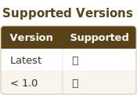

# Security Policy

## Supported Versions

## Reporting a Vulnerability

If you discover a security vulnerability, please follow these steps:

1. **Do NOT** create a public GitHub issue
2. Email the security concern with details to the maintainer
3. Include:
   - Description of the vulnerability
   - Steps to reproduce
   - Potential impact
   - Any suggested fixes

## Security Best Practices for Contributors

### Code Security

- **No Hardcoded Credentials**: Never commit passwords, API keys, or tokens
- **No Hardcoded Paths**: Use `Path(__file__).parent` for relative paths
- **Input Validation**: Validate and sanitize all user input
- **Parameterized Commands**: Never use string concatenation for shell commands

### Dependency Security

- Keep dependencies updated via Dependabot
- Review security advisories for dependencies
- Use `pip audit` to check for known vulnerabilities

## Security Checklist

- [ ] No hardcoded credentials in code
- [ ] No hardcoded absolute paths
- [ ] All user input validated
- [ ] Dependencies are up-to-date
- [ ] Code passes `bandit` security linting
