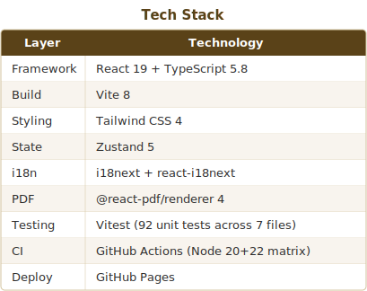
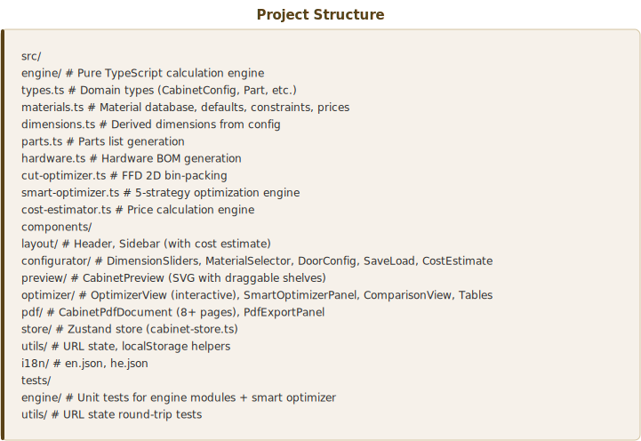

# Cabinet Planner — Interactive Woodworking Design Tool

A React single-page application for designing pantry/storage cabinets with real-time preview, cut-sheet optimization, and PDF export.

**[Live Demo →](https://rajwanyair.github.io/WoodworkingShop/)**

## Features

- **Interactive Configurator** — sliders and selectors for dimensions, materials, shelves, doors, handles, edge banding
- **Multi-Cabinet Projects** — design multiple cabinets in one project with combined cut-sheet optimization
- **5-View SVG Preview** — Front (closed/open), Side, Top, Back with dimension annotations and part tooltips
- **Draggable Shelves** — drag shelves in Front (Open) view to reposition; auto-switches to custom spacing
- **Smart Optimizer** — 5 strategies (reduce depth, co-nest strips, adjust width/height, material swap) to minimize sheet waste
- **Comparison View** — side-by-side original vs optimized config with diff summary
- **Interactive Cut Sheets** — hover to highlight parts, waste hatch patterns, edge banding indicators, per-part dimensions
- **Color-Blind Safe Mode** — deuteranopia-safe Wong palette toggle for cut sheet visualization
- **PDF Export** — full build plan: cover, specs, parts table, hardware BOM, cut diagrams, exploded assembly view, drilling guide, assembly sequence, shopping list
- **Cost Estimator** — per-material sheet costs, hardware, edge banding with total estimate in sidebar
- **Undo/Redo** — full history with Ctrl+Z / Ctrl+Y keyboard shortcuts
- **Keyboard Shortcuts** — Ctrl+Z undo, Ctrl+Y redo, Ctrl+P print, Alt+1-4 switch tabs
- **Responsive Design** — mobile-first layout with bottom sheet sidebar, scrollable tabs
- **Export/Import** — save/load configs to localStorage or download/upload as JSON files
- **Shareable URLs** — config encoded in URL query params; copy-link button
- **Print-Friendly** — @media print CSS hides UI chrome, optimizes tables and SVGs for paper
- **PWA / Offline** — service worker with cache-first strategy; installable web app
- **Bilingual** — English + Hebrew (RTL) with i18next
- **Dark Mode** — toggle with Tailwind CSS dark variant
- **Accessible** — ARIA landmarks, keyboard navigation, skip-to-content, color-blind support

## Tech Stack





## Quick Start

```bash
npm install
npm run dev        # development server at localhost:5173
npm run test       # run unit tests
npm run build      # production build → dist/
```

## Project Structure





## License

MIT
