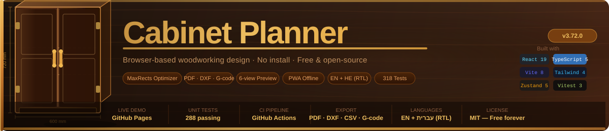
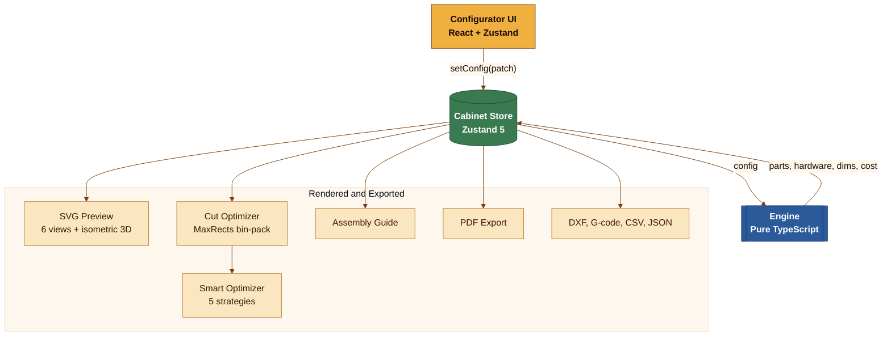

<div align="center">
  
</div>

<div align="center">

[](https://github.com/RajwanYair/WoodworkingShop/actions/workflows/ci.yml)
[](https://github.com/RajwanYair/WoodworkingShop/actions/workflows/pages.yml)
[](LICENSE)
[](tsconfig.json)
[](package.json)
[](vite.config.ts)
[](public/manifest.json)
[](src/i18n)
[](tests/)

**[🚀 Live Demo](https://rajwanyair.github.io/WoodworkingShop/)** · **[📋 Changelog](CHANGELOG.md)** · **[🗺 Roadmap](ROADMAP.md)** · **[🏛 Architecture](docs/ARCHITECTURE.md)**

</div>

---

> **Cabinet Planner** is a browser-based woodworking design tool: configure any cabinet or furniture piece, see a live 6-view 3D preview, optimize your cut sheets, and export a complete PDF build plan, DXF, G-code, or BOM — all without a server or an account.

---

## ✨ Features

### 🎛 Configurator

| Feature | Details |
|---|---|
| **Quick Presets** | 6 one-click templates: kitchen base/wall, tall pantry, bookcase, wardrobe, bathroom vanity |
| **Furniture types** | Cabinet · Bookshelf · Desk · Wardrobe — each with type-specific part generation |
| **Dimensions** | Width / height / depth sliders with free-text numeric entry; metric mm or fractional inches |
| **Toe kick / plinth** | Configurable kick height (0 = flush-to-floor or wall-mounted) |
| **Shelves** | Count, equal or custom spacing, drag-to-reposition in the preview |
| **Doors** | Flat · Shaker · Glass · None; 1 or 2 doors; configurable reveal |
| **Drawers** | 0–6 drawers with individual per-drawer box height |
| **Materials** | Built-in library (plywood, melamine, MDF, chipboard, glass) + custom material editor |
| **Grain direction** | Mark materials as grain-sensitive — cut optimizer never rotates those parts 90° |
| **Edge banding** | All-visible · Doors-only · None |
| **Handles** | Bar · Knob · Cup pull · None |
| **Save / Load** | localStorage presets + download/upload JSON config files |
| **Shareable URLs** | Full config encoded in URL query params; one-click copy |

### 🖼 Preview

| Feature | Details |
|---|---|
| **6 views** | Front (closed) · Front (open) · Side · Top · Back · Isometric 3D |
| **Dimension annotations** | Arrowhead dim lines; unit-aware labels (mm or fractional in) |
| **Grain arrows** | Per-part grain direction overlaid on cut sheets |
| **SVG + PNG export** | Download any view as a vector SVG or 2× rasterised PNG |
| **Pinch / swipe** | Touch zoom and swipe-between-views on mobile |
| **Dark mode** | Full dark theme; SVG dim lines use `currentColor` |

### 📐 Cut-Sheet Optimizer

| Feature | Details |
|---|---|
| **MaxRects bin-packing** | State-of-the-art 2D bin-packing across standard 2440×1220 mm sheets |
| **Grain constraints** | Grain-sensitive materials skip 90° rotation during placement |
| **Smart optimizer** | 5 strategies: reduce depth · co-nest strips · adjust width/height · material swap |
| **Comparison view** | Side-by-side original vs optimised config with waste diff |
| **Interactive sheets** | Hover to highlight parts; waste hatch patterns; edge-banding and grain indicators |
| **Color-blind safe** | Wong palette toggle (deuteranopia-friendly) |
| **Multi-cabinet** | Combine all cabinets in a project into one optimised cut run |

### 📤 Export

| Format | Details |
|---|---|
| **PDF** | Cover · specs · parts table · hardware BOM · cut diagrams · assembly sequence · shopping list |
| **DXF** | AutoCAD R12 DXF for CNC routers; per-sheet or combined |
| **G-code** | CNC router toolpath export |
| **CSV BOM** | Bill of materials as spreadsheet-ready CSV |
| **SVG / PNG** | Preview panels as vector or raster image |
| **JSON** | Full config export/import |

### 🛠 Other

- 🏗 **Assembly guide** — numbered steps with progress bar, part highlighting, and pro tips  
- 💰 **Cost estimator** — per-material sheet costs + hardware + edge banding; live sidebar total  
- ↩ **Undo / Redo** — full change history (`Ctrl+Z` / `Ctrl+Y`)  
- ⌨ **Keyboard shortcuts** — `Alt+1-5` tabs, `Ctrl+Z/Y`, `Ctrl+P`, `?` for help modal  
- 📱 **PWA / Offline** — service worker; installable as a desktop or mobile app  
- 🌐 **Bilingual** — English + Hebrew (RTL layout) via i18next  
- ♿ **Accessible** — ARIA landmarks, keyboard nav, skip-to-content, screen-reader labels  
- 🖨 **Print-friendly** — `@media print` hides UI chrome; optimises tables and SVGs for paper  

---

## 🚀 Quick Start

```bash
# 1 — clone
git clone https://github.com/RajwanYair/WoodworkingShop.git
cd WoodworkingShop

# 2 — install (deterministic, uses package-lock.json)
npm ci

# 3 — dev server  →  http://localhost:5173/WoodworkingShop/
npm run dev

# 4 — run 258+ unit tests
npm test

# 5 — production build  →  dist/
npm run build
```

> **Node.js ≥ 20** is required.

---

## 🏗 Tech Stack

| Layer | Technology |
|---|---|
| Framework | React 19 |
| Language | TypeScript 5.8 (strict mode) |
| Styling | Tailwind CSS 4 |
| State | Zustand 5 |
| PDF | @react-pdf/renderer 4 |
| i18n | i18next 25 + react-i18next |
| Build | Vite 6 |
| Unit tests | Vitest 4 + @testing-library/react |
| E2E tests | Playwright |
| Lint / format | ESLint 9 (flat config) + Prettier |
| CI/CD | GitHub Actions |
| Deploy | GitHub Pages |

---

## 🏛 Architecture

All computation runs **client-side** — no backend, no account required.


```mermaid
%%{init: {'theme': 'base', 'themeVariables': {'primaryColor': '#f0b040', 'primaryTextColor': '#1a0e06', 'primaryBorderColor': '#8b5022', 'lineColor': '#7a4010', 'secondaryColor': '#f8ede0', 'tertiaryColor': '#fef7ed', 'edgeLabelBackground': '#fef7ed'}}}%%
graph TD
    UI["Configurator UI\nReact + Zustand"]
    Store[("Cabinet Store\nZustand 5")]
    Engine[["Engine\nPure TypeScript"]]

    subgraph Outputs["Rendered and Exported"]
        Preview["SVG Preview\n6 views + isometric 3D"]
        Optimizer["Cut Optimizer\nMaxRects bin-pack"]
        Smart["Smart Optimizer\n5 strategies"]
        Assembly["Assembly Guide"]
        PDF["PDF Export"]
        Exports["DXF, G-code, CSV, JSON"]
    end

    UI -->|"setConfig(patch)"| Store
    Store -->|config| Engine
    Engine -->|"parts, hardware, dims, cost"| Store
    Store --> Preview
    Store --> Optimizer
    Optimizer --> Smart
    Store --> Assembly
    Store --> PDF
    Store --> Exports

    classDef ui fill:#f0b040,stroke:#8b5022,color:#1a0806,font-weight:bold
    classDef store fill:#3a7a50,stroke:#1e4a30,color:#ffffff,font-weight:bold
    classDef engine fill:#2a5a9a,stroke:#1a3a6e,color:#ffffff,font-weight:bold
    classDef output fill:#fae7c0,stroke:#c08040,color:#3a1806

    class UI ui
    class Store store
    class Engine engine
    class Preview,Optimizer,Smart,Assembly,PDF,Exports output
```

**Engine modules** (`src/engine/`) are pure TypeScript with no React dependencies — fully testable without a DOM.

```
src/
├── engine/          # Pure TS — types, materials, dimensions, parts, hardware,
│                    #   cut-optimizer, smart-optimizer, assembly, cost-estimator
├── components/      # React UI — configurator, preview, optimizer, assembly, pdf, layout
├── store/           # Zustand — cabinet-store, custom-materials-store, toast-store
├── hooks/           # useTouchGestures
├── i18n/            # en.json · he.json · setup
└── utils/           # bom-export · dxf-export · gcode-export · url-state · units · download
```

→ Full architecture docs: [docs/ARCHITECTURE.md](docs/ARCHITECTURE.md)

---

## 🔧 Development Commands

```bash
npm run typecheck       # TypeScript strict-mode check (tsc --noEmit)
npm run lint            # ESLint — 0 warnings policy
npm run format          # Prettier auto-format
npm run format:check    # Verify formatting (used in CI)
npm run i18n:coverage   # Check EN ↔ HE translation parity
npm run bundle:report   # Bundle size breakdown
npm run check           # typecheck + lint + format:check + test  (pre-commit gate)
npm run ci              # check + build + bundle:check  (full CI pipeline)
npm run test:e2e        # Playwright end-to-end tests
```

---

## 🌐 Internationalization

The app ships with full **English** and **Hebrew** (RTL) translations.  
All UI strings live in `src/i18n/en.json` and `src/i18n/he.json`.  
Run `npm run i18n:coverage` to verify both files are in sync.

---

## 🚢 Deployment

The app auto-deploys to **GitHub Pages** on every push to `main` via [`.github/workflows/pages.yml`](.github/workflows/pages.yml).

For a tagged release:

```bash
# 1 — bump version
npm version patch   # or minor / major

# 2 — update CHANGELOG.md, push
git push --follow-tags

# 3 — create GitHub Release (CI builds and attaches artifacts)
gh release create vX.Y.Z --generate-notes
```

---

## ❓ Troubleshooting

| Issue | Solution |
|---|---|
| `npm ci` fails | Ensure **Node.js ≥ 20**. Delete `node_modules` and retry |
| TypeScript errors | Run `npm run typecheck` for details. Strict mode is on |
| Lint failures | Run `npm run lint` — 0 warnings policy; fix root causes |
| Chunk size warning | Expected for `@react-pdf/renderer` (~1.5 MB) — it is code-split and lazy-loaded |
| Tests fail | Run `npm test` — requires jsdom. Check `vitest.config.ts` |
| Hebrew layout broken | Ensure `<html dir="rtl">` is set when language is `he` |

---

## 🤝 Contributing

Contributions are welcome! Please read [`.github/CONTRIBUTING.md`](.github/CONTRIBUTING.md) first.

Quick checklist before opening a PR:
1. `npm run check` passes (typecheck + lint + format + tests)
2. `npm run build` succeeds with 0 warnings
3. New features include unit tests
4. i18n keys added to **both** `en.json` and `he.json`

---

## 📄 License

[MIT](LICENSE) © RajwanYair
