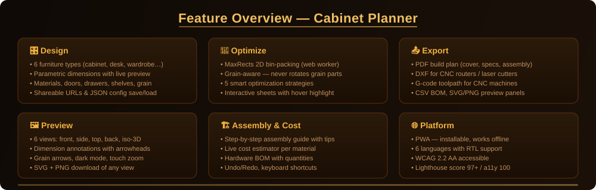
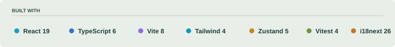
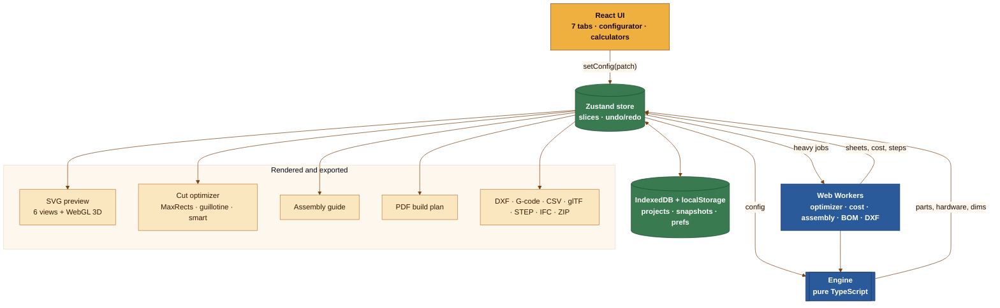

# WoodworkingShop — Free WoodworkingShop & Cut-List Optimizer

<div align="center">
  
</div>

<div align="center">

[](https://github.com/RajwanYair/WoodworkingShop/actions/workflows/ci.yml)
[](https://github.com/RajwanYair/WoodworkingShop/actions/workflows/pages.yml)
[](https://github.com/RajwanYair/WoodworkingShop/actions/workflows/cloudflare-pages.yml)
[](https://github.com/RajwanYair/WoodworkingShop/actions/workflows/codeql.yml)
[](https://codecov.io/gh/RajwanYair/WoodworkingShop)
[](LICENSE)
[](tsconfig.json)
[](package.json)
[](vite.config.ts)
[](src/index.css)
[](public/manifest.json)
[](src/i18n)
[](config/bundle-budget.json)
[](tests/e2e)
[](https://github.com/RajwanYair/WoodworkingShop/commits/main)
[](https://github.com/RajwanYair/WoodworkingShop/stargazers)

**[🚀 Live Demo](https://rajwanyair.github.io/WoodworkingShop/)** · **[📋 Changelog](CHANGELOG.md)** · **[🗺 Roadmap](ROADMAP.md)** · **[🏛 Architecture](docs/ARCHITECTURE.md)** · **[📖 User Guide](docs/USER-GUIDE.md)** · **[🛟 Support](SUPPORT.md)** · **[📚 Docs](docs/index.md)**

</div>

---

> **WoodworkingShop** is a free, open-source, browser-based woodworking design tool
> and cut-list optimizer: configure any cabinet or furniture piece, see a live
> 6-view 3D preview, optimize your cut sheets with MaxRects bin-packing, and export
> a complete PDF build plan, DXF, G-code, or BOM — all without a server, account,
> or installation. Supports 6 languages including RTL (Hebrew, Arabic).

<div align="center">
  
</div>

---

## ✨ Features

### 🎛 Configurator

| Feature               | Details                                                                                     |
| --------------------- | ------------------------------------------------------------------------------------------- |
| **Quick Presets**     | 6 one-click templates: kitchen base/wall, tall pantry, bookcase, wardrobe, bathroom vanity  |
| **Furniture types**   | Cabinet · Bookshelf · Desk · Wardrobe — each with type-specific part generation             |
| **Dimensions**        | Width / height / depth sliders with free-text numeric entry; metric mm or fractional inches |
| **Toe kick / plinth** | Configurable kick height (0 = flush-to-floor or wall-mounted)                               |
| **Shelves**           | Count, equal or custom spacing, drag-to-reposition in the preview                           |
| **Doors**             | Flat · Shaker · Glass · None; 1 or 2 doors; configurable reveal                             |
| **Drawers**           | 0–6 drawers with individual per-drawer box height                                           |
| **Materials**         | Built-in library (plywood, melamine, MDF, chipboard, glass) + custom material editor        |
| **Grain direction**   | Mark materials as grain-sensitive — cut optimizer never rotates those parts 90°             |
| **Edge banding**      | All-visible · Doors-only · None                                                             |
| **Handles**           | Bar · Knob · Cup pull · None                                                                |
| **Save / Load**       | localStorage presets + download/upload JSON config files                                    |
| **Shareable URLs**    | Full config encoded in URL query params; one-click copy                                     |

### 🖼 Preview

| Feature                   | Details                                                          |
| ------------------------- | ---------------------------------------------------------------- |
| **6 views**               | Front (closed) · Front (open) · Side · Top · Back · Isometric 3D |
| **Dimension annotations** | Arrowhead dim lines; unit-aware labels (mm or fractional in)     |
| **Grain arrows**          | Per-part grain direction overlaid on cut sheets                  |
| **SVG + PNG export**      | Download any view as a vector SVG or 2× rasterised PNG           |
| **Pinch / swipe**         | Touch zoom and swipe-between-views on mobile                     |
| **Dark mode**             | Full dark theme; SVG dim lines use `currentColor`                |

### 📐 Cut-Sheet Optimizer

| Feature                  | Details                                                                           |
| ------------------------ | --------------------------------------------------------------------------------- |
| **MaxRects bin-packing** | State-of-the-art 2D bin-packing across standard 2440×1220 mm sheets               |
| **Grain constraints**    | Grain-sensitive materials skip 90° rotation during placement                      |
| **Smart optimizer**      | 5 strategies: reduce depth · co-nest strips · adjust width/height · material swap |
| **Comparison view**      | Side-by-side original vs optimised config with waste diff                         |
| **Interactive sheets**   | Hover to highlight parts; waste hatch patterns; edge-banding and grain indicators |
| **Color-blind safe**     | Wong palette toggle (deuteranopia-friendly)                                       |
| **Multi-cabinet**        | Combine all cabinets in a project into one optimised cut run                      |

### 📤 Export

| Format                | Details                                                                                       |
| --------------------- | --------------------------------------------------------------------------------------------- |
| **PDF**               | Cover · specs · parts table · hardware BOM · cut diagrams · assembly sequence · shopping list |
| **DXF**               | AutoCAD R12 DXF for CNC routers; per-sheet or combined                                        |
| **G-code**            | CNC router toolpath export with preview, tool and pass options                                |
| **CSV**               | Bill of materials and hardware list as spreadsheet-ready CSV (formula-injection safe)         |
| **Labels**            | Grouped or per-part label sheets for printing                                                 |
| **SVG / PNG**         | Preview panels as vector or raster image                                                      |
| **glTF / STEP / IFC** | 3D model exchange for viewers, CAD and BIM tools                                              |
| **ZIP**               | Batch bundle with a SHA-256 manifest                                                          |
| **JSON**              | Full project export/import                                                                    |

### 🛠 Other

- 🏗 **Assembly guide** — numbered steps with progress bar, part highlighting, and pro tips
- 🧮 **24 woodworking calculators** — joinery, finishing, sag, wood movement, router, stair and more, each checked against a published reference case
- 💰 **Cost estimator** — per-material sheet costs + hardware + edge banding; live sidebar total
- ↩ **Undo / Redo** — full change history (`Ctrl+Z` / `Ctrl+Y`)
- ⌨ **Keyboard shortcuts** — `Alt+1`–`Alt+6` tabs, `Alt+D` dark mode, `Ctrl+Z/Y`, `Ctrl+P`, `?` for help modal
- 📱 **PWA / Offline** — service worker; installable as a desktop or mobile app
- 🌐 **Multilingual** — 6 languages: EN, HE, AR, DE, ES, FR (with full RTL support); EN and HE are complete, AR/DE/ES/FR are being completed ([Sprint 375](ROADMAP.md))
- ♿ **Accessible** — WCAG 2.2 AA axe scans on every tab, keyboard-only journeys, skip-to-content, screen-reader labels
- 🖨 **Print-friendly** — `@media print` hides UI chrome; optimises tables and SVGs for paper

---

## 🚀 Quick Start

```bash
# 1 — clone
git clone https://github.com/RajwanYair/WoodworkingShop.git
cd WoodworkingShop

# 2 — install (deterministic, uses package-lock.json)
npm ci

# 3 — dev server  →  http://localhost:5173/WoodworkingShop/
npm run dev

# 4 — run the unit tests
npm test

# 5 — production build  →  dist/
npm run build
```

> **Node.js >= 22** is required.

### Dev Container

Open the repository in VS Code and run **Dev Containers: Reopen in Container**. The container pins Node.js to 26.10.0, installs the exact dependencies from `package-lock.json`, and installs the matching Chromium and Firefox Playwright browsers.

---

## 🏗 Tech Stack

<div align="center">
  
</div>

| Layer         | Technology                                                 |
| ------------- | ---------------------------------------------------------- |
| Framework     | ⚛️ React 19                                                |
| Language      | 🔷 TypeScript 6 (strict mode)                              |
| Styling       | 🎨 Tailwind CSS 4                                          |
| State         | 🐻 Zustand 5                                               |
| PDF           | 📄 @react-pdf/renderer 4                                   |
| i18n          | 🌐 i18next 26 + react-i18next                              |
| Build         | ⚡ Vite 8                                                  |
| Unit tests    | 🧪 Vitest 4 + @testing-library/react                       |
| E2E tests     | 🎭 Playwright 1.61 + axe-core (Chromium, Firefox, WebKit)  |
| Lint / format | 🧹 ESLint 10 (flat config) + Prettier                      |
| CI/CD         | 🤖 GitHub Actions                                          |
| Deploy        | 🚀 GitHub Pages + Cloudflare Pages (edge CDN, PR previews) |

---

## 🏛 Architecture

All computation runs **client-side** — no backend, no account required.


```mermaid
%%{init: {'theme': 'base', 'themeVariables': {'primaryColor': '#f0b040', 'primaryTextColor': '#1a0e06', 'primaryBorderColor': '#8b5022', 'lineColor': '#7a4010', 'secondaryColor': '#f8ede0', 'tertiaryColor': '#fef7ed', 'edgeLabelBackground': '#fef7ed'}}}%%
graph TD
    UI["React UI<br/>7 tabs · configurator · calculators"]
    Store[("Zustand store<br/>slices · undo/redo")]
    Engine[["Engine<br/>pure TypeScript"]]
    Workers["Web Workers<br/>optimizer · cost · assembly · BOM · DXF"]
    Storage[("IndexedDB + localStorage<br/>projects · snapshots · prefs")]

    subgraph Outputs["Rendered and exported"]
        Preview["SVG preview<br/>6 views + WebGL 3D"]
        Optimizer["Cut optimizer<br/>MaxRects · guillotine · smart"]
        Assembly["Assembly guide"]
        PDF["PDF build plan"]
        Exports["DXF · G-code · CSV · glTF · STEP · IFC · ZIP"]
    end

    UI -->|"setConfig(patch)"| Store
    Store -->|config| Engine
    Store -->|"heavy jobs"| Workers
    Workers --> Engine
    Engine -->|"parts, hardware, dims"| Store
    Workers -->|"sheets, cost, steps"| Store
    Store <--> Storage
    Store --> Preview
    Store --> Optimizer
    Store --> Assembly
    Store --> PDF
    Store --> Exports

    classDef ui fill:#f0b040,stroke:#8b5022,color:#1a0806,font-weight:bold
    classDef store fill:#3a7a50,stroke:#1e4a30,color:#ffffff,font-weight:bold
    classDef engine fill:#2a5a9a,stroke:#1a3a6e,color:#ffffff,font-weight:bold
    classDef output fill:#fae7c0,stroke:#c08040,color:#3a1806

    class UI ui
    class Store,Storage store
    class Engine,Workers engine
    class Preview,Optimizer,Assembly,PDF,Exports output
```

**Engine modules** (`src/engine/`) are pure TypeScript with no React dependencies — fully testable without a DOM.

```text
src/
├── engine/          # Pure TS — dimensions, parts, hardware, cut optimizers, assembly,
│                    #   costing, calculators, exports (glTF/STEP/IFC), validation
├── components/      # React UI — configurator, preview, optimizer, assembly, pdf, layout
├── store/           # Zustand — cabinet-store + slices, materials, hardware, room, toast stores
├── workers/         # Web Workers — cut optimizer, cost, assembly, BOM, DXF
├── hooks/           # Focus trap, touch gestures, camera, haptics, PWA update/file handlers
├── i18n/            # en · he · ar · de · es · fr (non-English lazy-loaded)
├── services/        # Capability contracts, error reporter
└── utils/           # BOM/DXF/G-code export, URL state, storage, downloads, units
```

The [roadmap](ROADMAP.md#target-architecture-phase-82) describes the planned move to domain folders, a `platform/` layer and feature-sliced UI.

→ Full architecture docs: [docs/ARCHITECTURE.md](docs/ARCHITECTURE.md)

---

## 🗺 What's Next


```mermaid
flowchart LR
  now["v5.34.0 ✅<br/>verified journeys"] --> c["v5.35.0<br/>command palette · 6 complete locales"]
  c --> t["v5.36–v5.38<br/>TypeScript 7 · Vitest 5 · architecture refactor · versioned data"]
  t --> d["v5.39–v5.40<br/>examples · shop drawings · docs site"]
  d --> w["v5.41–v5.43<br/>cut-list workbench · 1D lumber · shop-floor mode"]
  w --> m["v5.44–v5.48<br/>CNC · doors · rooms · files"]
  m --> v6["v6.0<br/>best-in-class review"]

  classDef done fill:#3a7a50,stroke:#1e4a30,color:#ffffff,font-weight:bold
  classDef next fill:#f0b040,stroke:#8b5022,color:#1a0806,font-weight:bold
  classDef later fill:#fae7c0,stroke:#c08040,color:#3a1806
  class now done
  class c next
  class t,d,w,m,v6 later
```

Details, sprint contracts and the competitive benchmark live in [ROADMAP.md](ROADMAP.md).

---

## 🔧 Development Commands

```bash
npm run typecheck       # TypeScript strict-mode check (tsc -b --noEmit)
npm run lint            # ESLint — 0 warnings policy
npm run format          # Prettier auto-format
npm run format:check    # Verify formatting (used in CI)
npm run i18n:coverage   # Check translation key parity across all 6 locales
npm run quality:fast    # All quality gates in parallel (types, lint, CSS, Markdown, i18n, AI-asset validators)
npm run check           # quality:fast + unit tests  (pre-commit gate)
npm run ci              # check + build + bundle:check + bench:check  (full CI gate)
npm run test:e2e        # Playwright end-to-end, accessibility and visual tests
npm run test:coverage   # Coverage report → %TEMP%/WoodworkingShop/coverage
npm run dead:check      # Knip — unused files, exports and dependencies
npm run capabilities:check # verify engine, utility and service capability classifications
```

## 🧰 Tooling and Intermediate Files

- Shared development tooling baseline is maintained one level up under `MyScripts/.tools`.
- Project scripts remain the source of truth for this repository's behavior.
- Intermediate artifacts and cache outputs are routed to OS TEMP paths (for example `%TEMP%/WoodworkingShop`) rather than committed workspace folders.
- Generated outputs such as `dist`, `coverage`, `test-results`, and Playwright HTML reports are treated as disposable artifacts, not source-of-truth content.

---

## 🌐 Internationalization

The app ships with **6 languages**: English, Hebrew (RTL), Arabic (RTL),
German, Spanish, and French. English loads with the app; the other locales are lazy-loaded.
English and Hebrew are complete; Arabic, German, Spanish and French still fall back to English
for some strings and are being completed in [Sprint 375](ROADMAP.md).
All UI strings live in `src/i18n/{en,he,ar,de,es,fr}.json`.
Run `npm run i18n:coverage` to verify all locale files are in sync.

---

## ⚡ Performance

Performance is checked against a production build by Lighthouse CI. The workflow
enforces the current score and timing budgets; results vary by browser and runner.
Run `npm run build` followed by `npm run lighthouse` to reproduce the check locally.
Engine benchmarks are available with `npm run bench:check`.

---

## 🚢 Deployment

The app auto-deploys to **GitHub Pages** on every push to `main` via [`.github/workflows/pages.yml`](.github/workflows/pages.yml).

### Cloudflare Pages

A parallel Cloudflare Pages deployment is configured via [`.github/workflows/cloudflare-pages.yml`](.github/workflows/cloudflare-pages.yml).
It provides edge CDN delivery at 250+ PoPs and automatic PR preview deployments.

**Setup** (one-time, in the GitHub repository settings under _Secrets and variables → Actions_):

| Secret / Variable         | Description                                                                                                                                  |
| ------------------------- | -------------------------------------------------------------------------------------------------------------------------------------------- |
| `CLOUDFLARE_API_TOKEN`    | CF API token with **Cloudflare Pages: Edit** permission                                                                                      |
| `CLOUDFLARE_ACCOUNT_ID`   | Found in the Cloudflare dashboard URL                                                                                                        |
| `VITE_CF_ANALYTICS_TOKEN` | _(Optional)_ Cloudflare Web Analytics beacon token — enables privacy-first page-view tracking (no cookies, no PII, no GDPR consent required) |

The `_redirects` file in `public/` handles SPA fallback routing (`/* → /index.html 200`)
so direct URL navigation and refreshes work correctly on Cloudflare Pages.

For a tagged release:

```bash
# 1 — bump version
npm version patch   # or minor / major

# 2 — update CHANGELOG.md, push
git push --follow-tags

# 3 — create GitHub Release (CI builds and attaches artifacts)
gh release create vX.Y.Z --generate-notes
```

---

## ❓ Troubleshooting

| Issue                | Solution                                                                        |
| -------------------- | ------------------------------------------------------------------------------- |
| `npm ci` fails       | Ensure **Node.js >= 22**. Delete `node_modules` and retry                       |
| TypeScript errors    | Run `npm run typecheck` for details. Strict mode is on                          |
| Lint failures        | Run `npm run lint` — 0 warnings policy; fix root causes                         |
| Chunk size warning   | Expected for `@react-pdf/renderer` (~1.5 MB) — it is code-split and lazy-loaded |
| Tests fail           | Run `npm test` — requires jsdom. Check `vitest.config.ts`                       |
| Hebrew layout broken | Ensure `<html dir="rtl">` is set when language is `he`                          |

---

## 🤝 Contributing

Contributions are welcome! Please read [`.github/CONTRIBUTING.md`](.github/CONTRIBUTING.md)
and the [Code of Conduct](CODE_OF_CONDUCT.md) first. For questions and project
ideas, use [GitHub Discussions](https://github.com/RajwanYair/WoodworkingShop/discussions).

Quick checklist before opening a PR:

1. `npm run check` passes (parallel quality gates + unit tests)
2. `npm run build` succeeds with 0 warnings
3. New features include unit tests and a browser journey for every new control
4. i18n keys added to **all 6 locale files** (en + he proper, ar/de/es/fr at minimum)

---

## 🔍 GitHub Topics & Discoverability

<!-- GitHub repository topics (set via Settings → Topics):
  woodworking  cabinet-design  cut-list-optimizer  furniture-planner  cnc-router
  cut-list  sheet-nesting  maxrects  cabinet-maker  dxf  gcode  bin-packing
  woodworking-tools  furniture-design  browser-based  pwa  multilingual
  hebrew  rtl  open-source  cnc  nesting  offline-app  pdf-export
-->

**Keywords:** cabinet planner, woodworking design tool, cut list optimizer,
furniture layout planner, sheet goods optimizer, MaxRects bin packing algorithm,
CNC export DXF G-code, cabinet maker software free, free woodworking app,
browser-based cabinet design, parametric furniture designer,
multilingual RTL Hebrew Arabic, PWA offline woodworking,
React TypeScript woodworking app, cut sheet optimizer free online,
cabinet layout generator, kitchen cabinet planner, wardrobe designer,
bookcase builder, furniture cut list software, nesting software free,
panel optimization, 2D bin packing, wood cutting calculator,
material waste reduction, edge banding calculator, hardware BOM generator,
assembly instructions generator, woodworking project planner

### Why WoodworkingShop?

| Need                        | Solution                                                      |
| --------------------------- | ------------------------------------------------------------- |
| **Design cabinets quickly** | Parametric configurator with live 6-view preview              |
| **Plan sheet cuts**         | MaxRects bin-packing optimizer lays out parts on stock sheets |
| **Export for CNC machines** | DXF and G-code output for CNC routers                         |
| **Generate cut lists**      | Automatic BOM with CSV/PDF export                             |
| **Work offline**            | PWA — install on any device, no internet needed               |
| **Multi-language**          | EN, HE, AR (RTL), DE, ES, FR                                  |
| **Free and open source**    | MIT license; no account required                              |

---

## 📄 License

[MIT](LICENSE) © RajwanYair
