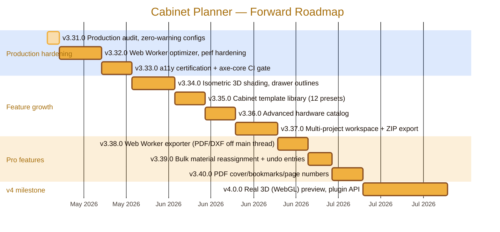

<div align="center">
  
</div>

# Roadmap

> Production-grade forward roadmap for **Cabinet Planner**.
> Historical sprint logs (v2.7.0 → v3.30.x) live in
> [`docs/SPRINT-HISTORY.md`](docs/SPRINT-HISTORY.md).
>
> Live changelog: [`CHANGELOG.md`](CHANGELOG.md) · Architecture:
> [`docs/ARCHITECTURE.md`](docs/ARCHITECTURE.md)

---

## Vision

Be the **best-in-class browser-based parametric cabinet planner**:
free, instant, offline-capable, bilingual (EN + HE/RTL), URL-shareable, with a
true bin-packing cut optimizer and a Smart Optimizer that suggests
dimension/material tweaks to lift sheet utilisation. No login, no cloud
dependency, no install.

| Pillar        | Definition                                                                               |
| ------------- | ---------------------------------------------------------------------------------------- |
| Domain depth  | Real woodworking constraints: grain, kerf, deflection, hardware, finishes, drawer slides |
| Performance   | TTI ≤ 2 s on 4G; sub-second cut optimisation for 5+ cabinets; 60 fps interactions        |
| Accessibility | WCAG 2.2 AA; full keyboard nav; `prefers-reduced-motion`; high-contrast palette          |
| Localisation  | EN + HE with strict key parity; RTL-correct from first paint; infrastructure for more    |
| Reliability   | 80%+ unit-test coverage; deterministic builds; signed releases; PWA offline-first        |
| Polish        | Production-grade UI; print-ready PDF/DXF/G-code; SVG-crisp at any zoom                   |

---

## Release Timeline (forward)



---

## Now — v3.31.0 Production Audit (in flight)

**Theme:** Zero warnings, zero waivers, zero dead code. Every config
option either enabled or removed with rationale.

- [x] Remove redundant `css.lint.*` waivers from `.vscode/settings.json`
- [x] Remove disabled webhint compat-api rules (browserslist handles exclusion)
- [x] Delete dead `scripts/fix-wcag.cjs` one-shot utility
- [x] Add `coverage/`, `test-results/`, `playwright-report/` to `.prettierignore`
- [x] Document VS Code CSS validator behaviour for Tailwind 4 projects
- [x] Audit all configs for disabled/suspended options
- [ ] Verify `npm run ci` passes with zero warnings locally
- [ ] Bump version to 3.31.0, tag, release

## Next — v3.32.0 Performance Hardening

- [ ] Move cut-optimizer into a Web Worker (Comlink-style RPC) — main thread stays responsive
- [ ] Memoise `generateParts()` / `generateHardware()` with a deep-equal-keyed `WeakMap`
- [ ] Lazy-load Assembly Guide and Cost Estimator routes on first access
- [ ] Tighten Lighthouse perf budget: TTI ≤ 2 s, LCP ≤ 1.8 s on simulated 4G
- [ ] Add `<link rel="modulepreload">` for critical chunks
- [ ] Tests: worker roundtrip, memoisation hit/miss, lazy-route render time

## Next — v3.33.0 Accessibility Certification

- [ ] axe-core in CI as a blocking E2E step on every PR
- [ ] WCAG 2.2 AA self-certification (focus visible, color contrast, target size)
- [ ] Focus trap inside modal dialogs (shortcut help, material editor)
- [ ] Respect `prefers-reduced-motion` (suppress all CSS transitions when set)
- [ ] High-contrast palette toggle (CSS custom properties)
- [ ] Document a11y stance in `docs/ARCHITECTURE.md` and `.github/SECURITY.md`

## Feature Growth (v3.34–v3.37)

| Release | Theme                   | Highlights                                                                 |
| ------- | ----------------------- | -------------------------------------------------------------------------- |
| v3.34.0 | Isometric polish        | Interior shading, shelf lines, drawer outlines, grain overlays             |
| v3.35.0 | Template library        | 12 cabinet presets, deep-link `?tpl=`, 80x60 SVG mini-previews             |
| v3.36.0 | Hardware catalog        | 20+ hardware items, per-item supplier links, quantity overrides            |
| v3.37.0 | Multi-project workspace | Sidebar projects list, thumbnails, ZIP export, switch without losing edits |

## Pro Features (v3.38–v3.40)

| Release | Theme                      | Highlights                                                        |
| ------- | -------------------------- | ----------------------------------------------------------------- |
| v3.38.0 | Worker exporter            | PDF/DXF generation off the main thread; progress bar; cancellable |
| v3.39.0 | Bulk material reassignment | One click reassigns all parts material A to material B; undoable  |
| v3.40.0 | PDF document polish        | Cover page, page numbers, outline bookmarks, project metadata     |

## v4.0.0 — Real 3D + Plugin API

- [ ] WebGL/Three.js 3D preview with materials and shadows; same parametric source of truth
- [ ] Plugin API for community-contributed templates / hardware vendors
- [ ] Public TypeScript types published as `@cabinet-planner/engine`
- [ ] Headless render mode for screenshot/CI snapshots
- [ ] Multi-language expansion (AR, RU, ES, DE) with community translation workflow
- [ ] IndexedDB project storage with import/export migration

---

## Competitive Landscape

How Cabinet Planner compares to popular cabinet, cut-list, and planner tools as
of **v3.31.0**. Legend: Yes = first-class | Partial = limited | No = not available.

| Capability                        | **Cabinet Planner** | CutList Optimizer Pro | OpenCutList (SketchUp) | MaxCut      | SketchUp + plugins | Polyboard | KitchenDraw | IKEA Home Planner | Sketchlist 3D | Fusion 360 |
| --------------------------------- | ------------------- | --------------------- | ---------------------- | ----------- | ------------------ | --------- | ----------- | ----------------- | ------------- | ---------- |
| Browser-based, no install         | Yes                 | Yes                   | No                     | No          | Partial (viewer)   | No        | No          | Yes               | No            | Partial    |
| Free / open-source                | Yes (MIT)           | Freemium              | Yes                    | Free (v1.x) | Free tier          | No        | No          | Yes (vendor-lock) | No            | Hobby tier |
| Parametric cabinet generation     | Yes                 | No                    | Partial                | No          | Partial (plugins)  | Yes       | Yes         | Partial (catalog) | Partial       | Yes        |
| Cut-sheet optimizer (bin-packing) | Yes (MaxRects)      | Yes                   | Yes                    | Yes         | Partial            | Yes       | No          | No                | Partial       | Partial    |
| BOM / parts list export           | Yes (CSV)           | Yes                   | Yes                    | Yes         | Partial            | Yes       | Yes         | Partial           | Yes           | Yes        |
| PDF assembly guide                | Yes                 | No                    | Partial                | Partial     | Partial            | Yes       | Yes         | No                | Yes           | Partial    |
| DXF / G-code export               | Yes                 | Partial               | Yes                    | Partial     | Yes                | Yes       | No          | No                | Partial       | Yes        |
| 3D preview                        | Isometric (v3.9+)   | No                    | Yes (host)             | No          | Yes                | Yes       | Yes         | Yes               | Yes           | Yes        |
| Smart dimension optimizer         | Yes (5 strategies)  | No                    | No                     | No          | No                 | Partial   | No          | No                | No            | No         |
| Cost estimation                   | Yes                 | Partial               | Partial                | Yes         | No                 | Yes       | Yes         | Yes               | Yes           | Partial    |
| Bilingual UI (EN + HE, RTL)       | Yes                 | No                    | Partial                | No          | Partial            | Partial   | Partial     | Yes               | No            | Partial    |
| Offline / PWA                     | Yes                 | No                    | Yes (host)             | Yes         | No                 | Yes       | No          | No                | Yes           | No         |
| Shareable design URL              | Yes                 | No                    | No                     | No          | Partial            | No        | No          | Partial           | No            | Partial    |
| Hardware catalogue                | Yes                 | No                    | Partial                | No          | Partial            | Yes       | Yes         | Partial           | Partial       | Partial    |
| Custom material library           | Yes                 | Yes                   | Yes                    | Yes         | Partial            | Yes       | Yes         | No                | Yes           | Yes        |
| Shelf deflection check            | Yes                 | No                    | No                     | No          | No                 | Partial   | No          | No                | No            | Yes        |
| Drawer slide configurator         | Yes                 | No                    | Partial                | No          | Partial            | Yes       | Yes         | Partial           | Partial       | Yes        |
| Plugin API / extensibility        | Planned (v4)        | No                    | Yes                    | No          | Yes                | Partial   | Partial     | No                | No            | Yes        |
| Undo/Redo history                 | Yes (50 deep)       | No                    | Yes (host)             | No          | Yes (host)         | Yes       | Yes         | Partial           | Yes           | Yes        |
| Keyboard shortcuts                | Yes                 | No                    | Yes (host)             | No          | Yes (host)         | Yes       | Yes         | No                | Yes           | Yes        |
| CI/CD quality gates               | Yes (6 workflows)   | Unknown               | Partial (GitHub)       | No          | No                 | No        | No          | No                | No            | No         |
| Price                             | **Free**            | $79–199               | Free                   | Free / $149 | $0–$349/yr         | EUR 1500+ | EUR 1500+   | Free              | $99–199       | $0–$680/yr |

### Lessons Harvested from Leaders

| Inspiration source        | Practice we adopted / are planning                                    |
| ------------------------- | --------------------------------------------------------------------- |
| **Polyboard / Fusion**    | Shelf deflection and drawer-slide engineering checks (shipped v3.9.0) |
| **OpenCutList**           | Plugin/extension model for community materials (v4.0)                 |
| **MaxCut**                | True bin-packing first-class (MaxRects shipped v3.1.0)                |
| **CutList Optimizer Pro** | Per-sheet utilisation feedback (shipped v3.1.0)                       |
| **KitchenDraw**           | Hardware-aware BOM with supplier hooks (v3.36.0)                      |
| **SketchUp**              | Off-main-thread heavy work (Worker optimizer v3.32.0)                 |
| **Sketchlist 3D**         | Assembly guide PDF with step images (shipped v3.3.0)                  |
| **IKEA Home Planner**     | Multi-project workspace with thumbnails (v3.37.0)                     |
| **Fusion 360**            | WebGL 3D with parametric source of truth (v4.0.0)                     |
| **CutList Optimizer Pro** | Real-time waste percentage during config changes (shipped v3.1.0)     |

### Where Cabinet Planner Intentionally Stays Narrow

- No full kitchen-layout floor-planner (Polyboard / KitchenDraw / IKEA niche).
- No 3D walkthrough renderer (browser-targeted, GPU-light by design until v4).
- No cloud account / vendor lock-in. URL state + localStorage only.
- No subscription model. MIT-licensed, free forever.

---

## Architecture Decision Log

Material technical decisions and the rationale behind them:

| #   | Decision                                        | Rationale                                                                                         |
| --- | ----------------------------------------------- | ------------------------------------------------------------------------------------------------- |
| 1   | React 19 + TypeScript 5.8 strict                | First-class hooks, Suspense; strict mode catches drift early                                      |
| 2   | Vite 6 (no webpack/Rollup config)               | Fastest dev loop; default Rollup prod build with manual `pdf-renderer` chunk                      |
| 3   | Tailwind 4 (CSS-first, no `tailwind.config.js`) | Less indirection; `@theme` in `src/index.css` is the single source of truth for tokens            |
| 4   | Zustand (not Redux / Context)                   | Local UI state is light; three small stores are enough; no boilerplate                            |
| 5   | i18next (not custom)                            | Robust RTL, plural rules, lazy namespaces; key parity enforced in CI                              |
| 6   | `@react-pdf/renderer` (not jsPDF / pdf-lib)     | Component model maps cleanly to JSX; assembled with React, predictable layout                     |
| 7   | MaxRects (Best Short Side Fit) cut optimizer    | Best free/open algorithm for guillotine + free-cut hybrid; sub-second for typical projects        |
| 8   | localStorage + URL state (no backend)           | Zero infra cost; user retains data; full offline; deep-link sharing                               |
| 9   | GitHub Pages (no SSR, no Node host)             | Free, fast, geographically distributed; SPA + `404.html` redirect handles routing                 |
| 10  | Service Worker (raw, not Workbox)               | < 1.5 KB; network-first navigate, cache-first assets; auto-versioned from `package.json`          |
| 11  | Playwright (not Cypress) for E2E                | Multi-browser, faster, first-class TypeScript; smoke tests only - Vitest covers logic             |
| 12  | Vitest (not Jest)                               | Same Vite config; native ESM; faster watch                                                        |
| 13  | No backend / database                           | Eliminates hosting cost, GDPR complexity, auth — all data lives in browser                        |
| 14  | Flat ESLint config + Prettier                   | Modern ESLint 9 flat config; Prettier formats; zero overlap                                       |
| 15  | Web Workers for heavy compute (v3.32+)          | Cut optimizer and PDF render block main thread >100ms on large projects; Workers keep UI at 60fps |

### Decisions Reconsidered (v3.31.0 audit)

| Decision            | Status   | Rationale for keeping / changing                                                              |
| ------------------- | -------- | --------------------------------------------------------------------------------------------- |
| No backend          | **Keep** | Project scope is single-user parametric design. Cloud sync is a v5+ consideration only.       |
| React (not Solid)   | **Keep** | Ecosystem maturity, `@react-pdf/renderer` dependency, team familiarity outweigh Solid's perf. |
| Tailwind (not CSS)  | **Keep** | Tailwind 4 is near-zero config; utility classes map 1:1 to design tokens.                     |
| Zustand (not Jotai) | **Keep** | Three stores with actions pattern matches our needs; Jotai's atom model is overkill here.     |
| No database         | **Keep** | localStorage + URL state covers all use cases; IndexedDB planned for v4 multi-project only.   |
| No SSR / Next.js    | **Keep** | Static SPA on GitHub Pages — no server cost, globally distributed, instant deploys.           |
| Vitest (not Bun)    | **Keep** | Bun test runner lacks jsdom parity and React Testing Library integration.                     |
| GitHub Pages        | **Keep** | Free, automatic from CI, custom domain supported, CDN-backed.                                 |

---

## Production Readiness Checklist

| Area              | State | Notes                                                                          |
| ----------------- | ----- | ------------------------------------------------------------------------------ |
| TypeScript strict | Pass  | `strict`, `noUnusedLocals`, `noUnusedParameters`, `verbatimModuleSyntax`       |
| ESLint            | Pass  | Flat config, `--max-warnings 0`, jsx-a11y, react-hooks, react-refresh          |
| Prettier          | Pass  | Single quote, trailing commas, 120 cols                                        |
| markdownlint      | Pass  | All `.md` linted in CI; only MD013 and MD041 disabled with rationale           |
| HTMLHint          | Pass  | `doctype-first`, `title-require` enabled                                       |
| Unit tests        | Pass  | Vitest 23+ files / 288+ tests; coverage thresholds 80/75/75/80                 |
| E2E tests         | Pass  | Playwright (chromium + firefox), retries on CI                                 |
| Lighthouse CI     | Pass  | Accessibility >= 0.9 enforced; perf/best-practices/SEO >= 0.8 warned           |
| Bundle budgets    | Pass  | `scripts/bundle-report.js`; JS 2 MB, CSS 100 KB, per-file budgets              |
| PWA offline       | Pass  | Service worker auto-syncs version from `package.json` at build time            |
| i18n parity       | Pass  | EN+HE structurally identical; enforced in CI (`tests/i18n/key-parity.test.ts`) |
| Secret scanning   | Pass  | `secret-scan.yml` workflow + `.gitleaks.toml`                                  |
| CodeQL            | Pass  | `codeql.yml` workflow                                                          |
| Dependabot        | Pass  | npm + github-actions ecosystems                                                |
| Release artefacts | Pass  | `release.yml` produces tarball + SHA-256; notes auto-extracted from CHANGELOG  |
| Pages deploy      | Pass  | `pages.yml` deploys on push to `main`                                          |
| Zero warnings     | Pass  | `--max-warnings 0` in ESLint; strict TS; no disabled lint rules                |
| No dead code      | Pass  | No orphaned scripts, no commented-out code, no unused dependencies             |

---

## Shared Tooling (MyScripts)

This project lives under `MyScripts/WoodworkingShop/`. Shared tooling scaffold
at [`MyScripts/.tools/`](../.tools/) provides:

- `.nvmrc` — pins Node 22 LTS for all sibling projects
- `.npmrc` — `engine-strict=true`, `save-exact=true`
- `editorconfig.shared` — universal editor settings
- `prettierrc.shared.json` — universal Prettier base
- `README.md` — onboarding for the shared scaffold

Per-project configs live inside each project root (so each project
remains self-contained and can be cloned in isolation), but they inherit
the shared base when convenient.

### Local Development Setup

```bash
# 1. Install Node 22 LTS (matches .nvmrc)
nvm install 22 && nvm use 22

# 2. Clone repo under MyScripts/
cd "$ONEDRIVE/Documents/MyScripts"
git clone https://github.com/RajwanYair/WoodworkingShop.git
cd WoodworkingShop

# 3. Install + verify
npm ci
npm run check   # typecheck + lint + md-lint + format-check + tests
npm run build   # production bundle into dist/
```

### Intermediate Files Policy

All transient output lives under `$TEMP` (Windows) / `$TMPDIR` (Unix) or
gitignored local directories, never inside the project's tracked tree:

| Output            | Location                                   | Tracked |
| ----------------- | ------------------------------------------ | ------- |
| ESLint cache      | `node_modules/.cache/eslint/`              | No      |
| Vitest cache      | `node_modules/.vitest/`                    | No      |
| Coverage HTML     | `coverage/`                                | No      |
| Playwright report | `playwright-report/`                       | No      |
| Lighthouse        | `.lighthouseci/`                           | No      |
| Build output      | `dist/`                                    | No      |
| TS build info     | `node_modules/.tmp/tsconfig.*.tsbuildinfo` | No      |

Only the source tree (`src/`, `tests/`, `public/`, `config/`, `scripts/`,
`docs/`, `.github/`) is version-controlled.

---

## Continuous Enhancement Guidelines

When adding features or making changes, follow these principles:

1. **No waivers.** If a lint rule fires, fix the code — do not disable the rule.
2. **No dead code.** Remove commented-out code, unused imports, orphaned files.
3. **Test first.** Every new engine function gets a unit test before merge.
4. **Budget aware.** Check bundle size after adding dependencies.
5. **Bilingual.** Every user-visible string goes through i18next with EN+HE keys.
6. **Accessible.** Every interactive element gets ARIA labels, keyboard support.
7. **Offline.** Service worker cache list updated when adding new static assets.
8. **Documented.** Architecture and CHANGELOG updated with every release.
9. **Intermediate files to $TEMP.** Never write transient data inside the repo.
10. **Commit per sprint, release per milestone.** Tag releases with semver.

---

## Reference Docs

- [`README.md`](README.md) — user-facing overview, install, tech stack
- [`CHANGELOG.md`](CHANGELOG.md) — Keep a Changelog format, every release
- [`docs/ARCHITECTURE.md`](docs/ARCHITECTURE.md) — module layout, data flow, diagrams
- [`docs/SPRINT-HISTORY.md`](docs/SPRINT-HISTORY.md) — archived per-sprint planning
- [`.github/CONTRIBUTING.md`](.github/CONTRIBUTING.md) — workflow, style rules
- [`.github/SECURITY.md`](.github/SECURITY.md) — security policy
