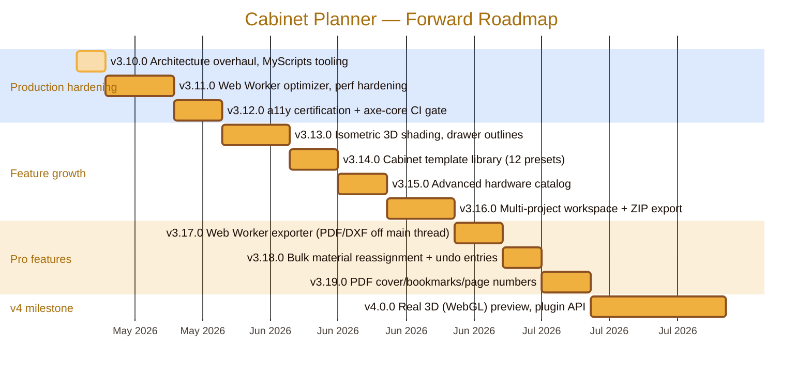

<div align="center">
  
</div>

# 🗺️ Roadmap

> Forward-looking, production-grade roadmap for **Cabinet Planner**.
> Historical sprint logs (v2.7.0 → v3.9.x, sprints 1–181) live in
> [`docs/SPRINT-HISTORY.md`](docs/SPRINT-HISTORY.md).
>
> Live changelog: [`CHANGELOG.md`](CHANGELOG.md) · Architecture:
> [`docs/ARCHITECTURE.md`](docs/ARCHITECTURE.md)

---

## 🎯 Vision

Be the **best-in-class browser-based parametric cabinet planner**:
free, instant, offline-capable, bilingual (EN + HE/RTL), URL-shareable, with a
true bin-packing cut optimizer and a Smart Optimizer that suggests
dimension/material tweaks to lift sheet utilisation. No login, no cloud
dependency, no install.

| Pillar           | Definition                                                                               |
| ---------------- | ---------------------------------------------------------------------------------------- |
| 🪵 Domain depth  | Real woodworking constraints: grain, kerf, deflection, hardware, finishes, drawer slides |
| ⚡ Performance   | TTI ≤ 2 s on 4G; sub-second cut optimisation for 5+ cabinets; 60 fps interactions        |
| ♿ Accessibility | WCAG 2.2 AA; full keyboard nav; `prefers-reduced-motion`; high-contrast palette          |
| 🌐 Localisation  | EN + HE with strict key parity; RTL-correct from first paint; infrastructure for more    |
| 🔒 Reliability   | 80 %+ unit-test coverage; deterministic builds; signed releases; PWA offline-first       |
| 🎨 Polish        | Production-grade UI; print-ready PDF/DXF/G-code; SVG-crisp at any zoom                   |

---

## 📅 Release Timeline (forward)



---

## 🚀 Now — v3.10.0 (in flight)

**Theme:** Production readiness. Audit every decision, drop every waiver,
consolidate tooling.

- [x] Move `bundle-budget.json` and `lighthouserc.json` → `config/`
- [x] Auto-sync `public/sw.js` `APP_VERSION` from `package.json` via `prebuild`
- [x] Fix CI Lighthouse step to honour `config/lighthouserc.json` (via `npm run lighthouse`)
- [x] Remove VS Code CSS-lint waivers (`unknownVendorSpecificProperties`, `compatibleVendorPrefixes`, `ieHack`)
- [x] Remove dead PowerShell section from `.editorconfig`
- [x] Re-enable `.htmlhintrc` `doctype-first` and `title-require`
- [x] Drop superseded `MD060` markdownlint waiver
- [x] Pin Node version with `.nvmrc` (Node 22 LTS)
- [x] Split forward roadmap (this file) and history (`docs/SPRINT-HISTORY.md`)
- [x] Scaffold shared tooling under `MyScripts/.tools/` (Node pin, npmrc, shared lint, README)
- [x] Document production checklist in this file

## 🔜 Next — v3.11.0 Performance Hardening

- [ ] Move cut-optimizer into a Web Worker (Comlink-style RPC) — main thread stays responsive
- [ ] Memoise `generateParts()` / `generateHardware()` with a deep-equal-keyed `WeakMap`
- [ ] Lazy-load Assembly Guide and Cost Estimator routes on first access
- [ ] Tighten Lighthouse perf budget: TTI ≤ 2 s, LCP ≤ 1.8 s on simulated 4G
- [ ] Add `<link rel="modulepreload">` for critical chunks
- [ ] Tests: worker roundtrip, memoisation hit/miss, lazy-route render time

## 🛡 Next — v3.12.0 Accessibility Certification

- [ ] axe-core in CI as a blocking E2E step on every PR
- [ ] WCAG 2.2 AA self-certification (focus visible, color contrast, target size)
- [ ] Focus trap inside modal dialogs (shortcut help, material editor)
- [ ] Respect `prefers-reduced-motion` (suppress all CSS transitions when set)
- [ ] High-contrast palette toggle (CSS custom properties)
- [ ] Document a11y stance in `docs/ARCHITECTURE.md` and `.github/SECURITY.md`

## ✨ Feature growth (v3.13–v3.16)

| Release | Theme                   | Highlights                                                                 |
| ------- | ----------------------- | -------------------------------------------------------------------------- |
| v3.13.0 | Isometric polish        | Interior shading, shelf lines, drawer outlines, grain overlays             |
| v3.14.0 | Template library        | 12 cabinet presets, deep-link `?tpl=`, 80×60 SVG mini-previews             |
| v3.15.0 | Hardware catalog        | 20+ hardware items, per-item supplier links, quantity overrides            |
| v3.16.0 | Multi-project workspace | Sidebar projects list, thumbnails, ZIP export, switch without losing edits |

## 🏭 Pro features (v3.17–v3.19)

| Release | Theme                      | Highlights                                                            |
| ------- | -------------------------- | --------------------------------------------------------------------- |
| v3.17.0 | Worker exporter            | PDF/DXF generation off the main thread; progress bar; cancellable     |
| v3.18.0 | Bulk material reassignment | One click reassigns all parts using material A → material B; undoable |
| v3.19.0 | PDF document polish        | Cover page, page numbers, outline bookmarks, project metadata         |

## 🌌 v4.0.0 — Real 3D + Plugin API

- [ ] WebGL/Three.js 3D preview with materials & shadows; same parametric source of truth
- [ ] Plugin API for community-contributed templates / hardware vendors
- [ ] Public TypeScript types published as `@cabinet-planner/engine`
- [ ] Headless render mode for screenshot/CI snapshots

---

## 🏆 Competitive Landscape

How Cabinet Planner compares to popular cabinet, cut-list, and planner tools as
of **v3.10.0**. Legend: ✅ first-class · 🟡 partial / limited · ❌ not available.

| Capability                        | **Cabinet Planner** | CutList Optimizer Pro | OpenCutList (SketchUp) | MaxCut        | SketchUp + plugins | Polyboard | KitchenDraw | IKEA Home Planner  | Sketchlist 3D | Fusion 360 |
| --------------------------------- | ------------------- | --------------------- | ---------------------- | ------------- | ------------------ | --------- | ----------- | ------------------ | ------------- | ---------- |
| Browser-based, no install         | ✅                  | ✅                    | ❌                     | ❌            | 🟡 (web viewer)    | ❌        | ❌          | ✅                 | ❌            | 🟡 (cloud) |
| Free / open-source                | ✅ (MIT)            | 🟡 (freemium)         | ✅                     | 🟡 (free 1.x) | 🟡 (free tier)     | ❌        | ❌          | ✅ (vendor-locked) | ❌            | 🟡 (hobby) |
| Parametric cabinet generation     | ✅                  | ❌                    | 🟡                     | ❌            | 🟡 (plugins)       | ✅        | ✅          | 🟡 (catalog)       | 🟡            | ✅         |
| Cut-sheet optimizer (bin-packing) | ✅ (MaxRects)       | ✅                    | ✅                     | ✅            | 🟡 (plugins)       | ✅        | ❌          | ❌                 | 🟡            | 🟡         |
| BOM / parts list export           | ✅ (CSV)            | ✅                    | ✅                     | ✅            | 🟡                 | ✅        | ✅          | 🟡                 | ✅            | ✅         |
| PDF assembly guide                | ✅                  | ❌                    | 🟡                     | 🟡            | 🟡                 | ✅        | ✅          | ❌                 | ✅            | 🟡         |
| DXF / G-code export               | ✅                  | 🟡                    | ✅                     | 🟡            | ✅                 | ✅        | ❌          | ❌                 | 🟡            | ✅         |
| 3D preview                        | 🟡 (isometric)      | ❌                    | ✅ (host)              | ❌            | ✅                 | ✅        | ✅          | ✅                 | ✅            | ✅         |
| Smart dimension optimizer         | ✅                  | ❌                    | ❌                     | ❌            | ❌                 | 🟡        | ❌          | ❌                 | ❌            | ❌         |
| Cost estimation                   | ✅                  | 🟡                    | 🟡                     | ✅            | ❌                 | ✅        | ✅          | ✅                 | ✅            | 🟡         |
| Bilingual UI (EN + HE, RTL)       | ✅                  | ❌                    | 🟡                     | ❌            | 🟡                 | 🟡        | 🟡          | ✅                 | ❌            | 🟡         |
| Offline / PWA                     | ✅                  | ❌                    | ✅ (host)              | ✅            | ❌                 | ✅        | ❌          | ❌                 | ✅            | ❌         |
| Shareable design URL              | ✅                  | ❌                    | ❌                     | ❌            | 🟡                 | ❌        | ❌          | 🟡                 | ❌            | 🟡         |
| Hardware catalogue                | ✅                  | ❌                    | 🟡                     | ❌            | 🟡                 | ✅        | ✅          | 🟡                 | 🟡            | 🟡         |
| Custom material library           | ✅                  | ✅                    | ✅                     | ✅            | 🟡                 | ✅        | ✅          | ❌                 | ✅            | ✅         |
| Shelf deflection check            | ✅                  | ❌                    | ❌                     | ❌            | ❌                 | 🟡        | ❌          | ❌                 | ❌            | ✅         |
| Drawer slide configurator         | ✅                  | ❌                    | 🟡                     | ❌            | 🟡                 | ✅        | ✅          | 🟡                 | 🟡            | ✅         |
| Plugin API / extensibility        | 🟡 (planned v4)     | ❌                    | ✅                     | ❌            | ✅                 | 🟡        | 🟡          | ❌                 | ❌            | ✅         |
| Price                             | **Free**            | $79–199               | Free                   | Free / $149   | $0–$349/yr         | €1500+    | €1500+      | Free               | $99–199       | $0–$680/yr |

### 🍯 What we harvest from the leaders

| Inspiration source        | Practice we are adopting / planning                                  |
| ------------------------- | -------------------------------------------------------------------- |
| **Polyboard / Fusion**    | Shelf deflection & drawer-slide engineering checks (already shipped) |
| **OpenCutList**           | Plugin/extension model for community materials (v4.0)                |
| **MaxCut**                | True bin-packing first-class (MaxRects shipped v3.1.0)               |
| **CutList Optimizer Pro** | Per-sheet utilisation feedback (shipped v3.1.0)                      |
| **KitchenDraw**           | Hardware-aware BOM with supplier hooks (v3.15.0)                     |
| **SketchUp**              | Off-main-thread heavy work (Worker exporter v3.17.0)                 |
| **Sketchlist 3D**         | Assembly guide PDF with step images (shipped v3.3.0)                 |
| **IKEA Home Planner**     | Multi-project workspace with thumbnails (v3.16.0)                    |

### 🎯 Where Cabinet Planner intentionally stays narrow

- No full kitchen-layout floor-planner (Polyboard / KitchenDraw / IKEA niche).
- No 3D walkthrough renderer (browser-targeted, GPU-light by design).
- No cloud account / vendor lock-in. URL state + localStorage only.

---

## ✅ Production Readiness Checklist

| Area              | State | Notes                                                                          |
| ----------------- | ----- | ------------------------------------------------------------------------------ |
| TypeScript strict | ✅    | `strict`, `noUnusedLocals`, `noUnusedParameters`, `verbatimModuleSyntax`       |
| ESLint            | ✅    | Flat config, `--max-warnings 0`, jsx-a11y, react-hooks, react-refresh          |
| Prettier          | ✅    | Single quote, trailing commas, 120 cols                                        |
| markdownlint      | ✅    | All `.md` linted in CI; only MD013 and MD041 disabled, both with rationale     |
| HTMLHint          | ✅    | `doctype-first`, `title-require` enabled                                       |
| Unit tests        | ✅    | Vitest 23 files / 288 tests; coverage thresholds 80/75/75/80                   |
| E2E tests         | ✅    | Playwright (chromium + firefox), retries on CI                                 |
| Lighthouse CI     | ✅    | Accessibility ≥ 0.9 enforced; perf/best-practices/SEO ≥ 0.8 warned             |
| Bundle budgets    | ✅    | `scripts/bundle-report.js`; JS 2 MB, CSS 100 KB, per-file budgets              |
| PWA offline       | ✅    | Service worker auto-syncs version from `package.json` at build time            |
| i18n parity       | ✅    | EN+HE structurally identical; enforced in CI (`tests/i18n/key-parity.test.ts`) |
| Secret scanning   | ✅    | `secret-scan.yml` workflow + `.gitleaks.toml`                                  |
| CodeQL            | ✅    | `codeql.yml` workflow                                                          |
| Dependabot        | ✅    | npm + github-actions ecosystems                                                |
| Release artefacts | ✅    | `release.yml` produces tarball + SHA-256; notes auto-extracted from CHANGELOG  |
| Pages deploy      | ✅    | `pages.yml` deploys on push to `main`                                          |

---

## 🧰 Shared Tooling (MyScripts)

This project lives under `MyScripts/`, which holds a shared tooling scaffold
at [`MyScripts/.tools/`](../.tools/). Any project under `MyScripts/` can
inherit:

- `.nvmrc` — pins Node 22 LTS for all sibling projects
- `.npmrc` — `engine-strict=true`, `save-exact=true`
- `editorconfig.shared` — universal editor settings
- `prettierrc.shared.json` — universal Prettier base
- `README.md` — onboarding for the shared scaffold

Per-project configs continue to live inside each project root (so each project
remains self-contained and can be cloned in isolation), but they may
inherit / mirror the shared base when convenient.

### Setup

```bash
# 1. Install Node 22 LTS (matches .nvmrc)
nvm install 22 && nvm use 22

# 2. Clone repo under MyScripts/
cd "$ONEDRIVE/Documents/MyScripts"
git clone https://github.com/RajwanYair/WoodworkingShop.git
cd WoodworkingShop

# 3. Install + verify
npm ci
npm run check   # typecheck + lint + md-lint + format-check + tests
npm run build   # production bundle into dist/
```

### Intermediate files → `$TEMP`

Per the workspace convention, any **transient** output (coverage reports,
Playwright reports, Lighthouse reports, lint caches, build temp) lives under
`$TEMP` (Windows) / `$TMPDIR` (Unix), never inside the project's tracked tree:

- ESLint cache → `node_modules/.cache/eslint/` (gitignored)
- Vitest cache → `node_modules/.vitest/` (gitignored)
- Coverage HTML → `coverage/` (gitignored, deleted by `npm run clean`)
- Playwright report → `playwright-report/` (gitignored)
- Lighthouse → `.lighthouseci/` (gitignored)

Permanent build output (`dist/`) is the only generated artefact retained in
the workspace, and even that is gitignored — only published as a release
artefact and to GitHub Pages.

---

## 📐 Architecture Decision Log

Material technical decisions and the rationale behind them:

| #   | Decision                                        | Rationale                                                                                              |
| --- | ----------------------------------------------- | ------------------------------------------------------------------------------------------------------ |
| 1   | React 19 + TypeScript 5.8 strict                | First-class hooks, Suspense; strict mode catches drift early                                           |
| 2   | Vite 6 (no webpack/Rollup config)               | Fastest dev loop; default Rollup prod build with manual `pdf-renderer` chunk                           |
| 3   | Tailwind 4 (CSS-first, no `tailwind.config.js`) | Less indirection; `@theme` in `src/index.css` is the single source of truth for tokens                 |
| 4   | Zustand (not Redux / Context)                   | Local UI state is light; three small stores are enough; no boilerplate                                 |
| 5   | i18next (not custom)                            | Robust RTL, plural rules, lazy namespaces; key parity enforced in CI                                   |
| 6   | `@react-pdf/renderer` (not jsPDF / pdf-lib)     | Component model maps cleanly to JSX; assembled with React, predictable layout                          |
| 7   | MaxRects (Best Short Side Fit) cut optimizer    | Best free/open algorithm for guillotine + free-cut hybrid; sub-second for typical projects             |
| 8   | localStorage + URL state (no backend)           | Zero infra cost; user retains data; full offline; deep-link sharing                                    |
| 9   | GitHub Pages (no SSR, no Node host)             | Free, fast, geographically distributed; SPA + `404.html` redirect handles routing                      |
| 10  | Service Worker (raw, not Workbox)               | < 1.5 KB; network-first navigate, cache-first assets — predictable; auto-versioned from `package.json` |
| 11  | Playwright (not Cypress) for E2E                | Multi-browser, faster, first-class TypeScript; smoke tests only — Vitest covers logic                  |
| 12  | Vitest (not Jest)                               | Same Vite config; native ESM; faster watch                                                             |

---

## 📚 Reference docs

- [`README.md`](README.md) — user-facing overview, install, tech stack
- [`CHANGELOG.md`](CHANGELOG.md) — Keep a Changelog format, every release
- [`docs/ARCHITECTURE.md`](docs/ARCHITECTURE.md) — module layout, data flow, diagrams
- [`docs/SPRINT-HISTORY.md`](docs/SPRINT-HISTORY.md) — archived per-sprint planning
- [`.github/CONTRIBUTING.md`](.github/CONTRIBUTING.md) — workflow, style rules
- [`.github/SECURITY.md`](.github/SECURITY.md) — security policy
