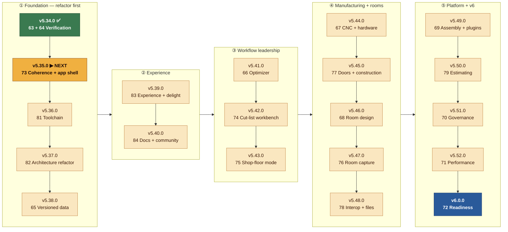
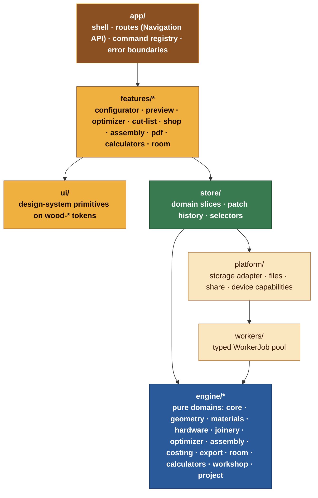
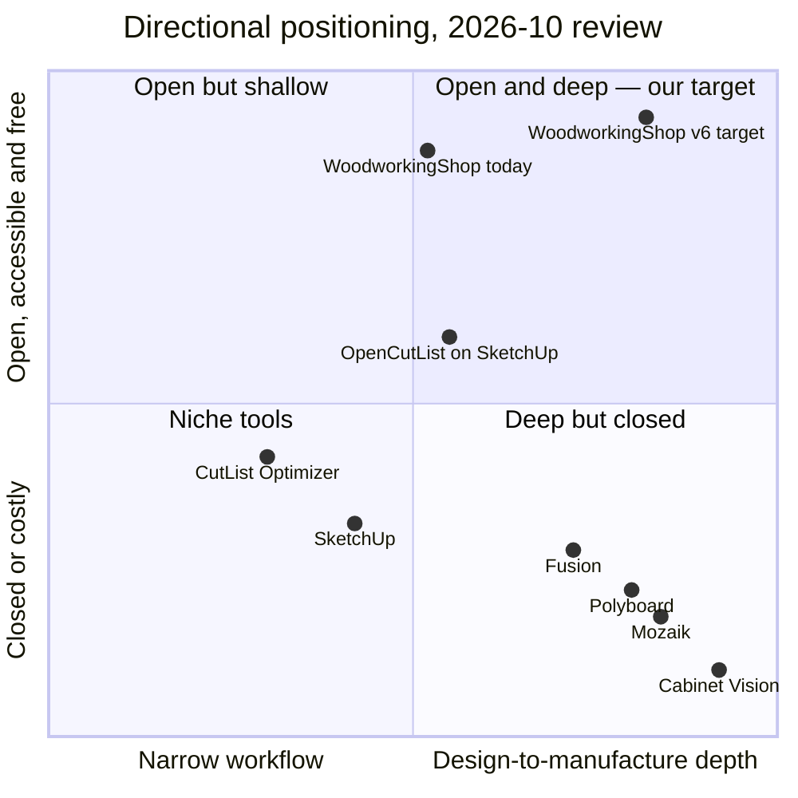
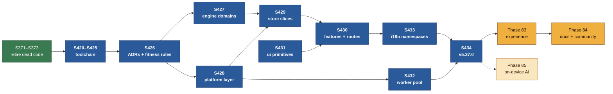

# Roadmap

> Last updated: 2026-10-05 (S375 locale progress)
> Current app version: v5.34.0
> Next release target: v5.35.0 (Phase 73 — Product coherence and modern app shell)
> Program horizon: Phases 63–85 · Sprints 300–451 · v5.34.0 → v6.0.0 (execution order: §7.2 release train)
> Strategy: best-in-class, local-first, production-grade woodworking planning platform — **refactor the foundation first, then lead on workflow depth**

---

## ★ Program at a Glance (2026-10-04 review)

### Where we stand

| Dimension      | Today (measured 2026-10-04)                                                                                          | v6.0 target                                                                                     | Phases    |
| -------------- | -------------------------------------------------------------------------------------------------------------------- | ----------------------------------------------------------------------------------------------- | --------- |
| Verification   | 5,338 Vitest tests (clean checkout 2026-10-02); 439 Playwright tests; axe on 7 tabs × 6 locales × 2 themes           | Full mutation baseline (incremental Stryker), browser-mode component tests, ARIA snapshots      | 81        |
| Architecture   | 165 flat engine modules + 7 thin domain folders; 1,448-line engine barrel; 97 engine modules unreachable from the UI | Domain-split engine, platform layer, feature-sliced UI, enforced layer rules, zero Knip hatches | 73, 82    |
| Toolchain      | TypeScript 6, Vitest 4, Playwright 1.61, manual memoisation                                                          | TypeScript 7 (native), Vitest 5 projects + browser mode, Playwright 1.63, React Compiler 1.0    | 81        |
| Product depth  | Cabinet generator, MaxRects sheet optimizer, 24 calculators, 10 export formats                                       | Parts-only workbench, 1D lumber optimizer, cut sequence, construction systems, shop-floor mode  | 66, 74–77 |
| Localization   | EN + HE complete with RTL; AR/DE/ES/FR ≈ 60 % English fallback                                                       | Six complete locales, then up to 12 through community translation                               | 73, 84    |
| Experience     | Seven tabs, static onboarding, SVG views + basic WebGL box                                                           | Guided first run, examples gallery, shop drawings, design timeline, realistic WebGPU preview    | 83        |
| Docs & visuals | Hand-maintained metrics and three static SVGs                                                                        | Docs site, generated screenshots and demo video, generated metrics, CI-verified diagrams        | 84        |
| Supply chain   | Tag-pinned actions, SBOM, CodeQL, dependency review                                                                  | SHA-pinned actions, build attestations, published OpenSSF Scorecard                             | 81        |

### Release train


```mermaid
flowchart LR
  subgraph foundation["① Foundation — refactor first"]
    direction TB
    r534["v5.34.0 ✅<br/>63 + 64 Verification"] --> r535["v5.35.0 ▶ NEXT<br/>73 Coherence + app shell"]
    r535 --> r536["v5.36.0<br/>81 Toolchain"]
    r536 --> r537["v5.37.0<br/>82 Architecture refactor"]
    r537 --> r538["v5.38.0<br/>65 Versioned data"]
  end
  subgraph delight["② Experience"]
    direction TB
    r539["v5.39.0<br/>83 Experience + delight"] --> r540["v5.40.0<br/>84 Docs + community"]
  end
  subgraph workflow["③ Workflow leadership"]
    direction TB
    r541["v5.41.0<br/>66 Optimizer"] --> r542["v5.42.0<br/>74 Cut-list workbench"]
    r542 --> r543["v5.43.0<br/>75 Shop-floor mode"]
  end
  subgraph making["④ Manufacturing + rooms"]
    direction TB
    r544["v5.44.0<br/>67 CNC + hardware"] --> r545["v5.45.0<br/>77 Doors + construction"]
    r545 --> r546["v5.46.0<br/>68 Room design"]
    r546 --> r547["v5.47.0<br/>76 Room capture"]
    r547 --> r548["v5.48.0<br/>78 Interop + files"]
  end
  subgraph platform["⑤ Platform + v6"]
    direction TB
    r549["v5.49.0<br/>69 Assembly + plugins"] --> r550["v5.50.0<br/>79 Estimating"]
    r550 --> r551["v5.51.0<br/>70 Governance"]
    r551 --> r552["v5.52.0<br/>71 Performance"]
    r552 --> r600["v6.0.0<br/>72 Readiness"]
  end
  foundation --> delight --> workflow --> making --> platform

  classDef done fill:#3a7a50,stroke:#1e4a30,color:#ffffff,font-weight:bold
  classDef next fill:#f0b040,stroke:#8b5022,color:#1a0806,font-weight:bold
  classDef planned fill:#fae7c0,stroke:#c08040,color:#3a1806
  classDef major fill:#2a5a9a,stroke:#1a3a6e,color:#ffffff,font-weight:bold
  class r534 done
  class r535 next
  class r536,r537,r538,r539,r540,r541,r542,r543,r544,r545,r546,r547,r548,r549,r550,r551,r552 planned
  class r600 major
```

Continuous tracks outside the train: Phase 80 (developer platform, remaining sprints) and Phase 85 (optional on-device intelligence, after Phase 82).

### Target architecture (Phase 82)


```mermaid
flowchart TB
  App["app/<br/>shell · routes (Navigation API) · command registry · error boundaries"]
  Features["features/*<br/>configurator · preview · optimizer · cut-list · shop · assembly · pdf · calculators · room"]
  UI["ui/<br/>design-system primitives on wood-* tokens"]
  Store["store/<br/>domain slices · patch history · selectors"]
  Platform["platform/<br/>storage adapter · files · share · device capabilities"]
  Workers["workers/<br/>typed WorkerJob pool"]
  Engine["engine/*<br/>pure domains: core · geometry · materials · hardware · joinery · optimizer · assembly · costing · export · room · calculators · workshop · project"]

  App --> Features
  Features --> UI
  Features --> Store
  Store --> Engine
  Store --> Platform
  Platform --> Workers
  Workers --> Engine

  classDef shell fill:#8b5022,stroke:#f0b040,color:#ffffff,font-weight:bold
  classDef view fill:#f0b040,stroke:#8b5022,color:#1a0806,font-weight:bold
  classDef state fill:#3a7a50,stroke:#1e4a30,color:#ffffff,font-weight:bold
  classDef pure fill:#2a5a9a,stroke:#1a3a6e,color:#ffffff,font-weight:bold
  classDef io fill:#fae7c0,stroke:#c08040,color:#3a1806
  class App shell
  class Features,UI view
  class Store state
  class Engine pure
  class Platform,Workers io
```

Layer rules are enforced automatically from Sprint 426: the engine imports nothing outside the engine; features never import platform code directly; the platform never imports React.

### Competitive positioning


```mermaid
quadrantChart
  title Directional positioning, 2026-10 review
  x-axis Narrow workflow --> Design-to-manufacture depth
  y-axis Closed or costly --> Open, accessible and free
  quadrant-1 Open and deep — our target
  quadrant-2 Open but shallow
  quadrant-3 Niche tools
  quadrant-4 Deep but closed
  WoodworkingShop today: [0.52, 0.88]
  WoodworkingShop v6 target: [0.82, 0.93]
  OpenCutList on SketchUp: [0.55, 0.60]
  CutList Optimizer: [0.30, 0.42]
  SketchUp: [0.42, 0.32]
  Fusion: [0.72, 0.28]
  Polyboard: [0.80, 0.22]
  Mozaik: [0.84, 0.18]
  Cabinet Vision: [0.92, 0.10]
```

Placement is a qualitative judgment from the §5 benchmarks, not a measurement; Sprint 370 replaces it with scored criteria.

### Twelve bets harvested from the best products

| #   | Bet                                                       | Harvested from                                                           | Lands in        | Why woodworkers will love it                        |
| --- | --------------------------------------------------------- | ------------------------------------------------------------------------ | --------------- | --------------------------------------------------- |
| 1   | Parts-only cut list with spreadsheet paste and CSV import | CutList Optimizer, OpenCutList, MaxCut                                   | S379–S380       | Use the optimizer without designing a cabinet       |
| 2   | Linear (1D) lumber optimizer                              | Opticutter, MaxCut, CutList Plus fx                                      | S381            | Face frames, rails, trim and solid wood             |
| 3   | Executable cut sequence and QR part labels                | CutList Plus fx, OpenCutList, cabinet CAD shop-floor modules             | S330, S388      | Cut in order; scan to track                         |
| 4   | Shop-floor mode: wake lock, large targets, read-aloud     | Shop-floor suites and mobile workshop apps                               | S386–S391       | Works on a dusty tablet at the saw                  |
| 5   | Shop drawings with exploded callouts                      | Published woodworking plans, SketchUp LayOut, OpenCutList exploded views | S437            | Print-ready plans, not just cut lists               |
| 6   | Construction systems and door styles                      | Mozaik, Cabinet Vision, Polyboard                                        | S398–S403       | Frameless, face-frame and inset the way shops build |
| 7   | Command palette and keyboard-first workflow               | VS Code, Figma, Excalidraw                                               | S374            | Every action two keystrokes away                    |
| 8   | Save-in-place files, round-trip exports, encrypted links  | Photopea, Excalidraw                                                     | S384, S404–S405 | Desktop-class files with privacy                    |
| 9   | Design history timeline with branches                     | Fusion timeline, Figma version history                                   | S438            | Experiment without fear                             |
| 10  | Realistic WebGPU preview with WebGL2 fallback             | Retail kitchen planners, Roomle, Shapr3D                                 | S440            | See the finished piece before cutting               |
| 11  | Examples gallery and guided first run                     | Figma, Onshape learning paths, Excalidraw libraries                      | S435            | Real value within the first minute                  |
| 12  | Optional on-device design assistant                       | Browser built-in AI (Prompt API), Onshape and SketchUp assistants        | S448–S450       | Describe a piece, review the diff, then apply       |

### What changed in this revision

- **New refactor program (Phases 81–85, Sprints 420–451):** toolchain modernisation, architecture refactor, experience and delight, documentation and community, optional on-device intelligence (§7.4).
- **Re-sequenced release train:** the foundation (73 → 81 → 82 → 65) now precedes the feature phases; later targets moved to v5.38.0–v5.52.0 (§7.2).
- **Absorbed sprints:** S414 → S421, S415 → S420, S417 → S425, S418 → S422, S377 T1/T3 → S431, S377 T2 → S439.
- **Honest carry-over:** S313 (assembly, build log, camera, machine flows) and S315 (PWA, offline, storage pressure) had no completion evidence and are re-opened for v5.35.0.
- **Refreshed facts:** TypeScript 7.0 (native) and Vitest 5.0 are released, Playwright 1.63, React Compiler 1.0, and the Navigation API is Baseline 2026; tool counts in §3.5 and §9 were corrected (29 extensions, 11 MCP servers, 15 workflows).
- **Same-day documentation fixes:** README, ARCHITECTURE, AGENTS, CONTRIBUTING and the docs index now match the code.

---

## 0. How To Use This Roadmap With The AI Agents

Every unit of work below is written as a **self-contained sprint contract** so that development can be requested one sprint (or one task) at a time:

| You want to…                     | Say this to Copilot                                             | Agent reads                                                                      |
| -------------------------------- | --------------------------------------------------------------- | -------------------------------------------------------------------------------- |
| Build the next planned sprint    | `Execute Sprint 300` (or `@sprint`)                             | Active Sprint table in `.github/copilot-instructions.md` → sprint contract in §7 |
| Build one task inside a sprint   | `Implement task T3 of Sprint 311`                               | The task row (files, tests, acceptance) in §7                                    |
| Build one component end-to-end   | `Scaffold <Feature> per Sprint 325` (or `@feature`)             | Sprint contract + `.github/agents/feature.agent.md`                              |
| Add the tests for a surface only | `Implement the E2E journeys for the Optimizer tab (Sprint 311)` | §8 test matrices + sprint contract                                               |
| Cut a release                    | `Release v5.35.0` (or `@release`)                               | §6 gates + phase release sprint                                                  |
| Pick the next phase              | `What is next on the release train?`                            | §7.2 release train (execution order and priority per phase)                      |

Sprint contract fields (§7): **Goal · Priority (P0 blocker → P3 nice-to-have) · Size (S ≤ ½ day, M ≤ 2 days, L ≤ 5 days) · Depends on · Tasks (T1…Tn with file paths) · Tests (unit / component / E2E) · Acceptance (observable, measurable)**.

Rules of engagement for every sprint: engine → store → component → i18n (en + he + 4 others) → mount → tests, then `npm run check`, then ROADMAP row → DONE, CHANGELOG `[Unreleased]` entry, conventional commit.

---

## 1. Purpose of This Document

This document is both the **living decision ledger** (§3) and the **executable program plan** (§7–§8).
Every major engineering, product, and tooling decision is re-opened, evaluated, and either confirmed with rationale or upgraded with a clear migration path.
Every planned feature is decomposed to tasks with file paths, test obligations, and acceptance criteria.

Consolidation rule: when a sprint reaches DONE, its progress log moves to SPRINT-HISTORY and this file keeps one summary row. In-progress sprints keep their task list plus a short **Status / Remaining** note only.

Historical artifacts:

- Sprint execution history → [docs/SPRINT-HISTORY.md](docs/SPRINT-HISTORY.md)
- Release changelog → [CHANGELOG.md](CHANGELOG.md)
- Architecture deep-dive → [docs/ARCHITECTURE.md](docs/ARCHITECTURE.md)
- User guide → [docs/USER-GUIDE.md](docs/USER-GUIDE.md)

---

## 2. Product North Star

**Build the most reliable local-first cabinet and furniture planning application that a real woodworker can trust in the workshop.**

### Core Pillars

| Pillar                       | Meaning                                                                             |
| ---------------------------- | ----------------------------------------------------------------------------------- |
| **Deterministic geometry**   | Same inputs always produce same cuts, same part lists, same assembly sequence       |
| **Manufacturing confidence** | Export outputs (PDF, DXF, G-code) are contract-tested and match physical materials  |
| **Instant authoring**        | Multi-cabinet projects configure in seconds with live visual feedback               |
| **Universal access**         | WCAG 2.2 AA, full RTL (Hebrew, Arabic), 6 locales, keyboard-first, mobile-ready     |
| **Zero-compromise quality**  | No lint suppressions, no type hacks, no dead code — production discipline at scale  |
| **Offline-first**            | No server required. All computation client-side. Optional cloud is strictly adapter |

### Non-Goals (Intentional Exclusions)

- 3D solid modeling (leave to Fusion 360 / FreeCAD)
- CNC post-processor library (we generate safe G-code, not machine-specific posts)
- Cloud-mandatory workflows (everything works offline; cloud is opt-in sync only)
- Payment/subscription infrastructure (MIT open-source, no monetization layer)

---

## 3. Decision Ledger (Full Strategic Review)

### 3.1 Language and Framework

| Decision     | Current               | Alternatives Considered                   | Verdict              | Rationale                                                                                                      |
| ------------ | --------------------- | ----------------------------------------- | -------------------- | -------------------------------------------------------------------------------------------------------------- |
| Language     | TypeScript 6 (strict) | Rust+WASM, Dart/Flutter, plain JS, Go     | **Upgrade to TS 7**  | TypeScript 7.0 (native Go port, released 2026) keeps the language and is ~10× faster to check; migrate in S420 |
| UI framework | React 19              | Svelte 5, SolidJS, Vue 3.5, Qwik          | **Keep React 19**    | Largest ecosystem, best Copilot/tooling support, concurrent rendering for heavy previews                       |
| Styling      | Tailwind CSS v4       | CSS Modules, Vanilla Extract, Panda CSS   | **Keep Tailwind v4** | Zero-runtime, design token system via CSS vars, logical properties for RTL                                     |
| State        | Zustand 5 (slices)    | Jotai, Redux Toolkit, Signals, Nanostores | **Keep Zustand**     | Minimal API, no boilerplate, excellent TS inference, undo/redo via middleware                                  |
| Build        | Vite 8 (Rolldown)     | Turbopack, Rspack, esbuild-only, Farm     | **Keep Vite 8**      | Fastest HMR, native Rolldown perf, worker import syntax, proven plugin ecosystem                               |
| Testing      | Vitest 4 + Playwright | Jest, Cypress, Testing Library only       | **Vitest 5 + PW**    | Same config as Vite; Vitest 5 projects + browser mode (S421) and Playwright 1.63 (S422)                        |
| Rendering    | Manual memoisation    | Signals, `useMemo` audits only            | **React Compiler**   | React Compiler 1.0 removes hand-written memoisation where proven safe; opt-in flag first (S423)                |
| Routing      | `?tab=` + History API | React Router, TanStack Router             | **Navigation API**   | Baseline 2026 (Chrome 102, Firefox 147, Safari 26.2); typed route table, no router dependency (S430)           |
| i18n         | i18next 26            | Paraglide, LinguiJS, FormatJS             | **Keep i18next**     | Mature, massive plugin ecosystem, works with react-i18next, i18n-ally extension                                |
| PDF          | @react-pdf/renderer   | pdfkit, jsPDF, Puppeteer PDF              | **Keep @react-pdf**  | React component model for layouts, off-main-thread support, no headless browser needed                         |

### 3.2 Frontend Architecture

| Area                 | Current                             | Decision    | Next Action                                                    |
| -------------------- | ----------------------------------- | ----------- | -------------------------------------------------------------- |
| Component boundaries | ≤600 lines enforced with exceptions | **Keep**    | Maintain reviewed exceptions; test user-visible behavior       |
| Error resilience     | ErrorBoundary per panel             | **Improve** | Test recovery/reset UI and isolation in Sprint 317             |
| Preview rendering    | SVG 6-view + WebGL orbit            | **Keep**    | Test six view outputs and WebGL fallback in Sprint 310         |
| PDF rendering        | @react-pdf off main thread          | **Keep**    | Parse generated PDFs and verify pages/content in Sprint 312    |
| Worker architecture  | Comlink + ?worker suffix            | **Keep**    | Add health checks and timeout recovery in Sprint 317           |
| Routing              | Single-page; `?tab=` deep-link      | **Keep**    | Add browser history and cabinet journey coverage in Sprint 307 |
| Design tokens        | wood-\* CSS vars via Tailwind v4    | **Keep**    | Document source-backed catalog in Sprint 362                   |
| Form validation      | Engine guards + field-level errors  | **Keep**    | Verify invalid, repair and screen-reader states in Sprint 308  |
| Code splitting       | Route-based lazy() + Suspense       | **Enhance** | Add granular chunk splitting for heavy panels (PDF, preview)   |

### 3.3 Backend, Data, and API

| Area              | Current                             | Alternatives Considered              | Verdict                | Rationale                                                                                 |
| ----------------- | ----------------------------------- | ------------------------------------ | ---------------------- | ----------------------------------------------------------------------------------------- |
| Topology          | Local-first SPA, no server          | Supabase, Firebase, Convex           | **Keep local-first**   | Privacy, offline, no vendor lock-in; sync is adapter layer                                |
| Persistence       | IndexedDB + JSON export             | SQLite/WASM, OPFS, Dexie.js          | **Evaluate OPFS**      | Benchmark and compatibility decision before any migration (S322–S324)                     |
| Schema versioning | Export versions; project schema TBD | Protobuf, JSON Schema, Zod           | **Add project schema** | Define project/catalog schema and migrations in S319; avoid runtime dependency by default |
| Cloud sync        | Not implemented                     | CRDTs (Yjs), Cloudflare D1, PGlite   | **Defer**              | No user demand; CRDT engine exists but has no production backend                          |
| External APIs     | None required                       | Lumber price APIs, hardware catalogs | **Keep zero-API**      | All data is user-owned; optional catalog import via JSON                                  |
| Analytics         | None                                | Plausible, PostHog, Umami            | **Keep none**          | Privacy-first; if added, must be default-off with consent UI                              |
| Database          | idb-keyval (thin wrapper)           | Dexie.js, OPFS SQLite                | **Keep IDB default**   | Minimal footprint; OPFS only if benchmarks show a material benefit                        |
| Infrastructure    | GitHub Pages (static CDN)           | Cloudflare Pages, Vercel, Netlify    | **Keep GH Pages**      | Free, immutable, CI-integrated; CF Pages for PR previews only                             |

### 3.4 Documentation Strategy

| Area           | Current State                                       | Decision        | Standard                                                                                        |
| -------------- | --------------------------------------------------- | --------------- | ----------------------------------------------------------------------------------------------- |
| Amount         | 12 docs in `docs/`, plus README, ROADMAP, CHANGELOG | **Restructure** | Diátaxis (tutorials, how-to, reference, explanation) on a docs site (S442)                      |
| API docs       | TypeDoc auto-generated                              | **Keep**        | Generated on `npm run docs:api`, not committed; linked from the docs site                       |
| User guide     | `docs/USER-GUIDE.md`                                | **Upgrade**     | Task-based how-to pages with generated screenshots per locale and theme (S443)                  |
| Architecture   | `docs/ARCHITECTURE.md`                              | **Upgrade**     | ADRs in `docs/decisions/` (S426); diagrams parsed in CI (S444)                                  |
| Sprint history | `docs/SPRINT-HISTORY.md`                            | **Keep**        | Append-only log                                                                                 |
| Metrics        | Hand-copied test counts, sizes and locale claims    | **Generate**    | `docs:metrics` writes marked blocks from real runs; hand-edited metrics are forbidden (S444)    |
| Visuals        | 3 static SVGs + Mermaid                             | **Expand**      | Screenshot gallery, 30-second demo video, version tokens synced from `package.json` (S443–S444) |
| Dead docs      | None detected                                       | **Enforce**     | Link checker + `docs:freshness` in `quality` (S444)                                             |
| Code methods   | Engine functions are pure, fully tested             | **Keep**        | Boundary guards with RangeError, no side-effects                                                |

### 3.5 Configuration and Governance

| Area             | Current                                        | Decision  | Next Action                                       |
| ---------------- | ---------------------------------------------- | --------- | ------------------------------------------------- |
| Tool configs     | All at workspace root (Vite convention)        | **Keep**  | Never move; documented in copilot-instructions    |
| Budget configs   | `config/` directory                            | **Keep**  | Add JSON Schema validation for budget files       |
| VS Code settings | Comprehensive, well-sectioned                  | **Clean** | Remove disabled/suspended entries                 |
| Extensions       | 29 recommended, 80 unwanted                    | **Keep**  | Periodic review; document keep/remove rationale   |
| MCP servers      | 11 servers with clear ownership                | **Keep**  | Add health-check ping in CI                       |
| Copilot assets   | 9 agents, 22 prompts, 9 instructions, 3 skills | **Keep**  | Version-align with release; test for parse errors |

### 3.6 Infrastructure and Deployment

| Area            | Current                        | Decision | Next Action                                    |
| --------------- | ------------------------------ | -------- | ---------------------------------------------- |
| Hosting         | GitHub Pages (static)          | **Keep** | Free, fast, immutable deploys per release      |
| Preview deploys | Cloudflare Pages PR previews   | **Keep** | Validate preview URLs in PR checks             |
| CI              | GitHub Actions (15 workflows)  | **Keep** | Pin actions by SHA, per-job permissions (S425) |
| SBOM            | CycloneDX generation           | **Keep** | Attach to GitHub releases as artifact          |
| Supply chain    | Dependabot + dependency-review | **Keep** | Add Scorecard badge                            |
| Secrets         | Zero secrets in codebase       | **Keep** | Secret scan workflow blocks PRs                |

### 3.7 Tooling Versions (Pinned)

Latest versions were checked against the npm registry on 2026-10-04.

| Tool         | Pinned today                                 | Latest (2026-10-04) | Target and sprint                                            |
| ------------ | -------------------------------------------- | ------------------- | ------------------------------------------------------------ |
| Node.js      | ≥ 22 (`package.json#engines`); CI default 24 | 26 current          | Raise floor to 24 with a CHANGELOG note (S425)               |
| npm          | 11.x                                         | 11.x                | Latest stable                                                |
| TypeScript   | 6.0.x                                        | 7.0.2               | TS 7 native for typecheck/build (S420)                       |
| React        | 19.x                                         | 19.3.0              | Keep; enable React Compiler 1.0 (S423)                       |
| Vite         | 8.x                                          | 8.3.0               | Keep; Rolldown is default                                    |
| Vitest       | 4.x                                          | 5.0.1               | Vitest 5 + browser mode projects (S421)                      |
| Playwright   | 1.61                                         | 1.63.0              | 1.63; sharding and ARIA snapshots (S422)                     |
| Tailwind CSS | 4.x                                          | 4.3.3               | Keep; v4 syntax only                                         |
| ESLint       | 10.x                                         | 10.x                | Keep; flat config, 7 plugins; oxlint pre-pass is an ADR only |
| Knip         | 6.x                                          | 6.39.0              | Zero entry hatches (S424)                                    |
| Stryker      | 10.x                                         | 10.0.0              | Incremental mode for the full baseline (S424)                |
| Prettier     | 3.x                                          | 3.x                 | Latest stable                                                |
| Stylelint    | 17.x                                         | 17.x                | Latest stable                                                |
| ripgrep      | 15.x                                         | —                   | System install via scoop/brew                                |
| GitHub CLI   | Latest                                       | —                   | System install via winget/brew                               |

### 3.8 Testing Strategy (New Decisions — 2026-09-27)

| Area                    | Current                                       | Decision                             | Rationale / Migration                                                                                               |
| ----------------------- | --------------------------------------------- | ------------------------------------ | ------------------------------------------------------------------------------------------------------------------- |
| E2E browsers            | Chromium + Firefox, desktop only              | **Add WebKit + 2 mobile emulations** | iOS Safari is the dominant workshop tablet; pinch/swipe code paths are untested today                               |
| E2E structure           | Flat specs with ad-hoc selectors              | **Page Object Model + fixtures**     | 4 specs / 12 tests cannot scale to ~400 journeys without shared page objects and an onboarding-dismiss fixture      |
| Selector policy         | 11 `data-testid`s, mostly role/name selectors | **Typed test-id registry**           | `src/test-ids.ts` (`as const`) imported by components and tests; roles/names remain first choice, ids for ambiguity |
| Download verification   | None (buttons only checked for visibility)    | **Parse every artifact**             | CSV rows, DXF entities, G-code tokens, PDF header + page count, SVG/PNG dimensions asserted against oracles         |
| Component coverage      | Excluded from thresholds                      | **Include with ratchet**             | Start at measured baseline, `scripts/coverage-ratchet.js` forbids regressions, +2 pp per release until 80 %         |
| Test strength           | Line coverage only                            | **Mutation testing (Stryker)**       | Coverage proves execution, not assertion. Score gate on engine hot paths; weekly full run                           |
| Oracles for calculators | Hard-coded expected numbers per test          | **Shared oracle tables**             | `tests/fixtures/oracles/*.json` used by both unit tests and E2E so UI results are checked against engine truth      |
| Flake policy            | 2 retries in CI                               | **Quarantine + 0 retries locally**   | `@flaky` tag moves a test to a non-blocking project for ≤ 1 sprint; retries never mask determinism bugs             |
| Visual regression       | 4 screenshots, 5 % threshold                  | **Per-view baselines, 1 %**          | One baseline per preview view × furniture type × theme; threshold lowered once fonts are self-hosted (already)      |
| Network mocking (MSW)   | Not used                                      | **Keep none**                        | App makes zero network calls; mocking would test nothing real. Catalog/plugin fetch is tested with `page.route()`   |

### 3.9 Expansion Decisions (2026-09-30 benchmark review)

| Area                   | Current (measured)                                                                                             | Decision                                                           | Rationale / Sprint                                                                           |
| ---------------------- | -------------------------------------------------------------------------------------------------------------- | ------------------------------------------------------------------ | -------------------------------------------------------------------------------------------- |
| Engine surface         | 97 of 163 top-level engine modules are not imported by components, store, hooks, utils or workers              | **Capability map: surface, keep internal, or retire**              | Unreachable features add bundle, test and maintenance cost without user value (S371–S373)    |
| Duplicate modules      | 6 template modules; 3 stock, 3 waste, 3 comparison modules; 7 engine/utils name clashes; v1 + v2 serial/plugin | **One owner module per capability**                                | Reduces drift and ambiguous imports (S372)                                                   |
| Supabase stub          | `src/services/supabase.ts` has zero importers                                                                  | **Retire unless an adapter ADR is approved**                       | Conflicts with the local-first/no-Supabase rule; dead adapter surface (S372)                 |
| Locale quality         | AR/DE/ES/FR ≈ 55–57 % of values identical to English; zero missing keys and 16 target-only keys per locale     | **Translation completeness gate + glossary + pseudo-locales**      | "6 locales" is currently a fallback claim, not a translated product (S375)                   |
| Bundle budgets         | Raw totals (2,960 KB), loosened seven times per `config/bundle-budget.json`                                    | **Critical-path compressed budget; loosening needs ADR**           | Users feel first-load bytes, not total emitted bytes (S376)                                  |
| Command surface        | Header buttons + shortcuts; `src/utils/command-palette.ts` unwired                                             | **Ctrl/Cmd+K command palette**                                     | Keyboard-first pattern from VS Code, Figma, Excalidraw (S374)                                |
| QR codes               | Deferred: no encoder, production dependencies at the 8/8 cap                                                   | **In-house pure-TS QR encoder (no dependency)**                    | Byte-mode QR + Reed–Solomon is small and spec-testable; unblocks labels S312 T3, S334, S388  |
| Cut-list entry         | Parts come only from the cabinet generator                                                                     | **Parts-only workbench + CSV/TSV import**                          | Core workflow of CutList Optimizer, OpenCutList, MaxCut, Opticutter (S379–S380)              |
| Solid lumber           | Sheet-goods optimizer only                                                                                     | **1D linear stock optimizer**                                      | Face frames, rails and trim are cut from boards (MaxCut, Opticutter, CutList Plus fx) (S381) |
| File open/save         | Download + `<input type=file>`; manifest file handlers                                                         | **File System Access API save-in-place with fallback**             | Photopea/Excalidraw desktop-class file UX; no server (S404)                                  |
| Artifact round-trip    | Exports are one-way                                                                                            | **Embed canonical project JSON in SVG/PNG/PDF (opt-out)**          | Excalidraw pattern: any exported image reopens the design (S405)                             |
| Share links            | Plain URL state                                                                                                | **Optional client-side encrypted fragment (Web Crypto)**           | Key stays in the `#fragment`, never sent to a server (S384)                                  |
| Shop display           | Desktop-density UI                                                                                             | **Shop mode: wake lock, large targets, read-aloud, scan-to-track** | Shop-floor apps in cabinet CAD suites; Android/iOS workshop apps (S386–S389)                 |
| Component test runtime | jsdom only                                                                                                     | **Evaluate Vitest browser mode for layout-dependent components**   | Real layout/focus without full E2E cost (S414)                                               |
| Type checker           | `tsc`                                                                                                          | **Evaluate TypeScript native preview (`tsgo`) as a fast path**     | Faster local and CI typecheck if parity holds (S415)                                         |
| Release provenance     | SBOM generated                                                                                                 | **GitHub artifact attestations for `dist/` and SBOM**              | Verifiable builds for a supply-chain-conscious OSS project (S417)                            |

### 3.10 Refactor Decisions (2026-10-04 full review)

Principles: refactor **behaviour-preserving first** (golden exports, visual baselines and E2E journeys must stay identical), **delete before moving** (S371–S373 retire unreachable code before Phase 82 restructures it), and **automate every rule** (no convention that depends on reviewer memory).

| Area               | Current (measured)                                                                     | Decision                                                                                   | Sprint    |
| ------------------ | -------------------------------------------------------------------------------------- | ------------------------------------------------------------------------------------------ | --------- |
| Engine layout      | 165 flat modules beside 7 mostly barrel-only folders; `engine/index.ts` is 1,448 lines | **13 domain folders with public barrels**, moved by a codemod                              | S427      |
| Browser I/O        | Pure helpers and browser I/O mixed in `src/utils/` (33 files) and `src/services/`      | **`src/platform/`** for storage, files, share and device APIs; `utils/` keeps pure helpers | S428      |
| State              | 1 main store + 5 satellite stores; history stores full snapshots                       | **Domain slices in one store** + patch-based history middleware (no new dependency)        | S429      |
| UI organisation    | 116 components in 6 type folders (`configurator/` has 49 files)                        | **Feature-sliced `src/features/*`** + `src/app/` shell                                     | S430      |
| Design system      | Tokens exist; buttons, fields and dialogs re-implemented per panel                     | **`src/ui/` primitives** (native `<dialog>`, Popover, NumberField with units/fractions)    | S431      |
| Component size     | Gate at 600 lines; `SheetCard.tsx` 599, `IsometricView.tsx` 583                        | **Target ≤ 400 lines** after primitives land; gate lowered only from measured results      | S431      |
| Workers            | Five workers with hand-written scheduling in `store/worker-schedule.ts`                | **Typed `WorkerJob<I, O>` pool** with abort, progress and health                           | S432      |
| i18n               | One 2,368-key JSON per locale                                                          | **Namespaces per feature**, lazy-loaded, typed keys                                        | S433      |
| Architecture rules | Conventions in instructions files only                                                 | **Fitness functions in CI** (layer rules, cycles, size) + ADRs in `docs/decisions/`        | S426      |
| Dead-code hatches  | 22 Knip `entry` overrides, 13 for otherwise-unused modules                             | **Zero hatches**; new hatch requires an ADR                                                | S424      |
| Lint speed         | ESLint only                                                                            | **oxlint pre-pass ADR** (speed only; ESLint and the 7-plugin rule remain authoritative)    | S424      |
| Mutation testing   | Bounded slices; full four-module run estimated at 35 h                                 | **Stryker incremental mode** to reach the full baseline in weekly CI                       | S424      |
| CI snapshots       | E2E runs with `--ignore-snapshots`                                                     | **Linux-pinned baselines** in a Playwright container image, then blocking                  | S422      |
| 3D preview         | Raw WebGL box                                                                          | **WebGPU renderer with WebGL2 fallback**; ADR on in-house vs lazily loaded library         | S440      |
| Docs               | Hand-maintained; metrics drift                                                         | **Docs site + generated screenshots/metrics + diagram checks**                             | S442–S444 |
| AI features        | Rule-based assistant, partly unwired                                                   | **Optional, on-device only**, feature-detected, never auto-applies                         | S448–S450 |

---

## 4. Verified Status Audit — Plan vs Reality (2026-09-27)

This section is the honest baseline the program plan in §7 is built on. Every row was verified by reading the code, not the docs.

### 4.1 Claim Corrections (stale statements found in project docs)

All eight stale claims found on 2026-09-27 (hard-coded test counts, README badge, AGENTS phase link, Node floor, shipped items listed as next, hardware-pattern claim, E2E scope) were corrected in Sprint 300. Evidence is archived in [docs/SPRINT-HISTORY.md](docs/SPRINT-HISTORY.md). Remaining gaps are tracked in §4.2 and §4.4.

### 4.2 Roadmap Item Status (34 items, evidence-based; refreshed 2026-09-30)

| #   | Item                                    | Status  | Evidence                                                                                                       | Follow-up                          |
| --- | --------------------------------------- | ------- | -------------------------------------------------------------------------------------------------------------- | ---------------------------------- |
| 1   | React Error Boundaries per panel        | DONE    | `src/components/layout/ErrorBoundary.tsx`; wraps all panels in `App.tsx`                                       | Recovery UX → S317                 |
| 2   | Visual regression (Playwright)          | PARTIAL | 24 Chromium baselines (S310); per-state matrix pending                                                         | S316                               |
| 3   | Keyboard journey matrix                 | PARTIAL | Browser header/tab/dialog journeys DONE (S307); full keyboard-only matrix pending                              | S316                               |
| 4   | URL deep-linking `?tab=`                | DONE    | `url-state.ts`; browser Back/Forward and invalid-tab journeys (S307)                                           | —                                  |
| 5   | Mobile gestures (pinch / swipe)         | DONE    | `useTouchGestures.ts`; real-browser pinch/swipe/cancel journeys (S310)                                         | —                                  |
| 6   | OPFS persistence                        | MISSING | No `navigator.storage.getDirectory` anywhere; `idb-keyval` only                                                | S322–S323                          |
| 7   | JSON Schema import validation           | PARTIAL | `schemaVersion` fields exist; no schema file, no structural validator with paths                               | S319–S320                          |
| 8   | Project templates (kitchen/bath/closet) | PARTIAL | `cabinet-templates.ts`, `template-data.ts` (single cabinets incl. blind corner); no room-level kits            | S325                               |
| 9   | Batch ZIP export                        | PARTIAL | SHA-256 manifest + entry-path validation + parsed-download E2E (S312 T5); multi-select UX missing              | S326                               |
| 10  | Release readiness report                | MISSING | No `scripts/release-readiness*`                                                                                | S360                               |
| 11  | Docs ownership / freshness              | DONE    | `scripts/check-docs-freshness.js`, `docs/OWNERSHIP.md`                                                         | CI gate → S363                     |
| 12  | OpenSSF Scorecard                       | MISSING | No workflow, no badge                                                                                          | S361                               |
| 13  | Named expressions                       | DONE    | Panel mounted; CSP-safe allowlisted parser; browser journeys (S309)                                            | Graph view → S348                  |
| 14  | Per-part grain constraint               | DONE    | `grain-constraint.ts`, `Part.grainConstraint`                                                                  | —                                  |
| 15  | Multi-material optimizer                | PARTIAL | `multi-stock-optimizer.ts`, `material-yield.ts`; one material per sheet by design (correct for wood)           | Strategy search → S328             |
| 16  | Property-based tests                    | DONE    | `fast-check` 4.x; expanded across geometry, optimizer, yield, cost and joinery (S303)                          | Extend → S303, S329                |
| 17  | Export schema versioning                | DONE    | `export-schema.ts` (DXF / G-code / BOM CSV versions)                                                           | Doc → S341                         |
| 18  | Worker health check / timeout           | MISSING | No timeout or supervisor in `src/workers/`, `src/store/worker-schedule.ts`                                     | S317                               |
| 19  | WebGL / 3D orbit preview                | DONE    | 3D panel mounted; non-blank canvas and fallback verified in browser (S310)                                     | —                                  |
| 20  | Field-level validation messaging        | DONE    | `aria-invalid` + `aria-describedby`; all 11 repair actions verified (S308)                                     | —                                  |
| 21  | Animated SVG assembly sequence          | MISSING | `AssemblyGuide.tsx` has CSS transitions only                                                                   | S353                               |
| 22  | Plugin API                              | DONE    | `plugin.ts` v1.2, `plugin-v2.ts` v2.0, `plugin-marketplace.ts`, `docs/PLUGIN-API.md`                           | Merge v1/v2 → S372; publish → S364 |
| 23  | CRDT engine                             | DONE    | `crdt-sync.ts` (LWW); no backend by decision                                                                   | Deferred                           |
| 24  | Design tokens doc                       | MISSING | No `docs/DESIGN-TOKENS.md`                                                                                     | S362                               |
| 25  | Community catalog import                | DONE    | `CatalogImportPanel.tsx`, `community-catalog.ts`, `catalog-import.ts`                                          | v2 schema → S350                   |
| 26  | Analytics engine (local)                | PARTIAL | `analytics.ts` exists but is not imported outside the engine                                                   | Surface/retire → S371              |
| 27  | AI design assistant (rule-based)        | PARTIAL | Engine and utils copies of `ai-assistant.ts`; engine copy unwired                                              | Merge → S372                       |
| 28  | Undo / redo                             | DONE    | `cabinet-store.ts` past/present/future, 50 states; browser journeys (S307)                                     | —                                  |
| 29  | PWA / service worker / file handlers    | DONE    | `vite-plugin-pwa`, `manifest.json` file handlers, `usePwaFileHandlers.ts`                                      | Offline E2E → S315                 |
| 30  | Hardware catalog                        | PARTIAL | `catalog/hardware.json` 20+ items, bilingual; **no drilling patterns / SKUs**                                  | S338, S351, S402                   |
| 31  | QR part labels                          | BLOCKED | No encoder; production dependencies at the 8/8 cap                                                             | In-house encoder → S388            |
| 32  | Custom material in cabinet derivation   | DONE    | Custom material selection propagates to parts, cut sheets and costs (114 focused store/component tests passed) | S305                               |
| 33  | Locale translation completeness         | PARTIAL | HE 0.47%; AR/DE/ES/FR 37.42–38.60% EN-identical; no missing keys/placeholders; 16 extra keys each              | S375                               |
| 34  | Component budget gate                   | DONE    | `CabinetPreview.tsx` is 543 lines with no exceptions; `npm run ci` passed on commit `312f38c`                  | S305                               |

### 4.3 Test-Suite Baseline (latest recorded evidence)

| Metric                        | 2026-09-27 (S300 baseline)      | Latest recorded (2026-09-30)                                | Source                          |
| ----------------------------- | ------------------------------- | ----------------------------------------------------------- | ------------------------------- |
| Unit tests (Vitest)           | 4,415 in 254 files              | 5,169 in 338 files                                          | S311 verification run           |
| Component tests               | not separated                   | 525                                                         | S312 component follow-up        |
| Component coverage (S/B/F/L)  | excluded from gate              | 75.02 / 68.76 / 72.41 / 75.47 % under the ratchet           | `npm run test:coverage:ratchet` |
| Engine+utils+store+hooks cov. | 91.64 / 84.91 / 92.83 / 92.18 % | gate 85 / 78 / 83 / 85 % (unchanged)                        | `vitest.config.ts`              |
| E2E (Playwright)              | 26 tests, Chromium+Firefox      | Chromium + Firefox full; WebKit + iPhone for preview (S310) | S307–S314 archive               |
| Bundle                        | —                               | 2,791.9 KB / 2,960 KB raw total                             | `npm run bundle:check`          |
| Benchmarks                    | 16 within budget                | 16 within budget                                            | `npm run bench:check`           |

Counts are copied from completed runs recorded in sprint evidence; they are not inferred from file inventories. Refresh this table at each release sprint from `npm run test:summary` and the coverage report under `%TEMP%\\WoodworkingShop\\`.

### 4.4 Capability and Product-Coherence Audit (2026-09-30)

Measured by static search of `src/` on 2026-09-30; S371 must replace these heuristics with a generated capability map.

| Finding                                                                                                                                                                                                                                                                                                                                                               | Impact                                                                | Sprint                |
| --------------------------------------------------------------------------------------------------------------------------------------------------------------------------------------------------------------------------------------------------------------------------------------------------------------------------------------------------------------------- | --------------------------------------------------------------------- | --------------------- |
| 97 of 163 top-level `src/engine/*.ts` modules are not imported by components, store, hooks, utils or workers (some are consumed by other engine modules or only the public barrel)                                                                                                                                                                                    | Features exist that users cannot reach; bundle/test cost for no value | S371–S373             |
| Duplicate capability families: 6 template modules (`templates`, `template-library`, `template-data`, `template-dsl`, `cabinet-templates`, `parametric-template`); stock (`stock-management`, `stock-tracker`, `shop-inventory`); waste (`waste-alert`, `waste-analytics`, `waste-predictor`); comparison (`project-comparison`, `design-comparison`, `snapshot-diff`) | Ambiguous ownership and drift                                         | S372                  |
| Same filename in engine and utils: `ai-assistant`, `batch-export`, `community-catalog`, `crdt-sync`, `erp-export`, `gltf-export`, `ifc-export`; parallel `webserial`/`webserial-v2` and `plugin`/`plugin-v2`                                                                                                                                                          | Split logic, double tests                                             | S372                  |
| `src/services/supabase.ts`, `src/utils/command-palette.ts`, `src/utils/voice-annotation.ts`, `src/utils/ar-placement.ts`, `src/utils/price-history.ts`, `src/utils/cost-comparison.ts` have zero importers                                                                                                                                                            | Dead or unfinished features                                           | S371, S374            |
| AR/DE/ES/FR: ≈ 60 % of values identical to English and 224–234 keys missing (fallback); HE complete                                                                                                                                                                                                                                                                   | Six-locale claim is only partly true                                  | S375                  |
| Bundle budget raised seven times; only raw totals are gated                                                                                                                                                                                                                                                                                                           | No first-load performance guarantee                                   | S376                  |
| No File System Access, Screen Wake Lock, BarcodeDetector or speech synthesis usage; unsupported `share_target` removed pending service-worker POST handling                                                                                                                                                                                                           | Desktop-class and shop-floor web capabilities unused                  | S386–S389, S404, S406 |
| No parts-only cut list, CSV part import, or 1D linear optimizer                                                                                                                                                                                                                                                                                                       | Largest workflow gap versus dedicated cut-list tools                  | S379–S381             |

### 4.5 Refactor and Tooling Audit (2026-10-04)

Measured from the working tree at `56aef6e` (v5.34.0) and the npm registry on 2026-10-04.

| Finding                                                                                                                                                        | Impact                                                        | Sprint               |
| -------------------------------------------------------------------------------------------------------------------------------------------------------------- | ------------------------------------------------------------- | -------------------- |
| Phase 64 is marked COMPLETE, but S313 (build log, camera, machine/serial flows) and S315 (offline reload, quota, file handlers) have no status or E2E evidence | Release-train claim is not fully evidenced                    | Carry-over → v5.35.0 |
| `src/` has 63,791 TypeScript lines; `src/engine/` 177 files (165 top-level); `src/components/` 116 `.tsx` files; 353 test files; 12 E2E specs                  | Flat engine and type-based folders slow navigation and review | S427, S430           |
| Two components sit at the 600-line gate (`SheetCard.tsx` 599, `IsometricView.tsx` 583); `Icons.tsx` 515                                                        | Next feature in these files forces an emergency split         | S431                 |
| TypeScript 7.0.2, Vitest 5.0.1, Playwright 1.63.0, `babel-plugin-react-compiler` 1.0.0 released; the project pins TS 6, Vitest 4 and Playwright 1.61           | Slower feedback; missing browser-mode and ARIA-snapshot tools | S420–S423            |
| CI actions are pinned by tag, not SHA; spell check is commented out in `ci.yml`; Lighthouse writes `.lighthouseci/` into the workspace                         | Supply-chain and `$TEMP` policy gaps                          | S422, S424, S425     |
| 22 Knip `entry` overrides in `package.json`, 13 for modules with no importers                                                                                  | Dead code can hide behind hatches                             | S371, S424           |
| README, ARCHITECTURE, CONTRIBUTING and AGENTS had drifted (source tree, shortcuts, PWA design, CI matrix, active sprint, tool counts)                          | Fixed on 2026-10-04; automation prevents recurrence           | S444                 |

---

## 5. Best-in-Class Benchmark Comparison

### 5.1 Direct Competitors (refreshed)

| Capability                | WoodworkingShop                                           | Fusion 360           | SketchUp + OpenCutList    | Cabinet Vision / PolyBoard       | Shapr3D         | CutList Optimizer                        | Gap → Sprint                                |
| ------------------------- | --------------------------------------------------------- | -------------------- | ------------------------- | -------------------------------- | --------------- | ---------------------------------------- | ------------------------------------------- |
| Parametric control        | Named expressions + constraints                           | Excellent (timeline) | Medium                    | Excellent (rules)                | Medium          | Low                                      | Dependency graph view → S348                |
| Cut optimization          | MaxRects BSSF + guillotine, kerf, grain, offcuts, defects | Basic nesting        | Good (bin-pack, offcuts)  | Excellent (proprietary)          | None            | Excellent (multi-strategy, cut sequence) | Strategy search + cut sequence → S328, S330 |
| Edge banding in optimizer | Reported, costed; not applied to part size                | —                    | Yes (oversize + schedule) | Yes                              | —               | Yes                                      | S331                                        |
| Manufacturing output      | PDF + DXF + G-code + SVG + glTF + STEP + IFC              | DXF/STEP/CAM         | DXF/SVG                   | DXF/CNC post                     | STEP/DXF        | PDF labels                               | Toolpath simulator → S336                   |
| Drilling / hardware ops   | Calculators only (hinge bore, shelf pin)                  | CAM                  | —                         | Full (System 32, hinges, slides) | —               | —                                        | S338, S351                                  |
| Labels                    | Print sheet (text)                                        | —                    | Labels with QR / barcode  | Barcode labels                   | —               | Labels                                   | QR + Avery templates → S334                 |
| Multi-project             | JSON project files + IDB                                  | Cloud project hub    | .skp files                | Project database                 | Cloud           | Single session                           | Templates + batch ZIP → S325–S326           |
| Accessibility             | WCAG 2.2 AA, RTL, 6 locales                               | Medium               | Low (13 langs, no RTL)    | Low                              | Medium          | Low                                      | **Lead — keep**; every-tab axe → S316       |
| Offline capability        | Full PWA                                                  | Limited              | Desktop only              | Desktop only                     | Limited         | Online only                              | OPFS + offline E2E → S315, S322–S323        |
| Open source               | MIT, full codebase                                        | Proprietary          | GPLv3 plugin              | Proprietary                      | Proprietary     | Proprietary                              | **Lead — keep**                             |
| Price                     | Free                                                      | $70/mo               | $120/yr + free plugin     | $3000+                           | $25/mo          | $50 one-time                             | **Lead — keep**                             |
| Extensibility             | Plugin API v1.2 / v2.0                                    | SDK                  | Ruby API                  | Macros                           | None            | None                                     | Publish + template repo → S364              |
| Code quality / governance | Zero-suppression, gates, governance validators            | Unknown              | Community                 | Enterprise                       | Unknown         | Unknown                                  | Mutation score + Scorecard → S306, S361     |
| Assembly instructions     | Step-by-step + DAG + timer + PDF                          | Timeline animation   | None                      | CNC program                      | None            | None                                     | Animated sequence → S353                    |
| Material database         | User JSON catalog + community import                      | Built-in + store     | Plugin-provided           | Extensive built-in               | None            | Manual                                   | Species data v2 → S350                      |
| Version control           | JSON + snapshots + diff                                   | Cloud versioning     | Manual save               | DB revisions                     | Cloud auto-save | None                                     | Schema + migrations → S319, S320            |
| Units                     | Metric ↔ imperial decimal                                 | Both                 | Fractional inches         | Both                             | Both            | Both                                     | Fractional inches → S342                    |

### 5.2 Additional Projects Mined For Capabilities (new)

Capability sources reviewed on 2026-09-27: [OpenCutList repository](https://github.com/lairdubois/lairdubois-opencutlist-sketchup-extension), [OpenCutList product page](https://extensions.sketchup.com/extension/00f0bf69-7a42-4295-9e1c-226080814e3e/opencutlist), [Sparrow](https://github.com/JeroenGar/sparrow), [Boxes.py](https://github.com/florianfesti/boxes), and [Blender Home Builder](https://github.com/CreativeDesigner3D/home_builder).

Product capabilities are directional and must be reverified against official documentation before implementation. License labels apply to referenced software, not to ideas or independent implementations.

| Project (license)                                    | Category                  | Capability worth harvesting                                                                                                                             | Where it lands                    |
| ---------------------------------------------------- | ------------------------- | ------------------------------------------------------------------------------------------------------------------------------------------------------- | --------------------------------- |
| **OpenCutList** (GPLv3, SketchUp)                    | Cut list / diagrams       | Offcut & panel-of-any-size reuse, veneer + edge-banding material types, part outliner, labels with QR, CSV import of parts, weight report, 13 languages | S332–S334, S350, S375, S380, S383 |
| **Sparrow / jagua-rs** (MIT, Rust + WASM)            | Irregular 2D nesting      | State-of-the-art irregular strip packing in the browser (Sparrow Studio); SVG-as-exact-solution output                                                  | Spike S335 (deps rule)            |
| **Deepnest / SVGnest** (MIT)                         | Irregular nesting         | DXF/SVG import of arbitrary shapes, genetic placement — reference for irregular part support                                                            | S335                              |
| **Boxes.py** (GPLv3, Python)                         | Parametric generators     | 100+ parametrised box/tray/shelf generators, finger-joint auto-sizing from thickness, kerf ("burn") compensation, flex/living-hinge cuts                | S349                              |
| **MakerCase** (web)                                  | Box generator             | Instant finger/T-slot box SVG; simple UI pattern for generators                                                                                         | S349                              |
| **Blender Home Builder** (GPLv3, add-on)             | Interior / cabinet design | Wall-based room layout, cabinet library drops snapping to walls, fillers/end panels, countertops, appliance library, 2D layout views with page sizes    | S345                              |
| **Sweet Home 3D** (GPLv2, Java)                      | Interior design           | Room drawing with walls/doors/windows, furniture catalog import, plan + 3D views, huge locale set                                                       | S347                              |
| **FreeCAD Woodworking Workbench** (LGPL)             | CAD                       | Timber list from solids, grain direction on parts, exploded assembly views                                                                              | S353                              |
| **Easel / Carbide Create** (web, proprietary)        | Browser CAM               | 2D toolpath preview and simulation, material/bit library, cut-depth passes, time estimate                                                               | S336, S337                        |
| **Kiri:Moto / jscut / OpenBuilds CAM** (MIT/Apache)  | Browser CAM               | Client-side G-code generation with live 3D toolpath viewer, machine profiles, WebSerial streaming                                                       | S336, S337                        |
| **ncviewer.com** (web)                               | G-code viewer             | Drag-and-drop G-code parsing and visualisation — pattern for our G-code preview modal                                                                   | S336                              |
| **CNCjs / UGS** (MIT)                                | G-code sender             | Job queue, macros, probing, serial reconnection — hardening ideas for `webserial-cnc.ts`                                                                | S317, S339                        |
| **Shaper Studio** (web, proprietary)                 | SVG for handheld CNC      | Colour-coded SVG cut types (on-line / inside / outside / pocket / guide)                                                                                | S407                              |
| **Woodgears BigPrint** (proprietary)                 | Tiled printing            | 1:1 tiled printing of templates with registration marks across A4/Letter pages                                                                          | S340                              |
| **Blum DYNAPLAN / Hettich configurators** (web)      | Hardware                  | Hinge/slide selection driving exact drilling patterns and cup-hole positions                                                                            | S338, S351                        |
| **Sagulator / Woodbin Shrinkulator** (web)           | Calculators               | Shelf sag & wood movement calculators — we already have these; cross-check numbers as oracles                                                           | S314 oracles                      |
| **The Wood Database** (web)                          | Species data              | Janka, density, T/R shrinkage — schema for species records in the material catalog                                                                      | S350                              |
| **CutList Plus fx / MaxCut / OptiCut** (proprietary) | Cut list software         | Cut sequence for panel saws, label printing, shopping list by supplier, cost per project                                                                | S330, S334, S381, S410            |
| **Mozaik / Microvellum / eCabinet Systems**          | Cabinet manufacturing     | Door/drawer-front splitting rules, reveal/overlay calculators, 5-piece door parts, nested CNC output                                                    | S398–S401                         |
| **Onshape FeatureScript** (proprietary)              | Parametric CAD            | Named variables with dependency introspection — informs the expression graph view                                                                       | S348                              |
| **Polyboard / Wood Designer** (proprietary)          | Cabinet design            | Rule-based construction methods (joinery per edge, hardware rules) applied project-wide                                                                 | S351, S352                        |

### 5.3 Key Takeaways

1. **We already lead** on accessibility, RTL, offline, price, openness, export breadth (7 formats), and calculator breadth (50+ engines). No competitor combines these.
2. **Where we lose today**: optimizer _depth_ (cut sequencing, banding-aware sizing, multi-strategy search), hardware-driven **drilling patterns**, **fractional imperial**, **room-level design**, and **shop-floor labels with QR**.
3. **Verification is no longer the largest gap**: Phases 63–64 raised the suite from 12 E2E tests to parsed-download journeys across all tabs. Sprint 306 accepted bounded mutation evidence without claiming a combined four-module score; v5.34.0 passed clean-checkout acceptance.
4. **Irregular nesting** is the only capability requiring a new runtime dependency (WASM). It is a spike with a written decision, not a commitment.
5. **Community data** (OpenCutList model) remains the right path for materials/hardware — importable JSON with schemas, no vendor APIs.
6. **New largest gap — product coherence**: more than half of the engine modules are unreachable from the UI and several capabilities exist in duplicate. Surfacing or retiring them (Phase 73) is cheaper than building new features and must happen first.
7. **Workflow gap versus dedicated cut-list tools**: users who already have a design (SketchUp, Fusion, paper) cannot type or paste a part list, and solid lumber has no 1D optimizer (Phase 74).
8. **The workshop is a different device context**: dusty hands, tablets on a bench, distance reading. Shop-floor modes in commercial cabinet suites and mobile apps show the value of large targets, read-aloud, scan-to-track and keep-awake screens (Phase 75).
9. **Best-in-class web apps set the UX bar**, not only woodworking tools: command palette, save-in-place files, round-trippable exports and encrypted share links (Excalidraw, Photopea, VS Code for the Web) are achievable with zero new production dependencies (Phases 73, 78).

### 5.4 Extended Cross-Platform Benchmark (2026-09-30)

Scope: web apps, Windows/macOS desktop suites, iPadOS/iOS and Android apps, and best-in-class general web apps whose UX patterns transfer. Capabilities are directional and must be reverified from official sources at sprint start (§7.1). Ideas are reimplemented independently; no code, assets or data are copied.

| Product (platform)                                              | Category                  | Capability to harvest                                                                                                        | Our status                           | Sprint(s)              | Priority |
| --------------------------------------------------------------- | ------------------------- | ---------------------------------------------------------------------------------------------------------------------------- | ------------------------------------ | ---------------------- | -------- |
| CutList Optimizer (web)                                         | Cut list                  | Free-form parts + stock tables, paste from spreadsheet, per-edge banding, shareable results                                  | Generator-only parts                 | S379, S380, S384       | P1       |
| Opticutter (web)                                                | Cut list                  | Linear (1D) and sheet optimization in one tool; simple stock entry                                                           | Sheet only                           | S381                   | P1       |
| MaxCut, OptiCut, CutList Plus fx (Windows)                      | Cut list / estimating     | Linear stock, edge-banding and hardware costing, job costing, supplier price lists, labels                                   | Partial costing; no linear stock     | S381, S383, S409, S410 | P1/P2    |
| SketchList 3D (Windows/macOS)                                   | Board-based furniture CAD | Board as primitive; rough-lumber and board-foot reports; solid-wood furniture beyond boxes                                   | Board feet calculator only           | S382, S349             | P2       |
| Mozaik, Cabinet Vision, KCD, Microvellum (Windows)              | Cabinet manufacturing     | Construction methods (frameless/face-frame/inset), door-style libraries, outsourced door orders, shop-floor barcode tracking | Single construction model            | S398–S402, S389        | P1       |
| Polyboard / Wood Designer (Windows/macOS)                       | Parametric cabinets       | Project-wide construction rules and hardware presets                                                                         | Planned                              | S351, S398             | P1       |
| Blum, Hettich, Grass configurators (web)                        | Hardware selection        | Hinge count by door height/weight, overlay-driven hinge choice, slide by depth/load                                          | Calculators only                     | S338, S402             | P1       |
| Retail kitchen planners, e.g. IKEA Kitchen Planner (web)        | Room planning             | Wall-snapped runs, appliance catalog, itemized list with prices; cabinet-run fill patterns common in design suites           | Room model exists, not in UI         | S345, S393             | P2       |
| Planner 5D, Floorplanner, Roomle (web/iOS/Android)              | Interior design           | Drag-and-drop 2D/3D room, instant elevation, mobile AR preview                                                               | 2D preview only                      | S345, S395, S396       | P2       |
| magicplan (iOS/Android)                                         | Room capture              | Floor plans from phone capture and Bluetooth laser meters; DXF/PDF export                                                    | None                                 | S392, S416†            | P2/P3    |
| Apple RoomPlan-based apps, Polycam (iOS/iPadOS)                 | LiDAR room capture        | Import walls/openings from exported scan data                                                                                | None                                 | S392                   | P2       |
| Shapr3D, SketchUp for iPad (iPadOS/macOS)                       | Touch/pencil CAD          | Pencil/stylus precision input, AR placement of the model at real scale                                                       | Touch gestures; WebXR module unwired | S396, S377             | P3       |
| Fusion, Onshape (web/desktop)                                   | Parametric CAD            | Feature timeline, named variables with dependency view, release/versions                                                     | Expressions + snapshots              | S348, S405             | P2       |
| OpenSCAD Customizer, CadQuery (desktop)                         | Code-as-design            | Auto-generated parameter UI from a template schema                                                                           | `template-dsl.ts` unwired            | S372, S349             | P2       |
| Excalidraw (web)                                                | Local-first web app       | Encrypted share links (key in fragment), scene embedded in exported PNG/SVG, library files                                   | Plain URL state; one-way exports     | S384, S405             | P2       |
| Photopea, VS Code for the Web (web)                             | Desktop-class web UX      | File System Access save-in-place, recent files, command palette, keyboard customization                                      | Downloads only; palette unwired      | S374, S404             | P1       |
| Squoosh-class PWAs (web)                                        | PWA platform              | Share target, file handling, launch handler, offline-first install UX                                                        | Declared; untested                   | S315, S406             | P2       |
| Android/iOS woodworking calculator and cut-list apps            | Mobile workshop           | Offline, one-handed large targets, camera measuring, quick unit/fraction entry                                               | Mobile layout; no shop mode          | S386, S342             | P1       |
| Shop-floor systems in cabinet CAD suites                        | Production tracking       | Scan part label → mark cut/banded/drilled/assembled; station views; large-screen cut list                                    | Checklist only                       | S387–S390              | P1/P2    |
| Brother/DYMO label workflows, Bluetooth laser meters (hardware) | Device integration        | Direct label printing and distance capture                                                                                   | PDF labels                           | S388, S416†            | P3       |

† S416 covers optional device-integration spikes (Web Bluetooth/WebHID/WebUSB) only after the core flows ship with non-device fallbacks.

### 5.5 Harvest Review (2026-10-04)

New or re-verified ideas from this review. Facts marked ✓ were checked against the official source on 2026-10-04; others remain directional and must be reverified at sprint start (§7.1).

| Source (platform)                                               | Verified fact or pattern                                                                                                    | What we harvest                                                                     | Sprint(s)        | Priority |
| --------------------------------------------------------------- | --------------------------------------------------------------------------------------------------------------------------- | ----------------------------------------------------------------------------------- | ---------------- | -------- |
| OpenCutList v7.1.0 (SketchUp, GPLv3) ✓                          | Parts list, cutting diagrams, labels, cost and weight reports; 13 languages; Arabic and Hebrew experimental **without RTL** | Keep RTL leadership; add weight/cost reports, exploded views and label workflow     | S383, S388, S437 | P1       |
| OpenCutList translation model ✓                                 | Community translation on a hosted platform; 13 languages                                                                    | Community translation pipeline; grow from 6 to up to 12 locales                     | S446             | P2       |
| CutList Optimizer (web) ✓                                       | Panels + stock tables; kerf, labels on panels, single-sheet mode, material, edge banding and grain options                  | Parts-only workbench and options parity                                             | S379–S381        | P1       |
| Published woodworking plans, SketchUp LayOut                    | Dimensioned orthographic views and exploded isometrics with balloon callouts keyed to the cut list                          | Shop drawings in PDF and SVG                                                        | S437             | P1       |
| Fusion timeline, Figma version history                          | Visual history with named checkpoints, compare and restore                                                                  | Design history timeline over existing `version-history.ts` / `project-branching.ts` | S438             | P2       |
| Figma, Onshape learning paths, Excalidraw libraries             | Example files and guided tours deliver value in the first minute                                                            | Examples gallery and guided first run                                               | S435             | P1       |
| Retail kitchen planners, Roomle, Shapr3D                        | Realistic materials, lighting and opening animations sell the design                                                        | WebGPU preview with WebGL2 fallback                                                 | S440             | P2       |
| Browser built-in AI (Chrome) ✓                                  | Translator, Language Detector and Summarizer in Chrome 138 stable; Prompt API on the web from Chrome 148; Chrome-only       | Optional on-device assistant; never required, never auto-applies                    | S448–S450        | P3       |
| Navigation API ✓                                                | Baseline 2026: Chrome 102, Firefox 147, Safari 26.2                                                                         | Replace manual History sync with a typed route table                                | S430             | P1       |
| TypeScript 7.0 ✓, Vitest 5 browser mode ✓, React Compiler 1.0 ✓ | Native compiler (~10× faster), real-browser component tests with ARIA snapshots and traces, automatic memoisation           | Faster feedback loops and fewer manual optimisations                                | S420–S423        | P1       |
| Excalidraw, Squoosh (PWA store listings)                        | PWAs packaged for app stores reach users who never visit a URL                                                              | Store distribution ADR via PWABuilder (Microsoft Store, Google Play TWA)            | S446             | P2       |
| Section 508 / EN 301 549 conformance reports                    | Public accessibility conformance reports build institutional trust                                                          | Publish an Accessibility Conformance Report (ACR)                                   | S445             | P2       |
| Vite, Vitest, Excalidraw docs sites                             | Searchable docs sites with live examples and screenshots                                                                    | Diátaxis docs site with generated screenshots and a demo video                      | S442–S444        | P1       |

License rule unchanged: product behaviour is reimplemented independently; no GPL code, assets or data are copied.

---

## 6. Production Readiness Gates (Blocking)

All release candidates must pass every gate before tagging:

| Gate             | Command                          | Threshold                                                    |
| ---------------- | -------------------------------- | ------------------------------------------------------------ |
| TypeScript       | `npm run typecheck`              | Zero errors                                                  |
| ESLint           | `npm run lint`                   | Zero warnings (`--max-warnings 0`)                           |
| Stylelint        | `npm run lint:css`               | Zero warnings                                                |
| Markdownlint     | `npm run lint:md`                | Zero warnings                                                |
| Prettier         | `npm run format:check`           | All files formatted                                          |
| i18n coverage    | `npm run i18n:coverage`          | 100% EN/HE parity                                            |
| Unit tests       | `npm test`                       | All tests pass; publish measured count from a successful run |
| Golden exports   | `npm run exports:golden:check`   | BOM/DXF/G-code match fixtures                                |
| PDF budget       | `npm run pdf:budget`             | Size within bounds, zero errors                              |
| Component budget | `npm run components:budget`      | ≤600 lines or explicit exception                             |
| Bundle size      | `npm run bundle:check`           | Within `config/bundle-budget.json`                           |
| Benchmarks       | `npm run bench:check`            | Within `config/bench-budget.json`                            |
| Dead code        | `npm run dead:check`             | Zero unused exports/files                                    |
| Security         | Dependency review + secret scan  | No high/critical CVEs                                        |
| Template sync    | `npm run template:sync:validate` | All 11 assets verified                                       |
| Agent contracts  | `npm run agents:validate`        | All 9 agents parse correctly                                 |
| Prompt contracts | `npm run prompts:validate`       | All 22 prompts parse correctly                               |

Combined: `npm run ci` runs all of the above in CI.

Planned gates (become blocking in the sprint that introduces them):

| Gate                     | Planned command              | Threshold                                                         | Sprint |
| ------------------------ | ---------------------------- | ----------------------------------------------------------------- | ------ |
| Mutation score           | `npm run test:mutation`      | Report-only first; block at measured baseline                     | S306   |
| E2E browser matrix       | `npm run test:e2e`           | P0 journeys pass in Chromium, Firefox, WebKit, mobile emulations  | S318   |
| Capability map           | `npm run capabilities:check` | Every engine module classified; no new unclassified module        | S371   |
| Locale completeness      | `npm run i18n:completeness`  | No missing keys; untranslated ratio ≤ allowlist per locale        | S375   |
| Critical-path budget     | `npm run bundle:critical`    | Brotli initial-route JS/CSS within measured budget                | S376   |
| Release readiness report | `npm run release:readiness`  | Every gate reports PASS/FAIL/NOT RUN with evidence path           | S360   |
| Architecture fitness     | `npm run architecture:check` | Layer rules, zero import cycles, domain barrels only              | S426   |
| Visual snapshots in CI   | `npm run test:e2e`           | Snapshot comparison blocking (no `--ignore-snapshots`)            | S422   |
| Knip hatches             | `npm run dead:check`         | Zero `entry` overrides without an ADR                             | S424   |
| Spell check              | `npm run spell:check`        | Zero unknown words in `src/`, `docs/` and root Markdown           | S424   |
| Docs verification        | `npm run docs:verify`        | Metrics fresh, Mermaid parses, links resolve, screenshots current | S444   |

---

## 7. Forward Program Plan (Phases 63–85)

### 7.1 Priorities, Sizing, and Sprint Contract

Priority: **P0** release blocker / data correctness / safety; **P1** core workshop workflow; **P2** competitive capability; **P3** optional polish. Size: **S** ≤ 0.5 day, **M** ≤ 2 days, **L** ≤ 5 days. A sprint is intentionally limited to a cohesive change and its tests; split any L sprint if implementation discovery increases scope.

No sprint is approved merely because a competitor has a feature. Benchmark-derived work must preserve local-first operation, deterministic geometry, zero production dependencies by default, MIT project licensing, and explicitly measured user value. In particular, do not copy GPL code or assets; learn from product behavior and implement independently. Revisit external project/license status before each feature begins.

The sprint contracts below are planned work, not claims of implementation. Sprint rows move to DONE only after acceptance evidence exists in CI and the shipped behavior is recorded in CHANGELOG and SPRINT-HISTORY.

Phase priority uses the same scale: a phase is **P0** if any exit criterion protects data, safety or release truthfulness; otherwise the highest sprint priority in it. Within a phase, execute P0 sprints first, then P1, and cut P3 sprints first when scope must shrink. Every sprint that adds a user-visible control must also add rows to the §8.3 interaction inventory, EN + HE strings (and AR/DE/ES/FR once S375 lands), and a browser journey.

### 7.2 Release Train (execution order)

Phase numbers are stable identifiers; this table is the execution order. Phases 80 and 85 are continuous tracks: their sprints may land in any release when they do not delay a P0 item (Phase 85 only after Phase 82).

| Order | Release | Phase(s)                                                      | Priority | Sprints                                            | Status                                     |
| ----- | ------- | ------------------------------------------------------------- | -------- | -------------------------------------------------- | ------------------------------------------ |
| 1     | v5.34.0 | 63 Trustworthy test foundation + 64 Real user journeys        | P0       | 300–318                                            | RELEASED; S313 and S315 carried to v5.35.0 |
| 2     | v5.35.0 | 73 Product coherence and modern app shell (+ S313, S315)      | P0       | 371–378, 313, 315                                  | NEXT                                       |
| 3     | v5.36.0 | 81 Toolchain modernisation                                    | P1       | 420–425                                            | PLANNED (new 2026-10-04)                   |
| 4     | v5.37.0 | 82 Architecture refactor                                      | P0       | 426–434                                            | PLANNED (new 2026-10-04)                   |
| 5     | v5.38.0 | 65 Versioned data, import safety, durable offline             | P0       | 319–326                                            | PLANNED (was v5.36.0)                      |
| 6     | v5.39.0 | 83 Experience and delight                                     | P1       | 435–441                                            | PLANNED (new 2026-10-04)                   |
| 7     | v5.40.0 | 84 Documentation, visual storytelling and community           | P1       | 442–447                                            | PLANNED (new 2026-10-04)                   |
| 8     | v5.41.0 | 66 Cut-list and optimizer leadership                          | P0/P1    | 327–335                                            | PLANNED (was v5.37.0)                      |
| 9     | v5.42.0 | 74 Universal cut-list workbench                               | P1       | 379–385                                            | PLANNED (was v5.38.0)                      |
| 10    | v5.43.0 | 75 Shop-floor mode                                            | P1       | 386–391                                            | PLANNED (was v5.39.0)                      |
| 11    | v5.44.0 | 67 CNC, hardware and manufacturing assurance                  | P0/P1    | 336–343                                            | PLANNED (was v5.40.0)                      |
| 12    | v5.45.0 | 77 Door, drawer and construction systems                      | P1       | 398–403                                            | PLANNED (was v5.41.0)                      |
| 13    | v5.46.0 | 68 Room design, cabinet rules, parametric authoring           | P1       | 344–352                                            | PLANNED (was v5.42.0)                      |
| 14    | v5.47.0 | 76 Room capture, import and client presentation               | P2       | 392–397                                            | PLANNED (was v5.43.0)                      |
| 15    | v5.48.0 | 78 Interop and desktop-class file workflows                   | P1/P2    | 404–408                                            | PLANNED (was v5.44.0)                      |
| 16    | v5.49.0 | 69 Assembly, collaboration boundaries, plugins                | P1/P2    | 353–359                                            | PLANNED (was v5.45.0)                      |
| 17    | v5.50.0 | 79 Estimating, quoting and job management                     | P2       | 409–413                                            | PLANNED (was v5.46.0)                      |
| 18    | v5.51.0 | 70 Governance, documentation and supply chain                 | P1/P2    | 360–364                                            | PLANNED (was v5.47.0)                      |
| 19    | v5.52.0 | 71 Performance, resilience and inclusive access               | P1       | 365–368                                            | PLANNED (was v5.48.0)                      |
| —     | any     | 80 Developer platform and engineering excellence (continuous) | P1–P3    | 416, 419 (414, 415, 417, 418 absorbed by Phase 81) | PLANNED                                    |
| —     | any     | 85 Optional on-device intelligence (continuous, after 82)     | P3       | 448–451                                            | PLANNED (new 2026-10-04)                   |
| 20    | v6.0.0  | 72 v6.0 readiness and strategic reassessment                  | P0       | 369–370                                            | PLANNED (runs last)                        |

Why the foundation moved first (2026-10-04): every feature phase adds modules, components and locale keys. Retiring dead code (73), upgrading the toolchain (81) and fixing the structure (82) before that growth is cheaper than refactoring afterwards, and Phase 65's storage and schema work lands directly on the new `platform/` layer instead of being moved twice.

Re-sequencing rule: a later phase may be pulled forward only when its dependencies are DONE and no P0 sprint in an earlier phase is open. Record every re-sequence in this table with a date.

- 2026-10-04: Phases 81–85 added; Phases 65–71 and 73–79 shifted after the foundation; S313 and S315 re-opened as v5.35.0 carry-over.

### Phase 63 — Trustworthy Test Foundation (Sprints 300–306; ships in v5.34.0 with Phase 64) — P0

**Exit:** reproducible baseline; the test command works from a clean install; engine/store/hooks/components coverage has a baseline and no regression; all existing E2E specs run deterministically.

Completed (evidence archived in [docs/SPRINT-HISTORY.md](docs/SPRINT-HISTORY.md)):

| Sprint | Title                                                     | Priority | Done       | Outcome                                                                                 |
| ------ | --------------------------------------------------------- | -------- | ---------- | --------------------------------------------------------------------------------------- |
| 300    | Evidence baseline and roadmap correction                  | P0       | 2026-09-27 | Clean `npm ci`; local Vitest reporter; 4,415-test baseline; stale claims corrected      |
| 301    | Coverage map and ownership                                | P0       | 2026-09-28 | 351 modules classified; per-area coverage ratchet; store/hook boundary tests            |
| 302    | Test fixtures, accessibility queries, deterministic reset | P1       | 2026-09-28 | Deterministic Playwright fixture; typed builders; shuffle-safe suite; semantic locators |
| 303    | Pure-engine invariant matrix I                            | P0       | 2026-10-02 | 634 exports; seeded invariants and named regressions; CI artifacts audited              |
| 304    | Store, persistence, import/export contract matrix         | P0       | 2026-09-28 | All slice actions; IDB/localStorage fault matrix; allowlisted, Unicode-safe round-trips |
| 305    | Component behavior foundation                             | P1       | 2026-10-02 | 118 calculator controls; 108 workspace controls; 75.04% component statements            |
| 306    | Mutation testing and quality evidence                     | P1       | 2026-10-02 | Bounded Stryker scope; weekly dimensions+BOM gate at 79 %; full baseline moved to S424  |

<details>
<summary>Sprint 305–306 progress logs (archived detail — expand for evidence)</summary>

**Sprint 305 — Component behavior foundation** — P1 · L · S302 · COMPLETE 2026-10-02.

- T1: Build a component test inventory from rendered components and their interactive controls; cover every high-use parent/panel and error/loading/empty states.
- T2: Add `userEvent` interaction tests for configuration fields and conditional panel visibility; test observable store/preview/parts changes rather than implementation calls.
- T3: Add component coverage to the measured ratchet, beginning at current baseline; prioritize reducers and UI branches with user-facing effects.
- Tests: accessible labels, keyboard input, validation, disabled states, async completion/error, focus restore, RTL direction, locale formatting.
- Accept: all controls touched in this sprint have positive and negative behavior assertions; no suppression, brittle shallow rendering, or class-based selector.

Status (2026-10-01): user-level journeys now cover every configurator, optimizer, cost, materials,
project/snapshot, PDF, assembly-log, Marketplace and calculator panel listed in the SPRINT-HISTORY
progress log. Component coverage rose from 41.3 % to 75.02 % statements (525 component tests)
without lowering any ratchet floor, and eight product defects were fixed along the way. The
custom-material derivation defect is fixed: selecting a custom carcass material now derives its
parts, cut sheets and costs; 114 focused store/component tests pass.
The `CabinetPreview.tsx` split (543 lines, no exceptions) is committed; `npm run ci` passed on commit `312f38c`.

Coverage evidence added (2026-10-02; clean-install acceptance passed):

1. Extend the browser-derived control inventory beyond Calculators to the remaining high-use parent panels; continue listing uncovered controls.
2. Cover remaining uncovered controls from that inventory or waive with reason.

Status (2026-10-02): the committed calculator inventory maps 24 panels, 118 default controls and
the Rabbet-only conditional offset control to accessible role/name and positive/negative E2E
evidence. A Chromium regression verifies panel count, control counts and accessible names. The
inventory exposed three face-frame fields without behavior assertions; positive output and
zero-value error cases now cover all three, and the Number of Openings slider verifies keyboard
clamping at both endpoints. A component-level glue coverage test checks invalid-area
validation and recovery. Cove Cut's five inputs now reconcile the Woodgears oracle, recompute results,
and verify zero-value errors with valid-value recovery. Finish Calculator buttons verify exclusive
selection and its coats slider clamps at both keyboard boundaries. Box Joint inputs now reconcile derived layout outputs, reject zero values, and recover.
The Wood Glue selector is restricted to its five supported types. Cabinet Door sizing verifies dimension updates, validation recovery, and exclusive overlay/door-count choices.
Drawer Box now covers all seven controls with engine-matched dimensions, zero-value recovery, and exclusive slide selection. Screw Pull-Out exposes exclusive density selection through accessible pressed states.
Kerf Bending covers all seven controls with engine-matched geometry, zero-value recovery, and exclusive material selection. Dado/Rabbet covers its five default controls and Rabbet-only offset with geometry, exclusivity, and error recovery verified.
Finishing Coat now covers both numeric inputs with output and error recovery, and verifies exclusive selection across all five finish types.
Wood Turning now verifies advisory RPM updates, diameter validation/recovery, and exclusive operation selection; its figures remain model-based, not a source-backed safety oracle. Frame and Panel now covers all six dimensions with engine-derived geometry, invalid-value handling, and recovery. The browser-derived workspace inventory now maps 108 controls across fourteen
inventory groups on four non-calculator parent views: 12 furniture/joinery choices, 19 material,
shelf, door and drawer controls, and three core-dimension controls in Configure; 15 Preview
controls for view selection, dimensions, export, and interactive 3D; and seven controls covered by
the Optimizer settings and rendered-presentation journey. The sixth group records five Cabinet
summary cost-edit inputs; a Chromium inventory regression verifies their accessible roles and names,
and the existing cost journey verifies each override increases the visible total. The seventh group
records five parts/hardware table controls; Chromium inventory and behavior tests cover their
accessible names, search, empty results, material filtering, and sort direction. Chromium
regressions verify accessible names and scoped counts. Configure coverage checks drawer-, shelf-,
and Panel-dependent control states, with explicit waivers where negative-value behavior is not
asserted. The eighth group records seven Assembly view, tips, checklist-progress and download
controls; Chromium verifies conditional states, progress reset, step navigation and the checklist
download event. The ninth group adds 13 Configure dimension and toe-kick controls. Chromium verifies
metric/imperial slider labels and width conversion, toe-kick inputs, and all four presets updating
the numeric value. The tenth group adds six Quick Preset buttons, with accessible names checked by
Chromium and resulting dimensions, furniture types, and parts covered by the existing preset
journey. The eleventh group adds the three default Named Expressions controls; component tests cover
invalid-name and out-of-range behavior, and the browser journey verifies the resulting cut
dimensions. The twelfth group adds the Project Name and Project Notes fields; Chromium verifies
their labels, edits, title synchronization and retained notes, with max-length behavior explicitly
waived. The thirteenth group adds Door Reveal's range and number inputs; Chromium verifies paired
updates and rejection beyond the 20 mm hard bound (the wider soft range remains intentionally
permitted with a warning). The fourteenth group maps nine workspace cabinet lifecycle controls
across initial, multi-cabinet, and rename states; Chromium checks their accessible names, while the
existing lifecycle journey verifies add, rename, duplicate, mirror, reorder, removal, active
selection, and project outputs. The calculator inventory maps all 118 controls to behavior evidence, and the workspace inventory maps 108 controls to evidence or explicit waivers. Focused calculator, configurator and optimizer-table browser suites passed. Sprint 305 acceptance is complete.
T3's measured component
ratchet now passes with 572 tests at 75.04% statements, 69.05% branches, 73.10% functions, and
75.74% lines; the component floors were refreshed to those measured counts without lowering any
threshold.

**Sprint 306 — Mutation testing and quality evidence** — P1 · M · S303–S305.

- T1: Evaluate Stryker on critical pure-engine modules (`dimensions`, `parts`, `cut-optimizer`, `validation`, export serializers); record static inclusion, runtime and mutant categories. Use focused behavior slices when a full target exceeds its runtime budget.
- T2: Fix actionable survivors on critical behavior slices; document equivalent, timed-out, uncovered and explicitly excluded mutants with evidence.
- T3: Add a scheduled mutation workflow; set a blocking threshold only after repeated clean scoped runs establish a stable baseline.
- Tests: mutation run in a dedicated isolated command; CI does not run the full suite on every PR until runtime is proven acceptable.
- Accept: module and critical-slice reports include runtime and residual categories; repeated clean dimensions+BOM runs support the scheduled 79% gate; the primary workflow stays within its 15-minute budget. Full combined runs that exceed the budget are explicitly excluded without claiming an aggregate score.

Status (2026-10-02): the bounded Stryker configuration targets dimensions, parts, cut-optimizer and
validation, uses two workers, writes reports under the OS temp directory and has no score threshold.
An initial four-module dry run discovered 1,366 mutants and 926 related tests in 2m55s. The focused
dimensions run took 2m47s: 122 mutants, 116 killed, five survived, one timed out (95.90% score).
Four survivors are equivalent zero/negative-count early-return guards; the initial static material-table
survivor was resolved in a focused follow-up, and the descending-loop mutant timed out as expected. Parts
behavior assertions now cover material selection, furniture-specific inclusions/exclusions, configured
dimensions and edge-banding totals. A focused `parts.ts` diagnostic invoked with `--ignoreStatic`
took 5m11s: 307 mutants, 189 killed, 99 survived, one timed out and 18 with no coverage (61.89%
overall; 65.74% of covered mutants). This is not the complete static-inclusive baseline; a full-static
parts attempt was stopped after its runtime estimate exceeded an hour. A 38-second follow-up over the
drawer-generation lines killed 15 of 18 mutants; the two surviving count guards are equivalent because
the nested loop has no iterations at zero or negative counts, and one mutant timed out. A weekly
report-only dimensions and BOM run (15-minute budget) is in place. A validation diagnostic invoked with
`--ignoreStatic` took 10m26s: 229 mutants, 132 killed, 94 survived and three with no coverage (57.64%
overall; 58.41% of covered mutants). Exact drawer-height and stack-overflow boundaries plus issue
metadata killed all 30 mutants in the focused drawer-validation slice in 35 seconds. At this status
capture the full-static validation baseline was unmeasured; the refreshed result is recorded below. A
`cut-optimizer.ts` diagnostic invoked with `--ignoreStatic`
took 110m47s: 443 killed, 219 survived, one timed out and 45 with no coverage (62.71% overall;
66.97% of covered mutants). Exact co-nesting yield, waste and conflict assertions plus empty-result and
untouched-conflict cases killed all 16 mutants in the focused metrics slice in 23 seconds. This runtime
rules out adding the full cut-optimizer diagnostic to routine CI. The complete static-inclusive
four-module scoring baseline remains open; no blocking threshold is set. A BOM/ERP serializer
diagnostic invoked with `--ignoreStatic` took 5m10s: 267 mutants, 197 killed, 49 survived and 21
with no coverage (73.78% overall; 80.08% of covered mutants). ERP CSV assertions now verify total
weight equals unit weight times quantity, non-grain output uses `none`, and unknown-material weight
fields stay blank; a focused seven-mutant slice killed all seven. This scoped result does not close
the complete static-inclusive baseline; no blocking threshold is set. Focused hardware and ERP
download tests now verify their filenames, MIME types, raw UTF-8 BOM bytes and payloads; each
three-mutant diagnostic killed all filename/BOM/MIME mutants (six total). ERP schema tests now
assert the exact ordered 13-column header, first schema row and ISO-8601 generated-at row; focused
diagnostics killed all 12 header mutants and all 11 metadata-initialization mutants. ERP row
construction assertions cover part-number selection, weight, grain and material fields; the focused
20-mutant slice killed all 20. BOM pricing now checks the two-sheet estimate and locale selection
independently of engine language; its focused pricing slice killed all 11 mutants. A full known-fixture
BOM part-row assertion covers column order and values; the focused part-row slice killed all four
mutants.
A static-inclusive BOM run took 5m34s: 335 mutants, 243 killed, 72 survived and 20 with no coverage
(72.54% overall; 77.14% of covered mutants). The locale table now initializes in `getBomHeaders`,
so Stryker exercises those literals at runtime; the focused locale slice killed all 70 mutants in
1m25s, including the unsupported-locale English fallback.
The initial combined weekly dimensions+BOM scope took 9m43s: 457 mutants, 359 killed, 77 survived, 20 with no coverage and one timeout (78.77%
overall; 82.38% of covered mutants). Dimensions scored 95.90% with one timeout; BOM scored 72.54%
overall and 77.14% of covered mutants. The full static-inclusive four-module baseline and
score/runtime gate remain open; no threshold is set.
An allocation-free `getElasticModulus` switch and parameterized assertions for all nine supported
material keys resolved the static-table survivor. The focused dimensions follow-up took 2m18s:
137 mutants, 132 killed, four equivalent zero/negative-count guards survived and one descending-loop
mutant timed out (97.08%; no uncovered mutants). The refreshed combined dimensions+BOM run took
7m39s: 472 mutants, 375 killed, 76 survived, 20 with no coverage and one timeout (79.66% overall;
83.19% of covered mutants). Dimensions scored 97.08%; BOM remained at 72.54% overall and 77.14% of
covered mutants. Two clean baselines and the thresholded run produced identical per-mutant statuses
and a 79.66% overall score (83.19% covered). The weekly-only 79% gate passed in 7m45s; the shared
four-module config remains report-only, and the full static-inclusive baseline remains open.

The initial static-inclusive validation diagnostic with both validation suites took 4m21s: 231
mutants, 226 killed, four survived and one with no coverage (97.84% overall; 98.26% of covered
mutants). Exact carcass,
toe-kick, wardrobe toe-kick, drawer-density, drawer/shelf-clearance, and excessive-drawer-count
assertions killed their focused slices (38/38, 15/15, 8/8, 13/13, 17/17 and 18/18 respectively);
drawer-stack issue construction killed 6/6. Registry sorting killed 3/3, registry registration/removal
killed 17/17, and the unknown-material fallback and joinery call-site slices killed 4/4 and 5/5.
Follow-up survivor triage added a low-height, zero-drawer regression assertion; the focused drawer-guard
slice killed all 4/4 mutants, including the former `true` and `>= 0` survivors. A focused
`safeGetMaterial` slice killed 5/6 mutants; its remaining `BlockStatement` mutant removes the catch body,
but `getMaterial` throws on unknown keys and the resulting `undefined` follows the same nullish 18 mm
fallback path as `null`. The registry now has an explicit empty-at-initialization test, but its
`ArrayDeclaration` mutant remains uncovered by Stryker (`static`, `coveredBy: []`).
A second refreshed full static-inclusive validation run took 4m13s: 229 mutants, 228 killed, one
survived and none with no coverage (99.56% overall and covered). The fresh-import registry test killed
the static array mutant, and removing the redundant `backPanelMaterial ?? ''` fallback eliminated its
uncovered literal. The sole survivor is the equivalent catch-block mutant: `getMaterial` throws on an
unknown key, and both the caught `null` and uncaught `undefined` take the same nullish 18 mm fallback.
Bounded-scope decision (2026-10-02): the full static-inclusive four-module command discovered 1,381
mutants but was stopped after 109 tests at an increasing estimate of 35 hours; it produced no aggregate
report or score. A static-inclusive cut-optimizer baseline is excluded from the 15-minute workflow after
the `--ignoreStatic` diagnostic itself took 110m47s; focused critical metric assertions killed 16/16
mutants. The latest focused parts slices killed the actionable name and front-edge mutants; remaining
false-arm `none` to empty-string survivors are equivalent because `edgeLabel` maps both to the same
`None` result. The combined dimensions+BOM scope passed its repeated 79% gate in 7m45s.

S306 acceptance is complete under this bounded, report-only scope: no combined four-module score or
static-inclusive cut-optimizer score is claimed, and the shared four-module config remains without a
threshold. Clean-checkout acceptance passed on 2026-10-02 from a fresh `npm ci`; `npm run check`
passed all 5,338 tests, `npm run dead:check` passed, and `npm run release:build` stayed within budget.

</details>

### Phase 64 — Real User Journeys and Browser Confidence (Sprints 307–318; released in v5.34.0; S313 and S315 carried to v5.35.0) — P0

**Exit:** each primary workflow is exercised in a real browser through user-visible controls; export downloads are opened and checked; Chromium, Firefox, WebKit and selected mobile projects pass; accessibility scans cover all tabs and modal states.

Completed (evidence archived in [docs/SPRINT-HISTORY.md](docs/SPRINT-HISTORY.md)):

| Sprint | Title                                       | Priority | Done       | Outcome                                                                                                 |
| ------ | ------------------------------------------- | -------- | ---------- | ------------------------------------------------------------------------------------------------------- |
| 307    | App shell journeys                          | P0       | 2026-09-28 | Tabs, URL/history, undo/redo, theme, units, 6 locales/RTL, dialogs, cabinets; double-commit bug fixed   |
| 308    | Configurator and validation journeys        | P0       | 2026-09-28 | Every configurator option asserts a part/hardware delta; all 11 repairs; multi-cabinet propagation      |
| 309    | Save/load, templates, catalogs, expressions | P1       | 2026-09-29 | Persistence, import failure atomicity, presets, catalogs; expression panel mounted with CSP-safe parser |
| 310    | Preview, gestures, canvas and 3D            | P1       | 2026-09-29 | Six views, SVG/PNG parsing, touch lifecycle, WebGL panel; WebKit + iPhone projects; 24 visual baselines |
| 311    | Optimizer controls and table journeys       | P0       | 2026-09-30 | Every optimizer option has a data delta; engine-oracle reports; 9 journeys × 2 browsers                 |

**Sprint 312 — Export downloads as real artifacts** — P0 · L · S304, S311.

- T1: DONE — 25 real-download BOM/hardware CSV behaviors (encoding, locales, escaping, formula-injection).
- T2: DONE — 25 DXF/G-code behaviors parse entities, extents, units, kerf, retract, tools; DXF extents cross-checked against G-code.
- T3: DONE — grouped/expanded labels and an escaped A4 print sheet pass 26 behaviors, including a browser assertion that every printed label identifier stays paired with its part text. **QR moved to S388** (in-house encoder; dependency cap).
- T4: DONE — 27 real-PDF behaviors (pages, geometry, headings, options, size budget, zero warnings).
- T5: DONE — SHA-256 ZIP manifest, entry-path validation; 29 behaviors parse every payload.
- Accept: tests listen for actual browser download events, read bytes and validate content; a visible button alone never counts as export coverage.

Detail and the GcodePreviewModal component follow-up are archived in SPRINT-HISTORY.

**Sprint 313 — Assembly, build log, camera and machine flows** — P1 · L · S305, S307 · **CARRY-OVER → v5.35.0** (no completion evidence found on 2026-10-04; only the checklist download is covered by `tests/e2e/configurator.spec.ts`).

- T1: DONE — Assembly completion checkboxes follow the step DAG: dependent steps stay disabled until prerequisites are complete, and unchecking a prerequisite clears downstream completion. Chromium and Firefox journeys verify gating, rollback, next/previous, progress/time counters, tips, reset and all-step mode.
- T2: IN PROGRESS — Build log supports add/edit/delete, Ctrl/Cmd+Enter and reload persistence; Chromium and Firefox journeys cover that lifecycle. Camera journeys in both browsers cover permission denial, missing device, capture, retake, manual stop and stream teardown on navigation. Remaining: verify a successful capture from a real camera device.
- T3: DONE — Saved machine profiles initialize panel state and drive serial framing plus feed, plunge, safe-Z, pass-depth, tool-diameter and spindle settings. A Chromium Web Serial stub verifies exact settings and streamed commands, pause/resume without duplicate writes, disconnect/reconnect, and picker/write failure recovery.
- T4: DONE — Browser download is read from disk and checked for filename, step count, order and rendered titles in Chromium and Firefox.
- Accept: each step control changes progress/instructions, persisted build state reloads accurately and permissions/device failures remain recoverable.

**Sprint 314 — All calculator panels and numeric oracles** — P0 · L · S303, S305.

- T1: DONE — Browser journeys exercise all 24 mounted calculator panels, every finite visible option and slider value, and verify calculated output/units.
- T2: DONE — Cover all 24 calculators mounted by `CalculatorsPanel`, reconciled against the component inventory.
- T3: DONE — Each calculator has a linked published/reference oracle case with explicit units, precision and scope; the honing-guide case validates idealized geometry only, and the wood-turning case validates surface-speed arithmetic only.
- T4: DONE — Browser coverage verifies typed numeric entry, ArrowUp/ArrowDown recomputation, clear-to-zero validation and no NaN/Infinity output.
- Accept: zero mounted calculator is untested; each visible option causes a checked output change; independent test fixtures state expected units and precision.

Status (2026-10-01): 27 production-browser journeys (Chromium + Firefox) compare every mounted calculator option with the pure engine; T4 passes. `tests/fixtures/oracles/INDEX.json` maps all 24 mounted calculators to their engine, test and oracle status.
Sourced fixtures cover Arm-R-Seal coverage compatibility (General Finishes; product-specific range only), water-based polyurethane coverage/recoat compatibility (Rust-Oleum; cure and volume excluded), screw pull-out and white-oak shrinkage (USDA FPL-GTR-282), planer-pass depth (DEWALT DW735 manual), crown-moulding flat-cut angles and half-lap depth (WOOD Magazine), router-template offset (Wealden Tool), IRC stair riser/tread limits, and Calculator Academy rafter-length and cabinet-door examples.
Other verified references include kerf-bending spacing (CalcGallery), Festool router-circle settings, Inch Calculator frame-panel width, overlay-door dimensions, WOOD Magazine box-joint, splined-joint, full-extension drawer and groove-depth references, WoodWorkCalc face-frame and one-sided taper geometry, and Woodgears cove-cut fence geometry.

The honing-guide idealized projection has an OpenStax right-triangle reference case; this verifies the trigonometric projection only, not real-guide roller radius, offsets, calibration, or jig compatibility. Wood-turning now has a published surface-speed formula case; its RPM ranges, operation factors and recommendations remain model-derived, not verified safety guidance. The AAW Safety Guidebook chart and warning remain context only.
Later commits harden boundary/oracle tests for box joint, glue, planer, honing, crown, router, cove, moisture, rafter, taper, stair, turning, frame-panel, half-lap and spline calculators.

Oracle update (2026-10-02): the honing-guide and wood-turning fixtures record published reference cases with explicit precision and exclusions; all 24 mounted calculators now have a linked source-backed case. Finish oracles cover only named-product coverage/recoat compatibility; generic finish schedules, cure/volume estimates and glue spread rates stay unclaimed until verifiable manufacturer data supports them.

**Sprint 315 — PWA, offline, updates and storage pressure** — P1 · M · S307 · **DONE** (browser-level journeys complete; native OS file launch remains unverified).

- T1: DONE — Chromium and Firefox verify manifest essentials, service-worker registration/activation/control, cached app-shell reload offline, update-banner dismissal for the tab, and user-confirmed reload through a real waiting worker.
- T2: DONE — Chromium and Firefox simulate near-limit and unavailable estimates; Project Manager reports each state, allows named saves, and retains both projects after reload.
- T3: DONE — Chromium and Firefox E2Es drive the registered `launchQueue` consumer with a valid `.cabinetplan`, unsupported file, and malformed payload; invalid inputs preserve the current configuration. Native OS-level launch remains unverified.
- Accept: offline start works after one online load in supported browser; explain unsupported API status without blocking core workflows.

**Sprint 316 — Accessibility, visual and responsive matrix** — P0 · L · S307–S315.

- T1: DONE — Chromium axe WCAG 2.2 AA scans cover all seven tabs × six locales × light/dark, plus mobile navigation/onboarding, shortcuts, project manager, invalid-import errors, G-code export preview, and optimizer loading/error recovery. The accessibility spec passes 6/6 tests.
- T2: DONE — Chromium keyboard-only journey covers the skip link, visible focus, main-content and tab order, keyboard tab activation, native range operation, onboarding focus containment/return and Escape, and reduced motion. Existing dialog regressions also cover shortcut-dialog Escape and focus return.
- T3: DONE — Chromium matrix checks all seven primary tabs at 320, 375, 768, 1024 and 1440 CSS px in EN/LTR and HE/RTL for document overflow, offscreen controls, clipped text and intersecting actions; preview reachability and mobile navigation bounds are also checked.
- T4: DONE — Stable snapshots cover Configurator, Preview, Cut Sheets and dark-mode header in Chromium and Firefox, plus all six preview views in four cabinet/bookshelf, light/dark and LTR/RTL scenarios. Tests wait for fonts and disable animations; the optimizer baselines were reviewed and intentionally refreshed.
- Accept: no serious/critical axe violations; all discovered issues have explicit exception owner/expiry; screenshots do not replace semantic behavior assertions.

Status (2026-10-01): T1 is complete with zero axe violations in the covered states; the scans fixed contrast issues, missing accessible names/labels, and keyboard access to scrollable error details.

T2 is complete: the keyboard-only journey and onboarding/shortcut dialog regressions pass in Chromium. The journey exposed and fixed a focus-trap bug where a negative-tabindex modal backdrop could receive initial focus; the optimizer tolerance slider's label association was also corrected.

T3 is complete: the Chromium matrix covers 70 tab/width/locale states, checking document overflow, offscreen controls, clipped text and overlapping actions; preview reachability and mobile navigation bounds are verified separately. It found and fixed simultaneous first-visit onboarding/gesture dialogs, a print action covering a Quick Preset at 320 px, optimizer header overflow and truncated suggestion explanations. Horizontally scrollable tables remain intentionally scrollable.

T4 is complete: all core visual baselines pass in Chromium and Firefox, and all 24 preview-view combinations pass in Chromium. Snapshot capture waits for fonts and disables animations; only the reviewed optimizer baselines changed intentionally.

**Sprint 317 — Worker, async and error recovery** — P0 · M · S301, S312.

- T1: DONE — Covered resolve, reject, timeout, abort, worker termination and recovery for assembly, optimization and cost requests; late successful replies cannot replace newer results.
- T2: DONE — Seven panel boundaries recover from controlled crashes without affecting a healthy sibling; localized EN/HE fallback, Retry action and accessible alert are verified.
- T3: DONE — Deferred PDF rendering verifies the pending state, blocks rapid duplicate submissions, and suppresses download/error/state-update side effects after navigation unmounts the panel; the same single-flight cleanup guards current, full-project and ZIP exports.
- Accept: no indefinite loading after worker failure; recovery is user-visible and worker termination does not corrupt project state.

**Sprint 318 — v5.34.0 verification release** — P0 · M · S300–S317.

- T1: DONE — `npm run check`, coverage map and ratchet, export golden suite, visual snapshots, full E2E matrix, bundle budget and all 16 benchmark budgets pass; evidence is archived in `docs/SPRINT-HISTORY.md`.
- T2: DONE — Architecture and sprint-history claims now reflect measured results, the no-retry browser baseline, and browser-specific test scope.
- Accept: all P0 workflows pass from clean checkout; every release claim links to an automated gate or observable evidence.

Status (2026-10-02): T1 and T2 verification and clean-checkout acceptance are complete. Fresh-install quality and test gates, dead-code scan, production build, and bundle budget all pass; v5.34.0 is release-ready.

### Phase 65 — Versioned Data, Import Safety, and Durable Offline Projects (Sprints 319–326; target v5.38.0) — P0

**Exit:** project/catalog schemas validate before mutation; upgrades are lossless and tested; IDB remains default until OPFS is proven; batch export is deterministic and safe.

**Sprint 319 — Canonical project format and migration policy** — P0 · M · S304.

- T1: Define versioned project envelope and JSON Schema under `config/schemas/`; document stable/optional/derived fields and compatibility guarantees.
- T2: Add a migration registry with pure `vN → vN+1` functions and explicit future-version rejection.
- T3: Fixture every historic schema actually present in repository/history; test migration idempotence and canonical serialization.
- Accept: imports are validated and migrated before store mutation; unknown fields policy and future-version behavior are explicit.

**Sprint 320 — Validation diagnostics and safe import UI** — P0 · M · S319.

- T1: Report JSON path, expected type/range, actual value and localized recovery action; cap displayed errors safely.
- T2: Test malformed JSON, wrong root, missing/extra fields, prototype-pollution keys, oversized files, invalid enum, impossible dimensions and hostile filenames.
- T3: UI preview/confirm step before applying imported project/catalog; transactional all-or-nothing behavior.
- Accept: no import creates partial state; error details are screen-reader accessible and do not expose executable HTML.

**Sprint 321 — Persistence resilience baseline** — P0 · M · S304.

- T1: Inventory durable and ephemeral state, data size, write frequency and multi-tab interactions.
- T2: Add IDB upgrade, interrupted write, blocked upgrade, quota, private-mode/unavailable and recovery tests.
- T3: Expose storage health/export-backup action and test restore through browser UI.
- Accept: existing IndexedDB remains source of truth; every failure mode either recovers or clearly preserves downloadable user data.

**Sprint 322 — OPFS feasibility and adapter decision** — P2 · M · S321.

- T1: Browser compatibility/security review, storage API quota/atomicity/worker requirements and static-host deployment constraints.
- T2: Benchmark IDB vs OPFS for representative cabinet projects and large generated exports; capture latency/size, not claims.
- T3: ADR recommends keep IDB, hybrid large-file OPFS, or migration; include fallback, backup, rollback and support matrix.
- Accept: no default migration until at least Chromium/Firefox/WebKit behavior and quota failure are tested; if OPFS provides no material benefit, close item as deferred.

**Sprint 323 — OPFS opt-in adapter prototype** — P2 · L · S322 approval.

- T1: Implement behind adapter/feature flag with IDB fallback and explicit transaction/flush behavior.
- T2: Test page close/reopen, offline, concurrent tab, quota, browser lacking API, export/restore, interrupted migration and rollback.
- Accept: zero user data loss in fault injection; measurable win over IDB; preserve IDB as default until next release decision.

**Sprint 324 — Data migration and backup/restore decision** — P1 · M · S323.

- T1: Only if prototype passes: one-way verified migration with checksums, backup and resumable batches.
- T2: Browser E2E with old/new storage and rollback; test delete/clear data and restore.
- Accept: migration is opt-in first, then defaults only after telemetry-free opt-in field trial and a release decision; do not force cloud/analytics.

**Sprint 325 — Whole-project templates and room kits** — P2 · L · S319.

- T1: Define template bundle schema for multi-cabinet kitchen, bath vanity, closet/wardrobe, workshop storage and accessible clearances; include provenance, units and editable assumptions.
- T2: Generate kits as ordinary project data; never encode unverified construction dimensions as authoritative standards.
- T3: UI browse/search/preview/apply/undo with localized descriptions; include fillers, toe kicks, countertop/appliance placeholders only when geometry is modeled.
- Tests: schema, project expansion, dimension/clearance constraints, apply/cancel/undo browser journeys.
- Accept: each template creates a valid editable project; all assumptions are disclosed in project notes; no unsupported appliance fit claim.

**Sprint 326 — Batch export UX and archive contract** — P1 · L · S312, S319.

- T1: Multi-select cabinets and formats; progress/cancel/retry; deterministic file names and a manifest containing project id, schema/export version, units and checksums.
- T2: Harden `src/utils/zip-writer.ts` against traversal, duplicate/Unicode filenames, ZIP size limits and partial failure.
- T3: Download ZIP in browser and inspect archive entries/content; test one/all cabinet, format toggles, no selection, cancellation and failed PDF.
- Accept: archive can be unpacked by a standard ZIP reader; every manifest entry matches bytes; partial failures are surfaced and never mislabelled as success.

### Phase 66 — Cut-List and Optimizer Leadership (Sprints 327–335; target v5.41.0) — P0

**Exit:** cut results are benchmarked for quality, manufacturability and determinism; no optimization strategy can violate grain, kerf, stock, defect or material constraints.

**Sprint 327 — Optimizer benchmark corpus** — P0 · M · S303.

- T1: Curate licensed synthetic and user-generated fixture cases spanning small/large sheets, long strips, mixed thickness, rotation constraints, defects and offcuts.
- T2: Record baseline material count, waste, runtime, cut count, constraint violations and deterministic seed.
- Accept: reproducible harness, inputs and scoring definitions checked in; fixtures contain no proprietary project data.

**Sprint 328 — Multi-strategy optimizer evaluation** — P1 · L · S327.

- T1: Compare existing BSSF, guillotine and smart strategies across corpus; report Pareto frontier (waste vs runtime vs cut count) per scenario.
- T2: Add seeded strategy selection/time budget and deterministic tie-breaking if evidence supports it.
- Accept: new strategy improves declared benchmark slices without regression in constraint validity or unacceptable runtime; otherwise document no-go.

**Sprint 329 — Property-based cut correctness expansion** — P0 · M · S303, S327.

- T1: Assert every part is placed exactly once, in bounds, non-overlapping including kerf, material-compatible, grain-valid and defect-clear.
- T2: Generate adversarial dimensions, duplicate parts, impossible stock, exact-boundary fits and large coordinates; shrink failures to fixtures.
- Accept: invariants are independent of strategy and run in CI at bounded sample count; extended corpus nightly.

**Sprint 330 — Cut sequence and panel-saw manufacturability** — P1 · L · S328–S329.

- T1: Represent cuts as a guillotine tree with kerf-adjusted stages, tool/access constraints and residual offcuts.
- T2: Add sequence visualization and step-by-step instructions; reject sequences not realizable by selected cut mode.
- Tests: replay cuts against geometry oracle; assert each cut separates intended pieces and residual stock is valid.
- Accept: distinguish layout optimization from an executable cut sequence in UI/exports; label assumptions and machine limitations.

**Sprint 331 — Edge banding-aware part sizing and operation schedule** — P1 · L · S329.

- T1: Model per-edge material allowance, trim/finished dimensions, grain and band thickness without double-counting stock.
- T2: Apply allowances to optimizer dimensions only under explicit material/process configuration; show finished vs raw dimensions.
- T3: Export banding schedule and add geometric property tests.
- Accept: raw stock bounds and finished dimensions both reconcile in BOM, drawing and cost totals; all optional allowance states tested.

**Sprint 332 — Offcut and stock reuse workflow** — P1 · L · S329, S331.

- T1: Offcut catalog with dimensions, material identity, thickness, grain, defects, source and remaining quantity; support arbitrary-size panel inventory.
- T2: Consume offcuts before new sheets under configurable policy; preserve traceability back to source sheet.
- Tests: repeated projects, stale stock, duplicate consumption, same size/different material and grain conflict.
- Accept: inventory never goes negative; optimizer reports old stock use and new purchase separately.

**Sprint 333 — Material types, veneer and edge banding inventory** — P2 · M · S331–S332.

- T1: Extend catalog schema for sheet goods, solid lumber, veneer, banding and hardware/accessory stock as distinct types.
- T2: Material conversion/import/export and migration; UI filters by type and thickness/grain suitability.
- Accept: one type cannot accidentally be packed with another; catalog import and legacy material fixtures pass.

**Sprint 334 — Shop-floor labels v2** — P1 · M · S312.

- T1: Add configurable label layout, QR with non-sensitive stable part/project reference, material/dimensions/grain/edge banding and quantity.
- T2: Support standard page sizes and user-defined grid; test print CSS and QR payload with parser.
- Accept: printed label remains legible at supported sizes, has text fallback when QR scan unavailable, and never embeds private share tokens.

**Sprint 335 — Irregular nesting feasibility spike** — P3 · M · S327.

- T1: Evaluate Sparrow/jagua-rs, Deepnest/SVGnest algorithm behavior, package/runtime size, WASM loading, browser support, licenses and maintenance risk.
- T2: Prototype only with separate sample app or temporary directory, using synthetic profiles; compare against rectangular optimizer and capture exact benchmark results.
- T3: ADR: proceed/defer/reject. Any dependency must pass MIT policy, bundle budget, deterministic correctness and maintenance requirements.
- Accept: no runtime dependency or production feature lands from the spike; implementation proceeds only with explicit user value and compatibility proof.

### Phase 67 — CNC, Hardware and Manufacturing Assurance (Sprints 336–343; target v5.44.0) — P0

**Exit:** generated files are simulation-checked, operation data is explicit, machine communication is recoverable, and unit representation is unambiguous.

**Sprint 336 — G-code parser and simulator model** — P0 · L · S312, S327.

- T1: Define supported safe G-code subset and reject unsupported modal commands; parse units, plane, coordinate modes, spindle/feed, tool changes and limits.
- T2: Render toolpath with rapid/cut distinction, bounds, depth passes, retracts and work envelope; scrub playback.
- T3: Compare interpreted moves to generator intent for golden jobs; malformed/truncated/adversarial input tests.
- Accept: simulator reports unsupported semantics instead of claiming safety; hard limits and no-move cases are tested.

**Sprint 337 — Tool/material profiles and machine envelopes** — P1 · M · S336.

- T1: Versioned user-owned tool and machine profile schema (bit diameter, flute, feed/plunge limits, spindle range, travel envelope, safe Z).
- T2: Validate generated toolpaths against selected profile; warnings are explicit and configurable.
- Accept: no profile silently becomes a real machine-specific postprocessor; all constraints are unit tested and browser selectable.

**Sprint 338 — Hardware catalog and parametric drilling patterns** — P1 · L · S319, S337.

- T1: Define hardware SKU/catalog schema with manufacturer, dimensions, source/date, compatible panel thickness and non-authoritative data flag.
- T2: Add parametric hinge cup, mounting plate, shelf pin/System 32, drawer slide and connector drilling pattern definitions; user selects exact product/profile.
- T3: Preview holes on part and export drilling coordinates to dimensioned PDF/DXF/CSV; coordinate handedness and datum explicit.
- Tests: fixture dimensions from manufacturer documentation, tolerance/boundary, mirrored door, overlay/inset, units and panel clearance.
- Accept: no default pattern is claimed compatible without sourced dimensions; every pattern has provenance and independent coordinate oracle.

**Sprint 339 — CNC job safety checklist and serial resilience** — P0 · M · S317, S336–S338.

- T1: Preflight stock, clamp, tool, work origin, bounds, spindle/feeds, units and emergency stop acknowledgement.
- T2: Test serial disconnect mid-send, queue backpressure, duplicate command, pause/resume and cancel; never auto-resume motion.
- Accept: destructive/motion actions require deliberate user confirmation and error state; never auto-connect or stream on page load.

**Sprint 340 — 1:1 tiled templates and registration** — P2 · M · S312.

- T1: Add tiled print layout with overlap/registration marks, scale bar and calibration page for selected SVG templates.
- T2: Validate exact dimensions via PDF physical page units and browser print margins; print dialogs are user-controlled.
- Accept: scale mismatch is detectable from calibration ruler; page cropping/overlap checked in browser PDF artifacts.

**Sprint 341 — Export format conformance matrix** — P0 · M · S312, S336–S340.

- T1: BOM/CSV, PDF, DXF, G-code, SVG/PNG, GLTF/GLB, STEP, IFC and ZIP: define formal units, coordinate axes, schema/export versions, supported subset and failure behavior.
- T2: Parser-based golden and round-trip tests where an independent parser exists; maintain fixtures per format/version.
- Accept: every UI export button maps to a named contract suite; unsupported or lossy formats disclose limitations.

**Sprint 342 — Imperial fractions and shop notation** — P1 · M · S303.

- T1: Add exact rational inch/fraction formatter/parser with configurable denominator, mixed fractions, tolerance and arithmetic conversion; retain millimeters as canonical internal storage.
- T2: Test 1/64 through 1/2 in fractions, negative/zero, rounding ties, Unicode fraction display, typed fraction input and metric/imperial round trip.
- T3: Browser E2E settings switch and verify configurator, cut list, dimensions, labels, PDF and exports all use chosen display units without changing physical geometry.
- Accept: no binary floating-point drift accumulates across repeated toggles; display precision policy documented.

**Sprint 343 — Manufacturing dossier release** — P0 · M · S336–S342.

- T1: Assemble versioned PDF/ZIP dossier with BOM, cut sequence, hardware drilling sheets, labels, material purchase list and assembly instructions.
- T2: Full browser workflow builds a multi-cabinet project, downloads dossier and validates every file against contracts.
- Accept: all exports describe the same project snapshot and schema versions; inconsistent/stale async results cannot mix.

### Phase 68 — Room Design, Cabinet Rules, and Parametric Authoring (Sprints 344–352; target v5.46.0) — P1

**Exit:** room planning is a usable, accessible 2D layout workflow; cabinet modifications remain dimensionally valid and explainable.

**Sprint 344 — Room-planner product boundary and geometry model** — P1 · M · S303.

- T1: Define room coordinate frame, units, wall segments, openings, obstacles, cabinet footprints, snap grid and clearance semantics.
- T2: Property tests for segment intersection, wall closure, polygon validity, overlap and numeric extremes.
- Accept: 2D layout scope stays separate from 3D BIM/structural claims; invalid geometry cannot persist.

**Sprint 345 — Room layout editor browser workflow** — P1 · L · S344.

- T1: Draw/edit walls and openings; add, move, rotate, align and remove cabinet instances by mouse and keyboard.
- T2: Snap grid, dimension entry, zoom/pan, undo/redo, selection list and focusable non-canvas alternative controls.
- T3: Save/load/import/export room plan; mobile touch interactions and narrow-screen fallback.
- Accept: drag, keyboard and numeric entry produce identical geometry; every canvas action has accessible equivalent.

**Sprint 346 — Clearance, filler and countertop rules** — P1 · L · S344–S345.

- T1: Model appliance/door swing/service/accessibility clearances with source and user-defined rule sets.
- T2: Parametric filler/end panel/countertop surfaces and dimensions; mark estimate vs verified manufacturer data.
- T3: Visualize conflicts, focus offending item, offer reversible repair suggestions.
- Accept: clearance checks are geometrically tested and never silently auto-adjust a design.

**Sprint 347 — Room kits, appliance library and layout sheet** — P2 · M · S325, S345–S346.

- T1: Add sourceable appliance placeholders/clear dimensions; searchable user-imported library.
- T2: Export dimensioned room layout PDF with scale, legend and page tiling.
- Accept: data source and date accompany hardware/appliance dimensions; editable custom objects work offline.

**Sprint 348 — Named-expression dependency graph** — P2 · M · S303.

- T1: Evaluate current expression parser constraints and define dependency/error graph without dynamic evaluation.
- T2: UI graph/list with cycle, invalid dependency, recompute order and per-expression preview.
- T3: Browser test add/edit/remove/cycle and demonstrate downstream dimensions update while undo/redo works.
- Accept: no eval/new Function, no cyclic partial state, every displayed edge matches engine dependencies.

**Sprint 349 — Parametric box and furniture generators** — P2 · L · S303, S325.

- T1: Generator schema for trays, boxes, drawer organizers, shelves and finger/T-slot joints; adjust joinery for material thickness and kerf.
- T2: Generate standard project/parts data so optimizer/PDF/assembly work without special cases.
- T3: Property tests for fit, thickness, kerf, finger count and assemblyability; browser generator input/output journey.
- Accept: independent geometry fixtures prove parts mate; all generated projects are editable afterward.

**Sprint 350 — Materials/species catalog v2** — P2 · M · S319, S333.

- T1: Optional provenance-aware species records (density, Janka, shrinkage, modulus, source URL/date, uncertainty); user/community additions remain local.
- T2: CSV/JSON import/export, search/filter, units and license/attribution policy.
- Accept: sourced values are not presented as universal guarantees; calculators surface ranges and data provenance.

**Sprint 351 — Rule-based construction methods and hardware presets** — P1 · L · S338, S348.

- T1: User-authored rules for joinery by edge/part/material, hardware compatibility, reveals/overlays and pilot/drilling locations.
- T2: Explain rule source and precedence, dry-run diff, apply to selected/all cabinets, undo.
- T3: Property + browser tests for precedence conflicts, invalid combination, localized labels and version migration.
- Accept: rules do not mutate geometry without preview/confirmation; deterministic ordering and conflict diagnostics documented.

**Sprint 352 — Cabinet construction release** — P1 · M · S344–S351.

- T1: Full room-to-cabinet-to-optimizer-to-dossier journey on desktop and tablet, including offline save/reload.
- Accept: clearance and production outputs match same revision; all new controls covered by interaction matrix.

### Phase 69 — Assembly, Collaboration Boundaries, and Plugin Ecosystem (Sprints 353–359; target v5.49.0) — P1

**Sprint 353 — Assembly animation and synchronized 3D steps** — P2 · M · S313.

- T1: Connect DAG steps to highlighted/exploded parts with play/pause/scrub and reduced-motion mode.
- T2: Browser test next/previous/play/pause, keyboard, reduced motion and step-to-part mapping.
- Accept: animation supplements full textual instructions and does not convey essential information alone.

**Sprint 354 — Assembly troubleshooting and verification** — P1 · M · S353.

- T1: Add per-step confirmation, tool/material checklist, user note/photo association and optional pause reasons.
- T2: Test persistence, offline use, camera permission failure, print/PDF step map and reset confirmation.
- Accept: assembly state is project-scoped and recoverable; photos remain local unless explicitly exported by user.

**Sprint 355 — Plugin sandbox and permissions audit** — P0 · M · S303.

- T1: Threat model plugin execution, permissions, storage, export APIs, CSP and untrusted catalog/plugin content.
- T2: Test malicious HTML/script URLs, prototype payloads, oversized plugin, API abuse and permission denial.
- Accept: no plugin gains ambient DOM/network/storage access without explicit capability; document residual sandbox limitations.

**Sprint 356 — Public plugin API conformance suite** — P1 · M · S355.

- T1: Publish versioned type/schema conformance fixtures and compatibility matrix for v1/v2 API.
- T2: Test install/update/disable/remove, invalid signature/hash, API version mismatch and rollback.
- Accept: APIs stable only after compatibility tests and deprecation policy; plugin code never silently bypasses host validation.

**Sprint 357 — CRDT sync boundary and offline conflict review** — P3 · M · S304.

- T1: Test current LWW engine across concurrent edits, duplicate/reordered delivery, clock skew, delete-vs-edit and schema upgrades.
- T2: ADR deciding whether collaboration warrants a production sync adapter; address privacy, identity, hosting, cost and conflict UX.
- Accept: CRDT presence is not represented as shipped collaboration until multi-client E2E with real transport passes; otherwise explicitly defer.

**Sprint 358 — Project comparison and design review collaboration** — P2 · M · S304, S356.

- T1: Shareable redacted project diff/export; define explicit consent and what leaves device.
- T2: Test compare/merge of selected fields, conflict resolution, rollback and no implicit network activity.
- Accept: offline remains complete; cloud transport remains optional and separately approved.

**Sprint 359 — Phase 69 quality release** — P0 · M · S353–S358.

- T1: Full test and artifact matrix; publish plugin compatibility and data migration notes.
- Accept: all active P0 gates pass; deferred collaboration has a clear boundary and no misleading UI claim.

### Phase 70 — Governance, Documentation, and Supply Chain (Sprints 360–364; target v5.51.0) — P1

**Sprint 360 — Release readiness report** — P1 · M · existing quality scripts.

- T1: Read command outputs/exit codes for typecheck, lint, CSS, markdown, formatting, i18n, tests, E2E, golden exports, budgets, security and docs freshness.
- T2: Emit text + machine-readable JSON in `$TEMP`; do not duplicate gate logic or claim success on missing command/output.
- T3: Test pass/fail/missing/timeout and ensure report command does not modify repository.
- Accept: one command gives truthful gate status, evidence path and next action; CI and release agent consume the same schema.

**Sprint 361 — OpenSSF Scorecard readiness** — P2 · M · S360.

- T1: Run current Scorecard against repository; record per-check score and remediation cost.
- T2: Improve only material issues (branch protection, pinned actions, token permissions, signed releases, security policy, dependency updates); avoid badge chasing.
- Accept: publish actual score/date and remaining exceptions; ≥7.0 is a target, not a fabricated guarantee.

**Sprint 362 — Design token reference generated from source** — P2 · M · inspect `src/index.css` and Tailwind theme.

- T1: Document token name, value/source, semantic role, light/dark mapping and contrast requirements.
- T2: Validate examples against CSS tokens; optionally generate palette table from source to prevent drift.
- Accept: no invented token names; docs freshness test detects stale token inventory.

**Sprint 363 — Documentation ownership and freshness enforcement** — P1 · M · existing ownership/freshness scripts.

- T1: Verify owners, sources and last-verified date for each maintained doc; do not count generated/API output as manually maintained.
- T2: CI validates required metadata and stale date; add test fixtures for malformed/unknown ownership.
- Accept: every public doc has owner and refresh trigger; no date-only churn required without meaningful source change.

**Sprint 364 — Plugin/catalog contribution workflow** — P2 · M · S319, S356.

- T1: Define independently authored contribution schema, validation, provenance, security review, license/attribution and deprecation rules.
- T2: Add sample validation command and contributor templates only if repository maintainers approve added governance.
- Accept: community content cannot execute code through catalog path; no GPL source/assets are copied into MIT project.

### Phase 71 — Performance, Resilience, and Inclusive Access (Sprints 365–368; target v5.52.0) — P1

**Sprint 365 — Realistic project performance budget** — P1 · L · S327, S318, S376.

- T1: Establish a repeatable production-build baseline on pinned Chromium and Lighthouse versions for desktop and mobile emulation. Run five audits per profile against a fresh load and a representative returning-user load; record the median and spread for the app shell, configurator, preview, optimizer and PDF entry points. Use small, typical and large project fixtures, and include optimizer runs, tab switches, dimension edits and project import in browser traces.
- T2: Report Lighthouse Performance, Accessibility, Best Practices and SEO scores separately; do not hide regressions in an aggregate score. Retain the existing mobile hard gates (Performance ≥ 0.90, Accessibility ≥ 0.95, Best Practices ≥ 0.90; FCP ≤ 1.2 s, LCP ≤ 2.5 s, TBT ≤ 200 ms, CLS ≤ 0.1) and the current SEO advisory while establishing stable desktop results.
  Set score targets from the measured baseline, then ratchet gates toward ≥ 0.95 in each category without weakening an existing gate. Treat TBT as a lab proxy for responsiveness, not as INP; assess INP against field data only if privacy-preserving, representative data becomes available.
- T3: Use Lighthouse diagnostics, browser waterfalls and Playwright traces to identify the largest user-visible costs: critical-route JS/CSS and lazy boundaries (coordinate with S376), font/image loading and layout reservation, long main-thread tasks, React render work, worker scheduling, and expensive preview/PDF paths.
  Rank fixes by measured impact and user workflow; preserve deterministic engine results, offline behavior, accessibility and reduced-motion behavior. Avoid adding a production dependency unless an ADR shows a net performance benefit.
- T4: Implement and compare the highest-impact fixes using the same build, fixtures, browser profiles and run count as the baseline. Record before/after score distributions, Core Web Vitals, initial-route transfer size, interaction traces and any trade-offs; retain only changes with repeatable improvement and no workflow, visual, accessibility or export regressions.
- T5: Make the measured budgets blocking in CI, attach Lighthouse reports and browser traces as artifacts, and report desktop and mobile results independently. Keep generated reports under the configured temporary/artifact locations; document the baseline, device/throttling profile and budget rationale so future budget changes require evidence.
- Accept: a dated, reproducible desktop/mobile baseline and before/after report exist; the current hard gates remain blocking, desktop gates are added from measured results, and score targets are ratcheted only after stable runs. Representative core workflows meet the agreed budgets without new accessibility, responsiveness, output-correctness or offline regressions; all budgets are evidence-based rather than arbitrary.

**Sprint 366 — Large project and memory stress** — P1 · L · S365.

- T1: Test hundreds of cabinets/parts, many sheets, long history, large catalogs and repeated PDF/image generation.
- T2: Observe UI responsiveness, worker memory, cleanup, virtualization and tab switch retention.
- Accept: stress run documents maximum supported profile and graceful limits; no silent truncation/data loss.

**Sprint 367 — Browser compatibility and recovery matrix** — P1 · M · S316, S365.

- T1: Run current Chromium, Firefox, WebKit plus mobile emulation on feature detection, storage, download, touch, WebGL, service worker and file handlers.
- T2: Test forced context loss, missing APIs, interrupted reload and storage denial; ensure fallbacks.
- Accept: support matrix lists tested real-browser versions; capability badges describe current state, not assumed hardware.

**Sprint 368 — Accessibility and localization field review** — P1 · M · S316.

- T1: Review keyboard/voiceover workflows with non-color cues, zoom/reflow, 200% text, reduced motion, Hebrew/Arabic shaping and mixed-direction dimensions.
- T2: Validate translations for calculators, error recovery, print/PDF and tooltips; test long labels at all breakpoints.
- Accept: WCAG 2.2 AA automated suite plus documented manual screen-reader/keyboard review; automate regressions where feasible.

### Phase 72 — v6.0 Readiness and Strategic Reassessment (Sprints 369–370; target v6.0.0) — P0

Executes last on the release train (§7.2), after the expansion phases in §7.3.

**Sprint 369 — v6 migration and compatibility contract** — P0 · M · S319, S341, S356, S372, S398, S404.

- T1: Decide which data/plugin/export API changes justify v6; provide migration tool, compatibility docs and rollback/backup story.
- T2: Test project files from every supported schema, plugin API compatibility and export version consumers.
- Accept: no major release based solely on version number; all breaking changes have migration fixtures and deprecation window.

**Sprint 370 — Best-in-class benchmark review and release gate** — P0 · L · all phases.

- T1: Re-run capability comparison against current Fusion, OpenCutList, Cabinet Vision/PolyBoard, Shapr3D, CutList Optimizer, MaxCut, every product in §5.4 and open-source alternatives; cite official/current sources and date.
- T2: Measure workflow completion time, output correctness, accessibility, offline behavior, browser performance and optimizer quality on common fixtures.
- T3: Review each planned feature for adoption, maintenance, security, license and usability; close low-value work rather than carrying roadmap debt.
- Accept: v6 readiness report lists shipped/partial/deferred by evidence, test artifacts, known risks and next program; never state “best” without a measurable comparison method.

### 7.3 Expansion Program (Phases 73–80, added 2026-09-30)

Sources: the §4.4 audit and the §5.4 cross-platform benchmark. Execution order is in §7.2. All §7.1 constraints apply: ≤ 8 production dependencies, local-first, MIT, no copied GPL code or assets, zero suppressions, EN + HE for every key (all six locales after S375), and a browser journey for every new control.

### Phase 73 — Product Coherence and Modern App Shell (Sprints 371–378; target v5.35.0) — P0

**Exit:** every engine/utils/services module is classified and is either reachable from the UI, documented as internal/public API, or removed; one owner module per capability; command palette ships; AR/DE/ES/FR meet the completeness gate; first-load bytes are measured and gated.

**Sprint 371 — Capability map and surfacing ledger** — P0 · M · S301 · DONE (2026-10-04).

- T1: Add `scripts/capability-map.js` (reuse the import-graph walk in `scripts/test-coverage-map.js`): for each module in `src/engine/**`, `src/utils/**` and `src/services/**` record UI importers (components, store, hooks, workers, `App.tsx`), engine-internal importers, barrel-only exposure, tests and output chunk. Write JSON + Markdown to `$TEMP/WoodworkingShop/capability-map/`.
- T2: Add `config/capability-ledger.json` (schema `config/schemas/capability-ledger.schema.json`) classifying each module as `surfaced`, `internal`, `public-api` (documented in `docs/API-BOUNDARIES.md` or `docs/PLUGIN-API.md`), `surface-next` (target sprint required) or `retire` (reason + target release).
- T3: `npm run capabilities:check` fails on unclassified modules, `retire` modules still present after their target release, and `surfaced` modules that lost all UI importers. Add to `quality:fast`.
- Tests: `tests/utils/capability-map.test.ts` with fixture trees for direct, transitive, barrel-only, dynamic `import()` and `?worker` imports.
- Result: all 213 engine/utils/services modules are classified: 189 have a transitive UI import path and 24 are explicitly internal, documented public API, or assigned a future surfacing/retirement decision. The production build emits 97 of the 189 source-reachable modules; 92 are tree-shaken and reported as not emitted. Generated JSON and Markdown reports are written under `$TEMP/WoodworkingShop/capability-map/` and are not committed.
- Accept: all engine modules plus utils/services classified and reviewed; `npm run capabilities:check` passes in 3.03 s; fixture tests cover direct, transitive, barrel-only, dynamic, alias, worker and test-only paths. Production build and bundle budget pass.

**Sprint 372 — Duplicate-module consolidation** — P1 · L · S371.

- T1: DONE — Consolidated the six template implementations in `src/engine/templates/` (configurator, data, library, cabinet, parametric and expression modules) behind an explicit non-colliding domain barrel. Legacy flat modules remain compatibility facades, engine public aliases are preserved, and `router-template.ts` remains separate.
  Focused template/consumer tests pass 157/157; typecheck, focused lint, Prettier and `git diff --check` pass. Production build and bundle budget pass at 2,816.4 KB / 2,960 KB.
- T2: DONE — Consolidated stock, waste and comparison ownership under `src/engine/stock/` and `src/engine/inventory/`, with explicit domain barrels and compatibility facades at the prior flat paths. Kept distinct data models and behavior as submodules rather than merging unlike APIs; UI, tests and the engine public barrel now consume the domain owners, while existing engine-level names remain compatible.
  All 156 focused stock/waste/comparison/store/component tests pass; typecheck, capability-ledger validation, engine function coverage mapping, focused lint, Prettier and `git diff --check` pass. The coverage map tracks 634 engine functions (608 directly covered, 26 indirectly covered). Production build and bundle budget pass at 2,816.4 KB / 2,960 KB.
- T3: DONE — Clarified `community-catalog` ownership: the engine validates the
  shareable schema; the utility fetches and caches a separate regional material catalog.
  The utility implementation now lives in `community-catalog-io.ts`; the original
  `community-catalog.ts` path remains a compatibility facade. Audited and documented
  same-name AI, batch-export, CRDT, ERP, IFC, and glTF module boundaries in
  `docs/API-BOUNDARIES.md`; their schemas or I/O ownership differ, so no behavior was
  merged. Community catalog/engine tests pass 56/56; typecheck and capability-ledger
  validation pass. No test imports or engine implementation files were changed for
  this clarification.
- T4: DONE — Retired the unreferenced Supabase local-only stub and its metadata. Routed
  v1 plugin registration through the v2 registry, marked v1 deprecated through v5.35.x,
  and documented removal in v5.36.0 with cross-version registration/deactivation tests.
  Migrated the assembly panel to `utils/webserial-cnc.ts`, preserving machine profile
  settings, progress, abort, and close behavior. Kept the public `engine/webserial.ts`
  API as a deprecated compatibility adapter through v5.35.x; the pure session model
  remains in `webserial-v2.ts` because engine code cannot own browser I/O.
- Tests: tests move with code; no coverage floor lowered; `npm run dead:check` clean; golden exports byte-identical.
- Accept: no two modules own one capability; public barrel exports unchanged or aliased with deprecation; bundle not larger.

Status (2026-10-03): T1's six template modules now live behind `src/engine/templates/` with the root engine barrel aliases preserved. T2 is complete: stock, waste and comparison families now live under their respective `src/engine/` directories behind public barrels, with distinct implementations preserved and conflicting API names explicitly aliased.
T3's AI assistant, batch export, community catalog, CRDT, ERP download, glTF engine modules, and project-level IFC exporter now have distinct ownership paths with public APIs preserved. T4 is complete: the unused Supabase stub is retired; Plugin API v1.3.0 forwards to the shared v2 registry through app v5.35.0; WebSerial browser I/O is centralized in the utility transport adapter, while v2 owns transport-neutral profiles and session state. Deprecated engine-barrel aliases preserve existing callers.

**Sprint 373 — Surface high-value engines, retire the rest** — P1 · L · S371, S372.

- T1: COMPLETE — ranked `surface-next` modules by user value and cost. Evidence check: all 16 candidates have engine tests and public barrel exports, but `CalculatorsPanel.tsx` imports none of them; the current project weight display uses a separate materials calculation. Barrel reachability alone is not user surfacing. Priority order (value / integration cost; source size is a rough cost proxy):
  1. `shelf-deflection` (high / medium, 203 lines): cabinet strength result directly informs shelf sizing.
  2. `pocket-hole` (high / medium, 188 lines): common joinery workflow with actionable drill and fastener settings.
  3. `cabinet-weight` (high / medium, 211 lines): useful project-level handling/load estimate; avoid duplicating the existing aggregate panel-weight display.
  4. `time-estimator` (high / medium, 179 lines): build-time estimate belongs in the project summary and PDF specification.
  5. `dowel-joint` (medium-high / medium, 199 lines).
  6. `mortise-tenon` (medium-high / medium, 181 lines).
  7. `dovetail-layout` (medium-high / medium, 223 lines).
  8. `biscuit-joint` (medium / medium, 138 lines).
  9. `appliance-clearance` (high / high, 247 lines): valuable, but needs placement context beyond a compact calculator form.
  10. `wood-movement` (medium-high / medium, 172 lines).
  11. `edge-banding-calc` (medium / medium, 207 lines).
  12. `veneer-calc` (medium / medium, 172 lines).
  13. `clamp-pressure` (medium / low-medium, 152 lines).
  14. `sanding-progression` (medium / low-medium, 102 lines).
  15. `workshop-safety` (high / high, 293 lines): prioritize after a dedicated safety workflow and sourced rule review are defined.
  16. `production-schedule` (medium / high, 439 lines): broad scheduling UI and resource model make this the costliest candidate.
      These were ordering decisions, not completion claims. The initial triage tagged all candidates `surface-next` for Sprint 373; T2 surfaced shelf-deflection, pocket-hole, dowel-joint, mortise-tenon, and dovetail-layout, while T3 retired the eleven unconsumed engine candidates. Revisit the ranking if implementation discovery materially changes the integration cost.
- T2: COMPLETE — Lazily mount shelf-deflection, pocket-hole, dowel-joint, mortise-tenon, and dovetail-layout
  calculators in `CalculatorsPanel.tsx`. Component journeys, browser option-delta checks against each engine, and
  the accessible control inventory cover all five. The project summary shows the persisted, user-entered labour
  estimate and accurately labels the existing materials-derived value as panel weight; single-cabinet PDF
  specifications include those same values. Capability-map reachability is unchanged at 234 modules: 196
  UI-reachable and 38 not UI-reachable before and after. The capability-ledger `surface-next` backlog fell from
  19 to 16 modules.
- T3: COMPLETE — Retired the eleven remaining unused engine candidates with their tests, public barrel exports, capability records, and unused locale strings; recorded the removals in CHANGELOG. Capability-map size fell from 234 to 223 modules, with UI reachability falling from 196 to 185 and not-UI-reachable remaining 38. The engine `surface-next` backlog is empty; five utility candidates remain queued for follow-up.
- Tests: each surfaced module gets a component journey and a browser option-delta journey (S314 pattern) plus a sourced oracle where one exists.
- Accept: no `surface-next` row without a target sprint; report the existing 21-module `surface-next` baseline and the post-T3 count.

Status: T1–T3 complete. The `surface-next` count remains 21 (20 target Sprint 373; `command-palette` targets Sprint 374); T2 surfaced four calculators, while T3 retired ten calculator modules that had been misclassified as surfaced solely through the shared barrel. No T3 locale keys had production call sites; shared edge-banding translations remain. The 20 Sprint 373 `surface-next` rows still require explicit disposition.

**Sprint 374 — Command palette and keyboard-first workflow** — P1 · M · S371.

- T1: COMPLETE — Mounted the command palette on Ctrl/Cmd+K with fuzzy search across tabs and actions, including add cabinet, undo/redo, exports, units, theme, language, calculators, presets and recent projects. Added combobox/listbox keyboard behavior, focus trapping/return, editable-field shortcut suppression, and Chromium E2E coverage with a zero-violation axe scan.
- T2: COMPLETE — Typed command descriptors (`as const`: id, i18n label key, shortcut, `when` predicate, handler) now drive palette commands, Header labels and shortcut hints, global key handling, and `ShortcutsModal`; registry and Header tests guard uniqueness and displayed bindings.
- T3: COMPLETE — Added direct palette commands for all 29 calculators and capped, validated localStorage recents. Component coverage verifies calculator command parity and malformed-storage handling; Chromium E2E confirms direct section opening and recent-command surfacing.
- Tests: fuzzy-ranking unit tests; combobox/listbox ARIA pattern with axe; E2E open → filter → run → Escape → focus return; no trigger while typing in inputs.
- Accept: every header action is reachable from the palette; zero duplicate shortcut definitions; WCAG 2.2 AA.

Status (2026-10-04): T1–T3 complete. Palette coverage includes tabs, built-in actions, calculators, templates, languages and recent projects; typed command metadata and shared callbacks feed the palette, Header and `ShortcutsModal`. Unit, accessibility and keyboard-journey checks pass.

**Sprint 375 — Translation completeness and locale quality** — P1 · L · S371.

- T1: COMPLETE — Added `scripts/i18n-completeness.js` → `npm run i18n:completeness` to report missing/extra keys, empty values, EN-identical ratios (excluding `config/i18n-allowlist.json` tokens), and interpolation/plural-family placeholder parity across all six locales. The CLI is covered with synthetic locale fixtures and exposes the existing AR/DE/ES/FR backlog without blocking unrelated quality gates.
- T2: COMPLETE — Since the initial audit, AR gained 232 formerly missing strings and DE/ES/FR gained 213 each; five stale nesting and ten onboarding keys were removed per locale. Key parity is exact in all six locales, with no empty values or placeholder mismatches.
  Mounted calculator namespaces translated in this pass include shelf deflection, named expressions, pocket-hole, mortise-and-tenon, dowel-joint, dovetail-layout, cabinet-door, face-frame, drawer-box, screw-pullout, kerf-bending, dado-rabbet, finishing-coat, wood-turning, frame-panel, taper-jig, stair-stringer, box-joint, glue-coverage, planer-passes, honing-guide, crown-moulding, router-circle, cove-cut, moisture-shrinkage, rafter-length, router-template, half-lap, and spline-joint.
  The mounted hardware-catalog import UI gained 26 strings per locale, room-planner and 3D preview UI gained 11 each, remaining optimizer labels were translated, and the constraints panel gained eight strings per locale. Config UI gained 2 AR, 8 DE, 6 ES, and 4 FR translations; the PDF panel gained two French labels, the storage badge gained AR/DE/ES text.
  CNC job-queue, project-sharing, batch-export, router-depth, parametric-template, machining, feed-rate, material-catalog,
  maintenance-scheduler, multi-machine, drawer-slide, material-yield, panel-label, drill-speed, wood-drying, glue-up-time,
  bandsaw-speed, tablesaw-blade, appliance, suggestions, version-history, and plugin-registry namespaces gained 23, 21, 19,
  24, 21, 19, 18, 18, 17, 16, 18, 16, 16, 16, 16, 16, 16, 16, 15, 15, 15, and 2 strings per locale. EN-identical rates:
  AR 8.84%, DE 7.64%, ES 7.64%, FR 7.78%; the 2% target remains open. Command-palette category labels gained one
  DE and three FR translations. Dust-collection, board-feet, assembly-dependency, cloud-sync, miter-angle, pilot-hole,
  material-usage, shelf-pin, project-comparison, cut-list-grouping, waste-predictor, shop-inventory, CNC-stream, and
  material-cost-tracker, stock-management, tool-wear, Web Serial, storage-fallback, library, a11yAudit, aiAssistant, collab,
  darkMode, gltf, layoutOptimizer, sync, and fingerJoint namespaces were translated across AR/DE/ES/FR. The mobileSync and
  analytics namespaces were translated into AR; ERP labels were translated into AR and the German ERP title was localized.
  EN-identical rates are now AR 1.20%, DE 1.49%, ES 1.44%, and FR 1.63%, meeting the 2% target. All 337 locale
  review records are approved; none remain pending.
- T3: COMPLETE — Test-only pseudo-locales are generated at runtime: `en-XA` (accented, +40 % length) and `ar-XB` (bidi-wrapped). Chromium E2E passes 70 standard tab/width/locale states plus 14 pseudo-locale states at 320 px, checking document overflow, offscreen controls, clipped text and overlapping actions.
- T4: COMPLETE — Replaced implicit locale date/number formatting, formatted selected physical measurements with `Intl.NumberFormat` unit style, moved manual UI/PDF singular-plural choices to i18next, and localized remaining fixed-precision UI/PDF and validation readouts. Editable numeric inputs, unit-conversion constraints, and machine geometry retain invariant decimal formatting by contract.
- Accept: zero missing keys in all six locales; EN-identical ratio ≤ 2 % excluding the allowlist; no placeholder mismatch; pseudo-locale E2E passes without overflow.

Status (2026-10-07): T1–T4 acceptance is complete. `npm run i18n:completeness` reports zero missing, extra, or empty keys and zero placeholder mismatches in all six locales. EN-identical rates are 1.21% (AR), 1.40% (DE), 1.35% (ES), and 1.68% (FR); all 337 translation-review records are approved. The separate glossary-term review tracker is not part of this acceptance gate.

The Chromium run of `tests/e2e/preview-acceptance.spec.ts` passes all four tests, including the standard responsive matrix and both pseudo-locales at 320 px. It exposed a long-word overflow in the workspace welcome copy under `en-XA`; the content is now width-constrained and wraps long words.

**Sprint 376 — Critical-path performance budget** — P1 · M · S371.

- T1: COMPLETE — `scripts/bundle-report.js` reports per-file and aggregate Brotli sizes plus the initial-route static-import graph, CSS, and entry assets. Measured baseline: 1,832.9 KB raw / 511.1 KB Brotli; 1,046.6 KB (37.6%) of emitted JavaScript sits outside the initial route. `npm run bundle:critical` enforces the 1,840 KB / 515 KB budgets in CI. The graph excludes dynamic imports and on-demand workers; the current static PDF renderer remains in the baseline.
- T2: COMPLETE — Each calculator panel, Marketplace, and G-code preview modal now load lazily and preload on pointer/focus intent; the PDF renderer and 3D/WebGL preview stay behind lazy route boundaries with tab-intent preloads.
  DXF export remains an on-demand worker, not a modal. No new dependency. The initial route fell from 1,832.9 KB raw / 511.1 KB Brotli to 655.1 KB / 160.4 KB across 13 files (64.3% raw, 68.6% Brotli reduction); 2,241.9 KB (80.1%) of emitted JavaScript is outside the route.
  The 700 KB / 175 KB critical gate passes. The aggregate dist cap is 2,970 KB per the measured T2 ADR in CHANGELOG.
- T3: COMPLETE — `lighthouse.yml` asserts LCP, TBT and CLS with mobile throttling on the built app; the existing
  `scripts/lighthouse.js` gate also checks FCP, performance score and Lighthouse insights. Initial sheet optimization
  runs in the existing worker on Worker-capable browsers, with pending sidebar and cost values. Both BOM export entry
  points now dynamically import the exporter. A cold mobile browser load requests neither BOM chunk; Ctrl+E fetches
  them on demand and completes the export. The workspace LCP banner uses a preloaded, responsive WebP; Lighthouse
  confirms image discovery and responsive delivery. The current critical route is 605.1 KB raw / 153.2 KB Brotli,
  within the unchanged 700 KB / 175 KB budget. Three consecutive local mobile Lighthouse runs measured performance
  95–96, FCP 1,697–1,717 ms, LCP 2,616–2,624 ms, TBT 43–114 ms and CLS 0; all satisfy the existing fixed thresholds.
  No bundle or metric budget was raised.
- Tests: bundle-report chunk-graph unit tests; bench budgets unchanged.
- Accept: `npm run bundle:critical` blocks in `npm run ci`; first-load reduction reported from measurements.

**Sprint 377 — Modern platform UI primitives and input modalities** — P2 · M · S374 · (2026-10-04: T1 and T3 move into the S431 design system, T2 into S439; T4 pen input stays here).

- T1: Migrate modals to native `<dialog>` with `showModal()` while keeping the `useFocusTrap` return-focus contract; menus/tooltips to the Popover API with fallback.
- T2: View Transitions for tab and preview-view changes, disabled under `prefers-reduced-motion`.
- T3: Container queries for panels reused in sidebar and main areas; `forced-colors` support and a high-visibility token set reused by shop mode (S386).
- T4: Pen input: `pointerType === 'pen'` precision for dimension drags and the room editor; no action may depend on pressure.
- Tests: axe per dialog; S307/S316 journeys unchanged; forced-colors emulation; reduced-motion E2E.
- Accept: capability detection only (no UA sniffing); clean fallback where an API is missing.

Status (2026-10-07): T4 is complete. Dimension sliders and room-layout dragging use 1 mm precision for pen input and retain 10 mm precision for mouse/touch; the two component suites pass 24 tests. T1–T3 remain assigned to S431/S439 as noted above.

**Sprint 378 — v5.35.0 coherence release** — P0 · S · S371–S377, S313, S315.

- T0: Close the Phase 64 carry-over first: S313 (assembly steps, build log, camera permission branches, machine profile and serial lifecycle) and S315 (offline reload, update banner, quota/unavailable storage, `.cabinetplan` file handler) with browser evidence.

- T1: Full `npm run ci` and E2E matrix; release notes publish the capability-map summary, locale completeness table and critical-path numbers.
- Accept: new gates blocking; README locale claims match the completeness report.

### Phase 74 — Universal Cut-List Workbench (Sprints 379–385; target v5.42.0) — P1

**Exit:** any part list — typed, pasted or imported — can be optimized on sheet and linear stock without designing a cabinet, and results flow into labels, PDF, costs and shop mode.

**Sprint 379 — Parts-only project mode** — P1 · L · S319, S329.

- T1: Engine `PartSpec` (name, L × W × T, quantity, material key, grain lock, per-edge banding, notes) validated in `src/engine/validation/part-rules.ts`; free parts enter the existing `Part` pipeline so optimizer, PDF and labels need no special case.
- T2: Store `partsListSlice` with undo/redo and persistence; a project may contain cabinets, free parts, or both.
- T3: `src/components/cutlist/PartsGrid.tsx`: keyboard-first editable grid (arrows, Enter, Tab, add/duplicate/delete, multi-select), virtualized to 1,000 rows, TSV paste from spreadsheets with a column-mapping preview; stock table alongside.
- Tests: validation properties; grid keyboard and RTL journeys; 500-row paste; E2E type → optimize → PDF lists the typed parts.
- Accept: free parts and generator parts with identical dimensions produce identical optimizer/PDF/label output (oracle comparison).

**Sprint 380 — Part and stock import (CSV/TSV)** — P1 · M · S379, S320.

- T1: `src/utils/parts-import.ts`: RFC 4180 CSV and TSV parser (no dependency), BOM/encoding detection, delimiter sniffing, decimal-comma locales, fractional inches via the S342 parser.
- T2: Column-mapping wizard with saved presets; presets for common cut-list tool exports validated only against self-authored sample files.
- T3: Preview/confirm with row-level diagnostics (S320), all-or-nothing apply, undo.
- Tests: fuzzed CSV (quotes, embedded newlines, formula-leading cells, 10 MB cap, hostile headers); re-import of the app's own BOM CSV.
- Accept: no partial import; formula injection neutralized on re-export; own BOM CSV re-imports to the same part list.

**Sprint 381 — Linear (1D) stock optimizer** — P1 · L · S327, S379.

- T1: `src/engine/linear-optimizer.ts`: cutting-stock for boards, rails, face-frame stock and trim with kerf, end trim, minimum offcut, defect intervals and multiple stock lengths with cost; first-fit-decreasing / best-fit baseline plus a bounded exact search for small inputs, deterministic tie-breaks and a time budget.
- T2: Worker integration following `cut-optimizer.worker.ts`; output bars, cut positions, offcuts to the S332 catalog, purchase list by length and board feet.
- T3: Linear tab in the optimizer with SVG bar diagrams, per-bar cut list, PDF page and labels.
- Tests: properties (each piece once, Σ pieces + kerf ≤ bar, no piece over a defect, determinism); corpus comparison to the Σ-length lower bound; new bench budget entry.
- Accept: never exceeds bar length; corpus waste within a documented margin of the lower bound; runtime within bench budget.

**Sprint 382 — Rough lumber and solid-wood allowances** — P2 · M · S381.

- T1: Rough → S4S oversize rules, planer snipe (reuse `planer-passes.ts`), grade yield factor; board-foot purchase list by species and quarter thickness (4/4, 5/4, 8/4) via `board-feet.ts`.
- T2: Glue-up panel planner: board count and widths for a target panel, growth-ring alternation hint, glue quantity via `glue-coverage.ts`.
- Tests: board-foot published-formula oracle; allowance composition properties; quarter-thickness notation parsing.
- Accept: rough and finished dimensions both shown; purchase list reconciles with the linear plan.

**Sprint 383 — Cut-list reporting parity** — P2 · M · S379–S381.

- T1: Reports grouped by material, thickness, cabinet and part name; part weight (S350 densities), cost per part, banding length per material, veneer area.
- T2: Compact one-sheet-per-page cutting-diagram PDF keyed to label numbers; per-sheet cut order when the S330 sequence exists.
- T3: CSV/PDF for each report plus print CSS.
- Tests: totals reconcile with optimizer output; parsed CSV/PDF assertions (S312 pattern).
- Accept: every report figure traces to engine output; no BOM logic duplicated.

**Sprint 384 — Shareable and encrypted links** — P2 · M · S319, S320.

- T1: Compact canonical project encoding in `url-state.ts` using `CompressionStream` (deflate) + base64url with a size guard that falls back to file export.
- T2: Optional AES-GCM encryption with a Web Crypto key carried only in the `#fragment`; UI states that anyone holding the link can open it.
- T3: Imports validate through S320 before mutation; the fragment is removed from the address bar after load.
- Tests: round-trip; tampered ciphertext rejected; oversize fallback; Playwright asserts zero network requests.
- Accept: links open offline; nothing leaves the device except through the user's own sharing.

**Sprint 385 — Cut-list workbench release** — P1 · S · S379–S384.

- T1: Journey in Chromium, Firefox and WebKit: paste list → sheet + linear optimize → labels → PDF → share link → reopen.
- Accept: every artifact comes from the same snapshot; `docs/USER-GUIDE.md` gains a parts-only section.

### Phase 75 — Shop-Floor Mode (Sprints 386–391; target v5.43.0) — P1

**Exit:** the app works on a workshop tablet or phone with dirty hands — large targets, readable at distance, screen kept awake, steps read aloud, parts tracked by scanning labels — fully offline.

**Sprint 386 — Shop mode shell** — P1 · M · S377.

- T1: `src/components/shop/ShopModeLayout.tsx`, toggled from the header, palette and `?mode=shop`: high-visibility tokens (S377), targets ≥ 48 CSS px (above the WCAG 2.5.8 minimum), large numerals, single-column flow for portrait and landscape.
- T2: Screen Wake Lock while active, re-acquired on visibility change, with a visible indicator; Fullscreen toggle.
- T3: Fraction display (S342) and a reading-distance font scale.
- Tests: touch-project E2E at 768 × 1024 and 390 × 844; wake-lock stub lifecycle; axe; reduced motion.
- Accept: every shop view is keyboard- and touch-operable; the wake lock is released on exit or when hidden.

**Sprint 387 — Guided cutting and assembly session** — P1 · L · S386, S330.

- T1: `src/engine/shop-session.ts`: ordered steps from the S330 cut sequence (or per-sheet order), S381 bars, then banding, drilling and S353 assembly; per-part state cut → banded → drilled → assembled.
- T2: Step view with large dimension readout, highlighted current cut on the sheet/bar diagram, next/back, mark done and undo; progress persisted in IndexedDB per project revision and resumed after reload.
- T3: Optional read-aloud via `speechSynthesis` in the active locale when a voice exists; optional voice next/back only where speech recognition is available and explicitly enabled.
- Tests: session reducer properties (no skipped part, idempotent marks); offline E2E completing a two-sheet job; speech API stubs.
- Accept: interruption-safe; steps for a stale project revision cannot be marked.

**Sprint 388 — In-house QR encoder and shop labels v2** — P1 · M · S312, S334.

- T1: `src/engine/qr/`: QR Model 2 encoder (byte and alphanumeric modes, versions 1–10, EC levels M/Q, mask scoring, Reed–Solomon over GF(256)) implemented independently from ISO/IEC 18004; SVG output; no production dependency.
- T2: Payload is a short stable `projectId:partId:rev` reference with no dimensions or private data; every label carries a human-readable fallback.
- T3: A4/Letter sheet grids and user-defined roll sizes in mm; print CSS.
- Tests: specification vectors; encode → decode with a dev-only decoder (devDependency, production cap unaffected); encode/decode property test; print-layout E2E.
- Accept: manual phone-camera scan evidence; zero production dependencies added; closes S312 T3 and unblocks S334.

**Sprint 389 — Scan-to-track** — P2 · M · S387, S388.

- T1: Camera scanning with `BarcodeDetector` where supported; otherwise manual code entry and keyboard-wedge USB scanners (plain text input). No production decoder dependency.
- T2: Stations (cut, band, drill, assemble): a scan marks the part at the current station and shows its next destination and cabinet; warnings for duplicate scans and wrong project/revision.
- Tests: detector stub; wedge-scanner key-stream E2E; permission-denied recovery; wrong-revision rejection.
- Accept: every scan path has a non-camera equivalent; camera frames are never stored or transmitted.

**Sprint 390 — Second-screen shop display** — P3 · S · S387.

- T1: Read-only large-type display window synchronized over `BroadcastChannel`; optional Window Management placement where supported.
- Tests: two-page Playwright context sync; closing either window is safe.
- Accept: works offline; the display never writes state.

**Sprint 391 — Shop-floor release** — P1 · S · S386–S390.

- T1: Offline tablet/phone journeys: open project → shop mode → cut → scan → assemble; accessibility review of shop mode.
- Accept: offline E2E passes on WebKit iPad and Android Chrome emulation.

### Phase 76 — Room Capture, Import and Client Presentation (Sprints 392–397; target v5.47.0) — P2

**Exit:** rooms can start from an existing plan, cabinet runs can be auto-filled, and clients receive a presentation pack separate from shop documents.

**Sprint 392 — Floor-plan import** — P2 · M · S344, S320.

- T1: DXF import (LINE, LWPOLYLINE, ARC; units from `$INSUNITS`) mapped to walls with a layer picker and entity/size caps.
- T2: Import of user-exported room-scan JSON (walls, doors, windows); document the fields used and ignore unknown fields.
- T3: Preview, scale check by entering one known dimension, confirm, undo.
- Tests: fuzzed DXF; unit mismatch; open polylines; self-intersections rejected with diagnostics.
- Accept: imported plans pass S344 geometry validation; no partial import.

**Sprint 393 — Auto-fill cabinet runs** — P2 · L · S345, S346.

- T1: `src/engine/run-fill.ts` (absorbing `layout-optimizer.ts` per the ledger): for a wall segment, openings, appliances and allowed widths, return ranked fills (fewest fillers, symmetry, standard widths) with filler and end-panel sizes.
- T2: Preview alternatives, accept one, edit afterward, undo.
- Tests: properties (Σ widths + fillers = run length; clearances honored); corner fixtures.
- Accept: deterministic proposals that never violate S346 clearance rules.

**Sprint 394 — Countertop and slab layout** — P2 · M · S346.

- T1: Countertop geometry from runs: overhangs, splashes, sink/cooktop cutouts with corner radii; seam placement on slab stock with pattern direction.
- T2: DXF export for fabricators; countertop pages in the dossier.
- Tests: polygon validity; configurable cutout-to-edge minimums; DXF parse.
- Accept: slab count reported; limitations documented (not stone-fabrication CAM).

**Sprint 395 — Elevations and client presentation pack** — P2 · M · S345, S409.

- T1: Dimensioned wall elevations from the room plan; finish swatches from catalog colours/textures.
- T2: Client PDF (cover, plan, elevations, 3D snapshots, finish schedule, optional S409 quote) separate from the shop dossier; branding fields stored locally.
- Tests: parsed PDF pages; RTL client pack; shop-only data (drilling, G-code) absent from the client pack.
- Accept: client and shop packs cite the same revision.

**Sprint 396 — AR preview decision** — P3 · M · S371.

- T1: Evaluate `webxr-placement.ts` and `ar-placement.ts`: WebXR `immersive-ar` on Android Chrome; iOS needs USDZ for Quick Look — measure the cost of writing USDZ without a dependency.
- T2: ADR: Android-only AR, glTF download for native viewers, or retire both modules.
- Accept: no half-surfaced AR; capability ledger updated.

**Sprint 397 — Room capture release** — P2 · S · S392–S396.

- T1: Journey: import plan → auto-fill run → countertop → client pack → shop dossier, desktop and tablet.
- Accept: all outputs from one revision; new controls in the §8.3 inventory.

### Phase 77 — Door, Drawer and Construction Systems (Sprints 398–403; target v5.45.0) — P1

**Exit:** cabinets can be built frameless, face-frame or inset; door and drawer-front styles generate correct parts; hardware follows sourced rules; outsourced orders export cleanly.

**Sprint 398 — Construction method profiles** — P1 · L · S319, S351.

- T1: `ConstructionProfile` union (`frameless-32mm`, `face-frame-overlay`, `face-frame-inset`) with carcass joinery per edge, reveals, back and toe-kick style; project default plus per-cabinet override.
- T2: `parts.ts` and `dimensions.ts` consume the profile; face-frame parts via `face-frame.ts`; System 32 line-bore offsets exposed to S338.
- T3: S319 migration defaulting to `frameless-32mm`, preserving current outputs byte-for-byte.
- Tests: golden exports unchanged for the default; per-profile properties (positive openings, consistent reveals); E2E profile switch → parts delta.
- Accept: lossless migration; every profile documents its assumptions.

**Sprint 399 — Door and drawer-front system** — P1 · L · S398.

- T1: Door styles: slab, shaker/5-piece (rails, stiles, panel with groove allowance via `frame-panel.ts`), raised panel, glass frame; matching drawer-front styles.
- T2: Sizing rules for overlay/inset gaps, inter-door reveal, pair split above a configurable width, false fronts.
- T3: Front-view rendering per style; cut list shows rails/stiles/panels with grain direction.
- Tests: rail/stile/panel oracles; property: door area + gaps = opening; E2E per style.
- Accept: every style's parts assemble to the opening within tolerance.

**Sprint 400 — Drawer box construction variants** — P2 · M · S399.

- T1: Drawer joinery options wired to `dovetail-layout.ts`, `dowel-joint.ts`, `pocket-hole.ts`, `box-joint.ts` and `drawer-box.ts`; groove-captured or applied bottoms.
- T2: Slide-specific clearances from `drawer-slide.ts` and S338 catalog data.
- Tests: per-variant part oracles; clearance boundaries.
- Accept: these joinery modules move to `surfaced` in the capability ledger.

**Sprint 401 — Outsourced order exports** — P2 · M · S399, S331.

- T1: Door/drawer-front order (CSV + PDF: style, species, size, quantity, hinge boring), edge-banding order by material and length, hardware order grouped by supplier SKU.
- Tests: CSV parsing, formula-injection neutralization, decimal-comma locales.
- Accept: order totals reconcile with the BOM.

**Sprint 402 — Rule-driven hardware configurator** — P1 · M · S338, S399.

- T1: Data rules with provenance (non-authoritative flag): hinge count by door height/weight, hinge type by overlay/inset and opening angle, slide length by depth and load, shelf pins on the System 32 grid.
- T2: Review/override UI; drilling patterns flow to PDF/DXF via S338.
- Tests: rule-table fixtures; height boundaries; override persistence; E2E door height → hinge-count delta.
- Accept: every suggestion shows rule and source; no manufacturer claim without sourced data.

**Sprint 403 — Construction systems release** — P1 · S · S398–S402.

- T1: Journey: face-frame kitchen with shaker doors → hardware rules → dossier and outsourced orders; golden updates reviewed as semantic diffs.
- Accept: default-profile projects remain byte-identical to pre-phase exports.

### Phase 78 — Interop and Desktop-Class File Workflows (Sprints 404–408; target v5.48.0) — P1/P2

**Exit:** projects behave like desktop documents (open, save in place, recent files), exports round-trip, and the app receives files from the OS and other apps.

**Sprint 404 — Save-in-place and recent files** — P1 · M · S319, S321.

- T1: File System Access API (`showOpenFilePicker`, `showSaveFilePicker`, `createWritable`) for `.cabinetplan`; handles persisted in IndexedDB with permission re-request; Ctrl/Cmd+S saves in place, Ctrl/Cmd+Shift+S saves as.
- T2: Fallback (download + file input) with identical labels where the API is missing; manifest `file_handlers` plus `launch_handler` open files in the existing window.
- T3: Dirty-state indicator and a `beforeunload` guard only when unsaved changes exist.
- Tests: API stubs in Chromium; fallback in Firefox/WebKit; permission-denied recovery; dirty-state logic.
- Accept: no data loss on permission revocation; identical bytes regardless of save path.

**Sprint 405 — Round-trippable exports** — P2 · M · S319, S404.

- T1: Embed the compressed canonical project in SVG `<metadata>`, PNG `iTXt` and a PDF embedded file; opt-out toggle and size cap.
- T2: Opening or dropping such an artifact restores the project after S320 validation.
- Tests: per-format embed/extract round-trip; tampered payload rejected; PNG still valid for standard decoders.
- Accept: artifacts reopen to an identical canonical snapshot; opt-out removes all project data.

**Sprint 406 — OS integration: share target, launch and protocol handling** — P2 · S · S315, S404.

- T1: Test and harden the declared `share_target` (service-worker POST handling for `.cabinetplan`, CSV and DXF from the Android share sheet); `launch_handler` `focus-existing`.
- T2: ADR on `protocol_handlers` (`web+cabinetplan:`) for shared links.
- Tests: service-worker unit tests for share POST parsing; synthetic-POST E2E.
- Accept: shared files validated before mutation; unsupported browsers keep the manual path.

**Sprint 407 — CAD interop hardening** — P2 · L · S341, S379.

- T1: DXF import of closed profiles as custom part outlines in parts-only mode (bounding box for the rectangular optimizer; outline preserved in DXF/SVG/CNC export).
- T2: SVG export with configurable cut-type colour conventions (inside, outside, on-line, pocket, guide) and a documented mapping.
- T3: Open STEP, glTF and IFC outputs in at least one independent open-source viewer per format; add parser tests where available.
- Tests: fuzzed DXF; closed-loop detection; SVG attribute contract tests.
- Accept: every interop path has a conformance fixture in the S341 matrix.

**Sprint 408 — Interop release** — P1 · S · S404–S407.

- T1: Journey: open file → edit → save in place → export PNG → reopen PNG → share to device → reopen.
- Accept: all paths produce the same canonical snapshot.

### Phase 79 — Estimating, Quoting and Job Management (Sprints 409–413; target v5.50.0) — P2

**Exit:** a small shop can price a job, send a quote and track it through production, entirely offline.

**Sprint 409 — Quote builder** — P2 · M · S383.

- T1: Quote model: materials (sheet and linear), hardware, banding, labour per operation (surface `time-estimator.ts`), overhead, markup, tax, rounding, `Intl` currency, validity date.
- T2: Client quote PDF (reusing the S395 pack) and CSV; quote revisions tied to project snapshots.
- Tests: integer minor-unit money properties; currency/locale formatting; rounding modes.
- Accept: totals reproducible from the snapshot; no cent drift.

**Sprint 410 — Supplier price lists** — P2 · M · S380, S409.

- T1: Import supplier CSVs (SKU, unit, price, date); surface or merge `price-history.ts` and `cost-comparison.ts` per the ledger; compare suppliers; stale-price warning after a configurable age.
- Tests: import validation; unit conversion (sheet, m², board foot, linear metre); history ordering.
- Accept: estimates state which price list and date they used.

**Sprint 411 — Job tracker** — P3 · M · S409, S387.

- T1: Local pipeline (quoted → accepted → cutting → assembly → delivered) on `production-schedule.ts` per the ledger, linked to shop sessions and the build log.
- Tests: state-machine properties; persistence; status-change E2E.
- Accept: local only; exported and imported with the project.

**Sprint 412 — Workshop inventory and tool maintenance** — P3 · M · S371, S332.

- T1: Ledger decision for `shop-inventory.ts`, `tool-wear.ts` and `maintenance-scheduler.ts`: surface (inventory unified with S332 offcuts; blade/bit hours from shop sessions) or retire.
- Accept: a single inventory model remains (S372 invariant).

**Sprint 413 — Estimating release** — P2 · S · S409–S412.

- T1: Journey: quote → accept → shop session → delivered, with quote and actual-cost variance.
- Accept: variance report reconciles with `cost-variance-store`.

### Phase 80 — Developer Platform and Engineering Excellence (Sprints 414–419; continuous track) — P1–P3

As of 2026-10-04, S414 is absorbed by S421, S415 by S420, S417 by S425 and S418 by S422 (Phase 81). Their contracts below remain as reference; only S416 and S419 stay on this track.

**Exit:** faster, more trustworthy feedback loops and verifiable releases, without weakening any gate.

**Sprint 414 — Vitest browser mode for layout-dependent components** — P2 · M · S305.

- T1: Add a browser project (Playwright provider) to `vitest.components.config.ts` for components depending on layout, focus, pointer events or canvas (preview, parts grid, dialogs); jsdom remains the default.
- T2: Measure runtime and flake rate over 10 CI runs; adopt only within the agreed runtime budget.
- Accept: ADR with numbers; no duplicated test files.

**Sprint 415 — TypeScript native compiler evaluation** — P2 · S · none.

- T1: Run the TypeScript native preview (`tsgo`) against every tsconfig; compare diagnostics and timing with `tsc`.
- T2: On parity add `typecheck:fast` for local/pre-commit use; `tsc` stays the CI source of truth until the native compiler is stable.
- Accept: zero diagnostic differences, or documented deltas.

**Sprint 416 — Device integration spikes** — P3 · M · S386, S388.

- T1: Isolated spikes with capability detection: Web Bluetooth laser distance meter into the focused dimension field; WebHID digital calipers; WebUSB label printers versus the print dialog.
- T2: ADR per device class; ship only with a non-device fallback and explicit permission UX.
- Accept: no background device access; Chromium-only features clearly labelled.

**Sprint 417 — Release provenance and supply-chain attestations** — P2 · M · S360, S361.

- T1: `actions/attest-build-provenance` for the `dist/` archive and CycloneDX SBOM in `release.yml`; document `gh attestation verify` in README.
- T2: Pin every action by SHA and set least-privilege `permissions` per job.
- Accept: release assets verifiable; Scorecard pinned-dependencies check passes.

**Sprint 418 — CI speed and selective testing** — P1 · M · S318.

- T1: Playwright sharding with blob reports merged into one HTML report; browser cache keyed by Playwright version.
- T2: PR fast lane (`vitest --changed` plus affected E2E tags); full matrix on `main`, nightly and release; track p50/p95 duration.
- Accept: shorter PR feedback with no gate removed from `main` or release.

**Sprint 419 — Local diagnostics and contributor experience** — P3 · S · S317.

- T1: Opt-in diagnostics panel: Web Vitals via `PerformanceObserver`, worker health, storage usage, errors from `src/services/error-reporter.ts`; an "Export diagnostic bundle" JSON for bug reports that is never sent automatically.
- T2: `.devcontainer/` with pinned Node and Playwright browsers (justified root addition under §10); README contributing section updated.
- Accept: no network calls added; project content excluded from diagnostics unless the user opts in.

### 7.4 Refactor Program (Phases 81–85, added 2026-10-04)

Sources: §3.10 refactor decisions, §4.5 audit and §5.5 harvest. All §7.1 constraints apply. Two extra rules govern Phases 81 and 82:

1. **Behaviour-preserving:** export goldens stay byte-identical, visual baselines unchanged, every E2E journey passes unmodified (selectors may change only through the typed test-id registry).
2. **Mechanical moves are scripted:** file moves and import rewrites run through committed codemods under `scripts/codemods/`, so a reviewer checks the script and the diff summary rather than thousands of lines.


```mermaid
flowchart LR
  s371["S371–S373<br/>retire dead code"] --> s420["S420–S425<br/>toolchain"]
  s420 --> s426["S426<br/>ADRs + fitness rules"]
  s426 --> s427["S427<br/>engine domains"]
  s426 --> s428["S428<br/>platform layer"]
  s427 --> s429["S429<br/>store slices"]
  s428 --> s429
  s429 --> s430["S430<br/>features + routes"]
  s431["S431<br/>ui primitives"] --> s430
  s428 --> s432["S432<br/>worker pool"]
  s430 --> s433["S433<br/>i18n namespaces"]
  s432 --> s434["S434<br/>v5.37.0"]
  s433 --> s434
  s434 --> p83["Phase 83<br/>experience"]
  p83 --> p84["Phase 84<br/>docs + community"]
  s434 -.-> p85["Phase 85<br/>on-device AI"]

  classDef prior fill:#3a7a50,stroke:#1e4a30,color:#ffffff
  classDef refactor fill:#2a5a9a,stroke:#1a3a6e,color:#ffffff,font-weight:bold
  classDef ux fill:#f0b040,stroke:#8b5022,color:#1a0806
  classDef optional fill:#fae7c0,stroke:#c08040,color:#3a1806
  class s371 prior
  class s420,s426,s427,s428,s429,s430,s431,s432,s433,s434 refactor
  class p83,p84 ux
  class p85 optional
```

### Phase 81 — Toolchain Modernisation (Sprints 420–425; target v5.36.0) — P1

**Exit:** the project runs on the current major toolchain; local and CI feedback is measurably faster; no gate is weakened; supply-chain hardening is complete.

**Sprint 420 — TypeScript 7 native compiler** — P1 · M · none (absorbs S415).

- T1: Install TypeScript 7 and run it against `tsconfig.app.json`, `tsconfig.node.json`, `tsconfig.test.json` and `tsconfig.e2e.json`; record diagnostics deltas and wall-clock time beside TypeScript 6 in `%TEMP%/WoodworkingShop/ts7/`.
- T2: Resolve removed or changed compiler options; keep `strict`, `erasableSyntaxOnly`, `noImplicitOverride`, `verbatimModuleSyntax` and `skipLibCheck` semantics.
- T3: Switch `typecheck` and `build` to TypeScript 7. If typescript-eslint's type-aware rules still need the TypeScript 6 JavaScript API, keep it as a lint-only devDependency with an ADR and a removal trigger.
- T4: Update the `TypeScript` token in AGENTS.md, copilot-instructions.md, README badges and `docs/tech-stack.svg` in the same commit (`ai:context:validate` enforces it).
- Accept: zero new diagnostics or each delta explained; typecheck time reported before and after; `npm run ci` green.

**Sprint 421 — Vitest 5 and unified test projects** — P1 · L · S420 (absorbs S414).

- T1: Migrate to Vitest 5 following the official migration guide; keep the root config files (`vitest.config.ts`, `vitest.components.config.ts`, `vitest.bench.config.ts`) or merge them into one `projects` config only if coverage reports and ratchets stay identical.
- T2: Add a `components-browser` project (`@vitest/browser-playwright`, Chromium) for layout-, focus-, pointer- and canvas-dependent components (preview, sheets, dialogs, parts grid); jsdom remains the default project.
- T3: Adopt ARIA snapshots for dialog, tablist, toolbar and table regions; use trace view for failures; write traces to `%TEMP%`.
- T4: Measure runtime and flake rate over 10 CI runs; ADR with numbers.
- Accept: no duplicated test files; coverage floors unchanged or higher; browser project within the agreed runtime budget.

**Sprint 422 — Playwright 1.63, blocking snapshots and CI speed** — P1 · M · S421 (absorbs S418).

- T1: Upgrade to Playwright 1.63; adopt `toMatchAriaSnapshot` for each tab's landmark structure and the clock API for timers.
- T2: Generate Linux visual baselines in the official Playwright container image and remove `--ignore-snapshots` from `ci.yml`.
- T3: Shard E2E with blob reports merged into one HTML report; PR fast lane (affected tags + P0 journeys) and full matrix on `main`, nightly and release; track p50/p95 duration.
- T4: Move Lighthouse output from `.lighthouseci/` to `%TEMP%/WoodworkingShop/lighthouse/` to satisfy the intermediate-files rule.
- Accept: snapshot comparisons block CI; PR feedback time reduced with no gate removed from `main` or release.

**Sprint 423 — React Compiler 1.0** — P2 · M · S421.

- T1: Enable React Compiler behind a build flag using the integration path documented for the current `@vitejs/plugin-react`; verify `eslint-plugin-react-hooks` compiler rules are clean first.
- T2: Measure render counts and interaction latency for configurator slider drags, optimizer re-runs and preview view switches with and without the compiler (Playwright trace + React Profiler build).
- T3: Remove hand-written `useMemo`/`useCallback`/`memo` only where the compiler output proves equivalent; keep the flag for one release as the rollback path.
- Accept: no behaviour or visual change; measured improvement or an ADR closing the item.

**Sprint 424 — Lint, dead-code, spelling and mutation hardening** — P1 · M · S371–S373.

- T1: Remove all 22 Knip `entry` overrides in `package.json`: delete, wire or document each module (capability ledger is the source of truth); a new override requires an ADR.
- T2: Fix the cspell configuration and re-enable spell checking as `npm run spell:check` in `quality:fast` and CI.
- T3: ADR on an oxlint pre-pass for speed only; ESLint and the 7-plugin rule remain authoritative and blocking.
- T4: Enable Stryker incremental mode in `mutation.yml`, cache the incremental file, and complete the full static-inclusive four-module baseline over successive weekly runs.
- Accept: `npm run dead:check` passes with zero hatches; spell check blocks CI; a full mutation baseline is published with date and score.

**Sprint 425 — Supply chain hardening and v5.36.0 release** — P1 · M · S420–S424 (absorbs S417).

- T1: Pin every action by full commit SHA with version comments; least-privilege `permissions` per job; Dependabot keeps pins current.
- T2: `actions/attest-build-provenance` for the `dist/` archive and CycloneDX SBOM; document `gh attestation verify` in README.
- T3: Add an OpenSSF Scorecard workflow and publish the dated score (prepares S361).
- T4: Raise the Node floor to 24 if all CI jobs already run on 24 or 26; CHANGELOG note.
- Accept: release assets verifiable; `npm run ci` green; tool tokens synced across docs.

### Phase 82 — Architecture Refactor (Sprints 426–434; target v5.37.0) — P0

**Exit:** the codebase follows the target architecture in §★; layer rules are enforced by CI; every user-visible behaviour, export byte and visual baseline is unchanged.

**Sprint 426 — ADRs and architecture fitness functions** — P0 · M · S371.

- T1: Create `docs/decisions/` with an ADR template (context, decision, consequences, status, date) and backfill ADRs for the existing big decisions in §3 (local-first, Zustand, react-pdf, dependency cap, no router library).
- T2: `scripts/check-architecture.js` (reusing the S371 import graph) → `npm run architecture:check`: allowed layer edges (§★ target architecture), zero import cycles, cross-domain imports only through barrels, React and DOM forbidden in `engine/` and `platform/` contracts. Add to `quality:fast`.
- T3: Mirror the simplest rules with ESLint core `no-restricted-imports` for in-editor feedback (no new plugin).
- Tests: fixture graphs for each rule; the current tree reports a baseline of violations that later sprints burn down to zero.
- Accept: gate runs in under 5 s and blocks new violations immediately.

**Sprint 427 — Engine domain split** — P0 · L · S426.

- T1: `scripts/codemods/move-engine-domains.js` moves the 165 top-level modules into `core`, `geometry`, `materials`, `hardware`, `joinery`, `optimizer`, `assembly`, `costing`, `export`, `room`, `calculators`, `workshop` and `project`, rewriting imports in `src/` and `tests/`.
- T2: Each domain gets a curated `index.ts`; `engine/index.ts` shrinks from 1,448 lines to domain re-exports while keeping the public plugin API stable (documented in `docs/API-BOUNDARIES.md` and `docs/PLUGIN-API.md`).
- T3: Move tests to mirror the new paths with the same codemod.
- Accept: golden exports byte-identical; test count unchanged; `architecture:check` shows zero cross-domain deep imports.

**Sprint 428 — Platform layer** — P0 · L · S426.

- T1: Create `src/platform/` with `storage/` (`StorageAdapter` interface; IndexedDB implementation; localStorage only for small preferences), `files/` (download, file input; File System Access later in S404), `share/` (Web Share, clipboard, URL state), `device/` (camera, haptics, wake lock, serial capability probes) and `diagnostics/` (error reporter).
- T2: Move browser I/O out of `src/utils/` and `src/services/`; `utils/` keeps pure helpers or folds them into `engine/core`; retire `services/` once empty.
- T3: Contract tests per adapter run against fake implementations and the real browser (Vitest browser project).
- Accept: no `window`, `document`, `navigator`, `indexedDB` or `localStorage` access outside `platform/` and `app/` (enforced by S426).

**Sprint 429 — Store refactor: domain slices and patch history** — P0 · L · S427, S428.

- T1: Compose one store from domain slices (`project`, `cabinets`, `catalog`, `optimizer`, `ui`, later `partsList` and `shop`); fold the custom-materials, custom-hardware, stock-tracker, cost-variance and room stores into slices or document why each stays separate.
- T2: In-house history middleware storing structural patches instead of full cabinet-array snapshots; keep the 50-step limit and grouping of slider drags into one undo step.
- T3: Persistence goes through `StorageAdapter` with a version field per slice (prepares S319).
- Tests: every existing store test passes unchanged; new memory test shows history size for a 50-cabinet project before and after.
- Accept: undo/redo journeys (S307) unchanged; measured memory reduction reported.

**Sprint 430 — Feature-sliced UI and typed routing** — P1 · L · S429, S431.

- T1: Move `src/components/*` into `src/features/{workspace,configurator,preview,optimizer,assembly,pdf,calculators}/` and the shell (header, tabs, toasts, error boundaries) into `src/app/`, via codemod.
- T2: Typed route table driven by the Navigation API with a History API fallback; `?tab=` and `?cab=` deep links keep working; Alt+1…Alt+6 and the command registry (S374) consume the same table.
- T3: Update `config/component-budget-exceptions.json` paths, coverage-map ownership and instructions files (`components.instructions.md` `applyTo`).
- Accept: S307 shell journeys and all deep links pass unchanged in Chromium, Firefox and WebKit.

**Sprint 431 — Design-system primitives** — P1 · L · S426 (absorbs S377 T1 and T3).

- T1: `src/ui/` primitives: Button, IconButton, Field, NumberField (units, fractions via S342 when available), Select, Switch, Tabs, Dialog (native `<dialog>` + `useFocusTrap` return-focus contract), Popover/Tooltip (Popover API with fallback), Toast, Table, Meter, EmptyState, Skeleton.
- T2: Tokens in the Tailwind v4 `@theme` with `light-dark()`, high-contrast and `forced-colors` support; container queries for panels reused in sidebar and main areas.
- T3: Migrate the highest-traffic panels first; split `SheetCard.tsx`, `IsometricView.tsx` and `Icons.tsx` below 400 lines.
- Tests: axe and ARIA snapshot per primitive; keyboard contract tests; RTL rendering.
- Accept: no panel re-implements a primitive; component budget target lowered toward 400 lines from measured results.

**Sprint 432 — Typed worker platform** — P1 · M · S428.

- T1: `WorkerJob<I, O>` contract (`id`, input schema version, `AbortSignal`, progress events, timeout, typed result or error) with a small pool and health checks; Comlink stays the transport.
- T2: Port optimizer, cost, assembly, BOM and DXF workers; replace hand-written scheduling in `store/worker-schedule.ts` while preserving its stale-result suppression.
- T3: Use transferables for large results; keep the `SharedArrayBuffer` path behind `crossOriginIsolated`.
- Accept: the S317 worker recovery suite passes unchanged; no indefinite loading states.

**Sprint 433 — i18n namespaces and typed keys** — P1 · M · S430 (prepares S375).

- T1: Split each 2,368-key locale file into feature namespaces under `src/i18n/{locale}/{namespace}.json` with a codemod; lazy-load namespaces with their feature.
- T2: Typed resources so an unknown `t('key')` fails typecheck; update `scripts/i18n-coverage.js` for namespaces.
- T3: Update `.vscode` i18n-ally settings and `i18n.instructions.md`.
- Accept: zero missing keys; initial-route locale bytes measured and reduced.

**Sprint 434 — v5.37.0 refactor release** — P0 · S · S426–S433.

- T1: Full `npm run ci`, E2E matrix, golden exports and visual baselines unchanged; `architecture:check` at zero violations.
- T2: Update `docs/ARCHITECTURE.md` diagrams and directory map, `AGENTS.md`, copilot instructions, scoped instruction `applyTo` globs and VS Code snippets to the new layout.
- Accept: release notes state "no user-visible change" and publish before/after metrics (typecheck time, test time, largest file, module count per domain).

### Phase 83 — Experience and Delight (Sprints 435–441; target v5.39.0) — P1

**Exit:** a first-time visitor reaches a useful result within one minute; the preview and printed plans feel professional; every change animates calmly and respects reduced motion.

**Sprint 435 — Examples gallery and guided first run** — P1 · M · S430.

- T1: Examples gallery (kitchen base run, wall cabinets, bookcase, wardrobe, bathroom vanity, workshop storage) as ordinary project files with thumbnails generated from the SVG renderer.
- T2: Replace the static onboarding with a skippable guided tour anchored to real controls (Popover API), resumable from Help and the command palette.
- T3: Empty states with one primary next action per panel; "What's new" panel generated from the CHANGELOG at build time.
- Tests: first-run journey timed in Playwright; tour keyboard and screen-reader paths; RTL.
- Accept: median scripted time from first load to first exported PDF under 60 s; tour never blocks keyboard users.

**Sprint 436 — Project home** — P1 · M · S435, S429.

- T1: Project home with recent projects, generated thumbnails, search, duplicate, delete with undo, and "start from example/template".
- T2: Storage usage and backup reminder from the S321 health data.
- Accept: every action reachable by keyboard and from the command palette.

**Sprint 437 — Shop drawings with exploded callouts** — P1 · L · S427.

- T1: Dimensioned orthographic views (front, side, top, section) with chained and overall dimensions in metric or fractional imperial.
- T2: Exploded isometric with balloon callouts keyed to cut-list part numbers and labels.
- T3: Add to PDF and SVG exports; print-scale checks reuse the S340 calibration ruler.
- Tests: SVG geometry oracles; parsed PDF pages; RTL labels.
- Accept: every part in the cut list appears exactly once with a matching callout number.

**Sprint 438 — Design history timeline** — P2 · M · S429.

- T1: Capability-ledger decision for `version-history.ts` and `project-branching.ts`; surface one as a visual timeline of named checkpoints with compare (reusing snapshot diff), restore and branch.
- T2: Automatic checkpoints before imports, template applies and bulk changes.
- Accept: restore is undoable; branch names and diffs are localized; no duplicate history systems remain.

**Sprint 439 — Motion and micro-interactions** — P2 · S · S431 (absorbs S377 T2).

- T1: View Transitions for tab and preview-view changes; `@starting-style` entry animations for dialogs and toasts; skeletons for lazy panels.
- T2: Everything disabled under `prefers-reduced-motion`; INP measured in E2E and kept within budget.
- Accept: no layout shift introduced (CLS unchanged); reduced-motion E2E passes.

**Sprint 440 — Realistic 3D preview** — P2 · L · S432.

- T1: ADR: in-house WebGPU renderer versus a lazily loaded library (dependency cap: only by replacing another dependency or proving the savings rule).
- T2: WebGPU path with WebGL2 fallback: physically based materials from catalog colours and grain direction, soft shadows, orbit, door and drawer open animation, PNG export.
- T3: SVG views remain the accessible and printable source of truth; 3D is an enhancement.
- Tests: capability probes, context-loss recovery, non-blank canvas, fallback journey.
- Accept: lazily loaded; critical-path budget unchanged; works with WebGL2 only.

**Sprint 441 — v5.39.0 experience release** — P1 · S · S435–S440.

- T1: Full matrix; moderated or self-run usability script recorded in SPRINT-HISTORY (tasks, completion time, issues found).
- Accept: no P0/P1 usability issue left open.

### Phase 84 — Documentation, Visual Storytelling and Community (Sprints 442–447; target v5.40.0) — P1

**Exit:** docs are searchable, task-based and visually current; every metric in docs is generated; contributors and translators have a clear path in.

**Sprint 442 — Diátaxis docs site** — P1 · M · S434.

- T1: ADR choosing a static docs generator (devDependency only) deployed with the app on GitHub Pages under `/docs/`.
- T2: Reorganise content into Tutorials (first cabinet, first cut list), How-to (export DXF, print labels, import parts), Reference (shortcuts, file formats, calculators, plugin API) and Explanation (architecture, optimizer, accessibility).
- T3: Search, dark mode, RTL rendering for Hebrew pages, and links from in-app Help.
- Accept: README stays the landing page; every doc page has an owner in `docs/OWNERSHIP.md`.

**Sprint 443 — Generated screenshots and demo media** — P1 · M · S441.

- T1: `npm run docs:screens` (Playwright) captures every tab × light/dark × LTR/RTL at fixed viewport into `docs/screens/` (compressed WebP/AVIF with `<picture>` fallbacks).
- T2: A 30-second demo video (configure → preview → optimize → export) recorded by Playwright for the README hero and docs site.
- T3: Regenerated on release only; size budget for committed media.
- Accept: README and USER-GUIDE images match the current release; alt text describes each image.

**Sprint 444 — Living diagrams and generated metrics** — P1 · M · S442.

- T1: `scripts/docs-metrics.js` writes test counts, coverage, bundle sizes, locale completeness and module counts into `<!-- metrics:start -->` blocks from real run outputs.
- T2: `npm run docs:verify`: Mermaid blocks parse, internal and external links resolve (cached), screenshots are current, version tokens in `docs/*.svg` match `package.json`; add to `quality`.
- T3: Wire `docs:freshness` into `quality` (closes S363 T2 early).
- Accept: hand-edited metrics fail CI; stale diagrams fail CI.

**Sprint 445 — Accessibility conformance report and trust pages** — P2 · S · S368.

- T1: Publish an Accessibility Conformance Report (WCAG 2.2 AA) with tested browsers, assistive technologies and known limitations.
- T2: Privacy page ("nothing leaves your device unless you share it"), browser support matrix and offline guarantees.
- Accept: every claim links to a test, gate or dated manual review.

**Sprint 446 — Community, translation and distribution** — P2 · M · S375, S433.

- T1: Contributor path: good-first-issue labels, Discussions categories, devcontainer (S419 T2), architecture tour in the docs site.
- T2: Community translation workflow on a hosted open-source translation platform, gated by S375 completeness checks; add locales by demand (candidates: IT, PT-BR, PL, NL, ZH-Hans, JA) up to 12.
- T3: ADR on app-store distribution of the PWA (Microsoft Store, Google Play via Trusted Web Activity) with no code fork.
- Accept: a new locale lands without code changes; translation reviews are tracked outside locale JSON.

**Sprint 447 — v5.40.0 documentation release** — P1 · S · S442–S446.

- T1: `docs:verify`, screenshots and metrics regenerated; docs site deployed.
- Accept: README claims all trace to generated metrics or gates.

### Phase 85 — Optional On-Device Intelligence (Sprints 448–451; continuous track after Phase 82) — P3

**Exit:** a clear go/no-go decision backed by a working, privacy-preserving spike. The deterministic engine remains the only source of geometry; AI output is always a reviewable proposal.

**Sprint 448 — Natural-language design proposals (spike)** — P3 · M · S429, S374.

- T1: Feature-detect the browser built-in Prompt API; with no API present the feature is hidden, with no network fallback.
- T2: Translate a request ("600 mm base cabinet with three drawers, soft-close") into a typed config patch validated by the engine; show a diff and preview before the user applies it (undoable).
- T3: Model-download consent UI and a privacy note; no project data leaves the device.
- Accept: proposals never bypass validation; ADR records accuracy on a fixed prompt set.

**Sprint 449 — Plain-language explanations** — P3 · S · S448.

- T1: Explain validation issues and optimizer trade-offs using on-device summarisation where available, with deterministic templated text as the always-available fallback.
- Accept: explanations are never the only source of a safety or dimension fact.

**Sprint 450 — Agent interfaces** — P3 · M · S374.

- T1: Local MCP server script (`scripts/mcp-server.js`) exposing pure engine functions (dimensions, parts, optimize, export) to coding agents for design-by-chat in VS Code.
- T2: Spike exposing command-registry actions to in-browser agents through emerging web agent APIs, feature-detected and permission-gated.
- Accept: agents can only call the same validated commands a user can; no ambient storage or network access.

**Sprint 451 — Intelligence decision** — P3 · S · S448–S450.

- T1: Go/no-go ADR per capability based on accuracy, browser availability, privacy and maintenance cost.
- Accept: features that do not meet the bar are removed rather than left half-surfaced.

---

## 8. Complete Verification Plan — Unit Through Real Browser

This is the quality contract for the project, not a promise that each test already exists. Every production module and visible interactive option must map to a test ID, an observable result, and a reliable oracle. The source inventories in `src/engine`, `src/store`, `src/hooks`, `src/utils`, `src/components`, and `src/i18n` are authoritative and must be regenerated during Sprint 301 so additions cannot bypass the plan.

### 8.1 Test Pyramid and Required Evidence

| Layer                 | What it proves                                                                | Required technique                                                | Blocking policy                                                                   |
| --------------------- | ----------------------------------------------------------------------------- | ----------------------------------------------------------------- | --------------------------------------------------------------------------------- |
| Engine unit/property  | Formula, geometry, validation, determinism, bounds                            | Vitest, `it.each`, `fast-check`, independent oracle fixtures      | Blocking; all pure exports mapped; no unreviewed coverage exclusions              |
| Store/persistence     | State transitions, undo/redo, serialization, recovery                         | Vitest + fake-indexeddb + storage fault injection                 | Blocking for data loss, mutation and migration defects                            |
| Component interaction | Each control produces expected visible/state/output transition                | Testing Library + `userEvent`; semantic queries                   | Blocking for core configurator/export/accessibility; expand ratchet progressively |
| Browser journey       | Actual browser clicks/typing/keyboard/touch, URL, storage, workers, downloads | Playwright projects, real app server, browser APIs where possible | Blocking all primary workflows; no “renders” only tests as behavior evidence      |
| Visual regression     | Geometry/layout appearance under fixed data                                   | Playwright screenshot baseline after fonts and stable viewport    | Blocking only reviewed stable scenes; never substitute for behavior tests         |
| Accessibility         | Semantics, keyboard, focus, contrast and reflow                               | axe-core WCAG 2.2 AA + manual screen-reader/keyboard review       | Blocking serious/critical; exceptions owned, scoped and dated                     |
| Performance/stress    | Real workload latency, memory and output size                                 | Playwright traces, Lighthouse, Vitest bench, large fixtures       | Measured budgets; do not introduce arbitrary thresholds                           |
| Mutation              | Whether assertions detect behavioral changes                                  | Stryker for selected critical engine paths                        | Report-only baseline first; block after stable baseline                           |

### 8.2 Unit-Test Checklist For Every Pure Engine Export

For every exported function or constant with behavioral meaning, create or map tests for ordinary known input; minimum and maximum inputs; just-below/above bounds; zero and empty input; negative values where meaningful; non-finite values; invalid enum/unknown key; rounding and numerical stability; metric/imperial conversion; locale-independent determinism; immutability; repeated-call determinism; and error type/message or structured diagnostic.

Also cover composition with neighboring engine functions and regression fixtures for historical defects.

Remove a case only with documented proof that it cannot occur at the API boundary.

For geometry and optimization, additionally assert finite coordinates, positive thickness, count and identity conservation, no overlap, kerf separation, stock/material match, grain and rotation validity, defect avoidance, sheet bounds, offcut conservation, and deterministic results for a fixed seed.

Infeasible cases must be reported rather than partially packed. Totals for area, weight, cost and waste must reconcile within declared precision. Property generators include adversarial aspect ratios, duplicate dimensions, tiny/huge values, exact-fit edges, impossible cases and mixed constraints; retain shrunk seeds.

For exports additionally assert canonical header/schema version, units/axis, encoding, delimiters/escaping, filenames, quantity/row/entity conservation, finite values, declared precision, stable ordering, no formula injection, no path traversal, exact snapshot consistency and parser/readback validity. Golden updates require reviewed semantic diff; never update snapshots only to silence failure.

### 8.3 User-Interface Interaction Inventory (Must Be Fully Covered)

For each visible control below: use the control as a user would; assert changed visible state AND the downstream result it is meant to control; assert keyboard operation and accessible name; verify disabled/invalid/loading/error/cancel where applicable. Build a generated control inventory per panel and fail CI if a new interactive control is absent from the matrix or explicitly waived.

| Surface                         | Controls/options to exercise                                                                                                                                                                               | Observable behavior to assert                                                                                                                                             |
| ------------------------------- | ---------------------------------------------------------------------------------------------------------------------------------------------------------------------------------------------------------- | ------------------------------------------------------------------------------------------------------------------------------------------------------------------------- |
| App shell/header                | 7 tabs by click and Alt+1…6; `?tab=`; browser back/forward; dark mode; language 6 locales; metric/imperial; undo/redo; reset; add cabinet; focus mode; help; shortcuts; mobile overflow/sidebar            | Active tab/panel, selected/RTL state, URL, theme class, unit display without geometry drift, undo/redo restores values, reset/add confirmation, focus and modal lifecycle |
| Onboarding and dialogs          | Next/back/skip/get started; project manager search/sort/save/load/import/export; snapshot create/restore/delete/diff; marketplace/plugin registry; Escape, backdrop, close, focus trap                     | Correct step/content, cancellation has no mutation, dialog focus enters/returns, data persists, import errors are actionable                                              |
| Configurator dimensions         | Width/height/depth/kick sliders and numeric fields; keyboard arrows; clear/re-enter; unit switch                                                                                                           | Exact normalized values, validation state, generated parts and all preview views reflect updated dimensions                                                               |
| Configurator choices            | Furniture type (all supported); joinery; carcass/back materials; include back; thickness source; shelf count/spacing/custom positions/supports; doors/count/style/handle/edge banding; drawers/count/slide | Conditional options show/hide correctly; selected value persists; parts/hardware/weight/cost/assembly change to expected oracle                                           |
| Materials/catalog               | Add/edit/delete custom sheet material; price/color/grain/thickness; import community/hardware catalog; merge/replace/cancel                                                                                | Validation, catalog contents and optimizer material choice; malformed file leaves previous state unchanged                                                                |
| Presets/expressions             | Each preset; save user preset; expression add/edit/remove; dependent/cyclic/invalid expression                                                                                                             | Preset dimensions/parts; evaluation/error message; dependency propagation; undo/redo and persistence                                                                      |
| Preview 2D                      | Front, front-open, side, top, back, isometric; dimensions toggle; zoom/pan; swipe; pinch; SVG and PNG downloads                                                                                            | Correct view geometry, dimension labels, bounded transform, view change and parsed artifact dimensions/content                                                            |
| Preview 3D                      | WebGPU/WebGL/SVG fallback, orbit, explode slider, wireframe, edge banding                                                                                                                                  | Canvas actually draws, controls alter rendered state; supported fallback is semantic and usable; WebGL unavailable path tested                                            |
| Optimizer                       | Kerf; sheet size; material/hardware prices and quantities; labor/finish; edge banding; grain/rotation; auto co-nest; color-blind; hatch/name; filters/sorts                                                | Sheet count/yield/waste/cost/cut list changes to expected results; no invalid packing; accessible meter values                                                            |
| Optimizer panels                | Smart strategies; before/after compare; cut checklist; waste/offcut analytics; grain report; stock tracker; defect zones; shopping list; material summary; virtual sheet navigation                        | Every action changes expected specific rows/parts/sheets; no virtualization omission; table search/sort is correct                                                        |
| Export and labels               | BOM/hardware CSV; DXF; G-code; PDF single/all; labels/print; ZIP where wired; all format options                                                                                                           | Listen for download, inspect bytes with parser, filename/schema/units/content/options/page count; no stale data or false success toast                                    |
| Assembly                        | Previous/next/all steps; tips; completion checkboxes; reset; timer; print/checklist; build log; camera; machine profile; serial connection                                                                 | Step text and dependencies, count/time, persistence, downloaded checklist, camera permission branches, safe serial lifecycle                                              |
| Calculators                     | Every panel and every select/radio/input/toggle; collapse/expand                                                                                                                                           | Numeric result/units/precision against independent oracle; valid and invalid values; each option causes output delta                                                      |
| PWA/storage                     | Offline reload, SW update dismiss/reload, file open, quota warning, storage unavailable                                                                                                                    | App shell/core project remain usable, recovery and user data visible, no reload/data loss surprises                                                                       |
| Responsive/RTL                  | 320/375/768/1024/1440 widths; EN/HE/AR; zoom/reflow and mobile nav                                                                                                                                         | No horizontal overflow or overlap; labels fit; RTL direction/order correct; all controls remain reachable                                                                 |
| Command palette (S374)          | Ctrl/Cmd+K; filter; arrow/Enter; Escape; recent commands                                                                                                                                                   | Command executes the same effect as its header/shortcut twin; focus returns; ARIA combobox semantics                                                                      |
| Parts grid (S379–S381)          | Cell edit, paste, add/duplicate/delete rows, CSV import wizard, stock tables, linear tab                                                                                                                   | Parts/stock persisted with undo; sheet and linear results match engine oracles; invalid rows never applied                                                                |
| Shop mode (S386–S390)           | Enter/exit, wake lock, next/back/mark done, read-aloud toggle, scan/manual code, station select, display window                                                                                            | Step and part state persist per revision; scans map to the right part; every camera/speech path has a manual equivalent                                                   |
| Room import (S392–S395)         | DXF/scan import, scale check, auto-fill alternatives, countertop cutouts, client pack export                                                                                                               | Valid geometry only; chosen fill applied with undo; client pack excludes shop-only data                                                                                   |
| File workflows (S404–S406)      | Open, save in place, save as, recent files, drop artifact, share target                                                                                                                                    | Same canonical bytes for every save path; permission denial recoverable; imported artifacts validated before mutation                                                     |
| First run (S435–S436)           | Examples gallery, guided tour next/back/skip/resume, empty-state actions, project home search/duplicate/delete/undo                                                                                        | Example opens as an editable project; tour focus and Escape behave; deletes are undoable                                                                                  |
| Drawings + timeline (S437–S438) | Shop-drawing export options, callout numbering, checkpoint create/compare/restore/branch                                                                                                                   | Callouts match cut-list numbers; restore is undoable; branches persist                                                                                                    |
| Assistant (S448–S450)           | Prompt entry, proposal diff, apply/discard, model-download consent                                                                                                                                         | Hidden when unsupported; proposals validated; nothing applied without confirmation                                                                                        |

### 8.4 Calculator and Engine Domain Inventory

Use `src/engine/index.ts` and submodule barrels as the export inventory; do not rely on module filename counts.

At minimum map cabinet dimensions; parts/BOM; materials/hardware; cut optimization; grain/defects/offcuts; expressions/templates; validation; assembly; cost/yield/waste; room/layout; project persistence/sharing/sync; plugin/sandbox; catalogs; analytics/AI; units; PWA/device adapters; and every woodworking calculator.

`CalculatorsPanel.tsx` is the source of truth for mounted calculators. Reconcile the current planning inventory there: finish, face frame, cabinet door, drawer box, screw pullout, kerf bending, dado/rabbet, finishing coat, wood turning, frame/panel, taper jig, stair stringer, box joint, glue coverage, planer passes, honing guide, crown moulding, router circle, cove cut, moisture shrinkage, rafter length, router template, half-lap and spline joint.

Sprint 314 must inspect actual imports/mounts and correct this list before test implementation.

Every component test file should map to a feature surface, not merely snapshot markup. Cover loading/empty/valid/invalid/error/success and keyboard/focus states. Every hook/store action/worker message and every serializer/deserializer is explicitly mapped in the Sprint 301 inventory. A missing test mapping is an open defect, even when aggregate coverage is above threshold.

### 8.5 Playwright Browser Project and Journey Policy

Add Chromium and Firefox desktop, WebKit desktop, and focused mobile emulations (Android Chrome and iPhone Safari/WebKit). Keep a small PR-critical suite across all projects; run the full matrix nightly and before release if runtime exceeds the PR budget. Install browser binaries only via the locked Playwright version. Do not claim an emulated mobile run is a physical-device test.

Use robust role/name/label locators first. Use explicit test ids only for canvas, generated SVG, virtualization or unnamed system surfaces. For each browser test: start from known app state, dismiss onboarding through UI, perform realistic clicks/typing/keyboard/touch, assert the result, and restore state. Do not mock the code under test. Stub only unavailable OS/browser permissions or remote third-party responses and state that boundary in the test.

Capture console/page errors and uncaught rejections; fail on unexpected errors. For downloads use `page.waitForEvent('download')`, inspect saved bytes and parse format. For print/PDF inspect bytes/content, not only button state. For PWA/offline use browser context routing/network controls and service worker registration checks. Use traces on failure and no retries locally; CI retry is diagnostic only and a flaky test stays visible as flaky. Any quarantine needs owner, issue and one-sprint expiry.

### 8.6 Coverage and Release Evidence

Retain existing 85 statements / 78 branches / 83 functions / 85 lines as the current configured engine/utils/store/hooks gate until a successful baseline run confirms them. Do not increase thresholds without measured trend; include components via a ratchet after baseline. Coverage exclusions require a named reason and testability review. Aggregate percentages never replace per-file mapping or behavior assertions.

Each release artifact records: commit SHA; Node/npm/browser versions; pass/fail/skipped test totals from a completed run; unit and E2E durations; coverage by directory; flaky/quarantined tests; axe violations/exceptions; export contracts; screenshot changes; benchmark/bundle budgets; and gate exit codes. If a command cannot run because dependencies are absent, report NOT RUN and the exact blocker, not PASS.

---

---

## 9. VS Code, Copilot, MCP, and GitHub Integration

### VS Code Extensions (29 Recommended, 80 Unwanted)

All recommended extensions provide direct value for this TypeScript/React/Tailwind stack (`.vscode/extensions.json` is the source of truth; `npm run vscode:extensions:validate` enforces the policy):

| Extension                       | Purpose                 |
| ------------------------------- | ----------------------- |
| prettier-vscode                 | Format on save          |
| vscode-eslint                   | Inline lint errors      |
| vscode-stylelint                | CSS lint                |
| errorlens                       | Inline error display    |
| vscode-typescript-next          | Latest TS features      |
| vscode-tailwindcss              | Tailwind IntelliSense   |
| vitest.explorer                 | Test runner UI          |
| ms-playwright.playwright        | E2E test runner         |
| vscode-coverage-gutters         | Coverage overlay        |
| i18n-ally                       | Translation management  |
| vscode-markdownlint             | Markdown lint           |
| code-spell-checker              | Typo detection          |
| jock.svg                        | SVG preview             |
| github.copilot                  | AI completions          |
| github.copilot-chat             | AI chat + agents        |
| vscode-pull-request-github      | PR workflow             |
| vscode-github-actions           | Workflow status         |
| ms-vscode.powershell            | Terminal                |
| eamodio.gitlens                 | Git blame/history       |
| editorconfig.editorconfig       | Editor consistency      |
| redhat.vscode-yaml              | YAML schema validation  |
| deque-systems.vscode-axe-linter | Accessibility lint      |
| oderwat.indent-rainbow          | Indentation guides      |
| mhutchie.git-graph              | Commit graph            |
| pflannery.vscode-versionlens    | Dependency versions     |
| yoavbls.pretty-ts-errors        | Readable TS errors      |
| path-intellisense               | Path completion         |
| npm-intellisense                | Import completion       |
| bierner.markdown-mermaid        | Mermaid preview in docs |

### Copilot Agents (9)

| Agent    | Scope                                         |
| -------- | --------------------------------------------- |
| sprint   | Execute current roadmap sprint item           |
| release  | Full automated release workflow               |
| feature  | Scaffold engine + store + UI + i18n + tests   |
| debug    | Diagnose and fix failures without suppression |
| a11y     | WCAG 2.2 AA audit and fix                     |
| i18n     | Key management with 6-locale parity           |
| cleanup  | Dead code, lint, $TEMP enforcement            |
| security | OWASP Top 10 audit and CSP hardening          |
| perf     | Lighthouse CI and Core Web Vitals             |

### MCP Servers (11)

| Server             | Type  | Purpose                              |
| ------------------ | ----- | ------------------------------------ |
| github             | HTTP  | PRs, issues, Actions, code search    |
| filesystem         | stdio | Scoped workspace file access         |
| fetch              | stdio | Web page/API retrieval               |
| playwright         | stdio | Browser automation for E2E debug     |
| memory             | stdio | Persistent agent notes               |
| sequentialthinking | stdio | Multi-step reasoning                 |
| context7           | stdio | Up-to-date library docs              |
| chrome-devtools    | stdio | Performance traces, console, network |
| gitkraken          | HTTP  | Git ops, blame, diff                 |
| cloudflare         | HTTP  | Pages/Workers management             |
| brave-search       | stdio | Web search fallback                  |

Planned: a project-local engine MCP server (S450) so agents can compute dimensions, parts and cut sheets through the same validated functions as the UI.

### GitHub Actions (15 Workflows)

| Workflow                  | Trigger      | Purpose                                                |
| ------------------------- | ------------ | ------------------------------------------------------ |
| ci.yml                    | push/PR      | Quality → test → compat (Node 24, 26), E2E, Lighthouse |
| release.yml               | tag push     | Build + GH release                                     |
| pages.yml                 | main push    | Deploy to GitHub Pages                                 |
| codeql.yml                | schedule/PR  | Security analysis                                      |
| dependency-review.yml     | PR           | Dep vulnerability check                                |
| secret-scan.yml           | push/PR      | Secret leak prevention                                 |
| lighthouse.yml            | PR           | Performance budget                                     |
| size-limit.yml            | PR           | Bundle size gate                                       |
| mutation.yml              | weekly (Mon) | Stryker dimensions+BOM gate (79 %)                     |
| labeler.yml               | PR           | Auto-label by path                                     |
| stale.yml                 | schedule     | Close stale issues                                     |
| pr-title.yml              | PR           | Conventional commit title                              |
| dependabot-auto-merge.yml | PR           | Auto-merge patch deps                                  |
| preview-deploy.yml        | PR           | Cloudflare preview URL                                 |
| cloudflare-pages.yml      | main push    | Production deploy                                      |

Planned: Scorecard and attestation steps (S425), sharded E2E (S422), docs site deploy (S442).

---

## 10. Repository Structure Policy

```text
/ (root)
├── Tool configs only: vite.config.ts, eslint.config.js, tsconfig*.json, etc.
├── Project essentials: package.json, index.html, README.md, ROADMAP.md, CHANGELOG.md
├── config/         Budget files, schema definitions, sync manifests
├── docs/           Architecture, user guide, sprint history, decisions/ (S426), screens/ (S443)
├── public/         Static assets served as-is (manifest, fonts, SVGs)
├── scripts/        Build/CI helper scripts (Node.js); codemods/ (S427)
├── src/            Application source code (target layout below)
├── tests/          All test files mirroring src/
└── .github/        CI, agents, prompts, instructions, skills, actions
```

Target `src/` layout after Phase 82 (S426–S434):

```text
src/
├── app/            Shell: App.tsx, routes (Navigation API), command registry, error boundaries
├── features/       workspace · configurator · preview · optimizer · assembly · pdf · calculators (+ cut-list, shop, room later)
├── ui/             Design-system primitives on wood-* tokens
├── store/          Domain slices + patch history middleware
├── engine/         core · geometry · materials · hardware · joinery · optimizer · assembly · costing · export · room · calculators · workshop · project
├── platform/       storage · files · share · device · diagnostics (all browser I/O)
├── workers/        Typed WorkerJob pool + workers
├── i18n/           {locale}/{namespace}.json + typed resources
└── utils/          Pure helpers only (shrinks toward zero)
```

Rules:

- No intermediate/generated files in workspace — all go to `$TEMP/WoodworkingShop/`
- No new root files without explicit justification in this document (approved: `.devcontainer/` in S419)
- Dead files caught by `npm run dead:check` (Knip)
- Template assets synced to parent `MyScripts/templates/` via `npm run template:sync`

---

---

## 11. Definition of Done

The project may claim best-in-class status only when:

- Every public engine export, store action, hook, serializer and user-facing interactive control maps to a focused test or an explicit reviewed exclusion.
- Unit/property tests prove geometry, validation boundaries, migrations and export contracts; browser tests prove real interactions and parsed downloads.
- P0 workflows pass in supported browser projects, desktop/mobile widths, keyboard operation, RTL and accessibility checks.
- Releases publish measured test totals, coverage by directory, browser matrix, accessibility, export, benchmark/bundle and gate evidence.
- No release claim says PASS, complete or best-in-class without reproducible evidence; unavailable checks are marked NOT RUN with the blocker.
- Production gates pass and there are no unresolved P0/P1 security or data-loss issues.
- Export formats have explicit versions, unit/coordinate contracts and independently parsed fixtures.
- Accessibility and all six locale key sets are continuously validated; RTL and long-string responsive behavior are included.
- Governance prevents silent drift in code, docs, AI assets and workflows; zero-suppression policy has no exceptions.
- The parent MyScripts template receives a validated governance baseline; OpenSSF score is reported from a dated run, not presumed.
- Every benchmark gap is closed with evidence or deferred with an owner, reason and revisit trigger.
- Every engine/utils/services module is classified in the capability ledger; nothing ships unreachable without a `public-api` or `internal` justification, and no capability has two owner modules.
- All six locales pass the completeness gate; locale claims in README match the generated report.
- First-load (critical-path) bytes are gated from measured budgets; no budget raised without a recorded cause.
- The architecture fitness gate reports zero violations; no file exceeds the component budget without an ADR.
- The toolchain is on current majors (TypeScript, Vitest, Playwright) within one release of their stable date, or an ADR explains the delay.
- Every metric, screenshot and diagram in the docs is generated or CI-verified; none is hand-maintained.
- A first-time user can reach an exported plan within one minute, verified by a scripted journey.
- Local-first operation remains complete; network/cloud behavior is opt-in, disclosed and independently threat-modeled.
