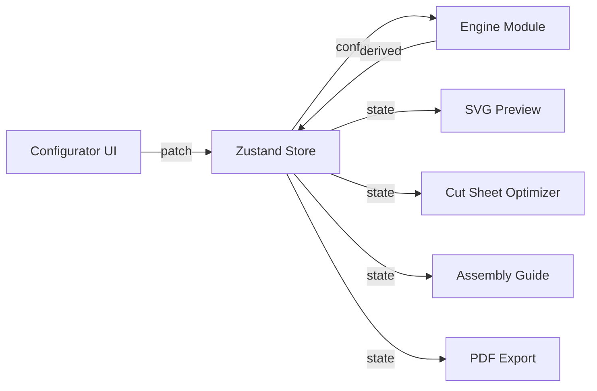
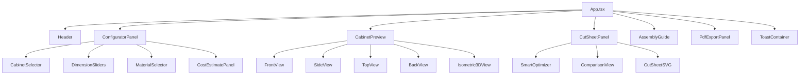
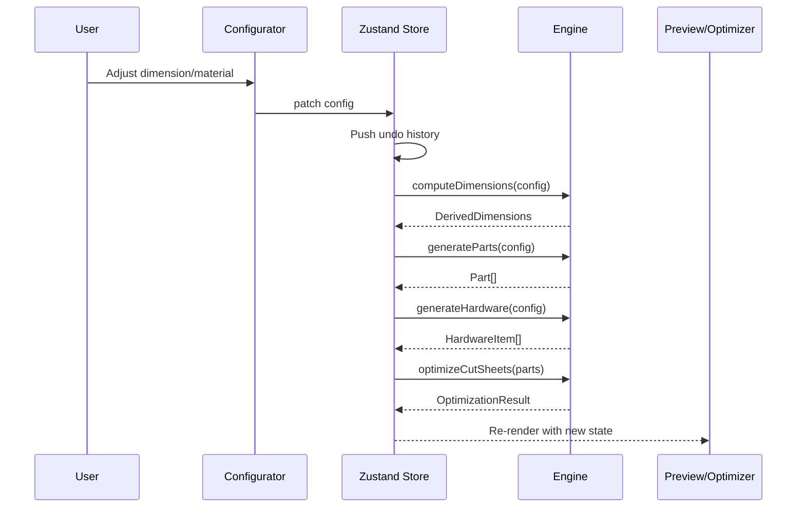

# Architecture

Cabinet Planner is a client-side React SPA (no backend). All computation — dimensions, parts, hardware, cut-sheet optimization, cost estimation — runs in the browser.

## High-Level Data Flow



## Directory Layout

```
src/
├── main.tsx                 # React 19 entry point
├── App.tsx                  # Root component: tabs, keyboard shortcuts, layout
├── index.css                # Tailwind theme, print styles, RTL support
├── engine/                  # Pure TypeScript computation (no React)
│   ├── types.ts             # Domain types: CabinetConfig, Part, HardwareItem, etc.
│   ├── materials.ts         # Material database, constraints, defaults
│   ├── dimensions.ts        # Derived dimensions from config
│   ├── parts.ts             # Part list generation
│   ├── hardware.ts          # Hardware BOM generation
│   ├── cut-optimizer.ts     # FFD bin-packing for cut sheets
│   ├── smart-optimizer.ts   # 5 optimization strategies
│   ├── assembly.ts          # Assembly step generation
│   ├── cost-estimator.ts    # Cost breakdown calculation
│   └── index.ts             # Barrel exports
├── components/
│   ├── configurator/        # Config panel: sliders, selectors, material editor
│   ├── preview/             # SVG cabinet views (6 views + isometric 3D)
│   ├── optimizer/           # Cut sheet visualization, smart optimizer, comparison
│   ├── assembly/            # Step-by-step assembly guide
│   ├── pdf/                 # @react-pdf/renderer document + export panel
│   └── layout/              # Header, sidebar, toast, onboarding overlay
├── store/
│   ├── cabinet-store.ts     # Main Zustand store: config, derived state, undo/redo
│   ├── custom-materials-store.ts  # User-defined materials
│   └── toast-store.ts       # Notification queue
├── hooks/
│   └── useTouchGestures.ts  # Pinch-zoom and swipe gestures
├── i18n/
│   ├── index.ts             # i18next setup
│   ├── en.json              # English translations
│   └── he.json              # Hebrew translations (RTL)
├── utils/
│   ├── bom-export.ts        # CSV bill of materials export
│   ├── download.ts          # Shared file download helper
│   ├── dxf-export.ts        # AutoCAD R12 DXF export for CNC
│   ├── gcode-export.ts      # G-code export for CNC routers
│   ├── local-storage.ts     # localStorage persistence
│   ├── units.ts             # Metric ↔ imperial conversion
│   └── url-state.ts         # URL query param serialization
└── assets/                  # Static assets (favicon, etc.)

public/
├── manifest.json            # PWA manifest
├── sw.js                    # Service worker (cache-first)
├── robots.txt               # Search engine directives
├── sitemap.xml              # Sitemap
└── 404.html                 # GitHub Pages SPA fallback

tests/                       # Vitest unit tests (mirrors src/ structure)
  ├── helpers.ts             # Shared test fixtures (cfg, mockSheet, mockPart)
  ├── assertions.ts          # Reusable test assertions (bilingual, sequential)
.github/
├── workflows/
│   ├── ci.yml               # CI: typecheck → lint → test → build
│   ├── release.yml          # Release: build + GitHub Release with artifacts
│   └── pages.yml            # Deploy to GitHub Pages on push to main
├── ISSUE_TEMPLATE/          # Bug report, feature request
├── PULL_REQUEST_TEMPLATE.md
├── CODEOWNERS
├── CONTRIBUTING.md
├── SECURITY.md
└── dependabot.yml
```

## Engine Module

The engine is a set of pure functions with no React dependency. All functions take a `CabinetConfig` and return derived data:

| Function            | Input                            | Output                                                       |
| ------------------- | -------------------------------- | ------------------------------------------------------------ |
| `computeDimensions` | `CabinetConfig`                  | `DerivedDimensions` (internal measurements, hinge positions) |
| `generateParts`     | `CabinetConfig`                  | `Part[]` (bilingual names, dimensions, edge banding)         |
| `generateHardware`  | `CabinetConfig`                  | `HardwareItem[]` (hinges, screws, cam locks, etc.)           |
| `optimizeCutSheets` | `Part[]`                         | `OptimizationResult` (sheet layouts, yield %, waste)         |
| `findOptimizations` | `CabinetConfig`                  | `OptimizationSuggestion[]` (5 strategies with scores)        |
| `estimateCost`      | `Part[], HardwareItem[], config` | `CostBreakdown` (per-material, hardware, total)              |

## State Management

A single Zustand store (`cabinet-store.ts`) holds:

- **Project state**: array of `CabinetEntry` (name + config), active index
- **Derived state**: dimensions, parts, hardware, optimization (recomputed on config change)
- **Undo/redo**: past/future stacks of cabinet arrays (max 50 entries)
- **UI state**: active tab, dark mode, color-blind mode, unit system

Two supplementary stores:

- `custom-materials-store.ts` — user-defined materials persisted to localStorage
- `toast-store.ts` — notification queue with auto-dismiss

## Build & Deploy

- **Bundler**: Vite 6 with React plugin + Tailwind CSS plugin
- **Code splitting**: `@react-pdf/renderer` is split into a separate chunk via `manualChunks` and lazy-loaded
- **Deploy target**: GitHub Pages (base path: `/WoodworkingShop/`)
- **PWA**: service worker in `public/sw.js` with cache-first strategy

## Supported Furniture Types

| Type        | Parts                                                  | Features                     |
| ----------- | ------------------------------------------------------ | ---------------------------- |
| `cabinet`   | Top, bottom, sides, shelves, back, doors, kick plate   | Doors, drawers (0–4), hinges |
| `bookshelf` | Top, bottom, sides, shelves, back, kick plate          | Open front (no doors)        |
| `desk`      | Desktop, legs, back panel, modesty panel, shelf        | Adjustable height            |
| `wardrobe`  | Top, bottom, sides, shelves, back, doors, hanging rail | Rail + shelf combo           |

## Component Tree



## State Flow


