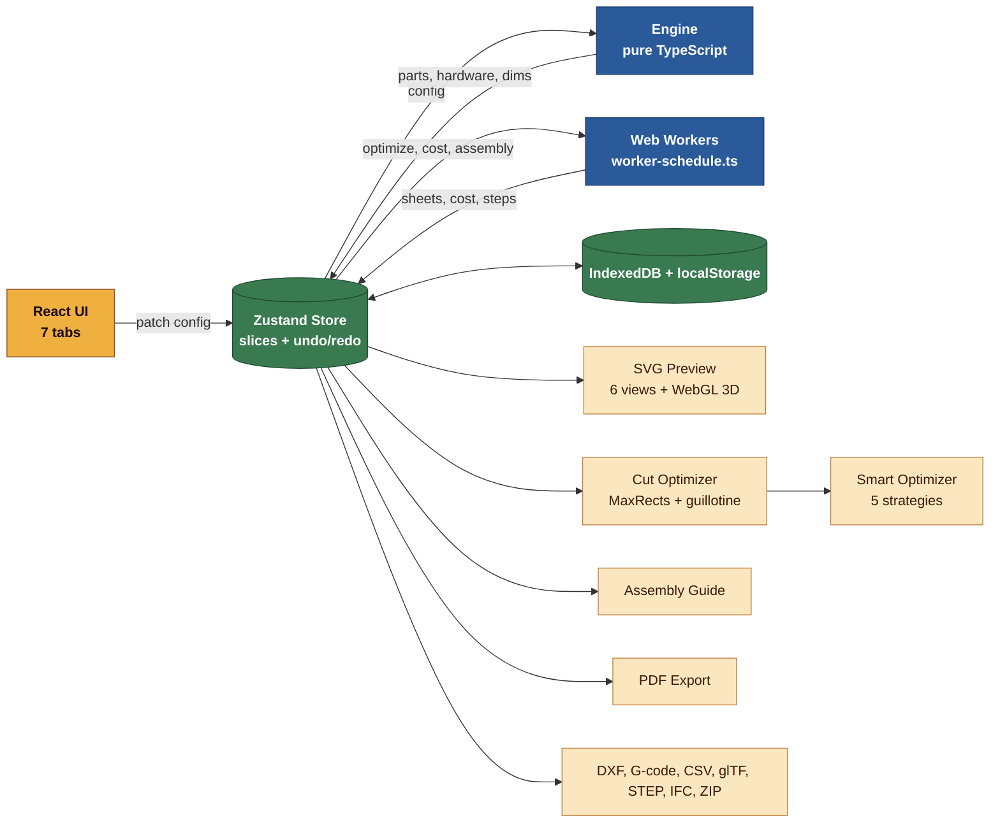
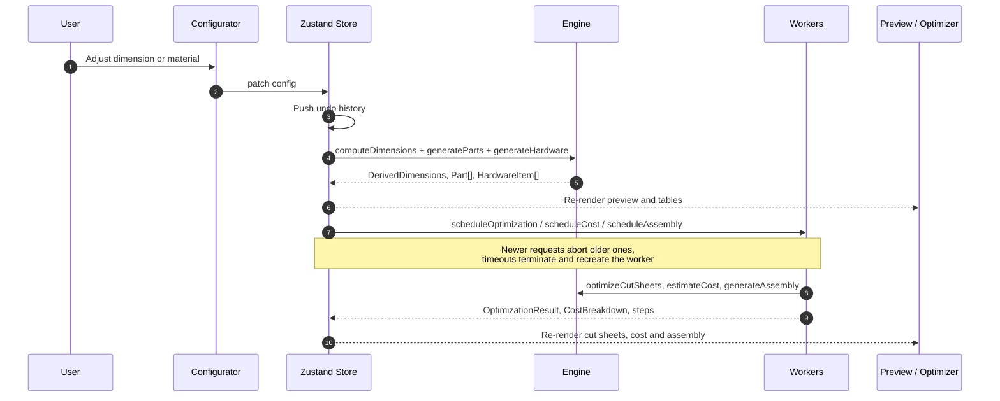
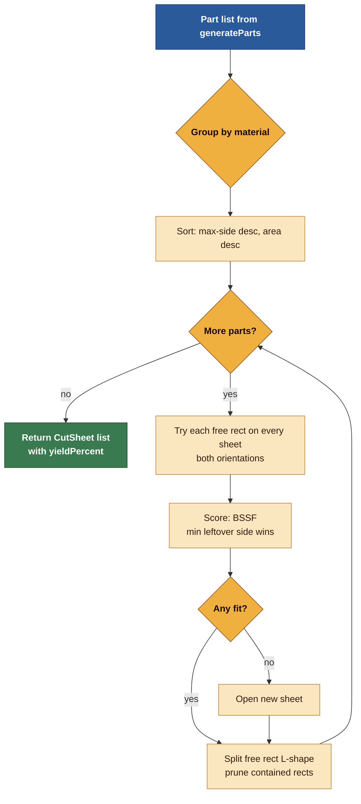
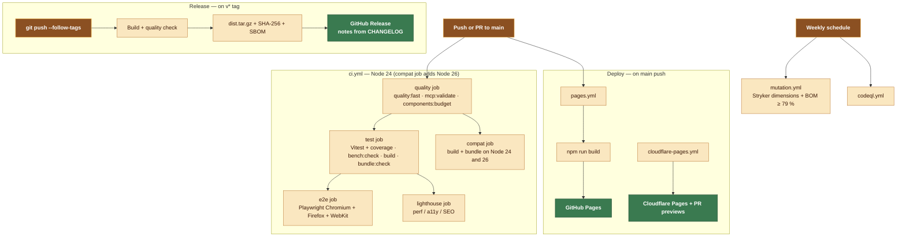
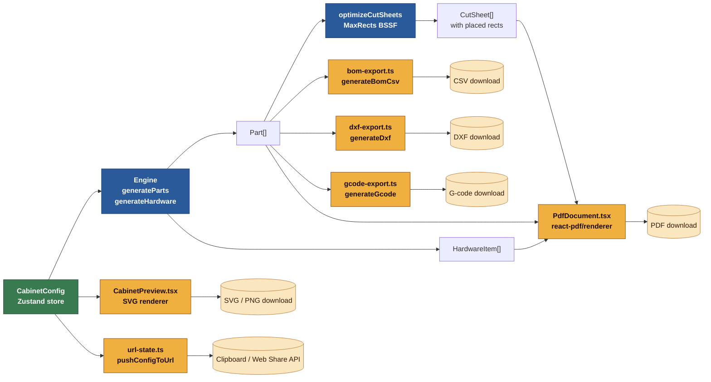
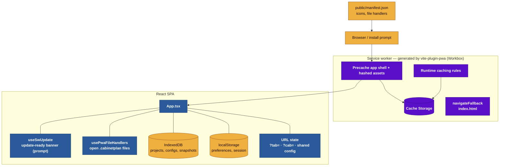
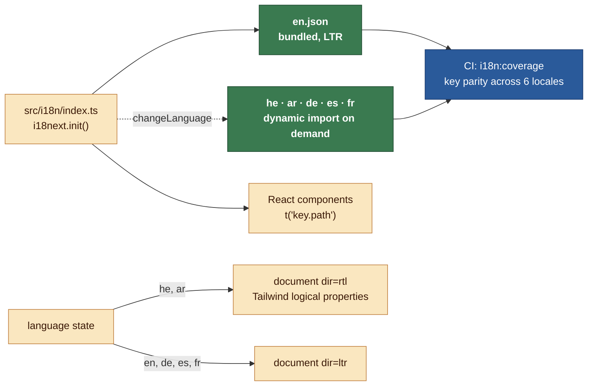
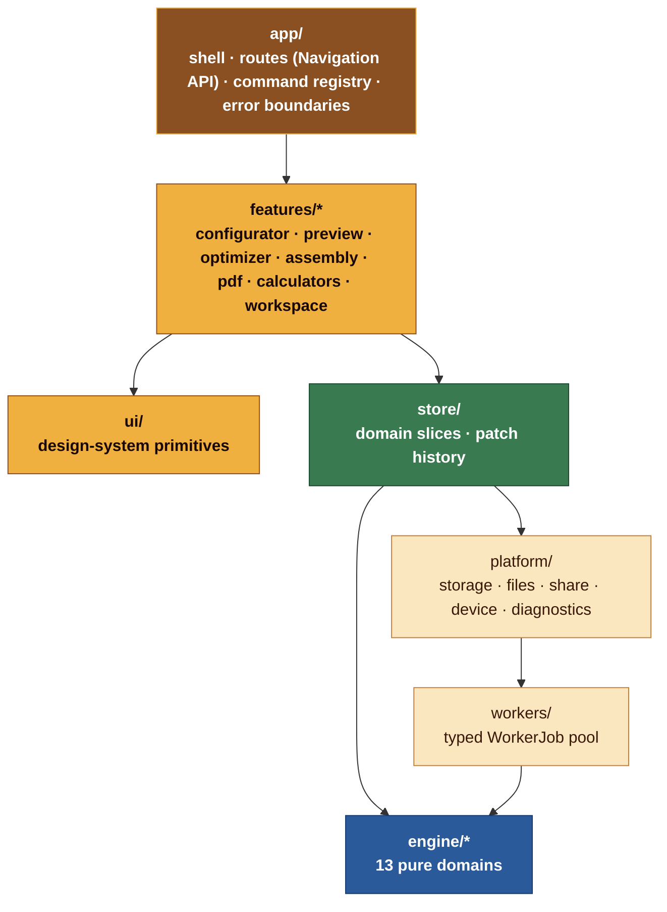

# 🏛 Architecture

<div align="center">
  
</div>

Cabinet Planner is a client-side React SPA (no backend). All computation — dimensions, parts, hardware, cut-sheet optimization, cost estimation — runs in the browser.

> **Module reference** — For competitive positioning, product strategy, and sprint planning see [ROADMAP.md](../ROADMAP.md). For user-facing feature descriptions see [USER-GUIDE.md](USER-GUIDE.md).

## ⚡ High-Level Data Flow


```mermaid
graph LR
  UI["React UI<br/>7 tabs"]:::ui -->|"patch config"| Store[("Zustand Store<br/>slices + undo/redo")]:::store
  Store -->|config| Engine["Engine<br/>pure TypeScript"]:::engine
  Engine -->|"parts, hardware, dims"| Store
  Store -->|"optimize, cost, assembly"| Workers["Web Workers<br/>worker-schedule.ts"]:::engine
  Workers -->|"sheets, cost, steps"| Store
  Store <--> Storage[("IndexedDB + localStorage")]:::store
  Store --> Preview["SVG Preview<br/>6 views + WebGL 3D"]:::output
  Store --> Optimizer["Cut Optimizer<br/>MaxRects + guillotine"]:::output
  Optimizer --> Smart["Smart Optimizer<br/>5 strategies"]:::output
  Store --> Assembly["Assembly Guide"]:::output
  Store --> PDF["PDF Export"]:::output
  Store --> Exports["DXF, G-code, CSV, glTF, STEP, IFC, ZIP"]:::output

  classDef ui fill:#f0b040,stroke:#8b5022,color:#1a0806,font-weight:bold
  classDef store fill:#3a7a50,stroke:#1e4a30,color:#ffffff,font-weight:bold
  classDef engine fill:#2a5a9a,stroke:#1a3a6e,color:#ffffff,font-weight:bold
  classDef output fill:#fae7c0,stroke:#c08040,color:#3a1806
```

## 📁 Directory Layout

Measured on 2026-10-04 (v5.34.0). The planned target layout is in [Target Architecture](#-target-architecture-phase-82).

```text
src/
├── main.tsx                 # React 19 entry point
├── App.tsx                  # Root: 7 tabs, keyboard shortcuts, lazy panels, error boundaries
├── index.css                # Tailwind v4 theme (wood-* tokens), print styles, RTL support
├── engine/                  # Pure TypeScript computation (no React, no DOM) — 177 files
│   ├── types.ts             # Domain types: CabinetConfig, Part, HardwareItem, …
│   ├── dimensions.ts        # Derived dimensions from config
│   ├── parts.ts             # Part list generation
│   ├── hardware.ts          # Hardware BOM generation
│   ├── cut-optimizer.ts     # MaxRects BSSF + guillotine bin-packing
│   ├── smart-optimizer.ts   # 5 optimization strategies
│   ├── assembly.ts          # Assembly step generation
│   ├── cost-estimator.ts    # Cost breakdown
│   ├── …                    # 24 mounted calculators and supporting modules (165 top-level files)
│   ├── assembly/ geometry/ hardware/ materials/ optimizer/   # Domain barrels
│   ├── export/              # glTF, STEP, IFC writers
│   ├── validation/          # Dimension, door and shelf rules
│   └── index.ts             # Public barrel (1,448 lines)
├── components/              # 116 .tsx files
│   ├── configurator/        # Config panel, presets, materials, calculators, room layout (49 files)
│   ├── preview/             # SVG views, isometric, WebGL 3D panel (9 files)
│   ├── optimizer/           # Cut sheets, smart optimizer, tables, G-code preview (26 files)
│   ├── assembly/            # Step-by-step guide, build log (5 files)
│   ├── pdf/                 # Document orchestrator + sections/ (17 files)
│   └── layout/              # Header, sidebar, toasts, onboarding, error boundary (19 files)
├── store/
│   ├── cabinet-store.ts     # Main store: cabinets, derived state, undo/redo
│   ├── slices/              # uiSlice · snapshotSlice · optimizerSettingsSlice · namedExpressionsSlice
│   ├── custom-materials-store.ts · custom-hardware-store.ts · room-store.ts
│   ├── stock-tracker-store.ts · cost-variance-store.ts · toast-store.ts
│   ├── safe-persist-storage.ts   # Fault-tolerant persistence wrapper
│   └── worker-schedule.ts   # Worker lifecycle, abort, timeout, stale-result suppression
├── workers/                 # cut-optimizer, cost-estimator, assembly, bom-export, dxf-export
├── hooks/                   # useFocusTrap, useTouchGestures, useCamera, useHaptics,
│                            #   useSwUpdate, usePwaFileHandlers, useSystemDarkMode, useIntersectionVisible
├── i18n/                    # index.ts + en, he, ar, de, es, fr (non-English lazy-loaded)
├── services/                # capability-contracts, error-reporter
└── utils/                   # 33 files: BOM/DXF/G-code export, URL state, IndexedDB storage, ZIP, downloads

public/
├── manifest.json            # PWA manifest with file handlers
├── _headers · _redirects    # Cloudflare Pages security headers (CSP) and SPA fallback
├── offline.html · 404.html  # Offline and GitHub Pages fallbacks
├── robots.txt · sitemap.xml
└── fonts/                   # Self-hosted fonts

tests/                       # 353 test files mirroring src/
├── engine/ store/ utils/ hooks/ services/ i18n/   # Vitest unit and property tests
├── components/              # Testing Library behaviour tests (separate coverage ratchet)
├── e2e/                     # Playwright journeys, accessibility, visual baselines
├── fixtures/                # Oracles, golden exports, project fixtures
├── bench/                   # Vitest benchmarks (budgets in config/bench-budget.json)
└── helpers.ts · assertions.ts · setup.ts

.github/
├── workflows/               # 15 workflows: CI, release, pages, CodeQL, mutation, Lighthouse, …
├── actions/setup-node/      # Composite checkout + Node + npm ci
├── agents/ prompts/ instructions/ skills/ hooks/   # Copilot assets (validated in quality)
├── ISSUE_TEMPLATE/ DISCUSSION_TEMPLATE/
├── CONTRIBUTING.md · SECURITY.md · GOVERNANCE-POLICY.md
└── dependabot.yml
```

### CNC Serial Ownership

`src/engine/webserial-v2.ts` owns the pure stream-session state machine;
`src/utils/webserial-cnc.ts` owns browser Web Serial I/O and is used by the
assembly panel. Keep device access out of the pure engine. The public
`src/engine/webserial.ts` API remains as a deprecated compatibility adapter
through v5.35.x and is scheduled for removal in v5.36.0.

## ⚙ Engine Module

The engine is a set of pure functions with no React dependency. All functions take a `CabinetConfig` and return derived data:

| Function            | Input                            | Output                                                       |
| ------------------- | -------------------------------- | ------------------------------------------------------------ |
| `computeDimensions` | `CabinetConfig`                  | `DerivedDimensions` (internal measurements, hinge positions) |
| `generateParts`     | `CabinetConfig`                  | `Part[]` (bilingual names, dimensions, edge banding)         |
| `generateHardware`  | `CabinetConfig`                  | `HardwareItem[]` (hinges, screws, cam locks, etc.)           |
| `optimizeCutSheets` | `Part[]`                         | `OptimizationResult` (sheet layouts, yield %, waste)         |
| `findOptimizations` | `CabinetConfig`                  | `OptimizationSuggestion[]` (5 strategies with scores)        |
| `estimateCost`      | `Part[], HardwareItem[], config` | `CostBreakdown` (per-material, hardware, total)              |

## 🗄 State Management

The main Zustand store (`cabinet-store.ts`) composes four slices (`uiSlice`, `snapshotSlice`, `optimizerSettingsSlice`, `namedExpressionsSlice`) and holds:

- **Project state**: array of `CabinetEntry` (name + config), active index
- **Derived state**: dimensions and parts computed synchronously; optimization, cost and assembly scheduled on Web Workers by `worker-schedule.ts` (abort, timeout and stale-result suppression)
- **Undo/redo**: past/future stacks of cabinet arrays (max 50 entries)
- **UI state**: active tab, dark mode, high contrast, colour-blind mode, unit system, focus mode

Satellite stores: `custom-materials-store.ts`, `custom-hardware-store.ts`, `room-store.ts`, `stock-tracker-store.ts`, `cost-variance-store.ts` and `toast-store.ts`. Phase 82 (Sprint 429) plans to fold them into domain slices with patch-based history.

Saved projects, configurations, and snapshots use IndexedDB through `idb-keyval` in
`utils/indexed-db-storage.ts`. Existing localStorage project/config data migrates one-way on first
access; session state and UI preferences continue to use localStorage via `safe-persist-storage.ts`.

## 📦 Build & Deploy

- **Bundler**: Vite 8 (Rolldown) with React plugin + Tailwind CSS plugin
- **Code splitting**: every tab panel is `React.lazy`; `@react-pdf/renderer` is split into its own chunk via `manualChunks` and loaded on demand
- **Deploy targets**: GitHub Pages (base path `/WoodworkingShop/`) and Cloudflare Pages (edge CDN, PR previews, CSP headers from `public/_headers`)
- **PWA**: `vite-plugin-pwa` generates a Workbox service worker (`registerType: 'prompt'`); `useSwUpdate` shows the update-ready banner

Intermediate artifact policy:

- Generated caches and reports (Vite cache, ESLint cache, Vitest coverage output, Playwright test results/reports) are configured to write to OS TEMP (`%TEMP%/WoodworkingShop` on Windows).
- Workspace root should only contain source/config/documentation artifacts, not transient telemetry outputs.

## 🔗 SharedArrayBuffer & Cross-Origin Isolation

`SharedArrayBuffer` enables zero-copy memory sharing between the main thread and Web Workers. The cut-optimizer worker currently uses structured-clone transfer. A future optimisation could pass part data via a shared buffer to avoid serialisation overhead.

**Requirement**: `SharedArrayBuffer` is only available when the page is _cross-origin isolated_. This requires the server to send:

```text
Cross-Origin-Opener-Policy:  same-origin
Cross-Origin-Embedder-Policy: require-corp
```

**Current status**: GitHub Pages does **not** set these headers, so `crossOriginIsolated` is `false` there. Cloudflare Pages sends `Cross-Origin-Opener-Policy: same-origin` but not COEP. The utility function `trySharedArrayBuffer(size)` in `src/workers/shared-buffer.ts` detects this and returns `null`, allowing the worker pipeline to fall back to standard transfer automatically.

**To enable locally**: Add to `vite.config.ts` `server.headers`:

```ts
'Cross-Origin-Opener-Policy': 'same-origin',
'Cross-Origin-Embedder-Policy': 'require-corp',
```

## 🎮 WebGL 3-D Preview

The Preview tab mounts an interactive 3D panel (`Preview3DPanel`) beside the six SVG views. Sprint 440 plans a WebGPU renderer with a WebGL2 fallback.

**Feature probe** — `src/engine/webgl-probe.ts`:

| Function              | Description                                     |
| --------------------- | ----------------------------------------------- |
| `probeWebGLTier()`    | Returns `'webgl2' \| 'webgl1' \| 'unavailable'` |
| `isWebGLAvailable()`  | Quick boolean gate                              |
| `isWebGL2Available()` | Check for full shader support                   |

**Component** — `src/components/preview/WebGLPreviewCanvas.tsx`:

- Renders a simplified 3-D box approximating the configured cabinet dimensions.
- Uses raw WebGL (no external library) to keep bundle impact near zero.
- Falls back gracefully to a descriptive message if WebGL is unsupported.

> Roadmap items for realistic materials and the WebGPU path: [ROADMAP.md — Sprint 440](../ROADMAP.md).

## 🧩 Component Tree


```mermaid
graph TD
  App["App.tsx<br/>shortcuts · lazy panels · focus mode"]:::root

  Header["Header<br/>tabs, undo/redo, theme, language, units"]:::layout
  Sidebar["Sidebar<br/>cabinets, project summary, cost"]:::layout
  Shell["ToastContainer · OnboardingManager · ShortcutsModal"]:::layout

  subgraph Tabs["Seven tabs — each panel wrapped in an ErrorBoundary"]
    Workspace["Workspace<br/>welcome banner"]:::tab
    Config["Configurator<br/>ConfiguratorPanel + RoomLayoutView"]:::config
    Preview["Preview<br/>CabinetPreview (6 SVG views) + Preview3DPanel"]:::view
    Optimizer["Cut Sheets<br/>ProjectSummary · SmartOptimizer · Parts/Hardware tables · OptimizerView"]:::tab
    Assembly["Assembly<br/>AssemblyGuide + build log"]:::tab
    PDF["PDF Export<br/>PdfExportPanel + glTF/STEP/IFC"]:::tab
    Calc["Calculators<br/>24 lazy calculator panels"]:::tab
  end

  subgraph ConfigParts["Configurator sections"]
    Presets["Quick presets"]:::sub
    Dims["Dimensions + toe kick"]:::sub
    Mat["Materials + custom catalog"]:::sub
    Doors["Doors + drawers + shelves"]:::sub
    Expr["Named expressions"]:::sub
  end

  App --> Header
  App --> Sidebar
  App --> Shell
  App --> Workspace
  App --> Config
  App --> Preview
  App --> Optimizer
  App --> Assembly
  App --> PDF
  App --> Calc
  Config --> Presets
  Config --> Dims
  Config --> Mat
  Config --> Doors
  Config --> Expr

  classDef root fill:#8b5022,stroke:#f0b040,color:#ffffff,font-weight:bold
  classDef layout fill:#d4860a,stroke:#8b5022,color:#1a0806
  classDef config fill:#2a6a4a,stroke:#1a4030,color:#ffffff,font-weight:bold
  classDef sub fill:#e0f5ea,stroke:#4a9a6a,color:#1a3a28
  classDef view fill:#2a5a9a,stroke:#1a3a6e,color:#ffffff,font-weight:bold
  classDef tab fill:#7a3a10,stroke:#c08040,color:#fae7c0
```

## 🔄 State Flow


```mermaid
sequenceDiagram
  autonumber
  participant U as User
  participant C as Configurator
  participant S as Zustand Store
  participant E as Engine
  participant W as Workers
  participant V as Preview / Optimizer

  U->>C: Adjust dimension or material
  C->>S: patch config
  S->>S: Push undo history
  S->>E: computeDimensions + generateParts + generateHardware
  E-->>S: DerivedDimensions, Part[], HardwareItem[]
  S-->>V: Re-render preview and tables
  S->>W: scheduleOptimization / scheduleCost / scheduleAssembly
  Note over S,W: Newer requests abort older ones,<br/>timeouts terminate and recreate the worker
  W->>E: optimizeCutSheets, estimateCost, generateAssembly
  W-->>S: OptimizationResult, CostBreakdown, steps
  S-->>V: Re-render cut sheets, cost and assembly
```

## ✂ Cut Optimizer Pipeline

The cut optimizer uses a Maximal Rectangles (MaxRects) algorithm with the
Best Short Side Fit (BSSF) heuristic. Parts are queued in descending
max-side order, then each part probes every free rectangle on every open
sheet in both orientations before opening a new sheet.


```mermaid
flowchart TD
  parts["Part list from generateParts"]:::input --> group{"Group by material"}:::decision
  group --> queue["Sort: max-side desc, area desc"]:::process
  queue --> next{"More parts?"}:::decision
  next -- no --> done["Return CutSheet list\nwith yieldPercent"]:::output
  next -- yes --> probe["Try each free rect on every sheet\nboth orientations"]:::process
  probe --> score["Score: BSSF\nmin leftover side wins"]:::process
  score --> place{"Any fit?"}:::decision
  place -- yes --> split["Split free rect L-shape\nprune contained rects"]:::process
  place -- no --> newSheet["Open new sheet"]:::process
  newSheet --> split
  split --> next

  classDef input fill:#2a5a9a,stroke:#1a3a6e,color:#ffffff,font-weight:bold
  classDef decision fill:#f0b040,stroke:#8b5022,color:#1a0806,font-weight:bold
  classDef process fill:#fae7c0,stroke:#c08040,color:#3a1806
  classDef output fill:#3a7a50,stroke:#1e4a30,color:#ffffff,font-weight:bold
```

## 🚀 CI/CD Pipeline


```mermaid
graph TD
  push["Push or PR to main"] --> quality
  push --> pages["pages.yml"]

  subgraph CI ["ci.yml — Node 24 (compat job adds Node 26)"]
    quality["quality job<br/>quality:fast · mcp:validate · components:budget"] --> test["test job<br/>Vitest + coverage · bench:check · build · bundle:check"]
    quality --> compat["compat job<br/>build + bundle on Node 24 and 26"]
    test --> e2e["e2e job<br/>Playwright Chromium + Firefox + WebKit"]
    test --> lhci["lighthouse job<br/>perf / a11y / SEO"]
  end

  subgraph Deploy ["Deploy — on main push"]
    pages --> dbuild["npm run build"]
    dbuild --> ghpages["GitHub Pages"]
    cfp["cloudflare-pages.yml"] --> cf["Cloudflare Pages + PR previews"]
  end

  subgraph Release ["Release — on v* tag"]
    tag["git push --follow-tags"] --> rbuild["Build + quality check"]
    rbuild --> archive["dist.tar.gz + SHA-256 + SBOM"]
    archive --> ghrelease["GitHub Release<br/>notes from CHANGELOG"]
  end

  weekly["Weekly schedule"] --> mutation["mutation.yml<br/>Stryker dimensions + BOM ≥ 79 %"]
  weekly --> codeql["codeql.yml"]

  classDef trigger fill:#8b5022,stroke:#f0b040,color:#fff,font-weight:bold
  classDef step fill:#fae7c0,stroke:#c08040,color:#3a1806
  classDef gate fill:#3a7a50,stroke:#1e4a30,color:#fff,font-weight:bold
  class push,tag,weekly trigger
  class ghpages,ghrelease,cf gate
  class quality,test,compat,e2e,lhci,dbuild,rbuild,archive,mutation,codeql,cfp,pages step
```

Planned (Phase 81): SHA-pinned actions, sharded E2E with blocking visual snapshots, build attestations and an OpenSSF Scorecard workflow.

## 📤 Export Pipeline


```mermaid
graph LR
  config["CabinetConfig\nZustand store"] --> engine["Engine\ngenerateParts\ngenerateHardware"]
  engine --> parts["Part[]"]
  engine --> hw["HardwareItem[]"]
  parts --> opt["optimizeCutSheets\nMaxRects BSSF"]
  opt --> sheets["CutSheet[]\nwith placed rects"]

  parts --> bom["bom-export.ts\ngenerateBomCsv"]
  bom --> csv[("CSV download")]

  parts --> dxf["dxf-export.ts\ngenerateDxf"]
  dxf --> dxffile[("DXF download")]

  parts --> gcode["gcode-export.ts\ngenerateGcode"]
  gcode --> gcfile[("G-code download")]

  sheets --> pdf["PdfDocument.tsx\nreact-pdf/renderer"]
  hw --> pdf
  parts --> pdf
  pdf --> pdffile[("PDF download")]

  config --> preview["CabinetPreview.tsx\nSVG renderer"]
  preview --> svgpng[("SVG / PNG download")]

  config --> url["url-state.ts\npushConfigToUrl"]
  url --> share[("Clipboard / Web Share API")]

  classDef store fill:#3a7a50,stroke:#1e4a30,color:#fff,font-weight:bold
  classDef engine fill:#2a5a9a,stroke:#1a3a6e,color:#fff,font-weight:bold
  classDef file fill:#f0b040,stroke:#8b5022,color:#1a0806,font-weight:bold
  classDef output fill:#fae7c0,stroke:#c08040,color:#3a1806
  class config store
  class engine,opt engine
  class bom,dxf,gcode,pdf,preview,url file
  class csv,dxffile,gcfile,pdffile,svgpng,share output
```

## 📱 PWA Architecture


```mermaid
graph TD
  browser["Browser / install prompt"]

  subgraph SW ["Service worker — generated by vite-plugin-pwa (Workbox)"]
    sw["Precache app shell + hashed assets"]
    cache[("Cache Storage")]
    runtime["Runtime caching rules"]
    sw --> cache
    runtime --> cache
    fallback["navigateFallback<br/>index.html"]
  end

  subgraph App ["React SPA"]
    app["App.tsx"]
    update["useSwUpdate<br/>update-ready banner (prompt)"]
    files["usePwaFileHandlers<br/>open .cabinetplan files"]
    idb[("IndexedDB<br/>projects, configs, snapshots")]
    ls[("localStorage<br/>preferences, session")]
    urlp["URL state<br/>?tab= · ?cab= · shared config"]
    app --- update
    app --- files
    app --- idb
    app --- ls
    app --- urlp
  end

  browser --> sw
  sw --> app
  manifest["public/manifest.json<br/>icons, file handlers"] --> browser

  classDef sw fill:#5a0fc8,stroke:#3a0a8a,color:#fff,font-weight:bold
  classDef app fill:#2a5a9a,stroke:#1a3a6e,color:#fff,font-weight:bold
  classDef storage fill:#f0b040,stroke:#8b5022,color:#1a0806
  class sw,cache,runtime,fallback sw
  class app,update,files,urlp app
  class manifest,browser,idb,ls storage
```

Offline reload, quota pressure and file-handler journeys are re-opened as Sprint 315 carry-over for v5.35.0.

## 🌐 i18n Architecture


```mermaid
graph LR
  init["src/i18n/index.ts<br/>i18next.init()"]
  en["en.json<br/>bundled, LTR"]
  lazy["he · ar · de · es · fr<br/>dynamic import on demand"]
  init --> en
  init -. "changeLanguage" .-> lazy

  store["language state"]
  store -- "he, ar" --> rtl["document dir=rtl<br/>Tailwind logical properties"]
  store -- "en, de, es, fr" --> ltr["document dir=ltr"]

  comp["React components<br/>t('key.path')"]
  init --> comp

  ci["CI: i18n:coverage<br/>key parity across 6 locales"]
  en --> ci
  lazy --> ci

  classDef file fill:#3a7a50,stroke:#1e4a30,color:#fff,font-weight:bold
  classDef process fill:#fae7c0,stroke:#c08040,color:#3a1806
  classDef check fill:#2a5a9a,stroke:#1a3a6e,color:#fff
  class en,lazy file
  class init,store,comp,rtl,ltr process
  class ci check
```

English and Hebrew are complete. Arabic, German, Spanish and French still fall back to English for a share of strings; Sprint 375 adds a completeness gate, glossary and pseudo-locales, and Sprint 433 splits locale files into typed namespaces.

## ♿ Accessibility (WCAG 2.2 AA)

Cabinet Planner targets **WCAG 2.2 Level AA** compliance. This section documents the patterns, CI gates, and runtime mechanisms in place.

### Compliance Target

| Standard | Level | Status                         |
| -------- | ----- | ------------------------------ |
| WCAG 2.2 | AA    | ✅ Enforced in CI via axe-core |
| WCAG 2.1 | AA    | ✅ (subset of 2.2)             |
| WCAG 2.2 | AAA   | ⚠ Partial (not fully targeted) |

### CI Gate — axe-core + Playwright

`tests/e2e/accessibility.spec.ts` runs on every CI run against the production build:

1. Launches the built app with `@playwright/test`
2. Injects `@axe-core/playwright` with tags `wcag2a`, `wcag2aa`, `wcag21a`, `wcag21aa` and `wcag22aa`
3. Fails the pipeline on any violation

Coverage: all seven tabs × six locales × light/dark themes, plus mobile navigation and onboarding, the shortcuts dialog, project manager, invalid-import errors, G-code export preview and optimizer loading/error recovery (Sprint 316). A keyboard-only journey covers skip link, focus visibility, tab order and dialog focus return.

### Focus Management

| Pattern                | Location                                                                                                                          |
| ---------------------- | --------------------------------------------------------------------------------------------------------------------------------- |
| **Focus trap**         | `useFocusTrap` hook — shared by every modal dialog; ignores negative-tabindex elements and restores focus to the trigger on close |
| **Skip-to-main**       | `index.html` — `<a href="#main-content">` skip link at the top of the DOM, translatable via `a11y.skipToContent` i18n key         |
| **Tab order**          | All interactive elements follow logical DOM order; `tabIndex` is only used for hidden inputs (`tabIndex={-1}`)                    |
| **Keyboard shortcuts** | `?` = shortcuts modal, `Ctrl+Z` / `Ctrl+Y` = undo/redo, `Alt+1`–`Alt+6` = tabs, `Alt+D` = dark mode, `Ctrl+Shift+K` = focus mode  |

### Visual Accessibility

| Feature                      | Implementation                                                                                                                                      |
| ---------------------------- | --------------------------------------------------------------------------------------------------------------------------------------------------- |
| **High-contrast mode**       | `.high-contrast` CSS class on the app root wrapper, toggled via the `toggleHighContrast()` store action and persisted with UI preferences.          |
| **Color-blind mode**         | `colorBlindMode` store toggle adds deuteranopia-friendly palette (amber → blue shift) for cut-sheet diagrams                                        |
| **`prefers-reduced-motion`** | CSS `@media (prefers-reduced-motion: reduce)` disables all transitions and animations (`transition: none !important`, `animation: none !important`) |
| **`prefers-color-scheme`**   | Dark mode auto-detected on first load via `detectOsDarkMode()`, persisted to localStorage                                                           |
| **Minimum contrast**         | Tailwind design tokens use `wood-600` (#5A3E28) on white, which exceeds 4.5:1 contrast ratio                                                        |

### ARIA Patterns

| Component           | ARIA usage                                                               |
| ------------------- | ------------------------------------------------------------------------ |
| Tab bar (Header)    | `role="tablist"`, `role="tab"`, `aria-selected`, `aria-controls`         |
| Modal dialogs       | `role="dialog"`, `aria-modal="true"`, `aria-labelledby`                  |
| Toggle buttons      | `aria-pressed`, `aria-label`                                             |
| Expandable sections | `aria-expanded`                                                          |
| SVG exports         | `<title>` elements on every polygon (isometric view, cut-sheet diagrams) |
| Form inputs         | `aria-label` or `<label for>` on all inputs                              |

### RTL Support

Hebrew (`he`) and Arabic (`ar`) locales set `document.dir = 'rtl'`. Tailwind's logical-property utilities (`start`, `end`, `ms-*`, `me-*`) are used throughout to ensure correct mirroring without manual CSS overrides.

### Known Limitations

- PDF exports (`@react-pdf/renderer`) are not keyboard-navigable (the generated PDF is a binary file; this is a platform constraint).
- The isometric 3D SVG view does not expose individual panel labels to screen readers — only the cabinet-level `<title>` and `<desc>` are present (improvement tracked in ROADMAP).
- Browser verification is intentionally uneven: the full journey suite runs in Chromium and Firefox; desktop and mobile WebKit run preview acceptance only. The six-locale axe matrix and responsive/visual preview matrices are Chromium-only. Sprint 318's 2026-10-02 no-retry run passed 439 tests with 13 intentional project-scope skips and no failures.

## 🎯 Target Architecture (Phase 82)

Phase 82 of the [roadmap](../ROADMAP.md) restructures the code without changing behaviour. Export goldens, visual baselines and E2E journeys must stay identical.


```mermaid
flowchart TB
  App["app/<br/>shell · routes (Navigation API) · command registry · error boundaries"]
  Features["features/*<br/>configurator · preview · optimizer · assembly · pdf · calculators · workspace"]
  UI["ui/<br/>design-system primitives"]
  Store["store/<br/>domain slices · patch history"]
  Platform["platform/<br/>storage · files · share · device · diagnostics"]
  Workers["workers/<br/>typed WorkerJob pool"]
  Engine["engine/*<br/>13 pure domains"]

  App --> Features
  Features --> UI
  Features --> Store
  Store --> Engine
  Store --> Platform
  Platform --> Workers
  Workers --> Engine

  classDef shell fill:#8b5022,stroke:#f0b040,color:#ffffff,font-weight:bold
  classDef view fill:#f0b040,stroke:#8b5022,color:#1a0806,font-weight:bold
  classDef state fill:#3a7a50,stroke:#1e4a30,color:#ffffff,font-weight:bold
  classDef pure fill:#2a5a9a,stroke:#1a3a6e,color:#ffffff,font-weight:bold
  classDef io fill:#fae7c0,stroke:#c08040,color:#3a1806
  class App shell
  class Features,UI view
  class Store state
  class Engine pure
  class Platform,Workers io
```

| Rule (enforced by `npm run architecture:check` from Sprint 426) | Why                                                   |
| --------------------------------------------------------------- | ----------------------------------------------------- |
| `engine/` imports only `engine/`                                | Pure, deterministic, testable without a DOM           |
| Browser APIs only in `platform/` and `app/`                     | One place to fake, harden and feature-detect          |
| Cross-domain imports only through domain barrels                | Stable internal APIs; safe moves                      |
| No import cycles                                                | Predictable loading and code splitting                |
| Components ≤ 400 lines after Sprint 431                         | Reviewable files; primitives instead of copy-paste UI |

Architecture decisions are recorded as ADRs in `docs/decisions/` from Sprint 426.
