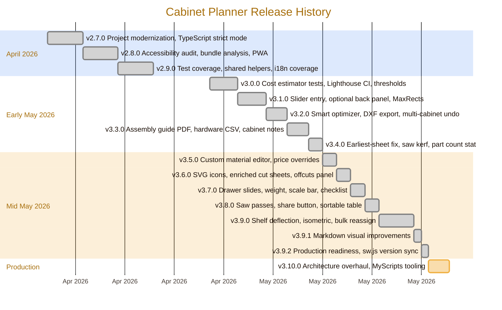

  

# 📜 Sprint History

This file is the archive of completed sprints and historical release planning.
The live, forward-looking roadmap lives at [`ROADMAP.md`](../ROADMAP.md).

Releases are tagged on GitHub. The CHANGELOG (`CHANGELOG.md`) is the source of
truth for what shipped in each version; this file records the per-sprint plan
that fed those releases.

## 📅 Release Timeline

## 🗺 v3.9.0 Sprint Plan (Sprints 173–181)

### Sprint 173 — Shelf Deflection Improvements ✅

- [x] Display a per-shelf deflection badge (δ mm) calculated from span, load, and E-modulus stored in `materials.ts`
- [x] Color-code badges: green (safe), amber (L/360–L/240), red (> L/240)
- [x] Add `deflectionMm` and `deflectionRating` to `DerivedDimensions`
- [x] Tests: deflection ratings for standard and overloaded spans (13 new tests — 27 total in dimensions.test.ts)
- [x] i18n: `shelves.deflectionSafe` and `shelves.deflectionDanger` keys in en.json + he.json

### Sprint 174 — Isometric 3D View Enhancements 🎲

- [ ] Add interior depth shading to the isometric view SVG
- [ ] Render individual shelf lines in isometric mode
- [ ] Show drawer stack outlines in isometric projection
- [ ] Ensure grain arrows overlay correctly in isometric
- [ ] Tests: snapshot comparison for cabinet/bookshelf/wardrobe isometric paths

### Sprint 175 — Bulk Material Reassignment 🔄

- [ ] "Reassign material" dropdown on the material summary panel (Optimizer tab)
- [ ] Selecting a new material updates all parts currently using the old material
- [ ] Rerun optimization automatically after reassignment
- [ ] Undo history entry: "Reassigned carcass from Birch Ply → Oak Ply"
- [ ] Tests: bulk reassign updates all part materials and triggers re-optimization

### Sprint 176 — Cabinet Template Library 📚

- [ ] Expand presets panel to 12 templates: add TV unit, bathroom vanity wall, bathroom vanity base, corner cabinet (blind), wine rack
- [ ] Each template encoded as a full `CabinetConfig` (not just dimension defaults)
- [ ] Template thumbnails: 80×60 SVG mini-preview per template
- [ ] URL param `tpl=` to deep-link directly to a template
- [ ] Tests: each template produces valid parts and hardware lists

### Sprint 177 — Advanced Hardware Catalog 🔩

- [ ] Hardware panel in Configurator: interactive catalog with 20+ hardware items
- [ ] Per-item supplier links (configurable, not hardcoded)
- [ ] Override quantity: user can increase/decrease any hardware count
- [ ] Export hardware list with overrides to CSV
- [ ] Tests: overridden quantities appear in BOM and cost calculation

### Sprint 178 — Multi-Project Workspace Panel 🗂️

- [ ] A "Projects" side panel (collapsible) listing all named projects saved in localStorage
- [ ] One-click switch between projects without losing current unsaved work (prompt to save)
- [ ] Project thumbnails: store a low-res preview SVG (front view) per project
- [ ] Export all projects as a single ZIP archive (one JSON per cabinet)
- [ ] Tests: project list persistence, thumbnail generation

### Sprint 179 — Print & PDF Improvements 🖨️

- [ ] Print dialog opens with correct page orientation auto-detected per sheet
- [ ] PDF cover page: project thumbnail, creation date, version, author field
- [ ] Page numbers on all PDF pages (e.g. "Page 3 of 12")
- [ ] PDF bookmarks (outline) for: cover, parts, cut sheets, hardware, assembly
- [ ] Tests: PDF document structure (page count, bookmark names)

### Sprint 180 — Accessibility & Keyboard Navigation ♿

- [ ] Full keyboard navigation within the configurator sidebar (Tab order, Enter/Space)
- [ ] Focus trap in modal dialogs (keyboard shortcuts help, material editor)
- [ ] `prefers-reduced-motion` media query: disable all CSS transitions when set
- [ ] High-contrast mode: CSS custom properties switch to WCAG AA-contrast palette
- [ ] Tests: axe-core a11y audit in ConfiguratorPanel and OptimizerView

### Sprint 181 — Performance & Bundle Optimization ⚡

- [ ] Split `cut-optimizer.ts` into a Web Worker to avoid blocking the main thread on large projects (5+ cabinets)
- [ ] Memoize `generateParts()` and `generateHardware()` with deep-equal config comparison
- [ ] Lazy-load the Assembly Guide and Cost Estimator tabs on first access
- [ ] Lighthouse CI perf budget: TTI ≤ 2 s on simulated 4G
- [ ] Tests: Web Worker message roundtrip, memoization cache hit/miss

---

User-reported needs from live preview review (`localhost:5173`). These supersede
the in-flight quality sprints (84-87) and run first.

### Sprint A1 — Slider free-text numeric entry (Sprint 100)

- [x] Every dimension slider gets a paired `<input type="number">` accepting any
      valid value (mm or in) outside the slider's visual range
- [x] Hard limits enforced from `engine/dimensions.ts` constraints (not UI slider
      max), e.g. depth allowed down to material thickness, up to physical max
- [x] Inline validation message on out-of-range entry; slider thumb clamps to
      visual range while the numeric field shows the true value
- [x] Unit tests: numeric input mirrors slider state, accepts edge values,
      rejects non-numeric / out-of-bounds
- [x] Applies to: width, height, depth, shelf count, drawer count, custom door
      gap, kick-base height — every Configurator slider

### Sprint A2 — Optional cabinet back panel (Sprint 101)

- [x] New `hasBack: boolean` flag on cabinet config (default true,
      backward-compatible)
- [x] Configurator toggle: "Include back panel" with description
- [x] `engine/parts.ts`: omit back part when `hasBack === false`
- [x] `engine/assembly.ts`: skip back-attachment step when omitted
- [x] `engine/cost-estimator.ts` and BOM: reflect material savings
- [x] PDF cut sheet and assembly guide auto-update
- [x] Tests for parts/assembly/cost with `hasBack: false`

### Sprint A3 — Sheet-fill optimizer + material-swap hint (Sprint 102)

- [x] `cut-optimizer.ts`: switch to a true bin-packing pass that fills each
      sheet to maximum coverage before starting a new sheet — done via
      Maximal Rectangles (Best Short Side Fit). Tall-narrow bookshelf case
      now fits on one sheet instead of two.
- [x] Report `utilization` per sheet (already partially there) and surface it
      in `OptimizerView`
- [x] When a part using material B can be cut from leftover space of a sheet
      using material A (and A and B differ only by a small attribute, e.g.
      same thickness/finish), emit a "consolidate to material A" suggestion in
      the `SmartOptimizerPanel`
- [x] Targets ≥ 90 % utilization average across sheets in default presets
- [x] Tests covering: high-utilization pack, leftover reuse (bookshelf
      regression test)

### Sprint A4 — PDF cut-sheet orientation parity (Sprint 103)

- [x] Currently: on-screen preview shows sheets portrait, PDF renders page
      landscape with portrait content → wasted page + visual mismatch
- [x] Fix: detect sheet aspect ratio at export time and rotate the PDF page
      to match content orientation (landscape A4 when sheet width > height).
- [x] Playwright PDF panel behavioral test (Sprint 122) — navigates to Export
      PDF tab, asserts "Generate PDF" button is visible and enabled, and the
      content-summary section lists parts/cut-sheets.

### Sprint A5 — Graphics & visual polish (Sprint 104)

- [x] Audit and optimize all in-repo raster assets (icon-192.png, icon-512.png,
      favicon.svg) — favicon optimised with svgo (-40% → 817 B)
- [x] Re-export icons at 1×/2×, ensure manifest entries use correct `sizes`
      (Sprint 121) — added `"purpose": "maskable"` entries for both PNG icons
- [x] Add hero / OG image (`og:image`, twitter:image now point to icon-512.png)
- [x] Replace generic placeholder favicon with woodworking cabinet glyph
- [x] MD diagrams: convert ASCII tables in `docs/ARCHITECTURE.md` and `ROADMAP.md`
      diagrams (where applicable) to Mermaid for crisp scaling on GitHub
      **Done — Sprint 142**: release timeline Mermaid diagram added to ROADMAP.md
- [x] Web preview: review color contrast and the cabinet 2D preview SVG for
      higher visual fidelity (axis labels, scale bar, dimension annotations)
      **Done — Sprint 114**: dimension lines use `currentColor`, arrow-heads,
      unit-aware labels, and per-bay height annotations in the open-front view.
- [x] All raster outputs lint-checked via `bundle:check` per-file budgets

---

## Sprint: v3.0.0 — Test Coverage & CI Tooling (April 2026) 🧪

### Completed

- [x] **Task 1**: Cost estimator tests — 11 tests for `estimateCost()` (Sprint 74)
- [x] **Task 2**: BOM export tests — 10 tests for `generateBomCsv()` (Sprint 74)
- [x] **Task 3**: Local storage tests — 9 tests with in-memory localStorage mock (Sprint 74)
- [x] **Task 4**: i18n key parity test — 5 tests verifying en/he structure (Sprint 74)
- [x] **Task 5**: Bundle analysis in CI — `scripts/bundle-report.js`, 2 MB budget (Sprint 75)
- [x] **Task 6**: Raise coverage thresholds — 70/60/60/70 (Sprint 75)
- [x] **Task 7**: Lighthouse CI budget — `lighthouserc.json` with perf/a11y/SEO assertions (Sprint 76)
- [x] **Task 8**: i18n coverage script — `scripts/i18n-coverage.js`, npm script (Sprint 76)
- [x] **Task 9**: Version bump to 3.0.0 + CHANGELOG + ROADMAP update (Sprint 77)
- [x] **Task 10**: GitHub release v3.0.0 (Sprint 77)

## Sprint: v2.9.0 — Production Readiness (April 2026) 🔒

### Completed

- [x] **Task 1**: Audit — full repo audit of tests, workflows, configs, docs, dead code
- [x] **Task 2**: Shared test helpers — extracted `cfg()`, `mockSheet`, `mockPart` to `tests/helpers.ts`
- [x] **Task 3**: Shared assertions — extracted `expectBilingualNames`, `expectSequentialSteps`, `expectBilingualSteps` to `tests/assertions.ts`
- [x] **Task 4**: Parameterized tests — converted materials bilingual loop to `it.each`
- [x] **Task 5**: Consolidate test imports — updated 10 test files to use shared helpers
- [x] **Task 6**: Clean `.gitignore` — removed legacy Python entries
- [x] **Task 7**: Optimize release workflow — consolidated 4 check steps into `npm run ci`
- [x] **Task 8**: Add npm cache to Pages workflow
- [x] **Task 9**: Fix ARCHITECTURE.md — corrected directory layout, added `download.ts` and test helpers
- [x] **Task 10**: Delete dead `public/icons.svg` — unused social brand sprite
- [x] **Task 11**: Fix markdownlint config — disabled MD022/MD024 false positives
- [x] **Task 12**: Version bump to 2.9.0 with CHANGELOG entry

## Sprint: v2.8.0 — Quality & Accessibility (April 2026) ♿

### Completed

- [x] **Task 1**: Remove unused assets — deleted `hero.png`, `react.svg`, `vite.svg` from `src/assets/`
- [x] **Task 2**: Remove vestigial Python config — cleaned `.editorconfig` (Python/Makefile sections)
- [x] **Task 3**: Enhance architecture docs — added component tree + state flow Mermaid diagrams
- [x] **Task 4**: Fix PWA — PNG icon fallbacks, versioned service worker cache
- [x] **Task 5**: Add `npm run clean` script — cross-platform `rimraf` build cleanup
- [x] **Task 6**: Clean project structure — removed `.mypy_cache/`, updated `.gitignore`
- [x] **Task 7**: Extract shared `triggerDownload()` helper — deduplicated 5 Blob+anchor patterns
- [x] **Task 8**: Add `eslint-plugin-jsx-a11y` — accessibility linting for all JSX
- [x] **Task 9**: Fix all a11y lint errors — 11 issues across 4 components
- [x] **Task 10**: Add test coverage reporting — `@vitest/coverage-v8` with thresholds, CI step
- [x] **Task 11**: Enhance release workflow — auto-extract notes from CHANGELOG.md
- [x] **Task 12**: Polish .vscode workspace — added coverage task
- [x] **Task 13**: Polish .github templates — verified all templates current
- [x] **Task 14**: Verify Dependabot — npm + github-actions ecosystems confirmed
- [x] **Task 15**: README badges — CI, deploy, and license badges
- [x] **Task 16**: CHANGELOG v2.8.0 — full entry with Added/Changed/Fixed/Removed
- [x] **Task 17**: Component diagrams — component tree + state flow in ARCHITECTURE.md
- [x] **Task 18**: Merge redundant configs — verified no redundancy
- [x] **Task 19**: Consolidate docs — updated ROADMAP, final doc pass
- [x] **Task 20**: Final consolidation — version bump, CI validation

## Sprint: v2.7.0 — Project Modernization (April 2026) 🏗️

### Completed

- [x] **Task 1**: Remove non-web code paths — deleted `legacy/` directory
- [x] **Task 2**: Remove Python scripts — deleted `generate_md_svgs.py`, `svg/`
- [x] **Task 3**: Document architecture — created `docs/ARCHITECTURE.md`
- [x] **Task 4**: Standardize build system — npm + lock file, deterministic installs
- [x] **Task 5**: Clean project structure — removed unused directories
- [x] **Task 6**: Deduplicate utilities — verified clean, no duplication found
- [x] **Task 7**: Warnings as errors — TypeScript strict mode, ESLint `--max-warnings 0`
- [x] **Task 8**: Fix all warnings — resolved 5 TS errors, zero build warnings
- [x] **Task 9**: Formatting standards — Prettier + eslint-config-prettier
- [x] **Task 10**: GitHub Actions CI — added format check step
- [x] **Task 11**: GitHub Actions Release — added SHA-256 checksums
- [x] **Task 12**: VS Code workspace standards — settings, extensions, tasks, launch configs
- [x] **Task 13**: GitHub hygiene — updated all templates, CODEOWNERS, CONTRIBUTING, SECURITY
- [x] **Task 14**: Dependabot — switched from pip to npm ecosystem
- [x] **Task 15**: Updated README — tech stack, dev commands, deployment, troubleshooting
- [x] **Task 16**: CHANGELOG.md — Keep a Changelog format, SemVer version bump rules
- [x] **Task 17**: Diagrams — Mermaid in ARCHITECTURE.md (data flow, structure)
- [x] **Task 18**: Merge redundant configs — verified no redundancy, all configs serve distinct roles
- [x] **Task 19**: Consolidate docs — removed `release-notes.md` (superseded by CHANGELOG)
- [x] **Task 20**: Final consolidation — footprint reduction, dead asset removal
