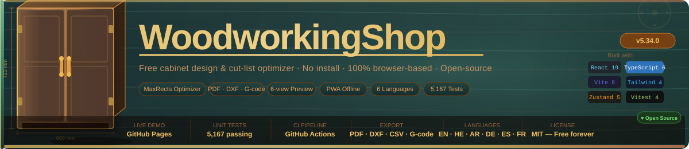
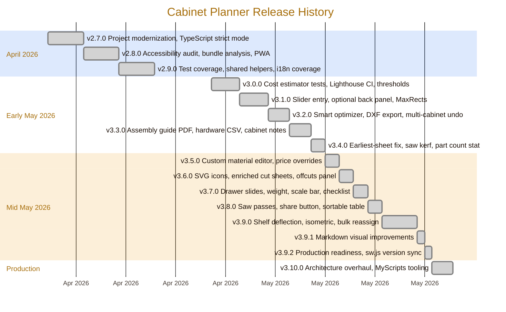

# 📜 Sprint History

      

This file is the archive of completed sprints and historical release planning.
The live, forward-looking roadmap lives at [`ROADMAP.md`](../ROADMAP.md).

Releases are tagged on GitHub. The CHANGELOG (`CHANGELOG.md`) is the source of
truth for what shipped in each version; this file records the per-sprint plan
that fed those releases.

## 📅 Release Timeline

```mermaid
%%{init: {'theme': 'base', 'themeVariables': {'primaryColor': '#f0b040', 'primaryTextColor': '#1a0e06', 'primaryBorderColor': '#8b5022', 'lineColor': '#7a4010'}}}%%
gantt
  title Cabinet Planner Release History
  dateFormat YYYY-MM-DD
  axisFormat %b %Y
  section April 2026
    v2.7.0 Project modernization, TypeScript strict mode  :done, v270, 2026-04-01, 5d
    v2.8.0 Accessibility audit, bundle analysis, PWA      :done, v280, after v270, 5d
    v2.9.0 Test coverage, shared helpers, i18n coverage   :done, v290, after v280, 5d
  section Early May 2026
    v3.0.0 Cost estimator tests, Lighthouse CI, thresholds :done, v300, 2026-04-24, 4d
    v3.1.0 Slider entry, optional back panel, MaxRects     :done, v310, after v300, 4d
    v3.2.0 Smart optimizer, DXF export, multi-cabinet undo :done, v320, after v310, 3d
    v3.3.0 Assembly guide PDF, hardware CSV, cabinet notes :done, v330, after v320, 3d
    v3.4.0 Earliest-sheet fix, saw kerf, part count stat   :done, v340, after v330, 2d
  section Mid May 2026
    v3.5.0 Custom material editor, price overrides         :done, v350, after v340, 2d
    v3.6.0 SVG icons, enriched cut sheets, offcuts panel   :done, v360, after v350, 2d
    v3.7.0 Drawer slides, weight, scale bar, checklist     :done, v370, after v360, 2d
    v3.8.0 Saw passes, share button, sortable table        :done, v380, after v370, 2d
    v3.9.0 Shelf deflection, isometric, bulk reassign      :done, v390, after v380, 5d
    v3.9.1 Markdown visual improvements                    :done, v391, after v390, 1d
    v3.9.2 Production readiness, sw.js version sync        :done, v392, after v391, 1d
  section Production
      v3.10.0 Architecture overhaul, MyScripts tooling        :done, v3100, after v392, 3d
```

## 🗺 v3.9.0 Sprint Plan (Sprints 173–181)

### Sprint 173 — Shelf Deflection Improvements ✅

- [x] Display a per-shelf deflection badge (δ mm) calculated from span, load, and E-modulus stored in `materials.ts`
- [x] Color-code badges: green (safe), amber (L/360–L/240), red (> L/240)
- [x] Add `deflectionMm` and `deflectionRating` to `DerivedDimensions`
- [x] Tests: deflection ratings for standard and overloaded spans (13 new tests — 27 total in dimensions.test.ts)
- [x] i18n: `shelves.deflectionSafe` and `shelves.deflectionDanger` keys in en.json + he.json

### Sprint 174 — Isometric 3D View Enhancements 🎲

- [ ] Add interior depth shading to the isometric view SVG
- [ ] Render individual shelf lines in isometric mode
- [ ] Show drawer stack outlines in isometric projection
- [ ] Ensure grain arrows overlay correctly in isometric
- [ ] Tests: snapshot comparison for cabinet/bookshelf/wardrobe isometric paths

### Sprint 175 — Bulk Material Reassignment 🔄

- [ ] "Reassign material" dropdown on the material summary panel (Optimizer tab)
- [ ] Selecting a new material updates all parts currently using the old material
- [ ] Rerun optimization automatically after reassignment
- [ ] Undo history entry: "Reassigned carcass from Birch Ply → Oak Ply"
- [ ] Tests: bulk reassign updates all part materials and triggers re-optimization

### Sprint 176 — Cabinet Template Library 📚

- [ ] Expand presets panel to 12 templates: add TV unit, bathroom vanity wall, bathroom vanity base, corner cabinet (blind), wine rack
- [ ] Each template encoded as a full `CabinetConfig` (not just dimension defaults)
- [ ] Template thumbnails: 80×60 SVG mini-preview per template
- [ ] URL param `tpl=` to deep-link directly to a template
- [ ] Tests: each template produces valid parts and hardware lists

### Sprint 177 — Advanced Hardware Catalog 🔩

- [ ] Hardware panel in Configurator: interactive catalog with 20+ hardware items
- [ ] Per-item supplier links (configurable, not hardcoded)
- [ ] Override quantity: user can increase/decrease any hardware count
- [ ] Export hardware list with overrides to CSV
- [ ] Tests: overridden quantities appear in BOM and cost calculation

### Sprint 178 — Multi-Project Workspace Panel 🗂️

- [ ] A "Projects" side panel (collapsible) listing all named projects saved in localStorage
- [ ] One-click switch between projects without losing current unsaved work (prompt to save)
- [ ] Project thumbnails: store a low-res preview SVG (front view) per project
- [ ] Export all projects as a single ZIP archive (one JSON per cabinet)
- [ ] Tests: project list persistence, thumbnail generation

### Sprint 179 — Print & PDF Improvements 🖨️

- [ ] Print dialog opens with correct page orientation auto-detected per sheet
- [ ] PDF cover page: project thumbnail, creation date, version, author field
- [ ] Page numbers on all PDF pages (e.g. "Page 3 of 12")
- [ ] PDF bookmarks (outline) for: cover, parts, cut sheets, hardware, assembly
- [ ] Tests: PDF document structure (page count, bookmark names)

### Sprint 180 — Accessibility & Keyboard Navigation ♿

- [ ] Full keyboard navigation within the configurator sidebar (Tab order, Enter/Space)
- [ ] Focus trap in modal dialogs (keyboard shortcuts help, material editor)
- [ ] `prefers-reduced-motion` media query: disable all CSS transitions when set
- [ ] High-contrast mode: CSS custom properties switch to WCAG AA-contrast palette
- [ ] Tests: axe-core a11y audit in ConfiguratorPanel and OptimizerView

### Sprint 181 — Performance & Bundle Optimization ⚡

- [ ] Split `cut-optimizer.ts` into a Web Worker to avoid blocking the main thread on large projects (5+ cabinets)
- [ ] Memoize `generateParts()` and `generateHardware()` with deep-equal config comparison
- [ ] Lazy-load the Assembly Guide and Cost Estimator tabs on first access
- [ ] Lighthouse CI perf budget: TTI ≤ 2 s on simulated 4G
- [ ] Tests: Web Worker message roundtrip, memoization cache hit/miss

---

User-reported needs from live preview review (`localhost:5173`). These supersede
the in-flight quality sprints (84-87) and run first.

### Sprint A1 — Slider free-text numeric entry (Sprint 100)

- [x] Every dimension slider gets a paired `<input type="number">` accepting any
      valid value (mm or in) outside the slider's visual range
- [x] Hard limits enforced from `engine/dimensions.ts` constraints (not UI slider
      max), e.g. depth allowed down to material thickness, up to physical max
- [x] Inline validation message on out-of-range entry; slider thumb clamps to
      visual range while the numeric field shows the true value
- [x] Unit tests: numeric input mirrors slider state, accepts edge values,
      rejects non-numeric / out-of-bounds
- [x] Applies to: width, height, depth, shelf count, drawer count, custom door
      gap, kick-base height — every Configurator slider

### Sprint A2 — Optional cabinet back panel (Sprint 101)

- [x] New `hasBack: boolean` flag on cabinet config (default true,
      backward-compatible)
- [x] Configurator toggle: "Include back panel" with description
- [x] `engine/parts.ts`: omit back part when `hasBack === false`
- [x] `engine/assembly.ts`: skip back-attachment step when omitted
- [x] `engine/cost-estimator.ts` and BOM: reflect material savings
- [x] PDF cut sheet and assembly guide auto-update
- [x] Tests for parts/assembly/cost with `hasBack: false`

### Sprint A3 — Sheet-fill optimizer + material-swap hint (Sprint 102)

- [x] `cut-optimizer.ts`: switch to a true bin-packing pass that fills each
      sheet to maximum coverage before starting a new sheet — done via
      Maximal Rectangles (Best Short Side Fit). Tall-narrow bookshelf case
      now fits on one sheet instead of two.
- [x] Report `utilization` per sheet (already partially there) and surface it
      in `OptimizerView`
- [x] When a part using material B can be cut from leftover space of a sheet
      using material A (and A and B differ only by a small attribute, e.g.
      same thickness/finish), emit a "consolidate to material A" suggestion in
      the `SmartOptimizerPanel`
- [x] Targets ≥ 90 % utilization average across sheets in default presets
- [x] Tests covering: high-utilization pack, leftover reuse (bookshelf
      regression test)

### Sprint A4 — PDF cut-sheet orientation parity (Sprint 103)

- [x] Currently: on-screen preview shows sheets portrait, PDF renders page
      landscape with portrait content → wasted page + visual mismatch
- [x] Fix: detect sheet aspect ratio at export time and rotate the PDF page
      to match content orientation (landscape A4 when sheet width > height).
- [x] Playwright PDF panel behavioral test (Sprint 122) — navigates to Export
      PDF tab, asserts "Generate PDF" button is visible and enabled, and the
      content-summary section lists parts/cut-sheets.

### Sprint A5 — Graphics & visual polish (Sprint 104)

- [x] Audit and optimize all in-repo raster assets (icon-192.png, icon-512.png,
      favicon.svg) — favicon optimised with svgo (-40% → 817 B)
- [x] Re-export icons at 1×/2×, ensure manifest entries use correct `sizes`
      (Sprint 121) — added `"purpose": "maskable"` entries for both PNG icons
- [x] Add hero / OG image (`og:image`, twitter:image now point to icon-512.png)
- [x] Replace generic placeholder favicon with woodworking cabinet glyph
- [x] MD diagrams: convert ASCII tables in `docs/ARCHITECTURE.md` and `ROADMAP.md`
      diagrams (where applicable) to Mermaid for crisp scaling on GitHub
      **Done — Sprint 142**: release timeline Mermaid diagram added to ROADMAP.md
- [x] Web preview: review color contrast and the cabinet 2D preview SVG for
      higher visual fidelity (axis labels, scale bar, dimension annotations)
      **Done — Sprint 114**: dimension lines use `currentColor`, arrow-heads,
      unit-aware labels, and per-bay height annotations in the open-front view.
- [x] All raster outputs lint-checked via `bundle:check` per-file budgets

---

## Sprint: v3.0.0 — Test Coverage & CI Tooling (April 2026) 🧪

### Completed

- [x] **Task 1**: Cost estimator tests — 11 tests for `estimateCost()` (Sprint 74)
- [x] **Task 2**: BOM export tests — 10 tests for `generateBomCsv()` (Sprint 74)
- [x] **Task 3**: Local storage tests — 9 tests with in-memory localStorage mock (Sprint 74)
- [x] **Task 4**: i18n key parity test — 5 tests verifying en/he structure (Sprint 74)
- [x] **Task 5**: Bundle analysis in CI — `scripts/bundle-report.js`, 2 MB budget (Sprint 75)
- [x] **Task 6**: Raise coverage thresholds — 70/60/60/70 (Sprint 75)
- [x] **Task 7**: Lighthouse CI budget — `lighthouserc.json` with perf/a11y/SEO assertions (Sprint 76)
- [x] **Task 8**: i18n coverage script — `scripts/i18n-coverage.js`, npm script (Sprint 76)
- [x] **Task 9**: Version bump to 3.0.0 + CHANGELOG + ROADMAP update (Sprint 77)
- [x] **Task 10**: GitHub release v3.0.0 (Sprint 77)

## Sprint: v2.9.0 — Production Readiness (April 2026) 🔒

### Completed

- [x] **Task 1**: Audit — full repo audit of tests, workflows, configs, docs, dead code
- [x] **Task 2**: Shared test helpers — extracted `cfg()`, `mockSheet`, `mockPart` to `tests/helpers.ts`
- [x] **Task 3**: Shared assertions — extracted `expectBilingualNames`, `expectSequentialSteps`, `expectBilingualSteps` to `tests/assertions.ts`
- [x] **Task 4**: Parameterized tests — converted materials bilingual loop to `it.each`
- [x] **Task 5**: Consolidate test imports — updated 10 test files to use shared helpers
- [x] **Task 6**: Clean `.gitignore` — removed legacy Python entries
- [x] **Task 7**: Optimize release workflow — consolidated 4 check steps into `npm run ci`
- [x] **Task 8**: Add npm cache to Pages workflow
- [x] **Task 9**: Fix ARCHITECTURE.md — corrected directory layout, added `download.ts` and test helpers
- [x] **Task 10**: Delete dead `public/icons.svg` — unused social brand sprite
- [x] **Task 11**: Fix markdownlint config — disabled MD022/MD024 false positives
- [x] **Task 12**: Version bump to 2.9.0 with CHANGELOG entry

---

## Phase 15: Manufacturing Intelligence Expansion — v3.67.0 (June 2026)

### Sprint 44 — Cut Kerf Compensation Engine ✅

- [x] `src/engine/kerf.ts` — `KERF_PROFILES` catalogue (panel-saw, circular-saw, cnc-router, band-saw, laser)
- [x] `compensateDimension(mm, kerfMm)` — adds kerf, ceiling-rounds to nearest 0.5 mm
- [x] `compensatePart` — expands both width and length; immutable; records `widthAddedMm` / `lengthAddedMm`
- [x] `estimateKerfLoss(parts, kerfMm)` — total kerf area mm²
- [x] `kerfLossPercent(lossMm2, sheetMm2)` — one decimal place; safe for zero sheet area
- [x] `getKerfProfile(id)` — returns undefined for unknown ids
- [x] 16 passing tests in `tests/engine/kerf.test.ts`

### Sprint 45 — Cabinet Zone Validator Engine ✅

- [x] `src/engine/zone-validator.ts` — `RoomZone` + `CabinetDimensions` types
- [x] `validateCabinetInZone(cabinet, zone, clearanceMm)` — checks width, height, depth
- [x] `validateCabinetRowInZone(cabinets, zone, clearanceMm)` — plus `TOTAL_WIDTH_OVERFLOW`
- [x] `violationCodes(result)` — deduplicated code set helper
- [x] Violation codes: `TOO_WIDE`, `TOO_TALL`, `TOO_DEEP`, `TOTAL_WIDTH_OVERFLOW`; each with `excessMm`
- [x] 11 passing tests in `tests/engine/zone-validator.test.ts`

### Sprint 46 — Template Library Engine ✅

- [x] `src/engine/template-library.ts` — 8 pre-built templates across 5 categories
- [x] Templates: `base-single-door`, `base-double-door`, `base-drawer-unit`, `wall-single-door`, `wall-double-door`, `tall-pantry`, `open-shelf-unit`, `corner-l-base`
- [x] All templates bilingual (en + he) with default dimensions and material thickness
- [x] `getTemplatesByCategory(category)`, `getTemplate(id)`, `instantiateTemplate(id, overrides?)`, `listTemplateIds()`
- [x] 12 passing tests in `tests/engine/template-library.test.ts`

### Sprint 47 — Batch Material Replace Engine ✅

- [x] `src/engine/batch-replace.ts` — `BatchPart` minimal interface with `material`, optional `type`/`zone`
- [x] `batchReplaceMaterial(parts, from, to, options)` — `filterType` + `filterZone` scoping
- [x] Returns `{ parts, changedCount, affectedIds }` — original array never mutated
- [x] `listMaterials(parts)` — sorted distinct materials
- [x] `countByMaterial(parts)` — `Map<string, number>` with counts
- [x] 11 passing tests in `tests/engine/batch-replace.test.ts`

### Sprint 48 — Project Settings Engine ✅

- [x] `src/engine/project-settings.ts` — `ProjectSettings` with 8 typed fields
- [x] `DEFAULT_PROJECT_SETTINGS`: mm, USD, Melamine White 18 mm, $50/hr, grain on, waste-desc sort
- [x] `mergeSettings(base, overrides)` — shallow immutable merge
- [x] `validateSettings(settings)` — returns field-level error string array
- [x] `describeSettings(settings)` — human-readable one-line summary
- [x] 10 passing tests in `tests/engine/project-settings.test.ts`

### Sprint 49 — i18n Key Audit Engine ✅

- [x] `src/engine/i18n-audit.ts` — `LocaleTree` (nested) → `FlatLocale` (dot-notation)
- [x] `flattenLocale(tree, prefix)` — recursive, handles arbitrary nesting depth
- [x] `auditLocale(tag, flat, referenceFlat)` — missing keys, extra keys, empty/whitespace values
- [x] `auditAllLocales(referenceLocale, locales)` — multi-locale sweep; excludes reference from results
- [x] `formatAuditReport(report)` — indented plain-text with per-locale sections
- [x] 14 passing tests in `tests/engine/i18n-audit.test.ts`

### Sprint 50 — Docs, Version Bump, GH Release ✅

- [x] CHANGELOG.md — v3.67.0 entry
- [x] ROADMAP.md — Phase 15 completed, Completed Phases Summary table updated
- [x] SPRINT-HISTORY.md — Phase 15 sprint records appended
- [x] `package.json` — version bumped 3.66.1 → 3.67.0
- [x] Full CI: 1915 tests passing, 118 files, zero TypeScript errors
- [x] GitHub release v3.67.0 created with `--generate-notes`

## Sprint: v2.8.0 — Quality & Accessibility (April 2026) ♿

### Completed

- [x] **Task 1**: Remove unused assets — deleted `hero.png`, `react.svg`, `vite.svg` from `src/assets/`
- [x] **Task 2**: Remove vestigial Python config — cleaned `.editorconfig` (Python/Makefile sections)
- [x] **Task 3**: Enhance architecture docs — added component tree + state flow Mermaid diagrams
- [x] **Task 4**: Fix PWA — PNG icon fallbacks, versioned service worker cache
- [x] **Task 5**: Add `npm run clean` script — cross-platform `rimraf` build cleanup
- [x] **Task 6**: Clean project structure — removed `.mypy_cache/`, updated `.gitignore`
- [x] **Task 7**: Extract shared `triggerDownload()` helper — deduplicated 5 Blob+anchor patterns
- [x] **Task 8**: Add `eslint-plugin-jsx-a11y` — accessibility linting for all JSX
- [x] **Task 9**: Fix all a11y lint errors — 11 issues across 4 components
- [x] **Task 10**: Add test coverage reporting — `@vitest/coverage-v8` with thresholds, CI step
- [x] **Task 11**: Enhance release workflow — auto-extract notes from CHANGELOG.md
- [x] **Task 12**: Polish .vscode workspace — added coverage task
- [x] **Task 13**: Polish .github templates — verified all templates current
- [x] **Task 14**: Verify Dependabot — npm + github-actions ecosystems confirmed
- [x] **Task 15**: README badges — CI, deploy, and license badges
- [x] **Task 16**: CHANGELOG v2.8.0 — full entry with Added/Changed/Fixed/Removed
- [x] **Task 17**: Component diagrams — component tree + state flow in ARCHITECTURE.md
- [x] **Task 18**: Merge redundant configs — verified no redundancy
- [x] **Task 19**: Consolidate docs — updated ROADMAP, final doc pass
- [x] **Task 20**: Final consolidation — version bump, CI validation

## Sprint: v2.7.0 — Project Modernization (April 2026) 🏗️

### Completed

- [x] **Task 1**: Remove non-web code paths — deleted `legacy/` directory
- [x] **Task 2**: Remove Python scripts — deleted `generate_md_svgs.py`, `svg/`
- [x] **Task 3**: Document architecture — created `docs/ARCHITECTURE.md`
- [x] **Task 4**: Standardize build system — npm + lock file, deterministic installs
- [x] **Task 5**: Clean project structure — removed unused directories
- [x] **Task 6**: Deduplicate utilities — verified clean, no duplication found
- [x] **Task 7**: Warnings as errors — TypeScript strict mode, ESLint `--max-warnings 0`
- [x] **Task 8**: Fix all warnings — resolved 5 TS errors, zero build warnings
- [x] **Task 9**: Formatting standards — Prettier + eslint-config-prettier
- [x] **Task 10**: GitHub Actions CI — added format check step
- [x] **Task 11**: GitHub Actions Release — added SHA-256 checksums
- [x] **Task 12**: VS Code workspace standards — settings, extensions, tasks, launch configs
- [x] **Task 13**: GitHub hygiene — updated all templates, CODEOWNERS, CONTRIBUTING, SECURITY
- [x] **Task 14**: Dependabot — switched from pip to npm ecosystem
- [x] **Task 15**: Updated README — tech stack, dev commands, deployment, troubleshooting
- [x] **Task 16**: CHANGELOG.md — Keep a Changelog format, SemVer version bump rules
- [x] **Task 17**: Diagrams — Mermaid in ARCHITECTURE.md (data flow, structure)
- [x] **Task 18**: Merge redundant configs — verified no redundancy, all configs serve distinct roles
- [x] **Task 19**: Consolidate docs — removed `release-notes.md` (superseded by CHANGELOG)
- [x] **Task 20**: Final consolidation — footprint reduction, dead asset removal

---

## Phases 35–47 Archive (Calculator & Manufacturing Tooling Era)

> Migrated from `ROADMAP.md` on 2026-05-31 to keep the live roadmap forward-only.
> Phases 48–51 are summarised in `.github/copilot-instructions.md`; `CHANGELOG.md`
> remains the source of truth for shipped versions.

### Phase 47 — Cabinet Hardware Sizing Calculators · v5.23.0 ✅ COMPLETE

| Sprint | Deliverable                                                               | Track  |
| ------ | ------------------------------------------------------------------------- | ------ |
| 220    | Cabinet door sizing calculator — engine (overlay, leaf size, hinge count) | ✓ Done |
| 221    | Face frame calculator — engine + UI panel + 11 tests                      | ✓ Done |
| 222    | Cabinet door sizing calculator — UI panel (overlay selector, door toggle) | ✓ Done |
| 223    | Drawer box sizing calculator — engine + UI panel + tests                  | ✓ Done |
| 224    | Screw pull-out strength estimator — NDS formula, 4 density classes, UI    | ✓ Done |

### Phase 46 — Workspace & Tooling · v5.22.0 ✅ COMPLETE

| Sprint | Deliverable                                                                               | Track  |
| ------ | ----------------------------------------------------------------------------------------- | ------ |
| 215    | SVG quality improvements + VS Code / Copilot workspace integration                        | ✓ Done |
| 216    | Strategic ROADMAP review — competitor table, gap analysis, enhanced Copilot instructions  | ✓ Done |
| 217    | Production readiness — 26 TypeScript errors resolved, dead code removed, quality gates    | ✓ Done |
| 218    | Engine barrel fix — 13 duplicate-export aliases, type narrowing fixes in 5 engine modules | ✓ Done |

### Phase 45 — Power Tool Setup Calculators · v5.21.0 ✅ COMPLETE

- Sprint 210: Finger joint calculator (box joint layout, finger/socket positions, glue area)
- Sprint 211: Wood screw pilot hole calculator (gauge lookup, clearance hole, countersink)
- Sprint 212: Glue-up time calculator (open/clamp/cure time, clamp count, env factors)
- Sprint 213: Bandsaw blade speed calculator (SFPM, TPI selection, feed rate)
- Sprint 214: Tablesaw blade height calculator (blade exposure, dado depth, feasibility)

### Phase 44 — Advanced Joinery Planning Tools · v5.20.0 ✅ COMPLETE

- Sprint 205: Mortise & tenon calculator (joint sizing, glue area, chisel recommendation)
- Sprint 206: Shelf deflection calculator (sag estimate, ratio checks, modulus lookup)
- Sprint 207: Router depth-of-cut calculator (pass schedule, chip load, RPM guidance)
- Sprint 208: Biscuit joinery calculator (size selection, slot depth, layout positions)
- Sprint 209: Sanding progression planner (grit sequence, effort and sheet estimates)

### Phase 43 — Precision Workshop Calculators · v5.19.0 ✅ COMPLETE

| Sprint | Deliverable                                                          | Track  |
| ------ | -------------------------------------------------------------------- | ------ |
| 200    | Miter & compound angle calculator (polygon, compound, crown molding) | ✓ Done |
| 201    | Shelf pin spacing calculator (single/double/euro 32, drill depth)    | ✓ Done |
| 202    | Drawer slide calculator (side/under/center mount, box dimensions)    | ✓ Done |
| 203    | Wood drying time estimator (air/kiln, species, defect risk)          | ✓ Done |
| 204    | Dovetail layout calculator (through/half-blind, pin/tail spacing)    | ✓ Done |

### Phase 42 — Advanced Joinery & Workshop Tools · v5.18.0 ✅ COMPLETE

| Sprint | Deliverable                                                                | Track  |
| ------ | -------------------------------------------------------------------------- | ------ |
| 195    | Pocket hole joinery calculator (screw length, drill angle, spacing)        | ✓ Done |
| 196    | Veneer calculator (sheet count, strip layout, adhesive volume)             | ✓ Done |
| 197    | Clamp pressure calculator (force distribution, spacing, clamping time)     | ✓ Done |
| 198    | Drill press speed calculator (RPM by bit type, material, diameter)         | ✓ Done |
| 199    | Board-feet calculator (nominal-to-actual, species cost, linear conversion) | ✓ Done |

### Phase 41 — Measurement & Estimation Tools · v5.17.0 ✅ COMPLETE

| Sprint | Deliverable                                                          | Track  |
| ------ | -------------------------------------------------------------------- | ------ |
| 190    | Wood movement calculator (seasonal expansion/contraction by species) | ✓ Done |
| 191    | Toolpath feed rate calculator (chip load, spindle speed, feed rate)  | ✓ Done |
| 192    | Cabinet weight estimator (panel weights, hardware, total assembly)   | ✓ Done |
| 193    | Dowel joint calculator (diameter, depth, spacing, pull-out strength) | ✓ Done |
| 194    | Panel layout label generator (cut labels, IDs, batch printing)       | ✓ Done |

### Phase 40 — Material Management & Templates · v5.16.0 ✅ COMPLETE

| Sprint | Deliverable                                                            | Track  |
| ------ | ---------------------------------------------------------------------- | ------ |
| 182    | Material cost tracker (historical prices, trends, budget alerts)       | ✓ Done |
| 183    | Shop inventory manager (stock levels, reorder lists, fulfilment check) | ✓ Done |
| 184    | Cabinet template library (6 built-in parametric templates)             | ✓ Done |
| 185    | Edge banding calculator (exposure detection, grouping, wastage)        | ✓ Done |

### Phase 38 — Shop Floor Intelligence & Workflow Automation · v5.14.0 ✅ COMPLETE

| Sprint | Deliverable                                                          | Track  |
| ------ | -------------------------------------------------------------------- | ------ |
| 172    | Dust collection estimator (CFM sizing, duct loss, HP recommendation) | ✓ Done |
| 173    | Cut-list grouping engine (multi-criteria batching, grain merge)      | ✓ Done |
| 174    | Assembly dependency resolver (topo-sort, CPM, parallel waves)        | ✓ Done |
| 175    | Workshop safety checker (clearance zones, PPE, noise, safety score)  | ✓ Done |

### Phase 37 — Advanced Manufacturing Tools · v5.13.0 ✅ COMPLETE

| Sprint | Deliverable                                                               | Track  |
| ------ | ------------------------------------------------------------------------- | ------ |
| 167    | Production schedule planner (jobs, priorities, conflict detection)        | ✓ Done |
| 168    | Nesting pattern library (save/recall/score cut-sheet patterns)            | ✓ Done |
| 169    | Tool wear tracker (inventory, usage log, maintenance alerts)              | ✓ Done |
| 170    | Design comparison engine (7-criterion weighted scoring, radar chart data) | ✓ Done |

### Phase 36 — Advanced Workflows & Design Exploration · v5.12.0 ✅ COMPLETE

| Sprint | Deliverable                                                              | Track  |
| ------ | ------------------------------------------------------------------------ | ------ |
| 162    | Parametric template engine (reusable templates, expressions, validation) | ✓ Done |
| 163    | Batch export pipeline (multi-format, multi-cabinet, progress tracking)   | ✓ Done |
| 164    | Material yield optimizer (multi-sheet scheduling, waste minimization)    | ✓ Done |
| 165    | Version history & branching (timeline, diff, branch/merge)               | ✓ Done |

### Phase 35 — CNC Workflow & Cloud Sync · v5.11.0 ✅ COMPLETE

| Sprint | Deliverable                                                            | Track  |
| ------ | ---------------------------------------------------------------------- | ------ |
| 157    | CNC job queue with priority scheduling (critical/high/normal/low)      | ✓ Done |
| 158    | Cloud sync engine with E2E encryption (AES-256-GCM, PBKDF2)            | ✓ Done |
| 159    | Multi-machine workflow distribution (capability-match, load balancing) | ✓ Done |
| 160    | Project sharing links with expiration (token-based, permissions)       | ✓ Done |

## Phase 63 — Trustworthy Test Foundation

### Sprint 300 — Evidence baseline and roadmap correction — 2026-09-27

- [x] Verified clean `npm ci` install and project-local Vitest execution.
- [x] Fixed `scripts/vitest-reporter.js` to invoke local Vitest and parse JSON assertion results; added regression tests for counts and invalid reports.
- [x] Recorded 4,415 passing tests across 254 files; 0 failures and 0 skips.
- [x] Recorded coverage: 91.64% statements, 84.91% branches, 92.83% functions, 92.18% lines.
- [x] Verified quality gate, production build, and all 5 Chromium smoke tests; updated roadmap and agent context. Sprint 301 is next.

### Sprint 301 — Coverage map and ownership — 2026-09-28

- [x] Added `scripts/test-coverage-map.js` to classify all 351 production modules as direct, indirect integration-only, uncovered, or not measured; final inventory: 257 direct, 71 indirect, 23 uncovered, 0 not measured.
- [x] Added coverage floors for engine, utils, store, hooks, and components; `npm run test:coverage:ratchet` passes with only engine type declarations and the public API barrel excluded.
- [x] Added direct boundary/interaction coverage for the named store and hook targets, plus export and calculator-panel behavior; verified 4,465 tests across 278 files and `npm run quality:fast`.
- [x] Recorded remaining uncovered modules in the generated inventory for prioritization in Sprint 305. Sprint 302 is next.

### Sprint 302 — Test fixtures, accessibility queries, and deterministic reset — 2026-09-28

- [x] Added a shared deterministic Playwright app fixture with isolated browser storage, fixed time, dismissed onboarding/tutorial overlays, and a named default-cabinet assertion.
- [x] Added typed independent builders for projects, materials, hardware, optimizer results, cut sheets, and downloadable outputs; froze the legacy shared sheet fixture.
- [x] Added an isolated RTL render helper; migrated E2E tests to semantic locators and removed serial execution and style-based assertions.
- [x] Added per-test cleanup for mocks/stubs, fake timers, storage, URL, document direction, and rendered trees; fixed the AI assistant storage mock leak revealed by shuffle.
- [x] Verified 4,470 tests across 280 files in normal and seeded-shuffle runs, 26 Chromium/Firefox E2E tests, and full `npm run ci` including 16 benchmark budgets. Sprint 303 is next.

### Sprint 304 — Store, persistence, import/export contract matrix — 2026-09-28

- [x] T1: action-level coverage for the cabinet, UI, optimizer-settings, snapshot and named-expression slices: transitions, invalid/no-op input, undo/redo, persistence/reload and cross-slice rescheduling. `loadSettings` now clamps once and reschedules exactly once from one normalized snapshot; `autoCoNest` and session autosave (500 ms debounce) reload correctly.
- [x] T2: fault matrix for unavailable IndexedDB/localStorage, corrupt and future-schema records (never overwritten), quota failure, partial-write snapshot rollback, `crypto.randomUUID()` project IDs with collision checks, a serialized mutation queue for concurrent saves/deletes/imports, deletion retry and legacy-migration shape validation.
- [x] T3: single-project and bundle round-trips preserve cabinets and snapshot history, regenerate IDs and omit ephemeral UI state through an explicit `SavedProject` allowlist; Hebrew, Arabic, Japanese, empty and 250-cabinet projects are covered.
- [x] Verified `npm run ci`: 4,592 tests across 283 files, production build, bundle budgets and 16 benchmarks.

### Sprint 303 — Pure-engine invariant matrix I (progress log, archived 2026-09-30)

- Generated properties added for shelf deflection, hinge positions, panel weight, part generation, optimizer bounds and kerf clearance, material-yield conservation, cost arithmetic, box-joint geometry, named-parameter dependency order, and honing-guide projection scaling, angle monotonicity and microbevel behavior.
- Dated birch-weight oracle (Engineering ToolBox, 510–770 kg/m³). The optimizer property exposed a diagonal placement with insufficient kerf; candidate-level clearance checks and a named regression fixed it.
- Static inventory: 632 exported engine functions — 614 with a direct test call and body-line hits, 13 with line hits only, 0 uncovered, 5 declarations not measured; literal test titles map to 612 exports. These are traceability indicators, not behavioral guarantees.
- Direct tests added for `getMaterialResult`, `getMachineProfile`, `defaultTokenGenerator`, `applyValidationPlugins` and the Web Serial adapter. `npm run ci` passed with 4,593 tests across 283 files.
- 2026-10-02 trace audit: GitHub Actions artifacts from 2026-09-27 through 2026-10-01 include build distributions, Playwright reports and secret-scan reports, but no fast-check or shrink-trace artifacts.
- The optimizer replay (seed `303003`) was regenerated against the pre-fix engine and is not the original trace. The kerf replay (seed `303011`, path `21`) reproduces its invariant but not the original failure path. Neither is presented as historical.
- The cove rounding regression retains its exact minimized seed/path. With the retained-artifact inventory checked, Sprint 303 is complete; original shrink histories that were not persisted remain unavailable. Calculator oracle gaps continue in S314 T3.

### Sprint 305 — Component behavior foundation (progress log, archived 2026-09-30)

- 2026-09-29 → 2026-09-30: `userEvent` journeys added in batches for optimizer tables and OptimizerView, configurator controls (furniture type, joinery, shelves, doors, drawers), calculators, cabinet management, project manager and snapshots, materials and hardware catalogs.
- Further batches covered presets, constraint repairs, cost panels, optimizer suggestions, material summary/selector, templates, CNC profiles, PDF settings, cut checklist, stock/offcuts, waste analytics, build log, labels, G-code presets, SaveLoadPanel, Marketplace and Sidebar.
- Product defects fixed: invalid nested snapshot buttons; intermediate-keystroke clamping in custom clearance; unlabeled icon-only controls; 16 built-in templates referencing nonexistent `hdf-3` (now `mdf-3`, with a registry guard); grouped material area for differing sheet sizes and 100–5000 mm bounds; stale drafts committed by reset controls; missing clipboard-failure message.
- Component coverage (statements): 41.3 % → 48.4 % → 57.4 % → 66.8 % → 74.2 % → 75.02 % (525 component tests), with no area floor lowered.
- Browser-derived inventory maps all 118 calculator controls to positive/negative behavior evidence and 108 high-use workspace controls to evidence or explicit waivers. Calculator suite passed 60/60 at two workers; configurator suite passed 62/62; optimizer parts/hardware inventory passed 2/2. A separate stock-persistence Firefox failure in a broad inventory grep was unrelated to these table-inventory tests.
- Component ratchet: 572 tests, 75.04% statements, 69.05% branches, 73.10% functions and 75.74% lines; no floor lowered. The custom-material derivation defect is fixed. Sprint 305 acceptance is complete.

### Sprint 306 — Mutation testing and quality evidence (in progress, 2026-10-02)

- Bounded Stryker targets: dimensions, parts, cut-optimizer and validation; two workers; no score threshold; JSON/HTML and temp files remain under the OS temp directory.
- Four-module initial dry run: 1,366 mutants and 926 related tests in 2m55s. Focused `dimensions.ts` run: 122 mutants in 2m47s; 116 killed, five survived, one timed out (95.90%).
- Improved dimensions assertions for centre-support deflection, exact hinge and shelf-rating boundaries, material modulus outputs, maximum load, and the zero-deflection fallback. Four surviving nonpositive-count guards are equivalent; the initial static material-table survivor was resolved in a focused follow-up; the descending-loop mutant timed out.
- Added `parts.ts` behavior assertions for material selection, furniture exclusions, part dimensions,
  zero drawers, and edge-banding totals. A focused run invoked with `--ignoreStatic` took 5m11s:
  307 mutants, 189 killed, 99 survived, one timed out and 18 with no coverage (61.89% overall;
  65.74% of covered mutants). A 38-second follow-up over drawer-generation lines killed 15 of 18
  mutants; two surviving count guards are equivalent because the nested loop has no iterations at
  zero or negative counts, and one mutant timed out. This scoped diagnostic is not the static-inclusive
  baseline; a full-static parts attempt was stopped after its runtime estimate exceeded an hour.
- A validation diagnostic invoked with `--ignoreStatic` took 10m26s: 229 mutants, 132 killed,
  94 survived and three with no coverage (57.64% overall; 58.41% of covered mutants). Added exact
  99/100/101 mm drawer-height and exact/exceeding drawer-stack boundaries, plus issue field and
  bilingual drawer-index assertions. A 35-second focused drawer-validation run killed all 30 mutants.
  The full-static validation baseline remains unmeasured. A `cut-optimizer.ts` diagnostic invoked with
  `--ignoreStatic` took 110m47s: 443 killed, 219 survived, one timed out and 45 with no coverage
  (62.71% overall; 66.97% of covered mutants). Added exact co-nesting yield, waste and conflict checks,
  plus empty-result and untouched-conflict cases; the focused metrics slice killed all 16 mutants in
  23 seconds. This runtime rules out adding the full diagnostic to routine CI. The complete
  static-inclusive four-module baseline remains open; no blocking threshold is set.
- Added a weekly report-only dimensions and BOM mutation workflow (15-minute budget) with retained JSON/HTML artifacts. Other targets remain out of the schedule until their runtime is measured. Full four-module scoring baseline and runtime gate remain open; no blocking score threshold is set.
- A BOM/ERP serializer diagnostic invoked with `--ignoreStatic` took 5m10s: 267 mutants, 197 killed, 49 survived and 21 with no coverage (73.78% overall; 80.08% of covered mutants). ERP assertions now verify total weight equals unit weight times quantity, non-grain output uses `none`, and unknown-material weight fields stay blank. The focused weight/grain/fallback slice killed all seven mutants; the static-inclusive baseline remains open.
- Strengthened hardware and ERP CSV download tests to inspect each filename, MIME type, raw UTF-8 BOM bytes, and payload. Each focused diagnostic killed all three filename/BOM/MIME mutants (six total).
- ERP schema tests now assert the exact ordered 13-column header, the first schema row, and the ISO-8601 generated-at row; focused diagnostics killed all 12 header mutants and all 11 metadata-initialization mutants.
- ERP row construction is covered across part-number selection, weight, grain, and material fields: a focused 20-mutant slice killed all 20. BOM pricing now checks two-sheet cost multiplication and separates engine language from full locale; the focused pricing slice killed all 11 mutants.
- A complete BOM part-row assertion now checks column order and values for a known single-cabinet fixture; the focused part-row slice killed all four mutants.
- Static-inclusive BOM diagnostic (5m34s): 335 mutants, 243 killed, 72 survived and 20 with no
  coverage (72.54% overall; 77.14% of covered mutants). The locale table now initializes in
  `getBomHeaders`, making its literals runtime mutants; exact emitted summary, parts, hardware and
  grain-direction assertions cover all six supported locales. The focused locale slice killed all
  70 mutants in 1m25s, including the unsupported-locale English fallback. The full static-inclusive
  four-module baseline and score/runtime gate remain open; no threshold is set.
- Initial combined weekly dimensions+BOM run completed in 9m43s, within the 15-minute budget: 457 mutants,
  359 killed, 77 survived, 20 with no coverage and one timeout (78.77% overall; 82.38% of covered
  mutants). Dimensions scored 95.90% with one timeout; BOM scored 72.54% overall and 77.14% of
  covered mutants. The report remains report-only; no score threshold is set.
- Replaced the static modulus map with an allocation-free `getElasticModulus` switch and added
  parameterized output checks for all nine supported material keys. The focused dimensions run took
  2m18s: 137 mutants, 132 killed, four equivalent zero/negative-count guards survived, one
  descending-loop timeout and no uncovered mutants (97.08%). The refreshed combined weekly run took
  7m39s: 472 mutants, 375 killed, 76 survived, 20 with no coverage and one timeout (79.66% overall;
  83.19% of covered mutants). Dimensions scored 97.08%; BOM remained at 72.54% overall and 77.14%
  of covered mutants. It remains report-only with no threshold.

## Phase 64 — Real User Journeys and Browser Confidence

### Sprint 307 — App shell journeys — 2026-09-28

- [x] T1: tab navigation by click, Alt+1…6, direct URLs for all seven tabs, Back/Forward restoration, shortcut suppression while editing and invalid-tab fallback.
- [x] T2: header and Ctrl+Z/Ctrl+Y/Ctrl+Shift+Z undo/redo restore both the dimension and the generated Top Panel length; fixed Enter + blur committing a dimension twice.
- [x] T3: dark mode (button and Alt+D), metric/imperial, six locales with RTL/LTR direction, focus mode, onboarding and shortcuts dialogs, Escape and focus restoration via the shared focus trap.
- [x] T4: localized reset confirmation; cabinet add/switch/rename/reload/shortcut journeys verify `?cab=` index precedence, project state and toast. 32 smoke tests pass in Chromium and Firefox.

### Sprint 308 — Configurator and validation journeys — 2026-09-28

- [x] T1: width/height/depth slider ↔ text synchronization, exact 20 mm Top Panel delta, preview titles, range clamping, hard-limit rejection/recovery and reset.
- [x] T2: every furniture type, joinery, carcass/back material, back panel, thickness source, shelf, door and drawer option asserts a part or hardware change; fixed `doors-only` edge banding.
- [x] T3: all 11 repair actions verified against production validation issues (focus continuity, live region); fixed the wide-span warning so a centre support resolves it.
- [x] T4: cabinet add/remove/rename/duplicate/mirror/reorder and switching reflected in optimizer, assembly and PDF names. 62 E2E tests pass in Chromium and Firefox.

### Sprint 309 — Save/load, templates, catalogs and expressions — 2026-09-29

- [x] T1: project save/load, same-name replace, JSON export/import, cancel, malformed/invalid imports, share fallback and snapshot save/restore/delete/diff; fixed snapshot ID collisions.
- [x] T2: all six built-in presets and a reload-persistent saved configuration.
- [x] T3: custom-material CRUD, community catalog URL import and hardware JSON import with schema, duplicate-ID, merge/replace and failure-atomicity checks.
- [x] T4: mounted the named-expression panel; evaluator moved to the allowlisted arithmetic parser (CSP-safe); cycles, unknown names, invalid math and non-finite results surfaced. 76 E2E tests pass.

### Sprint 310 — Preview, gestures, canvas and 3D — 2026-09-29

- [x] Six views with viewBox/geometry assertions and dimension toggle; SVG parsing and PNG IHDR checks at 2×; touch-cancel lifecycle and pinch/swipe/wheel/orbit bounds; mounted the interactive 3D panel with WebGL fallback and a non-blank canvas.
- [x] Chromium, Firefox, WebKit desktop and iPhone WebKit render all views without overflow; 24 Chromium visual baselines (cabinet/bookshelf × light/dark × LTR/RTL).

### Sprint 311 — Optimizer controls and table journeys — 2026-09-30

- [x] Kerf, sheet size, costs, guillotine rationale, rotation lock, co-nesting, colour-blind mode, grain hatch and labels; search/filter/sort; bulk replace; stock and offcut persistence; defect zones; SmartOptimizer candidate propagation; engine-oracle checks of yield, waste, grain and shopping list.
- [x] Fixed stock-quantity Enter double commit and `autoCoNest` session persistence. Nine optimizer journeys pass in Chromium and Firefox; 5,169 unit tests across 338 files pass.

### Sprint 312 — Export downloads as real artifacts (progress log, archived 2026-09-30)

- [x] T1: 25 BOM/hardware CSV download behaviors (UTF-8 BOM, headers, quantities, five locales, escaping, formula-injection neutralization); fixed engine-language resolution for UI-only locales.
- [x] T2: 25 DXF/G-code download behaviors parsing entities, layers, extents, labels, checksum, units, bounds, safe retract, multi-pass depth, kerf, tool compensation, presets and tool changes; DXF extents cross-checked against G-code.
- [x] T3: grouped and quantity-expanded labels plus an escaped UTF-8 A4 print sheet (26 behaviors), including a browser assertion that each printed label identifier stays paired with its part text. QR deferred to S388: no encoder and production dependencies at the 8-package cap.
- [x] T4: 27 real-PDF behaviors (page count/geometry, headings, options, multi-cabinet, size budget, text bounds, zero warnings); footer placement fixed; renderer WASM data resource allowed in `connect-src` only.
- [x] T5: SHA-256 integrity manifest and ZIP entry-path validation; 29 behaviors parse the central directory and every payload.
- Component follow-up: 25 GcodePreviewModal behaviors; numeric fields replace rather than append, invalid drafts revert on blur.

### Sprint 314 — Calculator panels and numeric oracles (progress log, archived 2026-10-01)

- [x] T1/T2: 27 production-browser journeys (Chromium + Firefox) expand all 24 mounted calculators and compare every finite option against the pure engine.
- [x] T4: typed entry, ArrowUp/ArrowDown recomputation and clear-to-zero validation without NaN/Infinity.
- [ ] T3: screw pull-out now follows USDA FPL-GTR-282 Eq. 8-10a with an independent #8 × 1 in oracle; white-oak shrinkage cites FPL-GTR-282 Table 4-3; finish coverage/recoat compatibility has product-scoped manufacturer range oracles; glue and moisture bounds are shared between UI and engine; board-foot inputs reject non-finite values. Finish cure/volume and category-wide assumptions remain unverified. Glue spread rates remain unclaimed; two calculator oracle gaps remain.
- [ ] T3 update (2026-10-02): an OpenStax-backed honing-guide fixture verifies only the idealized right-triangle projection at 0.1 mm precision; real guide geometry and calibration remain excluded. Wood-turning still has no qualifying numeric oracle, so T3 remains open.

### Sprint 318 — v5.34.0 verification evidence (2026-10-02)

- [x] T1: `npm run check` passes: quality gates and 5,256 unit tests across 341 files. Coverage passes for 356 production modules (315 direct, 26 indirect integration-only, 15 uncovered); 634 engine functions classify as 623 covered and 11 indirectly covered. The coverage ratchet passes after adding a rounding-rollover case to `units.test.ts`.
- [x] T1: Export golden test passes; all 8 Chromium/Firefox visual-regression comparisons pass; bundle totals 2,658.3 KB JavaScript, 68.0 KB CSS and 2,816.1 KB overall; all 16 benchmark budgets pass.
- [x] T1: Full Playwright run against the fresh TEMP production build used one worker and zero retries: 439 passed, 13 intentionally skipped, 0 failed (30 minutes). The corrected keyboard journey also passed all 36 Chromium/Firefox cases. CI now installs and caches WebKit for its configured preview-acceptance projects.
- [x] T2: Recorded browser scope in `docs/ARCHITECTURE.md`: full journey suite in Chromium/Firefox; WebKit desktop/mobile preview acceptance only; six-locale axe and responsive/visual preview matrices are Chromium-only.
- Release gate: NOT READY. Phase 63 S303, S305 and S306 remain open, and the clean-checkout acceptance criterion has not been exercised. Do not mark v5.34.0 released until Phase 63 exits.
