# WoodworkingShop — Full Refactoring Roadmap

> **Goal:** Replace the static PDF-per-plan approach with an interactive web application
> where customers configure custom cabinets and download tailored PDF build plans.

---

## Architecture Decision

### Recommended Stack: Full Client-Side SPA


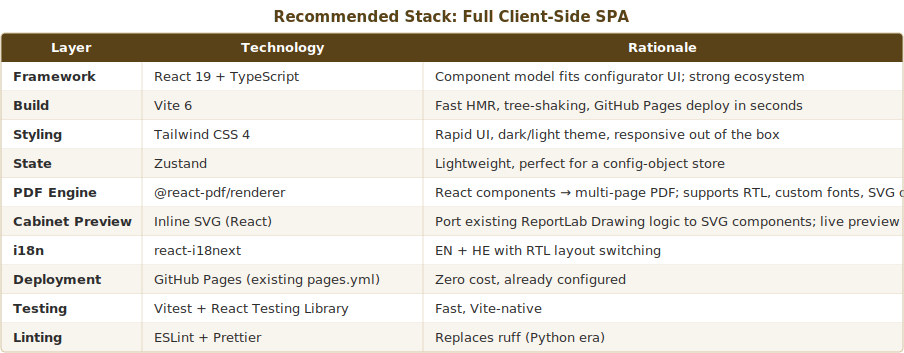


### Why Not a Python Backend?


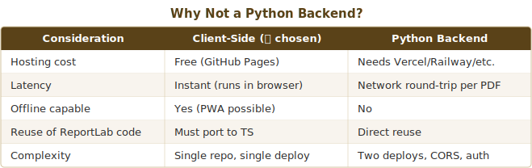


The existing Python code is ~820 lines of drawing + ~400 lines per generator. The core math
(dimension formulas, cut optimization, nesting) is straightforward arithmetic that ports
cleanly to TypeScript. The drawings are SVG-compatible (rectangles, lines, text, dimensions).
The PDF premium catalog features (`@react-pdf/renderer`) can replicate the ReportLab output.

---

## Current State → Target State


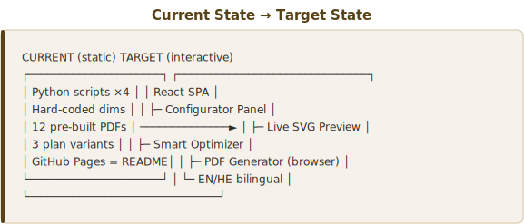


---

## Phase 0 — Project Scaffolding

**Duration estimate: foundation sprint**

### 0.1 Initialize React + Vite + TypeScript project
- `npm create vite@latest app -- --template react-ts` inside repo root
- Move legacy Python code to `legacy/` (preserve, don't delete)
- Configure `vite.config.ts` with `base: '/WoodworkingShop/'` for GitHub Pages

### 0.2 Tailwind + theming
- Install Tailwind CSS 4
- Define design tokens: woodworking palette (warm browns, accent gold, dark backgrounds)
- Dark/light mode toggle (CSS custom properties)

### 0.3 Project structure

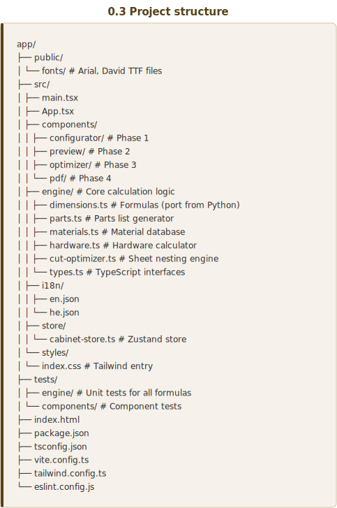


### 0.4 CI/CD update
- Replace Python CI with Node.js CI (lint, type-check, test, build)
- Keep `pages.yml` but point to Vite build output (`dist/`)
- Keep `release.yml` for tagged releases (build + deploy)

### 0.5 Deliverable
- Empty app shell renders at `https://rajwanyair.github.io/WoodworkingShop/`
- All tooling works: `npm run dev`, `npm run build`, `npm test`

---

## Phase 1 — Cabinet Configurator UI

**The core interactive form where customers define their cabinet.**

### 1.1 Configuration data model

```typescript
interface CabinetConfig {
  // External dimensions (mm)
  width:  number;    // 300–1200, step 10, default 1000
  height: number;    // 300–2400, step 10, default 2000
  depth:  number;    // 200–800,  step 10, default 600

  // Structure
  shelfCount:     number;    // 0–12, default 4
  shelfSpacing:   'equal' | 'custom';
  customShelfPositions?: number[];  // mm from bottom

  // Material
  carcassMaterial: MaterialKey;     // from materials DB
  backPanelMaterial: MaterialKey;
  doorStyle: 'flat' | 'none';      // future: 'shaker', 'glass'

  // Hardware
  hingesPerDoor: number;   // 2–6, auto-calculated from height
  handleStyle: HandleKey;

  // Edge banding
  edgeBanding: 'all-visible' | 'doors-only' | 'none';

  // Doors
  doorCount: 1 | 2;    // single or double door
  doorReveal: number;   // mm, default 3

  // Language
  lang: 'en' | 'he';
}
```

### 1.2 Materials database

```typescript
interface Material {
  key: string;
  name: { en: string; he: string };
  thickness: number;          // mm
  sheetWidth: number;         // mm (standard 1220)
  sheetLength: number;        // mm (standard 2440)
  pricePerSheet?: number;     // optional, for cost estimation
  category: 'panel' | 'back' | 'door';
  color: string;              // hex for preview rendering
}

// Initial material list (expandable):
const MATERIALS: Material[] = [
  { key: 'plywood-17',     name: {en: 'Sandwich Plywood 17mm', he: 'פנלפלק 17 מ"מ'},     thickness: 17, sheetWidth: 1220, sheetLength: 2440, category: 'panel', color: '#C8B88A' },
  { key: 'plywood-18',     name: {en: 'Birch Plywood 18mm',    he: 'דיקט ליבנה 18 מ"מ'},   thickness: 18, sheetWidth: 1220, sheetLength: 2440, category: 'panel', color: '#D4C4A0' },
  { key: 'melamine-16',    name: {en: 'Melamine 16mm',         he: 'מלמין 16 מ"מ'},         thickness: 16, sheetWidth: 1220, sheetLength: 2440, category: 'panel', color: '#F5F0E8' },
  { key: 'melamine-18',    name: {en: 'Melamine 18mm',         he: 'מלמין 18 מ"מ'},         thickness: 18, sheetWidth: 1220, sheetLength: 2440, category: 'panel', color: '#F5F0E8' },
  { key: 'mdf-16',         name: {en: 'MDF 16mm',              he: 'אם.די.אף 16 מ"מ'},     thickness: 16, sheetWidth: 1220, sheetLength: 2440, category: 'panel', color: '#BFA87A' },
  { key: 'mdf-18',         name: {en: 'MDF 18mm',              he: 'אם.די.אף 18 מ"מ'},     thickness: 18, sheetWidth: 1220, sheetLength: 2440, category: 'panel', color: '#BFA87A' },
  { key: 'chipboard-16',   name: {en: 'Chipboard 16mm',        he: 'שבבית 16 מ"מ'},         thickness: 16, sheetWidth: 1220, sheetLength: 2440, category: 'panel', color: '#C9B97A' },
  { key: 'chipboard-18',   name: {en: 'Chipboard 18mm',        he: 'שבבית 18 מ"מ'},         thickness: 18, sheetWidth: 1220, sheetLength: 2440, category: 'panel', color: '#C9B97A' },
  { key: 'osb-18',         name: {en: 'OSB 18mm',              he: 'או.אס.בי 18 מ"מ'},     thickness: 18, sheetWidth: 1220, sheetLength: 2440, category: 'panel', color: '#D4B87A' },
  { key: 'plywood-4',      name: {en: 'Plywood 4mm (back)',    he: 'דיקט 4 מ"מ (גב)'},     thickness: 4,  sheetWidth: 1220, sheetLength: 2440, category: 'back',  color: '#E8D8B0' },
  { key: 'mdf-3',          name: {en: 'MDF/HDF 3mm (back)',    he: 'סיבית 3 מ"מ (גב)'},    thickness: 3,  sheetWidth: 1220, sheetLength: 2440, category: 'back',  color: '#D4C4A0' },
];
```

### 1.3 UI layout (responsive)


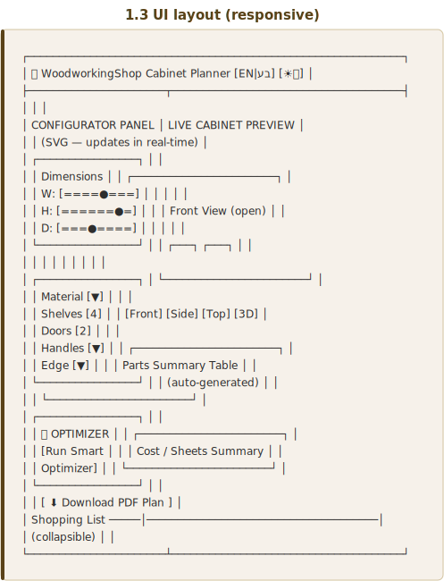


### 1.4 Configurator components


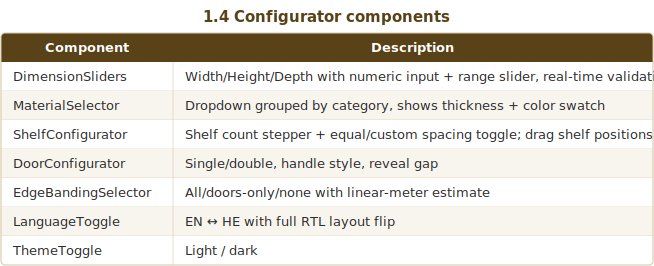


### 1.5 Validation rules

```typescript
// Structural constraints (from existing plans):
const CONSTRAINTS = {
  minWidth:  300,   maxWidth:  1200,
  minHeight: 300,   maxHeight: 2400,
  minDepth:  200,   maxDepth:  800,

  // Derived limits
  minShelfSpan:     150,   // mm between shelves (practical minimum)
  maxShelves:       (h: number) => Math.floor((h - 100) / 150),
  minDoorWidth:     200,   // too narrow = impractical
  maxDoorHeight:    2200,  // hinge strength limit

  // Auto-hinge calculation
  hingesPerDoor:    (doorH: number) => doorH <= 600 ? 2 : doorH <= 1200 ? 3 : doorH <= 1800 ? 4 : doorH <= 2200 ? 5 : 6,

  // Material compatibility
  backPanelMaxThickness: 6,  // back panels must be ≤6mm
  carcassMinThickness:   15, // structural panels ≥15mm
};
```

### 1.6 Deliverable
- Fully interactive configurator with all inputs
- Real-time validation with helpful error messages
- Zustand store updates on every change
- No preview yet (Phase 2), no PDF yet (Phase 4)

---

## Phase 2 — Live SVG Cabinet Preview

**Port the Python drawing functions to React SVG components.**

### 2.1 SVG component architecture

```typescript
// Each view is a self-contained SVG component:
<CabinetFrontClosed config={config} parts={parts} scale={scale} />
<CabinetFrontOpen   config={config} parts={parts} scale={scale} />
<CabinetSideView    config={config} parts={parts} scale={scale} />
<CabinetTopView     config={config} parts={parts} scale={scale} />
<CabinetBackView    config={config} parts={parts} scale={scale} />
<Cabinet3DIsometric  config={config} parts={parts} scale={scale} />
```

### 2.2 Mapping from Python → React SVG


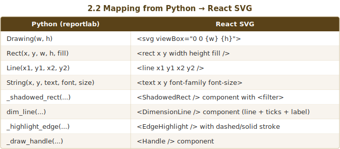


### 2.3 View switcher
- Tab bar: Front (Closed) | Front (Open) | Side | Top | Back | 3D
- Responsive scaling: SVG `viewBox` adapts to container width
- Smooth transitions between views (CSS transform)

### 2.4 Interactive features
- Hover a part → highlight + show tooltip (name, dimensions, material)
- Click a shelf → drag to reposition (updates `customShelfPositions`)
- Pan + zoom on mobile (touch gestures)

### 2.5 Dimension annotations
- Auto-placed dimension lines (same positions as existing Python drawings)
- Toggle dimensions on/off
- Millimeter display with configurable precision

### 2.6 Deliverable
- 6 SVG views rendering live from the config store
- Updates in real-time as sliders change
- Matches the visual quality of the existing PDF drawings

---

## Phase 3 — Smart Optimizer

**The "brain" — suggests cost-effective dimension tweaks.**

### 3.1 Optimization engine (`cut-optimizer.ts`)

```typescript
interface OptimizationResult {
  originalConfig: CabinetConfig;
  optimizedConfig: CabinetConfig;
  savings: {
    sheetsRemoved: number;
    yieldImprovement: number;  // percentage points
    costSaved?: number;        // if price data available
    wasteReduced: number;      // mm² of saved waste
  };
  strategy: OptimizationStrategy;
  explanation: { en: string; he: string };
}

type OptimizationStrategy =
  | 'reduce-depth'        // Plan B approach: shrink depth to fit 3 strips per sheet
  | 'co-nest-strips'      // Plan C approach: door + depth + shelf fill 1220mm exactly
  | 'adjust-width'        // Tweak width to eliminate partial sheet
  | 'adjust-height'       // Tweak height to reduce waste
  | 'shelf-consolidation' // Fewer shelves → fewer cuts → better nesting
  | 'material-swap';      // Different thickness → different nesting efficiency
```

### 3.2 How the optimizer works

The optimizer implements the **same strip-nesting math** from the existing plans:

1. **Generate parts list** from current config
2. **Run first-fit-decreasing (FFD) bin packing** to estimate sheet count
3. **Try depth variations** (±1mm increments) checking for "magic" strip widths:
   - `n × depth + (n-1) × kerf = sheetWidth` (Plan B trick: `3×404 + 2×4 = 1220`)
   - `doorWidth + kerf + depth + kerf + shelfDepth = sheetWidth` (Plan C trick)
4. **Try width/height variations** with same FFD check
5. **Score each variant** by: `sheetsRequired × 1000 - yieldPercent`
6. **Return top 3 suggestions** sorted by savings

### 3.3 User-facing optimizer modes


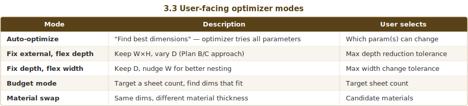


### 3.4 Optimizer UI


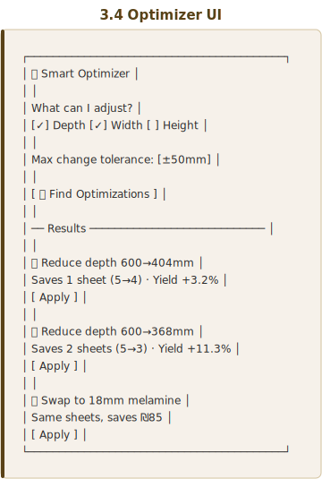


### 3.5 Comparison view
- Side-by-side: original config vs optimized config
- Animated diff showing what changed
- "What I gave up" disclaimer (e.g., "32mm less shelf depth")

### 3.6 Deliverable
- Working optimization engine with all 5 modes
- Top-3 suggestions rendered with savings breakdown
- One-click "Apply" updates the configurator + preview
- Unit tests covering all Plan A→B→C transitions as regression tests

---

## Phase 4 — PDF Generation (Browser-Side)

**Generate the full detailed build plan as a downloadable PDF.**

### 4.1 Technology: `@react-pdf/renderer`

```tsx
import { Document, Page, View, Text, Image, Font } from '@react-pdf/renderer';

const CabinetPlan: React.FC<{ config: CabinetConfig; parts: Part[] }> = ({ config, parts }) => (
  <Document>
    <CoverPage config={config} />
    <SpecificationsPage config={config} />
    <PartsListPage parts={parts} />
    <CutPlanPage parts={parts} sheets={sheets} />
    <DrawingsPage config={config} />
    <DrillingGuidePage config={config} />
    <AssemblySequencePage config={config} />
    <ShoppingListPage parts={parts} hardware={hardware} />
  </Document>
);
```

### 4.2 PDF page structure (matches existing quality)


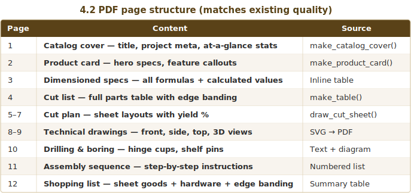


### 4.3 SVG drawings in PDF
- Render the same React SVG components from Phase 2
- Convert to PDF vector paths via `@react-pdf/renderer`'s `<Svg>` primitive
- Or: render SVG to canvas → embed as image (fallback)

### 4.4 Font registration
```typescript
Font.register({
  family: 'Arial',
  fonts: [
    { src: '/fonts/arial.ttf', fontWeight: 'normal' },
    { src: '/fonts/arialbd.ttf', fontWeight: 'bold' },
  ],
});
Font.register({
  family: 'David',
  fonts: [
    { src: '/fonts/david.ttf', fontWeight: 'normal' },
    { src: '/fonts/davidbd.ttf', fontWeight: 'bold' },
  ],
});
```

### 4.5 Deliverable
- "Download PDF" button generates complete build plan in ~2 seconds
- EN and HE versions with proper RTL layout
- Visual quality matches or exceeds the existing Python-generated PDFs
- PDF file name: `Cabinet_Plan_{W}x{H}x{D}_{material}_{lang}.pdf`

---

## Phase 5 — Cut Sheet Optimizer (Visual)

**Interactive cut sheet layout viewer.**

### 5.1 Bin-packing algorithm

```typescript
// First-Fit Decreasing with strip optimization
function optimizeCutSheets(
  parts: CutPart[],
  sheetW: number,
  sheetH: number,
  kerf: number
): CutSheet[] {
  // 1. Sort parts by largest dimension descending
  // 2. Try strip-based nesting (group by common width)
  // 3. Fall back to guillotine-cut FFD for remaining parts
  // 4. Calculate yield per sheet
  return sheets;
}
```

### 5.2 Visual cut sheet component
- SVG rendering of each sheet with color-coded parts
- Yield percentage per sheet + total yield
- Waste areas shaded
- Edge banding indicators (colored borders on edges that need banding)
- Interactive: hover part → highlight in parts table + preview

### 5.3 Deliverable
- Auto-generated cut layouts matching or exceeding the manual Python layouts
- Visual sheet display with hover/click interactivity

---

## Phase 6 — Polish & Production Readiness

### 6.1 PWA support
- Service worker for offline use
- `manifest.json` with app icon
- "Install app" prompt

### 6.2 URL state persistence
- Encode full config in URL query params
- Share a link → opens with exact same config
- "Copy link" button

### 6.3 Save/load configurations
- LocalStorage for recent configs
- "My Saved Cabinets" panel
- Export/import JSON config files

### 6.4 Print-friendly view
- CSS `@media print` styles
- "Print parts list" shortcut

### 6.5 Accessibility
- ARIA labels on all interactive elements
- Keyboard navigation for all controls
- Screen reader support for parts tables
- Color-blind safe palette option

### 6.6 Analytics (optional)
- Privacy-respecting usage tracking (Plausible / self-hosted)
- Most popular configurations
- Optimization adoption rate

### 6.7 Deliverable
- Production-quality web app
- Lighthouse score ≥ 95 across all categories
- Works offline, shareable configs, accessible

---

## Phase 7 — Advanced Features (Future)

> These are stretch goals, not part of the initial build.


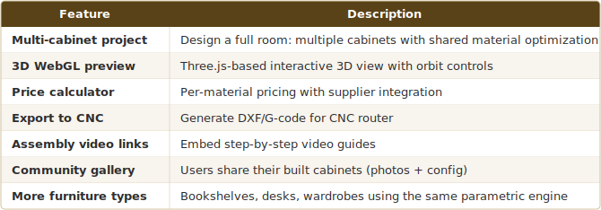


---

## Migration Strategy

### What gets preserved
- **All dimension formulas** — ported to TypeScript with 1:1 unit tests
- **Drawing logic** — ported from ReportLab Drawing → React SVG
- **PDF structure** — same pages, same layout, same quality
- **Bilingual support** — EN + HE with RTL
- **GitHub Pages deployment** — same URL, same workflow trigger
- **Reference documents** — kept in `legacy/reference/`

### What gets replaced
- Python scripts → TypeScript engine
- ReportLab → `@react-pdf/renderer`
- Static PDFs → Dynamic generation
- Hard-coded plans A/B/C → Infinite parametric configs
- README.md landing page → Full SPA

### Migration steps
1. Move all current files to `legacy/` folder
2. Scaffold new app in repo root
3. Port and test engine module by module
4. Deploy in parallel (new app at root, legacy at `/legacy/`)
5. Remove legacy once new app is validated

---

## Dependency Summary

### Runtime
```json
{
  "react": "^19.0.0",
  "react-dom": "^19.0.0",
  "@react-pdf/renderer": "^4.0.0",
  "zustand": "^5.0.0",
  "react-i18next": "^15.0.0",
  "i18next": "^24.0.0"
}
```

### Dev
```json
{
  "vite": "^6.0.0",
  "typescript": "^5.7.0",
  "@tailwindcss/vite": "^4.0.0",
  "tailwindcss": "^4.0.0",
  "vitest": "^3.0.0",
  "@testing-library/react": "^16.0.0",
  "eslint": "^9.0.0",
  "prettier": "^3.0.0"
}
```

---

## Risk Register


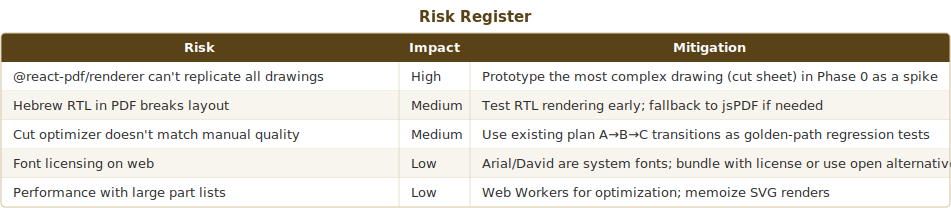


---

## Definition of Done (per phase)

- [ ] All unit tests pass (`npm test`)
- [ ] TypeScript strict mode, zero errors
- [ ] ESLint + Prettier clean
- [ ] Responsive (mobile, tablet, desktop)
- [ ] EN + HE both work correctly
- [ ] Lighthouse performance ≥ 90
- [ ] Deployed to GitHub Pages and manually verified
