# Plan A — Pantry Cabinet Collection

## Catalog Cover

> **Collection note:** Plan A is the flagship layout in the pantry cabinet collection. It keeps the full 600 mm depth, uses the warmest material specification, and is the version to choose when the project should read like built-in furniture rather than utility storage.

### Download PDFs

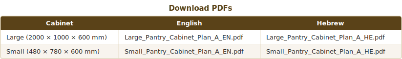

### Plan A at a Glance

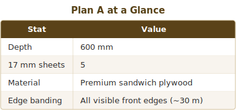

### Design Callouts

1. **Full 600 mm depth** for bulk pantry storage and the strongest visual presence.
2. **Visible front edges are fully finished** for a cleaner furniture-grade presentation.
3. **All carcass, door, and back panels** stay in sandwich plywood for a fully consistent material spec.

---

# Double Pantry Cabinet — Complete DIY Build Plan

> **Project date:** April 2026
> **Units:** All dimensions in **mm** unless noted.
> **Source documents:** Detailed Carpentry Plan – Large Pantry Cabinet (200-100-60).pdf,
> Detailed Carpentry Plan – Small Pantry Cabinet (48-78-60).pdf,
> Specification & Prompt – Double Pantry Cabinet.pdf

---

## Project Context

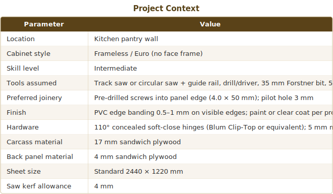

## Signature Features

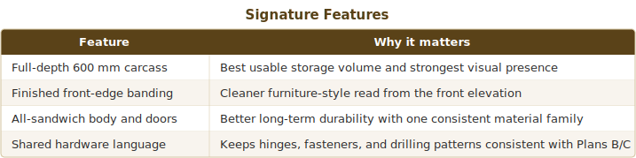

---

## 1. Assumptions & Risk Checks

1. **Wall flatness.** Check the wall with a 2 m straightedge. Shim behind the cabinet if the wall bows more than 3 mm over the cabinet width; otherwise the back panel will push the carcass out of square.
2. **Floor level.** Verify with a spirit level across the full footprint. If the large cabinet stands on the floor, use adjustable feet or shim the base to bring it plumb. The small cabinet is assumed to be wall-mounted above the large one.
3. **Plumb & square.** After assembly, both diagonals of each carcass must be equal within 2 mm before the back panel is fixed.
4. **Anti-tip.** The large cabinet (2000 mm tall) **must** be secured to the wall with at least two heavy-duty L-brackets or a French cleat to prevent tipping.
5. **Load capacity.** Each adjustable shelf is rated for typical pantry goods (≤ 25 kg). For heavier loads, add a center support rail under the shelf.
6. **Material tolerance.** Sandwich plywood sheets may vary ±0.5 mm in thickness. Measure your actual sheet thickness before cutting dados or calculating reveals.
7. **Edge banding before boring.** Apply edge banding before drilling hinge cups so the Forstner bit reference face is flush.
8. **Grain direction.** Run the face grain vertically on side panels and doors for consistent appearance.
9. **Door gap convention.** Outer reveals: 3 mm. Center gap between paired doors: 2 mm. This totals 8 mm of gaps across the width, yielding confirmed door widths.
10. **Back panel kerf note.** The two back panels add up to 2440 mm in length—exactly the sheet length with zero kerf. In practice, trim 4 mm from S-06 height (460 → 456 mm) to account for one kerf. This changes the inset from 10 mm to 12 mm on one edge—structurally irrelevant.

---

## 2. Dimensioned Specification Summary

### Cabinet 1 — Large Pantry (2000 × 1000 × 600)

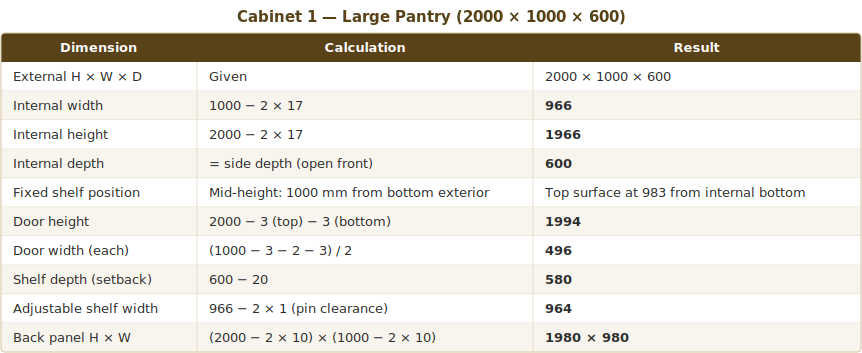

### Cabinet 2 — Small Upper Unit (480 × 780 × 600)

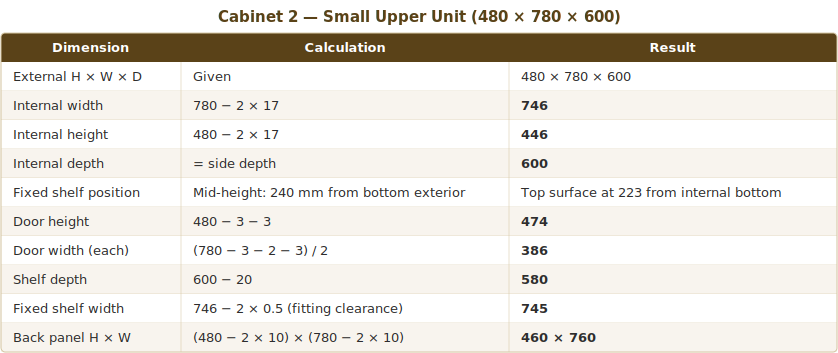

---

## 3. Cut List

### Cabinet 1 — Large Pantry

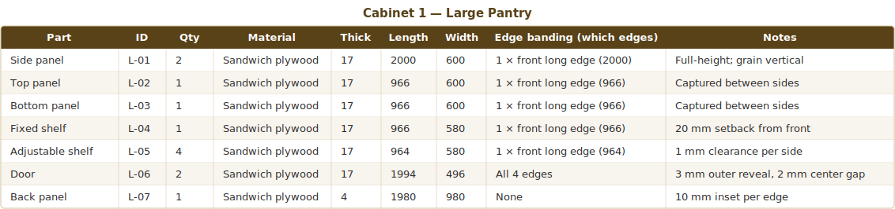

### Cabinet 2 — Small Upper Unit

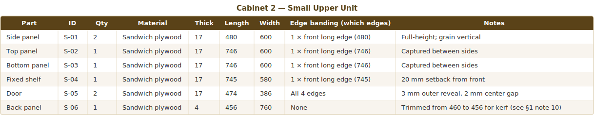

### Combined Cut List (both cabinets, 20 parts total)

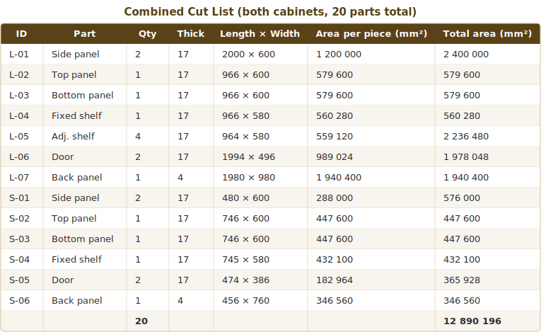

**Material totals:**

- 17 mm sandwich plywood net part area: **10 603 236 mm² ≈ 10.60 m²**
- 4 mm backer net part area: **2 286 960 mm² ≈ 2.29 m²**

---

## 4. Drilling & Boring Layout

### 4.1 Hinge Cup Boring (doors)

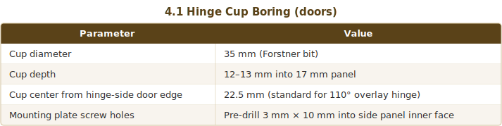

**Cabinet 1 doors (1994 mm tall, 4 hinges per door):**

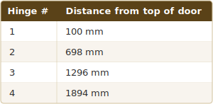

Spacing = (1994 − 200) / 3 ≈ **598 mm** between hinges.

**Cabinet 2 doors (474 mm tall, 2 hinges per door):**

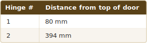

Spacing = 474 − 160 = **314 mm** between hinges.

### 4.2 Shelf Pin Boring (Cabinet 1 only)

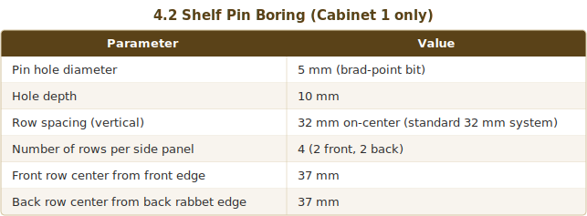

Bore two columns of holes (front and back) on each side panel, running from **96 mm above the bottom panel** to **96 mm below the top panel**. The fixed shelf interrupts the column at mid-height; drill holes above and below it. Each column has approximately **28 holes** (14 above fixed shelf, 14 below).

### 4.3 Assembly Pre-Drilling

- **Pilot holes for screws into panel edges:** 3 mm bit, 40 mm deep.
- **Spacing:** One screw every 150–200 mm along each joint line.
- **Joints to drill:** Side-to-top (×2), side-to-bottom (×2), side-to-fixed-shelf (×2).
- **Cabinet 1:** approximately 6 screws per joint × 6 joints = **36 structural screws**.
- **Cabinet 2:** approximately 5 screws per joint × 6 joints = **30 structural screws**.

---

## 5. Assembly Sequence

### Cabinet 1 — Large Pantry

1. **Rip & crosscut** all parts to final dimensions from marked-up sheets (see § 7).
2. **Apply edge banding** to all marked edges (see cut list column). Trim flush.
3. **Mark layout lines** on the inner faces of both side panels: top/bottom panel positions (17 mm from each end), fixed shelf center line (983 mm from the bottom inner face).
4. **Drill shelf-pin columns** on both side panels (§ 4.2) using a drilling jig or template.
5. **Pre-drill pilot holes** (3 mm) through the outer face of the side panels into top, bottom, and fixed shelf positions.
6. **Dry-fit** one side panel flat on the bench, stand top, bottom, and fixed shelf on edge, and check alignment.
7. **Drive screws** (4.0 × 50 mm) through the first side panel into the top, bottom, and fixed shelf.
8. **Flip and attach** the second side panel the same way. Clamp while driving screws.
9. **Check square.** Measure both diagonals across the front opening—they must match within 2 mm.
10. **Attach back panel** (L-07) with 3.5 × 16 mm screws at 150 mm spacing around the perimeter. The back locks the cabinet square.
11. **Bore hinge cups** in doors (§ 4.1). Mount hinge plates to side panels.
12. **Hang doors.** Adjust three-way hinge adjustment screws for even 3 mm reveal on outer edges and 2 mm center gap.
13. **Install handles.**
14. **Secure cabinet to wall** with L-brackets or French cleat through the back panel into studs.
15. **Insert shelf pins** and place adjustable shelves.

### Cabinet 2 — Small Upper Unit

1. **Cut and edge-band** all parts.
2. **Mark layout lines** on side panels: 17 mm from each end for top/bottom, 223 mm from bottom inner face for fixed shelf.
3. **Pre-drill pilot holes** (3 mm) through side panel outer faces.
4. **Assemble box** (same method: one side flat, stand horizontals, screw, flip, screw second side).
5. **Check square** and attach back panel (S-06).
6. **Bore hinge cups** and mount hinges.
7. **Hang and adjust doors.**
8. **Install handles.**
9. **Wall-mount** the unit using L-brackets or a French cleat. Ensure the support structure below (top of Cabinet 1 or a dedicated shelf) can bear the load.

---

## 6. Materials & Hardware Shopping List

### Sheet Goods

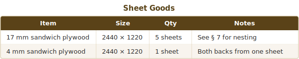

### Hardware

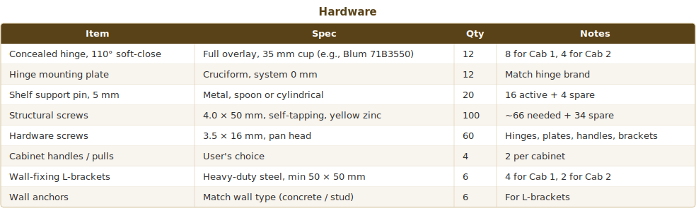

### Consumables

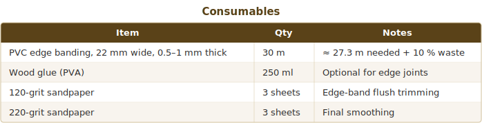

---

## 7. Sheet Layout Strategy (Cut Plan)

**Total 17 mm sandwich plywood required:** 5 standard sheets (2440 × 1220 mm).
**Total 4 mm backer required:** 1 standard sheet.
**Overall yield (17 mm):** 10 603 236 mm² used / 14 884 000 mm² purchased = **71.2 %**.

> The layout below favors straight rip-and-crosscut sequences suitable for a track saw.
> A CNC nesting optimizer could reduce this to 4 sheets at >89 % yield, but that requires L-shaped cuts.

### 17 mm Sandwich Plywood — Sheet-by-Sheet

**Sheet 1** — Yield 92.9 %

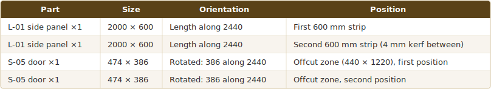

Rip the sheet into two 600 mm strips (1204 mm total + 16 mm waste strip). Crosscut each strip at 2000 mm for side panels. The remaining 440 × 1220 offcut yields both small doors (386 × 474 each, rotated).

**Sheet 2** — Yield 66.4 %

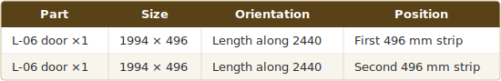

Rip two 496 mm strips (996 mm + 224 mm waste). Crosscut each at 1994 mm. Reserve the 442 × 1220 and 1994 × 224 offcuts (useful for jigs, test pieces, or future shelving).

**Sheet 3** — Yield 88.4 %

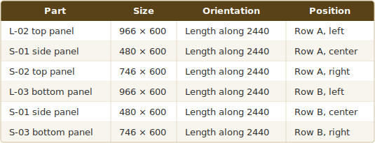

Rip into two 600 mm strips (1204 mm + 16 mm waste). In each strip crosscut at 966, 480, and 746 mm (with 4 mm kerf between parts). Each strip consumes 966 + 4 + 480 + 4 + 746 = **2200 mm** of the 2440 mm length, leaving a 240 × 600 offcut per strip.

**Sheet 4** — Yield 70.9 %

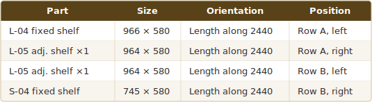

Rip into two 580 mm strips (1164 mm + 56 mm waste). Row A: crosscut at 966 and 964 (total 1934 mm). Row B: crosscut at 964 and 745 (total 1713 mm).

**Sheet 5** — Yield 37.6 %

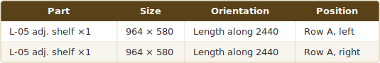

Single 580 mm rip. Crosscut at 964 + 4 + 964 = 1932 mm. Large offcut (2440 × 640 mm) remains—save for shelving or test cuts.

### 4 mm Backer — Single Sheet

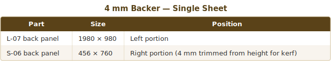

Rip one 980 mm strip. Crosscut at 1980 mm for L-07. The remaining strip (456 × 980 minimum) yields S-06 (456 × 760). One saw cut separates the two parts.

### Grain Direction Notes

- **Doors (L-06, S-05):** run face grain vertically (along the 1994 / 474 mm dimension).
- **Side panels (L-01, S-01):** run face grain vertically.
- **Top/bottom, shelves:** grain direction runs along the length for visual consistency when the door is open.

---

## 8. Verify Before Cutting Checklist

- [ ] Measure your actual sandwich plywood thickness with calipers. If it is not exactly 17.0 mm, recalculate internal width (top/bottom/shelf lengths) and door widths.
- [ ] Verify the sheet dimensions of every sandwich plywood sheet before layout. Some suppliers cut undersized.
- [ ] Confirm the hinge cup center-to-edge dimension from the hinge manufacturer's datasheet (typically 22.5 mm but can vary by model).
- [ ] Check that the saw kerf matches the 4 mm allowance. If using a thinner blade (3 mm), you gain 1 mm per cut—do not adjust part sizes, just enjoy tighter nesting.
- [ ] Mark every part with its ID (L-01, L-02 … S-06) immediately after cutting, on a surface that will be hidden after assembly.
- [ ] Dry-fit all carcass joints before committing any screws. Confirm that top/bottom panels slide between the side panels without force.
- [ ] Confirm that the edge banding thickness will not cause the doors to bind. With 0.5–1 mm banding, the effective reveal shrinks by up to 1 mm per banded edge.
- [ ] Double-check shelf pin column alignment with a straightedge or drilling jig. Misaligned columns prevent shelves from sitting level.
- [ ] Verify wall-stud locations before mounting. Heavy pantry loads require fastening into solid framing, not just drywall anchors.
- [ ] Before final assembly, lay all labeled parts on the floor in approximate position and walk through the assembly sequence mentally to catch any conflicts.

---

## Drawing Files

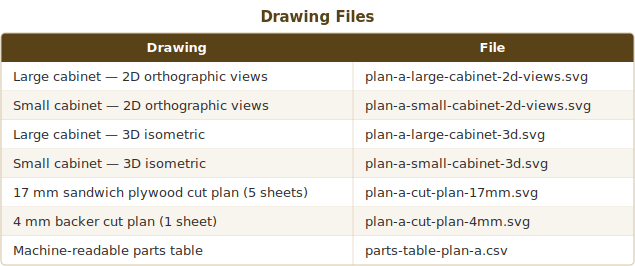

