# Plan B — Pantry Cabinet Collection

## Catalog Cover

> **Collection note:** Plan B is the pragmatic middle option. It trims the cabinet depth enough to save a full sheet, but avoids the sharper compromise of Plan C. Use it when cost reduction matters, yet the cabinet still needs comfortable everyday storage depth.

### Download PDFs

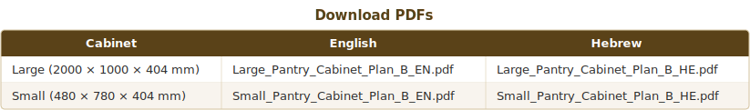

### Plan B at a Glance

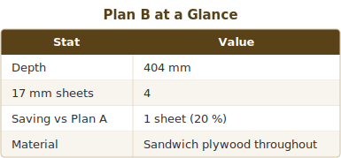

### Design Callouts

1. **404 mm depth** still supports jars, cans, cereal boxes, and daily storage use.
2. **All parts stay in sandwich plywood**, so cutting, fastening, and finishing stay aligned with Plan A.
3. **Leaving most carcass edges raw** reduces labor time and avoids unnecessary finishing cost.

---

# Plan B — Cost-Optimized Double Pantry Cabinet

> **Based on:** Plan A (double-pantry-cabinet-plan-plan-a.md)
> **Optimization goal:** Reduce sandwich plywood sheet count by adjusting depth only.
> **Location:** Storage room — appearance is not a priority.
> **Material change:** Keep **sandwich plywood** for all parts, including the back panels.
> **Edge banding:** Minimal — only front-facing door edges if desired; all other edges left raw.

---

## Key Change: Depth 600 → 404 mm

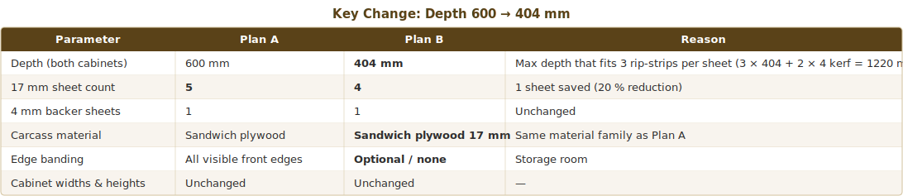

> **404 mm depth** is comfortable for standard pantry items (cans, jars, cereal boxes). It is roughly equivalent to a standard 40 cm kitchen cabinet depth.

## Signature Features

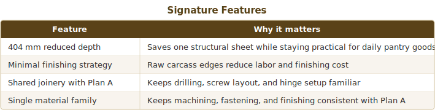

---

## 1. Dimensioned Specification Summary

### Cabinet 1 — Large Pantry (2000 × 1000 × 404)

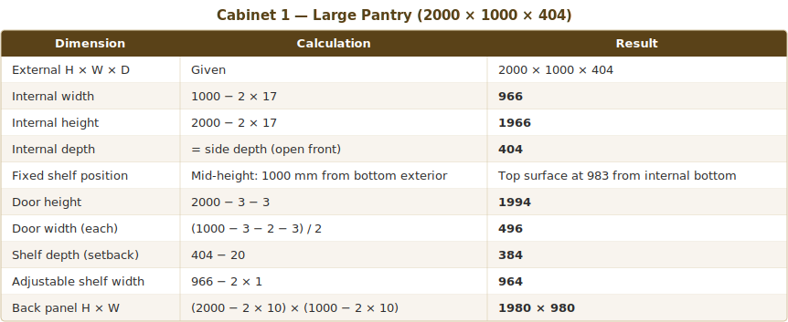

### Cabinet 2 — Small Upper Unit (480 × 780 × 404)

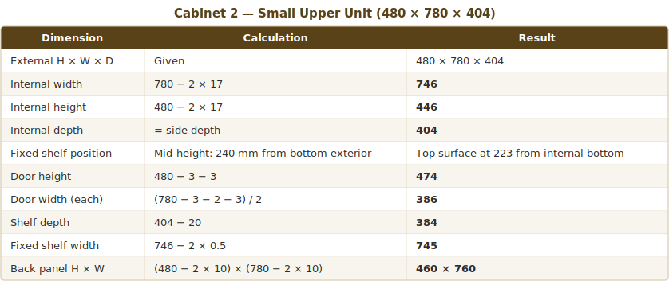

---

## 2. Cut List

### Cabinet 1 — Large Pantry

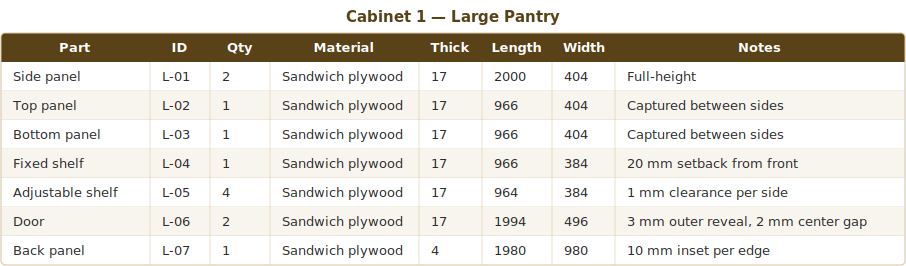

### Cabinet 2 — Small Upper Unit

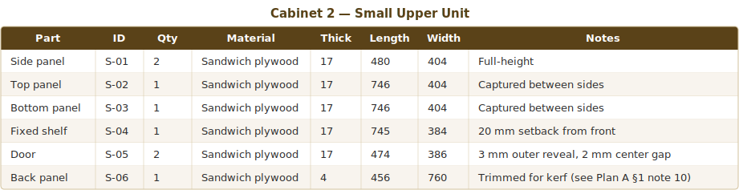

### Combined Cut List (both cabinets, 20 parts total)

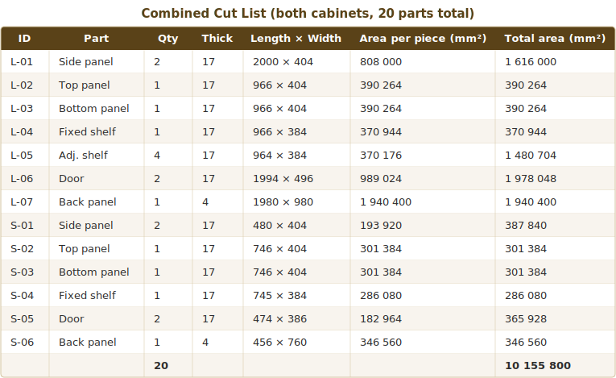

**Material totals:**

- 17 mm sandwich plywood net part area: **7 868 840 mm² ≈ 7.87 m²**
- 4 mm sandwich plywood backer net part area: **2 286 960 mm² ≈ 2.29 m²**

---

## 3. Sheet Layout Strategy — 4 Sheets of 17 mm Sandwich Plywood

**Total 17 mm sandwich plywood required:** 4 standard sheets (2440 × 1220 mm).
**Total 4 mm backer required:** 1 standard sheet.
**Overall yield (17 mm):** 7 868 840 mm² / 11 907 200 mm² = **66.1 %**.

> All cuts are straight rip-and-crosscut sequences for a track saw. No L-shaped or complex cuts needed.

---

### Sheet 1 — Yield 88.3 %

Rip into **3 strips of 404 mm** (404 + 4 + 404 + 4 + 404 = 1220 mm exactly).

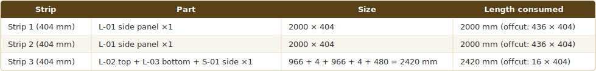

---

### Sheet 2 — Yield 66.4 %

Rip into **2 strips of 496 mm** (496 + 4 + 496 = 996 mm; 224 mm waste strip).

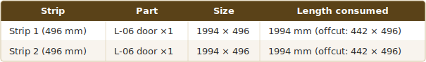

> Door dimensions are unchanged from Plan A.

---

### Sheet 3 — Yield 74.5 %

Rip into **3 strips**: 404 + 4 + 404 + 4 + 384 = **1200 mm** (20 mm waste strip).

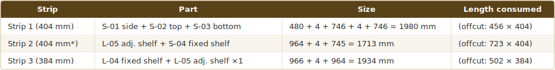

*Strip 2 carries 384 mm-wide shelf parts in a 404 mm strip (20 mm waste in width — acceptable).

---

### Sheet 4 — Yield 34.6 %

Rip into **3 strips**: 384 + 4 + 384 + 4 + 386 = **1162 mm** (58 mm waste strip).

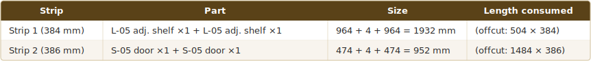

> Sheet 4 has low yield but cannot be avoided — the remaining parts don't fit on Sheets 1–3. Save offcuts for future projects.

---

### 4 mm Backer — Single Sheet (unchanged from Plan A)

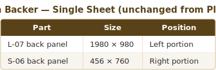

---

## 4. Shopping List — Plan B

### Sheet Goods

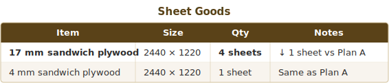

### Hardware (same as Plan A)

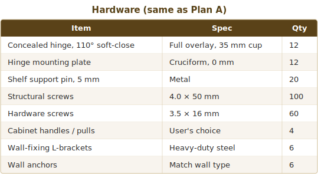

### Consumables

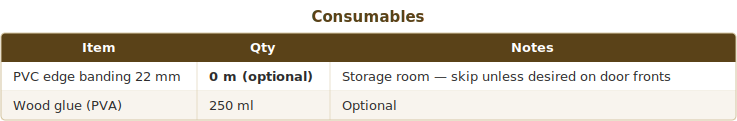

---

## 5. Cost Comparison Summary

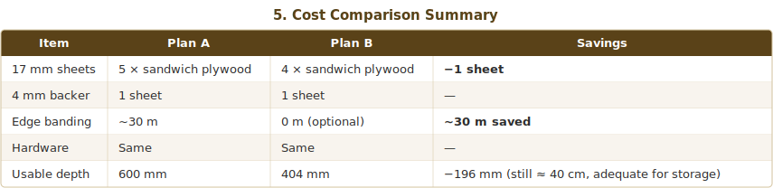

---

## 6. Notes

1. **All drilling, hinge, and assembly instructions from Plan A apply unchanged.** Only depth-dependent dimensions (side panel width, top/bottom width, shelf depth) are modified.
2. **Sandwich plywood consistency.** Keep the same drilling discipline as Plan A. Use 3 mm pilot holes for clean screw tracking and reliable assembly.
3. **Shelf load.** At 384 mm shelf depth, center-span deflection under 25 kg load is lower than at 580 mm — shelves will actually be stiffer.
4. **Anti-tip.** Wall mounting remains mandatory for the tall cabinet.
5. **Door fitment.** Doors are identical to Plan A. The reduced depth means doors will protrude beyond the cabinet sides by 496 − 404 = 92 mm on the hinge side — this is normal for overlay doors on shallow cabinets but verify clearance.

> **Correction:** Doors do NOT protrude — the 496 mm is the door *width* (horizontal), not depth. The door hangs on the front face of the 404 mm deep carcass with normal overlay. No clearance issue.
