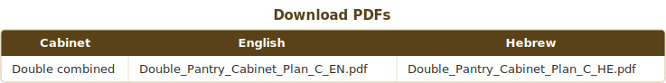
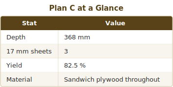
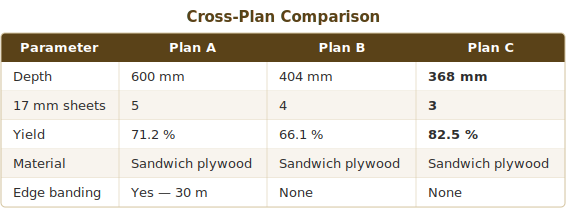
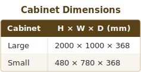
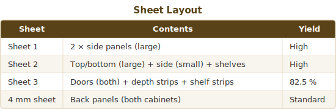

# Plan C — Pantry Cabinet Collection

## Catalog Cover

> **Collection note:** Plan C is the leanest version in the collection, engineered around smarter strip nesting so a whole sheet disappears while all parts remain sandwich plywood. Choose it when total sheet count and sourcing simplicity matter more than maximum pantry depth.

### Download PDFs

### Plan C at a Glance

### Optimisation Callouts

1. **Combining door, depth, and shelf strips** on the same sheet removes an entire structural sheet from the plan.
2. **368 mm depth** is best suited to storage rooms and service zones where compactness beats maximum capacity.
3. **Fewer sheets** mean less transport, less temporary storage, and a cleaner workshop flow.

### Cross-Plan Comparison

---

# Plan C — Maximum-Optimisation Double Pantry Cabinet

> **Based on:** Plan A / Plan B external envelope
> **Optimization goal:** Absolute minimum 17 mm sheet count while keeping all parts in sandwich plywood.
> **Location:** Storage room — appearance is not a priority.
> **Key trick:** Co-nest the 496 mm door strip alongside a 368 mm depth strip and a 348 mm shelf strip on the same sheet — 496 + 4 + 368 + 4 + 348 = 1220 mm exactly.

## Cabinet Dimensions

## Sheet Layout

